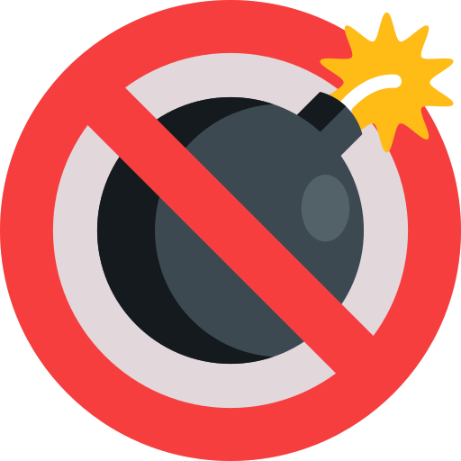

# Hello VuePress

[[toc]]

test 🤨

**Веселка**


VuePress 2 is out :tada: !

Mars


## jkhkj

```ts
// line-numbers is enabled by default
const line2 = "This is line 2";
const line3 = "This is line 3";
```

```ts:no-line-numbers
// line-numbers is disabled
const line2 = 'This is line 2'
const line3 = 'This is line 3'
```

### klkj

### kjkjkjjk

## jkjkj

```json
[
  {
    "name": "Pattern. Fix relative path ./",
    "rules": [
      {
        "from": "",
        "to": "",
        "caseInsensitive": false,
        "global": false,
        "multiline": false,
        "sticky": false,
        "disabled": false
      }
    ],
    "collapsed": true,
    "cursorRegexStart": "$",
    "cursorRegexEnd": "^"
  }
]
```

```json
[
  {
    "name": "Pattern. Fix relative path ./",
    "icon": "search",
    "patternFilter": "Pattern. Fix relative path ./",
    "selection": true,
    "lines": true,
    "document": true,
    "clipboard": false,
    "clipboardLines": false
  }
]
```
