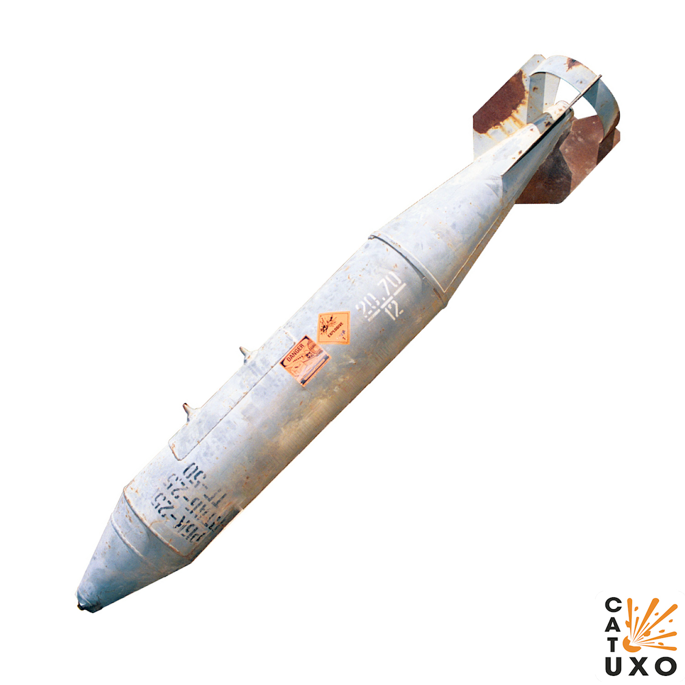
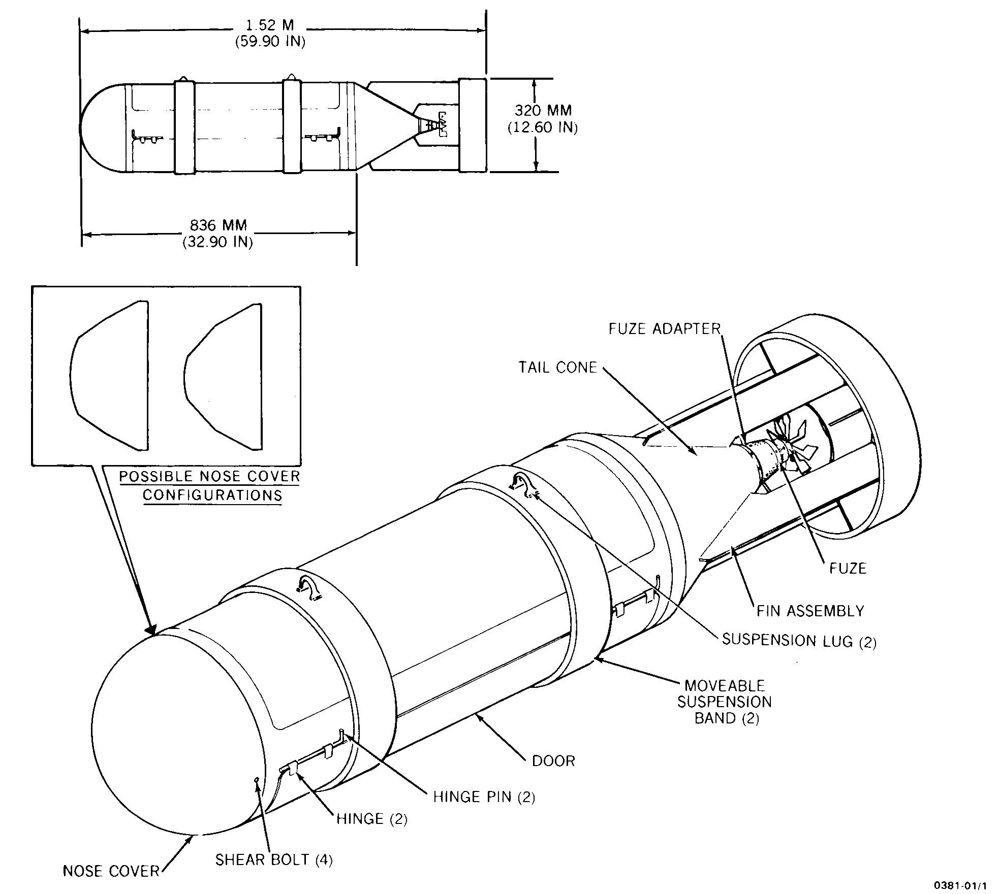
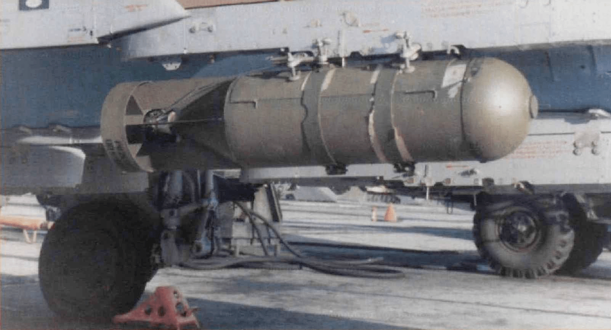
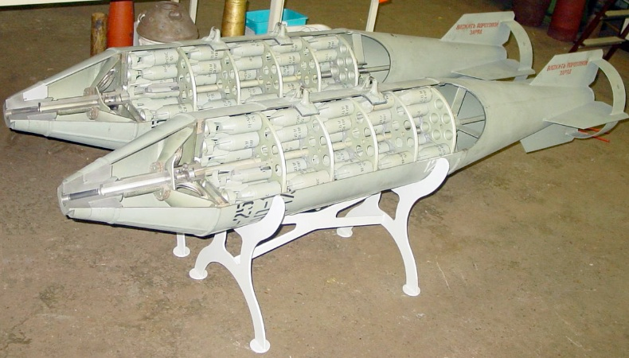
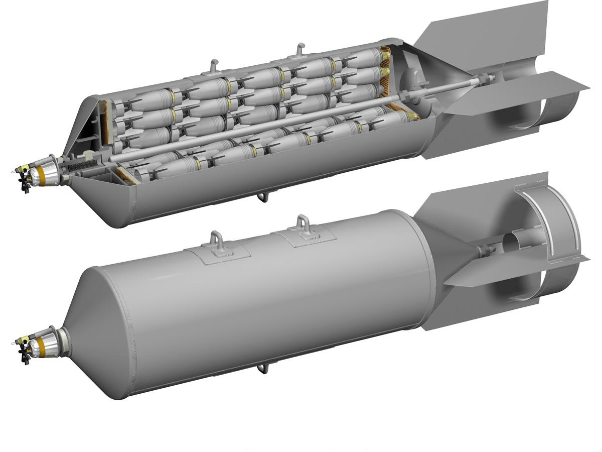
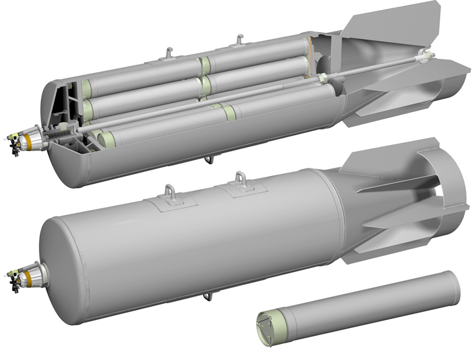

---
# Custom KB params
title: Касетна бомба РБК-250
subtitle: "Касетна бомба РБК-250"
description: "Касетна бомба РБК-250"

# Obsidian metadata YAML front matter params
aliases: РБК-250
tags:
keywords:
cssclass:
publish: false

# VuePress 2.x Frontmatter params
lang: uk-UA
prev:
  text: МС-5
  link: /catalog/mina-ms-5.html
next:
  text: РБК-500
  link: /catalog/bomb-rbk500.html
---

← [Повернутись](../index.md)

# Касетна бомба РБК-250

РБК-250 (Разова Бомбова Касета) — Сімейство касетних боєприпасів. Призначен для ураження різних типів цілей, залежно від типу суббоєприпасу. Eлемент авіаційного озброєння (касетна бомба) калібру 250 мм.

Загальна вага бойової частини касети 150 кг. Можна встановлювати на Су-17 та Мі-24.

Бомбова касета РБК-250 була розроблена на початку 1950-х років. Вона відрізняється низьким лобовим опором і може скидатися з різних висот на швидкості від 600 до 1300 км/год - залежно від типу суббоєприпасу та типу підривника, що використовується. 

Касета, скинута з великої висоти і за великою швидкістю літака, може відкриватися на будь-якій заданій висоті у залежності від установки таймера підривника ТМ-24. Відкриття касети відбувається на крутій ділянці траєкторії польоту, тому бомби, що розсіюються з неї, займають такє положення в просторі, що забезпечує їм кут падіння, близький до 90°. Це запобігає неспрацюванню підривника через занадто малий кут падіння.

Касета має тонкостінний корпус розміром із бомбу ФАБ-250 М-46. Заповнення касети суббоєприпасами здійснюється у місцях зберігання бомб в авіаційних частинах.

Бомбова касета РБК-250 може бути заряджена суббоєприпасами за такими варіантами:

- [АО-2,5сч](https://mass-destruction-weapon.blogspot.com/2021/10/25.html) - 42 шт. – осколочні авіабомби АО-1, призначені для ураження живої сили противника при застосуванні з літаків з висот до 16000 м  і при швидкості польоту до 1200 км/год.
- [ЗАБ-2,5](https://mass-destruction-weapon.blogspot.com/2021/10/25_8.html) - 30 шт.
- [ПТАБ-2,5— 1,5](https://mass-destruction-weapon.blogspot.com/2021/10/25-15.html) - 30 шт.
- [АО-2,5-2](https://mass-destruction-weapon.blogspot.com/2021/10/25.html) - 60 шт.
- [ампулы АЖ-2](https://mass-destruction-weapon.blogspot.com/2021/11/2-4.html) - 31 шт.
- [ПТАБ-2,5](https://mass-destruction-weapon.blogspot.com/2021/09/500-255-25.html) - 30 шт.
- [АО-10сч](https://mass-destruction-weapon.blogspot.com/2021/11/10.html) - 8 шт.
- [АО-10-6,5](https://mass-destruction-weapon.blogspot.com/2021/11/10.html) - 11 шт.

Разовая бомбовая кассета РБК-100 АО-1, снаряженная осколочными авиабомбами АО-1, предназначена для поражения живой силы противника при применении с самолетов с высот до 16000 м и при скорости полета до 1200 км/ч.

и массой 273 кг, снаряженный 150 осколочными боеприпасами AO-1. Общий вес боевой части кассеты 150 кг. Площадь поражения — 4800 кв. м. Можно устанавливать на Су-17 и на Ми-24.

Авиационная разовая бомбовая кассета РБК-250-170МА-3 снаряженная авиационными заградительными минами ЗАМ-2,5 предназначается для минирования с самолетов аэродромов и вероятных путей движения автотранспорта и живой силы противника.

  

Кассета допускает применение с внутренней и наружной подвесок и может сбрасываться с горизонтального полета и пикирования.

::: danger Категорично забороняється:

1. Виконувати будь - які механічні , термічні та інші впливи на корпус.
2. Переміщувати з місця їх знаходження .
3. Проводити будь - які земляні роботи поблизу.
4. Намагатися викрутити будь - які комплектуючі.
5. Чипати корпус.
6. Самостійно знешкоджувати.

:::

## Історична довідка

РБК-250 применялись во время Афганской войны истребительно-бомбардировочной и штурмовой авиацией, а также с вертолётов.

Использовались в ходе чеченской войны.

По утверждению международной организации Human Rights Watch бомба применялась российской авиацией во время войны в Южной Осетии (2008) при бомбардировке г. Гори в ходе российско-грузинского вооруженного конфликта в августе 2008. По заявлению Генерального штаба ВС РФ кассетные боеприпасы в ходе этого конфликта не использовались.

## Відео

<iframe width="560" height="315" src="https://www.youtube.com/embed/T-bADJfTJts" title="Росія на Одещині застосовує касетні бомби РБК-500 з ПТАБ-1М" frameborder="0" allow="accelerometer; autoplay; clipboard-write; encrypted-media; gyroscope; picture-in-picture; web-share" allowfullscreen></iframe>

## Зображення

::: gallery

- 
- 
- 
- 
- 
:::

#### Інформаційні джерела

1. [Росія на Одещині застосовує касетні бомби РБК-500 з ПТАБ-1М](https://mil.in.ua/uk/news/rosiya-na-odeshhyni-zastosovuye-kasetni-bomby-rbk-500-z-ptab-1m/)
2. [ВКС РФ сбросили в Одесской области кассетную бомбу, но, похоже, большая часть суббоеприпасов не взорвалась](https://citeam-ru.medium.com/%D0%B2%D0%BA%D1%81-%D1%80%D1%84-%D1%81%D0%B1%D1%80%D0%BE%D1%81%D0%B8%D0%BB%D0%B8-%D0%B2-%D0%BE%D0%B4%D0%B5%D1%81%D1%81%D0%BA%D0%BE%D0%B9-%D0%BE%D0%B1%D0%BB%D0%B0%D1%81%D1%82%D0%B8-%D0%BA%D0%B0%D1%81%D1%81%D0%B5%D1%82%D0%BD%D1%83%D1%8E-%D0%B1%D0%BE%D0%BC%D0%B1%D1%83-%D0%BD%D0%BE-%D0%BF%D0%BE%D1%85%D0%BE%D0%B6%D0%B5-%D0%B1%D0%BE%D0%BB%D1%8C%D1%88%D0%B0%D1%8F-%D1%87%D0%B0%D1%81%D1%82%D1%8C-%D1%81%D1%83%D0%B1%D0%B1%D0%BE%D0%B5%D0%BF%D1%80%D0%B8%D0%BF%D0%B0%D1%81%D0%BE%D0%B2-%D0%BD%D0%B5-4236f2dffedd)
3. [ML-7 Firing Device](https://cat-uxo.com/explosive-hazards/firing-devices/ml-7-firing-device)
