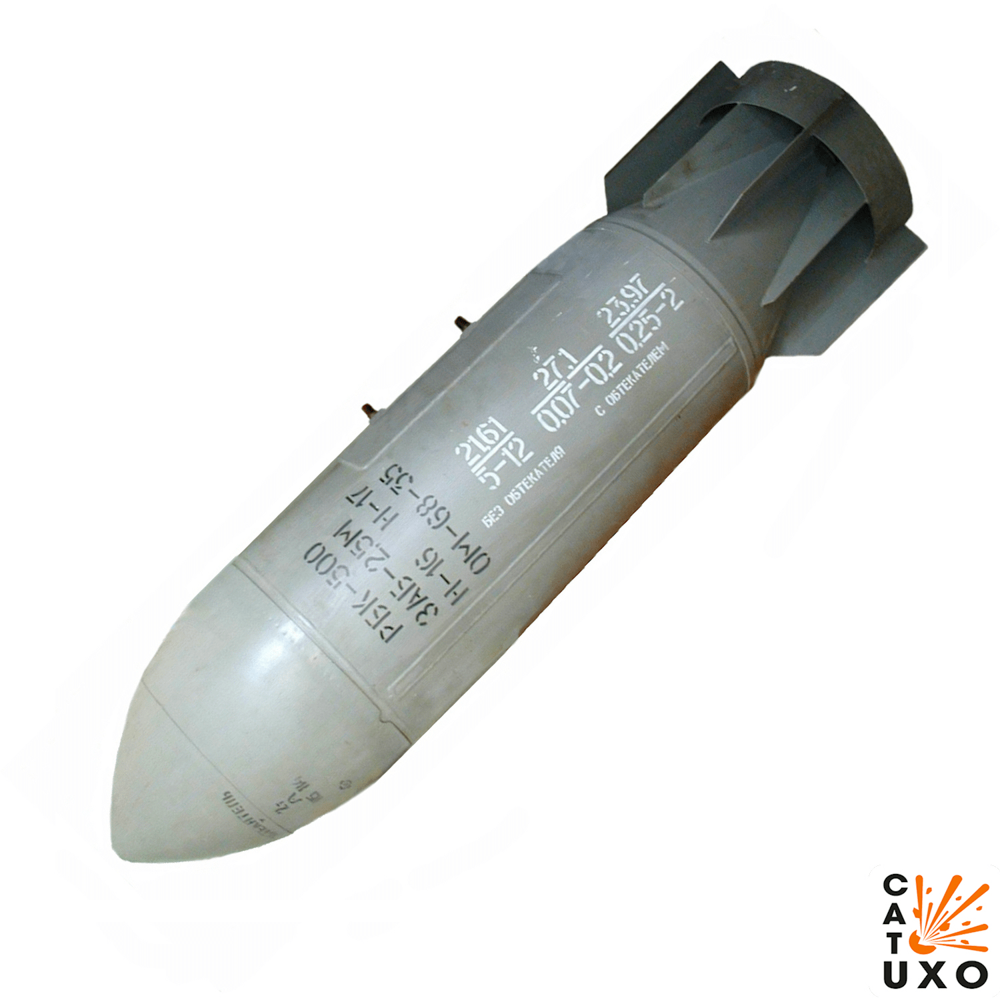

---
# Custom KB params
title: Касетна бомба РБК-250
subtitle: "Касетна бомба РБК-250"
description: "Касетна бомба РБК-250"

# Obsidian metadata YAML front matter params
aliases: РБК-250
tags:
keywords:
cssclass:
publish: false

# VuePress 2.x Frontmatter params
lang: uk-UA
prev:
  text: МС-5
  link: /catalog/mina-ms-5.html
next:
  text: РБК-500
  link: /catalog/bomb-rbk500.html
---

← [Повернутись](../index.md)

# Касетна бомба РБК-250

РБК-250 АО-1 (Разовая Бомбовая Кассета) — элемент авиационного вооружения («кассетная бомба») калибра 250 мм и массой 273 кг, снаряженный 150 осколочными боеприпасами AO-1. Общий вес боевой части кассеты 150 кг. Площадь поражения — 4800 кв. м. Можно устанавливать на Су-17 и на Ми-24.

::: danger Категорично забороняється:

1. Виконувати будь - які механічні , термічні та інші впливи на корпус.
2. Переміщувати з місця їх знаходження .
3. Проводити будь - які земляні роботи поблизу.
4. Намагатися викрутити будь - які комплектуючі.
5. Чипати корпус.
6. Самостійно знешкоджувати.

:::

## Історична довідка

РБК-250 применялись во время Афганской войны истребительно-бомбардировочной и штурмовой авиацией, а также с вертолётов.

Использовались в ходе чеченской войны.

По утверждению международной организации Human Rights Watch бомба применялась российской авиацией во время войны в Южной Осетии (2008) при бомбардировке г. Гори в ходе российско-грузинского вооруженного конфликта в августе 2008. По заявлению Генерального штаба ВС РФ кассетные боеприпасы в ходе этого конфликта не использовались.

## Відео

<iframe width="560" height="315" src="https://www.youtube.com/embed/T-bADJfTJts" title="Росія на Одещині застосовує касетні бомби РБК-500 з ПТАБ-1М" frameborder="0" allow="accelerometer; autoplay; clipboard-write; encrypted-media; gyroscope; picture-in-picture; web-share" allowfullscreen></iframe>

## Зображення

::: gallery

- 
- 
:::

#### Інформаційні джерела

1. [Росія на Одещині застосовує касетні бомби РБК-500 з ПТАБ-1М](https://mil.in.ua/uk/news/rosiya-na-odeshhyni-zastosovuye-kasetni-bomby-rbk-500-z-ptab-1m/)
2. [ВКС РФ сбросили в Одесской области кассетную бомбу, но, похоже, большая часть суббоеприпасов не взорвалась](https://citeam-ru.medium.com/%D0%B2%D0%BA%D1%81-%D1%80%D1%84-%D1%81%D0%B1%D1%80%D0%BE%D1%81%D0%B8%D0%BB%D0%B8-%D0%B2-%D0%BE%D0%B4%D0%B5%D1%81%D1%81%D0%BA%D0%BE%D0%B9-%D0%BE%D0%B1%D0%BB%D0%B0%D1%81%D1%82%D0%B8-%D0%BA%D0%B0%D1%81%D1%81%D0%B5%D1%82%D0%BD%D1%83%D1%8E-%D0%B1%D0%BE%D0%BC%D0%B1%D1%83-%D0%BD%D0%BE-%D0%BF%D0%BE%D1%85%D0%BE%D0%B6%D0%B5-%D0%B1%D0%BE%D0%BB%D1%8C%D1%88%D0%B0%D1%8F-%D1%87%D0%B0%D1%81%D1%82%D1%8C-%D1%81%D1%83%D0%B1%D0%B1%D0%BE%D0%B5%D0%BF%D1%80%D0%B8%D0%BF%D0%B0%D1%81%D0%BE%D0%B2-%D0%BD%D0%B5-4236f2dffedd)
3. [ML-7 Firing Device](https://cat-uxo.com/explosive-hazards/firing-devices/ml-7-firing-device)
