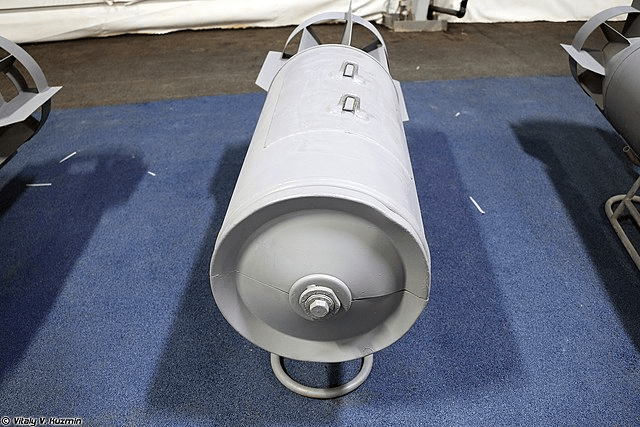
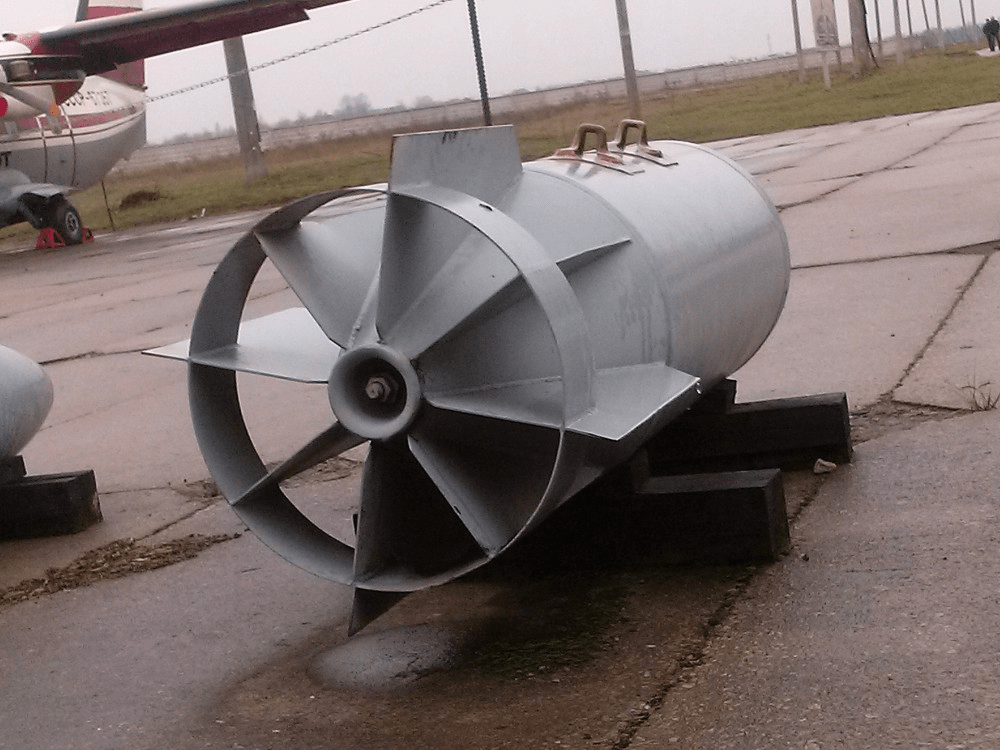
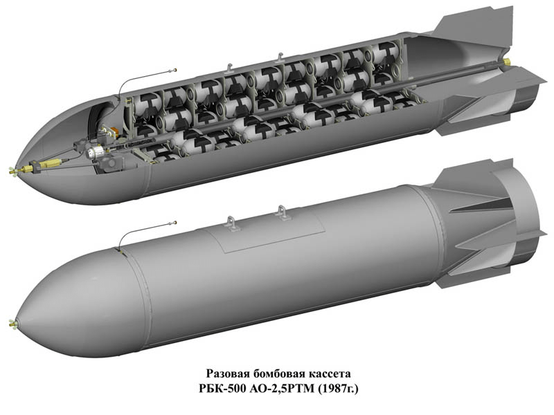

---
# Custom KB params
title: Касетна бомба РБК-500-225 ПТАБ-10-5
subtitle: "Касетна бомба РБК-500-225 ПТАБ-10-5"
description: "Касетна бомба РБК-500-225 ПТАБ-10-5"

# Obsidian metadata YAML front matter params
aliases: РБК-500-225
tags:
keywords:
cssclass:
publish: true

# VuePress 2.x Frontmatter params
lang: uk-UA
prev:
  text: РБК-500
  link: /catalog/bomb-rbk500.html
next:
  text: РБК-500
  link: /catalog/bomb-rbk500.html
---

← [Повернутись](../index.md)

# Касетна бомба РБК-500-225 ПТАБ-10-5

Разова бомбова касета РБК-500-225 ПТАБ-10-5 призначена для ураження броньованої техніки і складів противника. РБК може застосовуватися із зовнішніх і внутрішніх підвісок при горизонтальному польоті і пікуванні на висоті до 16000 м і швидкості польоту до 1200 км/год.

Разова бомбова касета РБК-500-225 ПТАБ-10-5 являє собою тонкостенну металеву оболонку з перісто-циліндричним надкаліберним стабілізатором. Знаряжена противотанковыми авіабомбами ПТАБ-10-5 в кількості 30 штук (два ряди по 15 авіабомб в кожному).

Невеликий викидний заряд слабкої вибухової речовини під підривником викидає хвостову частину касетної бомби та розподіляє суббоєприпаси.

RBK-500-225 завжди має встановлений запобіжник часу та велику гайку, яка утримує хвостове оперення на місці.

Вважається, що касетна бомба використовує механічний детонатор часу ATK або ATM серії з електричним озброєнням.

Варіант РБК-500 ПТАБ-1М з іншого боку несе до 268 малогабаритних протитанкових ракет (бомб) [ПТАБ-1М](./subbomb-ptab1m.md) . Варто зазначити, що останній випадок представленої касетної бомби, тобто РБК-500У, також може нести як допоміжні ракети осколкові бомби АО-25РТ або ОФАБ-50. 

Бомби сімейства РБК-500 можуть нести багато літаків радянського, а потім і російського виробництва, зокрема МіГ-21, МіГ-27, МіГ-29, Су-17 або Су-25.

## Відео

<iframe width="560" height="315" src="https://www.youtube.com/embed/T-bADJfTJts" title="Росія на Одещині застосовує касетні бомби РБК-500 з ПТАБ-1М" frameborder="0" allow="accelerometer; autoplay; clipboard-write; encrypted-media; gyroscope; picture-in-picture; web-share" allowfullscreen></iframe>

<iframe width="560" height="315" src="https://www.youtube.com/embed/iarnfIGkxvM" title="YouTube video player" frameborder="0" allow="accelerometer; autoplay; clipboard-write; encrypted-media; gyroscope; picture-in-picture; web-share" allowfullscreen></iframe>

<iframe width="560" height="315" src="https://www.youtube.com/embed/eg940IWvm58" title="YouTube video player" frameborder="0" allow="accelerometer; autoplay; clipboard-write; encrypted-media; gyroscope; picture-in-picture; web-share" allowfullscreen></iframe>

<iframe width="560" height="315" src="https://www.youtube.com/embed/iFe3JaJVm7E?start=16" title="YouTube video player" frameborder="0" allow="accelerometer; autoplay; clipboard-write; encrypted-media; gyroscope; picture-in-picture; web-share" allowfullscreen></iframe>

## Зображення

::: gallery

- 
- 
- 
- 
- 
- 
- 
- 
- 
- 
:::

#### Інформаційні джерела

1. [Росія на Одещині застосовує касетні бомби РБК-500 з ПТАБ-1М](https://mil.in.ua/uk/news/rosiya-na-odeshhyni-zastosovuye-kasetni-bomby-rbk-500-z-ptab-1m/)
2. [ВКС РФ сбросили в Одесской области кассетную бомбу, но, похоже, большая часть суббоеприпасов не взорвалась](https://citeam-ru.medium.com/%D0%B2%D0%BA%D1%81-%D1%80%D1%84-%D1%81%D0%B1%D1%80%D0%BE%D1%81%D0%B8%D0%BB%D0%B8-%D0%B2-%D0%BE%D0%B4%D0%B5%D1%81%D1%81%D0%BA%D0%BE%D0%B9-%D0%BE%D0%B1%D0%BB%D0%B0%D1%81%D1%82%D0%B8-%D0%BA%D0%B0%D1%81%D1%81%D0%B5%D1%82%D0%BD%D1%83%D1%8E-%D0%B1%D0%BE%D0%BC%D0%B1%D1%83-%D0%BD%D0%BE-%D0%BF%D0%BE%D1%85%D0%BE%D0%B6%D0%B5-%D0%B1%D0%BE%D0%BB%D1%8C%D1%88%D0%B0%D1%8F-%D1%87%D0%B0%D1%81%D1%82%D1%8C-%D1%81%D1%83%D0%B1%D0%B1%D0%BE%D0%B5%D0%BF%D1%80%D0%B8%D0%BF%D0%B0%D1%81%D0%BE%D0%B2-%D0%BD%D0%B5-4236f2dffedd)
3. [RBK-500 AO-2.5RT Aircraft Cluster Bomb](https://cat-uxo.com/explosive-hazards/aircraft-bombs/rbk-500-ao-25rt-aircraft-cluster-bomb)
