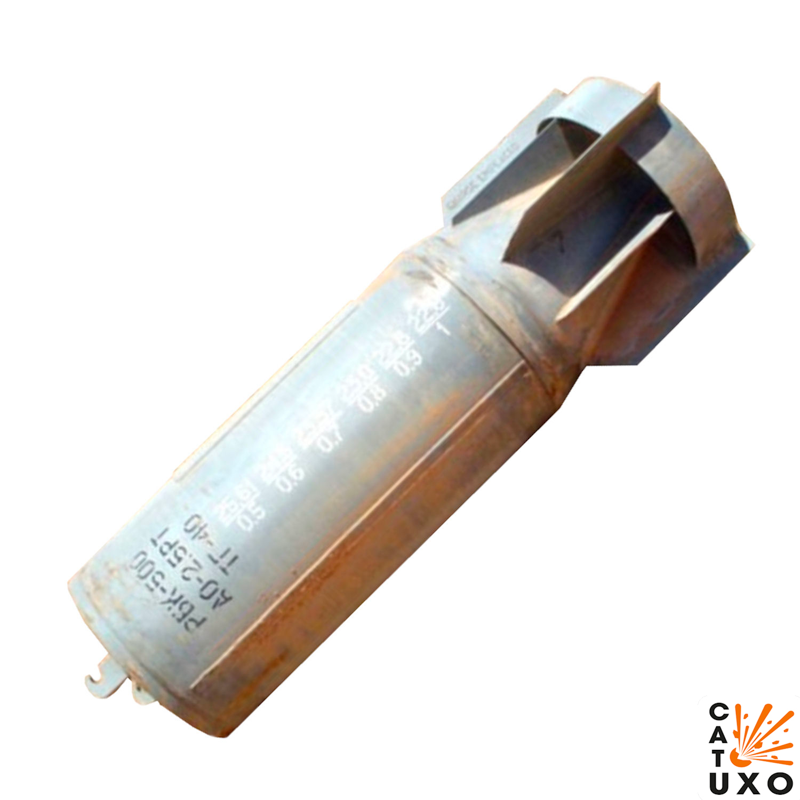
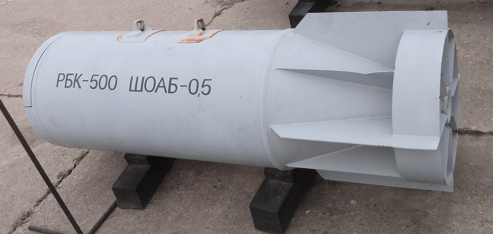
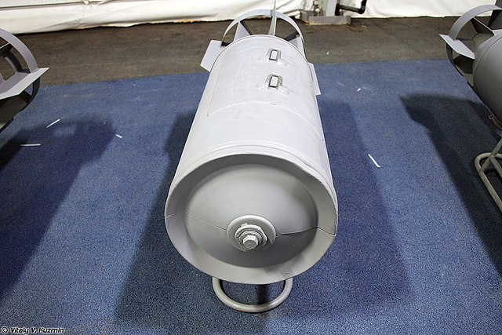
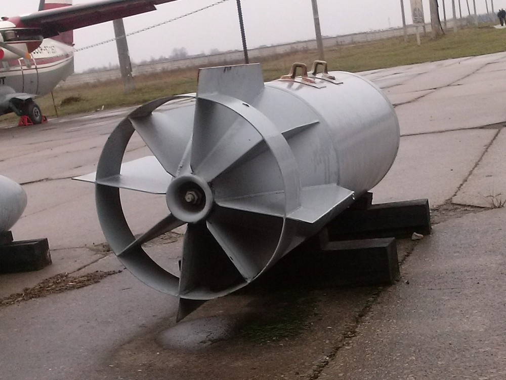
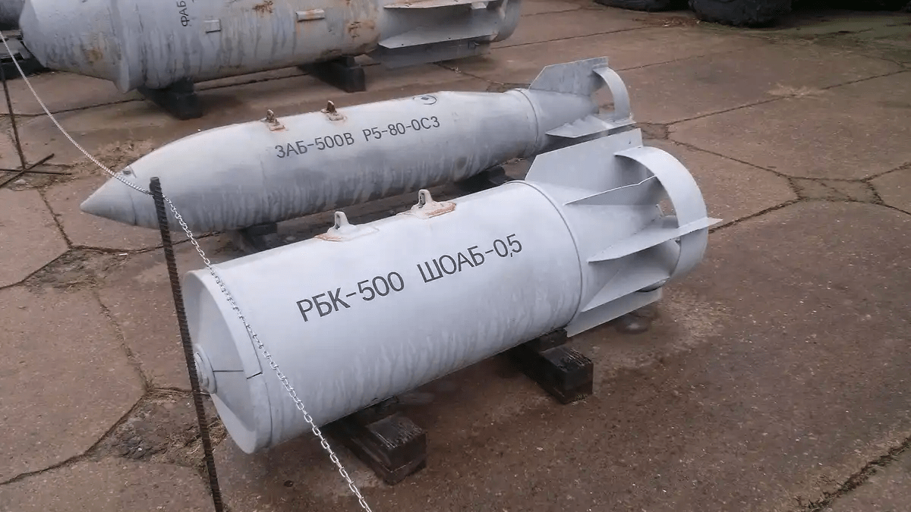
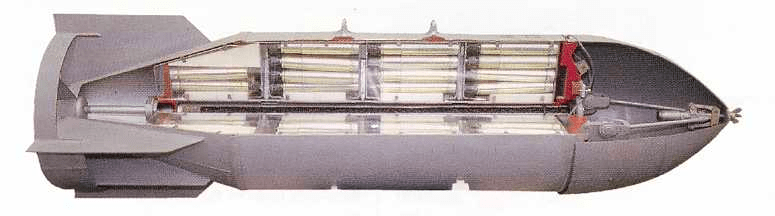
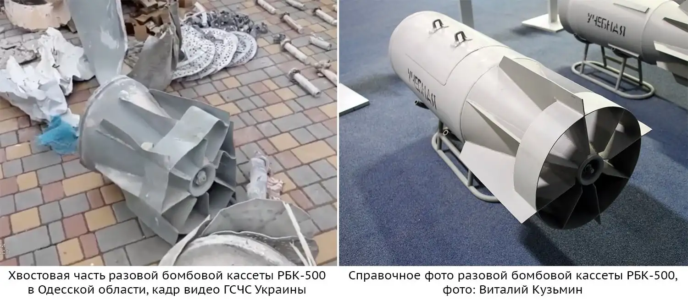

---
# Custom KB params
title: Касетна бомба РБК-500
subtitle: "Касетна бомба РБК-500"
description: "Касетна бомба РБК-500"

# Obsidian metadata YAML front matter params
aliases: РБК-500
tags:
keywords:
cssclass:
publish: true

# VuePress 2.x Frontmatter params
lang: uk-UA
prev:
  text: РБК-250
  link: /catalog/bomb-rbk250.html
next:
  text: МЛ-8
  link: /catalog/mina-ml-8.html
---

← [Повернутись](../index.md)

# Касетна бомба РБК-500

РБК-500 - радянська, а зараз російська вільнопадаюча касетна бомба часів холодної війни та сучасності. Бомба у варіанті РБК-500 має довжину 250 см, діаметр 45 см і вага від 500 до 525 кг. 

Сімейство касетних бомб РБК-500 розроблялося насамперед для того, щоб ефективно знищувати живу силу супротивника, а також знищувати його бронетехніку. Бомби цього сімейства здатні нести різні типи суббоєприпасів, призначених для знищення цих двох вищезгаданих типів цілей. 

Як допоміжний боєприпас часто використовуються осколкові снаряди (бомби) АТ-10, яких в бомбі РБК-500-375 АТ-10 може бути розміщено до 30 штук. 

Варіант РБК-500 ПТАБ-1М з іншого боку несе до 268 малогабаритних протитанкових ракет (бомб) [ПТАБ-1М](./subbomb-ptab1m.md) . Варто зазначити, що останній випадок представленої касетної бомби, тобто РБК-500У, також може нести як допоміжні ракети осколкові бомби АТ-25РТ або ОФАБ-50. 

Бомби сімейства РБК-500 можуть нести багато літаків радянського, а потім і російського виробництва, зокрема МіГ-21, МіГ-27, МіГ-29, Су-17 або Су-25.

::: danger Категорично забороняється:

1. Виконувати будь - які механічні , термічні та інші впливи на корпус.
2. Переміщувати з місця їх знаходження .
3. Проводити будь - які земляні роботи поблизу.
4. Намагатися викрутити будь - які комплектуючі.
5. Чипати корпус.
6. Самостійно знешкоджувати.

:::

## Історична довідка

Міна-пастка МЛ-7 (ML-7) була прийнята на озброєння Радянської Армії в 1984 році і призначена для використання як пристрій невилучності для протипіхотних мін, а також як міна-пастка розвантажувальної дії.

## Відео

<iframe width="560" height="315" src="https://www.youtube.com/embed/T-bADJfTJts" title="Росія на Одещині застосовує касетні бомби РБК-500 з ПТАБ-1М" frameborder="0" allow="accelerometer; autoplay; clipboard-write; encrypted-media; gyroscope; picture-in-picture; web-share" allowfullscreen></iframe>

<iframe width="560" height="315" src="https://www.youtube.com/embed/iarnfIGkxvM" title="YouTube video player" frameborder="0" allow="accelerometer; autoplay; clipboard-write; encrypted-media; gyroscope; picture-in-picture; web-share" allowfullscreen></iframe>

<iframe width="560" height="315" src="https://www.youtube.com/embed/eg940IWvm58" title="YouTube video player" frameborder="0" allow="accelerometer; autoplay; clipboard-write; encrypted-media; gyroscope; picture-in-picture; web-share" allowfullscreen></iframe>

<iframe width="560" height="315" src="https://www.youtube.com/embed/iFe3JaJVm7E?start=16" title="YouTube video player" frameborder="0" allow="accelerometer; autoplay; clipboard-write; encrypted-media; gyroscope; picture-in-picture; web-share" allowfullscreen></iframe>

## Зображення

::: gallery

- 
- 
- 
- 
- 
- 

:::

#### Інформаційні джерела

1. [Росія на Одещині застосовує касетні бомби РБК-500 з ПТАБ-1М](https://mil.in.ua/uk/news/rosiya-na-odeshhyni-zastosovuye-kasetni-bomby-rbk-500-z-ptab-1m/)
2. [ВКС РФ сбросили в Одесской области кассетную бомбу, но, похоже, большая часть суббоеприпасов не взорвалась](https://citeam-ru.medium.com/%D0%B2%D0%BA%D1%81-%D1%80%D1%84-%D1%81%D0%B1%D1%80%D0%BE%D1%81%D0%B8%D0%BB%D0%B8-%D0%B2-%D0%BE%D0%B4%D0%B5%D1%81%D1%81%D0%BA%D0%BE%D0%B9-%D0%BE%D0%B1%D0%BB%D0%B0%D1%81%D1%82%D0%B8-%D0%BA%D0%B0%D1%81%D1%81%D0%B5%D1%82%D0%BD%D1%83%D1%8E-%D0%B1%D0%BE%D0%BC%D0%B1%D1%83-%D0%BD%D0%BE-%D0%BF%D0%BE%D1%85%D0%BE%D0%B6%D0%B5-%D0%B1%D0%BE%D0%BB%D1%8C%D1%88%D0%B0%D1%8F-%D1%87%D0%B0%D1%81%D1%82%D1%8C-%D1%81%D1%83%D0%B1%D0%B1%D0%BE%D0%B5%D0%BF%D1%80%D0%B8%D0%BF%D0%B0%D1%81%D0%BE%D0%B2-%D0%BD%D0%B5-4236f2dffedd)
3. [RBK-500 AO-2.5RT Aircraft Cluster Bomb](https://cat-uxo.com/explosive-hazards/aircraft-bombs/rbk-500-ao-25rt-aircraft-cluster-bomb)
