---
# Custom KB params
title: Ручна граната Ф-1
subtitle: "Ручна граната Ф-1 ударно-дистанційна"
description: "Ручна осколкова граната Ф-1 – граната дистанційної дії призначена для ураження живої сили противника під час оборонного бою. "

# Obsidian metadata YAML front matter params
aliases: Ф-1, «Лимонка», «Фенюша»
tags:
keywords:
cssclass:
publish: false

# VuePress 2.x Frontmatter params
lang: uk-UA
prev:
  text: Перелік
  link: /catalog/index.html
next:
  text: МОН-100
  link: /catalog/hand-thrown-grenade-rgn.html
---

← [Повернутись](./index.md)

# Ручна граната Ф-1 «Лимонка» «Фенюша».

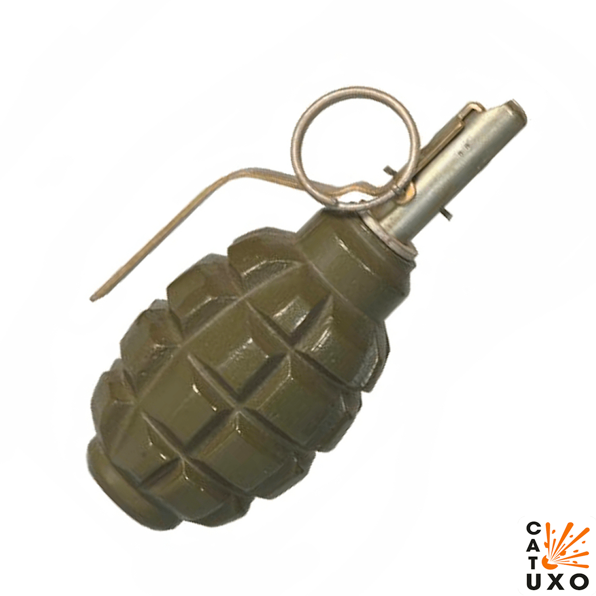

Ручна осколкова граната Ф-1 – граната дистанційної дії призначена для ураження живої сили противника під час оборонного бою. Оскільки Ф-1 є гранатою оборонної дії, то радіус ураження осколками значно перевищує радіус можливого кидка гранати.

- Радіус суцільного ураження: 7-35 м
- Безпечна відстань: 200 м

- Мають невеликий розмір.
- Йх часто застосовують для пасток з розтяжками.
- Є однією з найбільш поширених ручних гранат у світі.

## Тактико-технічні характеристики

- **Корпус** - чавун
- **Тип** - осколкова
- **Маса** - 0,6 кг
- **Габарити**- ⌀56 х 114 мм ( як великий лімон ) 🍋
- **Сила натягу** - Усилие срабатывания (кг/см) - 300 г 🐀
- **Безпечна відстань** - 200 м (1 стадіон) 🏟

::: danger Категорично забороняється:

1. Виконувати будь - які механічні , термічні та інші впливи на корпус гранати або запалу.
2. Переміщувати гранату з місця їх знаходження .
3. Проводити будь - які земляні роботи поблизу з гранатою .
4. Намагатися викрутити будь - які комплектуючі з гранати .
5. Перерізати проводити , троси , тощо , що ідуть до гранати.
6. Намагатись знешкодити гранату самостійно.
   :::

### Зона враження

- **Кількість осколків** - до 300 шт.
- **Горизонтальний кут розкидання осколків** – 180°
- Прицільна дальність кидання – 35-45 м
- **Радіус суцільного ураження** – 7-35 м
- **Дальність польоту забійних осколків** – 30-200 м,
- **Приведена площа розльоту** – 95 – 96 м2, 
- **Температурний діапазон (°C)** – від -40 до +50
- **Видобуваність** - так
- **Знешкоджуваність** – так
- **Самоліквідація** – так, через  3,2-4,2 с
- **Гарантійний термін** – 10 років

## Історична довідка

Граната Ф-1 була розроблена на основі французької осколкової гранати F-1 моделі 1915 р. та англійської гранати системи Лемона, що постачались у Росію в роки Першої світової війни, звідки й назва Ф-1 та прізвисько «лимонка». 
У військах граната крім «лимонки» отримала також прізвиська «фенюша».
Причиною розробки гранати для радянських військ стали численні недоліки гранати РГД-33, то ж у 1939 році розробку нової гаранати було доручене Ф. І. Храмєєву з чим він впорався за два місяці. 
На озброєння РККА граната була прийнята з механічним запалом Ф.Ковешникова. У 1941 р. запал був замінений більш надійним, простішим і надійнішим запалом УЗРГ системи Е. М. Вицені.
Знята з озброєння в СРСР в 1988, але використовується всіма арміями пострадянського простору. У російській федерації станом на 2013 на утилізацію було виставлено 365681 гранат Ф-1
Бойові гранати пофарбовано у зелений колір від хакі до темно-зеленого. 
**Корпус гранати** служить для розміщення розривного заряду і запалу, а також для утворення осколків під час вибуху гранати. Корпус гранати чавунний з повздовжніми і поперечними борознами, по яких граната, як правило, розривається на осколки. У верхній частині корпусу є нарізний отвір для вгвинчування запалу. При зберіганні, транспортуванні і перенесені гранати в цей отвір вкручена пластмасова пробка.
**Розривний заряд** заповнює корпус та призначений для розриву гранати на осколки.
Гранати Ф-1 упаковуються в дерев'яні ящики по 20 штук, отвір для запалу заглушена пластмасовою заглушкою. Запали УЗРГМ зберігаються в цьому ж ящику окремо в двох металевих герметично запаяних банках (по 10 штук у банці). Вага ящика - 18 кг. Ящик комплектується консервним ножем, призначеним для відкриття банки з запалами.

Практично у всіх інструкція сказано, що граната «лимонка» «розкидає» осколки на 150-200 метрів. Це не зовсім фантастика: дійсно, окремі «шматки» можуть залітати і на таку дистанцію. Але про зону гарантованого ураження в цьому випадку ніякої мови не йде.  
Більш того, в інших ситуаціях на 200 метрів летять осколки навіть від РГ-42 творці якої про подібні рекорди і не заїкалися. Це не показник. Досвід учасників реальних бойових дій каже, що зона гарантованого ураження у мін, гранат і тому подібного «добра» становить приблизно 35-40 метрів, не більше. Якщо далі – то тут все залежить від індивідуального везіння. Якщо зовсім пощастить, то є ймовірність і в метрі від вибуху «лимонки» залишитися в живих.

## Відео

<iframe width="560" height="315" src="https://www.youtube.com/embed/9lgry2ScWgg" title="YouTube video player" frameborder="0" allow="accelerometer; autoplay; clipboard-write; encrypted-media; gyroscope; picture-in-picture" allowfullscreen></iframe>

## Зображення

::: gallery
- 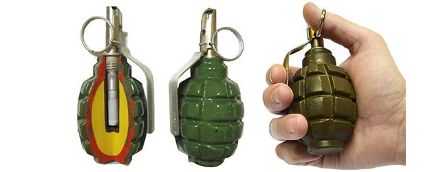
- 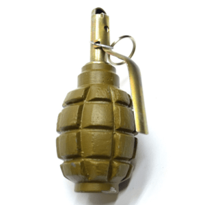
- 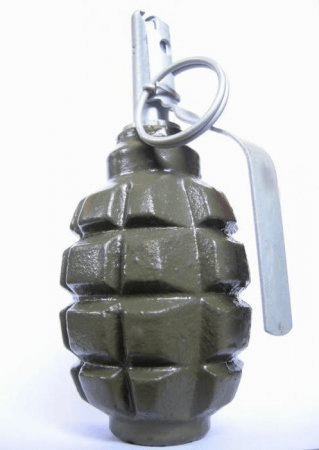
- 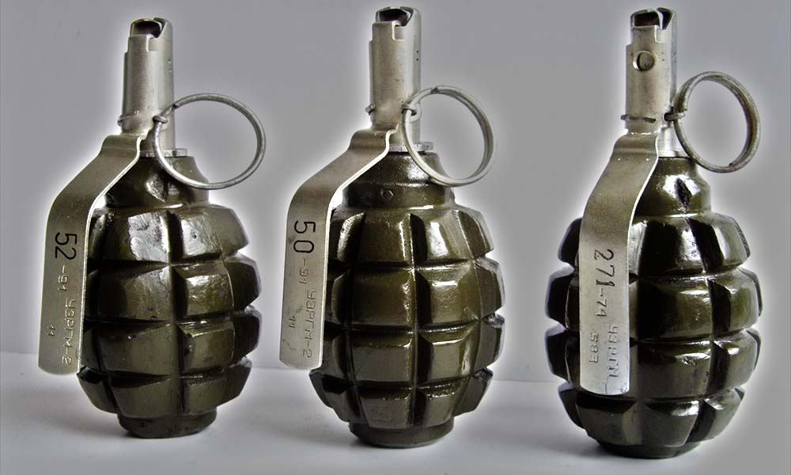
- 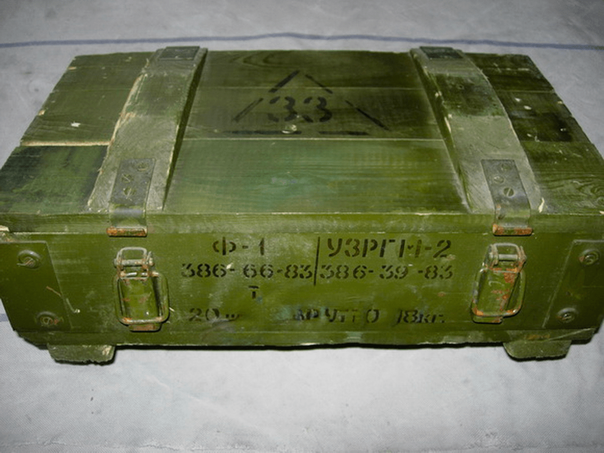
- 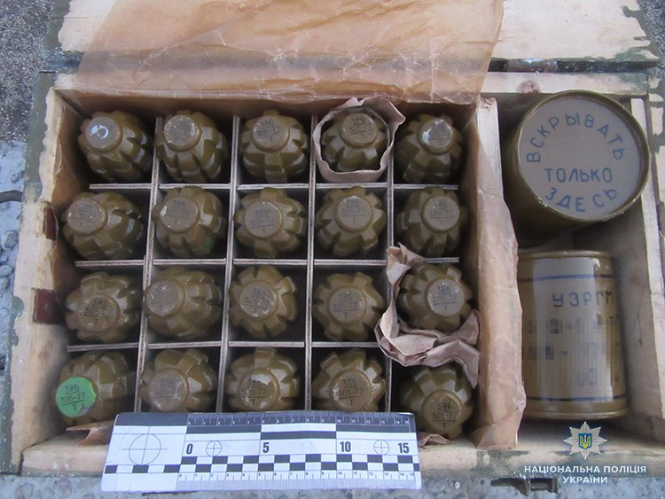
- 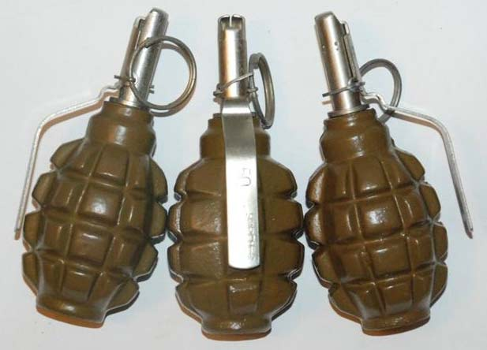
- 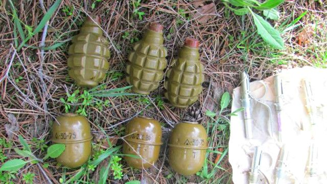
- 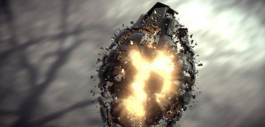
- 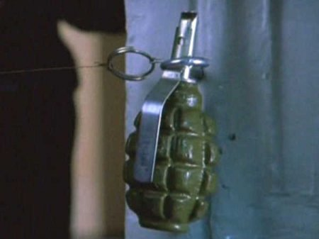

:::

#### Інформаційні джерела

1. [# F1 (Russian) Hand Grenade](https://cat-uxo.com/explosive-hazards/grenades/f1-russian-hand-grenade)
2. [Ручна осколкова граната Ф-1](https://www.ukrmilitary.com/2020/10/f1-grenade.html)
3. Wiki: [Ручна осколкова граната Ф-1](https://uk.wikipedia.org/wiki/%D0%A4-1)
4. [Ручна оборонна граната «лимонка» Ф-1](http://poradu.pp.ua/nauka/35945-ruchna-oboronna-granata-limonka-f-1-opis-harakteristiki-vdguki.html)
5. [Граната Ф-1: фото, технічні характеристики, радіус ураження](http://poradu.pp.ua/nauka/49060-granata-f-1-foto-tehnchn-harakteristiki-radus-urazhennya.html)
6. [В Одесі в житловому будинку знайшли розтяжку з бойовою гранатою: фото і відео (2021)](https://apostrophe.ua/ua/news/society/accidents/2021-05-06/v-odesse-v-jilom-dome-nashli-rastyajku-s-boevoy-granatoy-foto-i-video/231307)
