---
# Custom KB params
title: Ручна граната РГД-5
subtitle: "Ручна граната РГД-5 ударно-дистанційна"
description: "Ручна граната РГД-5 («Ручна граната дистанційна») — протипіхотна уламкова ручна граната дистанційної дії, наступального типу. Уражає уламками корпусу."

# Obsidian metadata YAML front matter params
aliases: РГД-5
tags:
keywords:
cssclass:
publish: false

# VuePress 2.x Frontmatter params
lang: uk-UA
prev:
  text: Перелік
  link: /catalog/index.html
next:
  text: МОН-100
  link: /catalog/hand-thrown-grenade-rog-43.html
---

← [Повернутись](./index.md)

# Ручна граната РГД-5

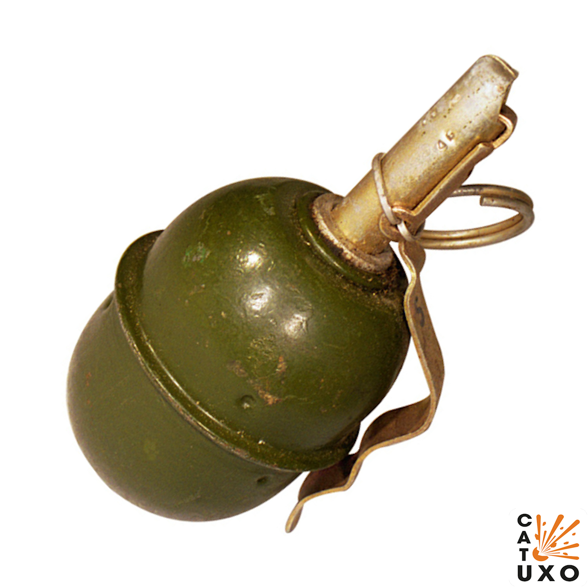

Ручна граната РГД-5 («Ручна граната дистанційна») — протипіхотна уламкова ручна граната дистанційної дії, наступального типу. Уражає уламками корпусу.

- Радіус суцільного ураження: 20 м
- Безпечна відстань: 60 м

- Мають невеликий розмір.
- Йх часто застосовують для пасток з розтяжками.
- Комплектуються запалами що реагують на удар та можуть керуватись дистанційно.
- Є однією з найбільш поширених ручних гранат у світі; перебуває на озброєнні країн колишнього Радянського Союзу, практично всіх держав Східної Європи, Китаю, КНДР та В'єтнаму.

## Тактико-технічні характеристики

- **Корпус** - сталь
- **Тип** - осколкова
- **Маса** - 0,31 кг
- **Габарити**- ⌀56 х 114 мм ( як великий лімон ) 🍋
- **Сила натягу** - Усилие срабатывания (кг/см) - 300 г 🐀
- **Безпечна відстань** - 60 м (2 вагони) 🚃🚃 

::: danger Категорично забороняється:

1. Виконувати будь - які механічні , термічні та інші впливи на корпус гранати або запалу.
2. Переміщувати гранату з місця їх знаходження .
3. Проводити будь - які земляні роботи поблизу з гранатою .
4. Намагатися викрутити будь - які комплектуючі з гранати .
5. Перерізати проводити , троси , тощо , що ідуть до гранати.
6. Намагатись знешкодити гранату самостійно.
   :::

### Зона враження

- **Кількість осколків** - 220 – 300
- **Горизонтальний кут розкидання осколків** – 180°
- Прицільна дальність кидання – 30-50 м
- **Радіус суцільного ураження** – 15-20 м
- **Дальність польоту забійних осколків** – 30-200 м,
- **Приведена площа розльоту** – 95 – 96 м2, 
- **Температурний діапазон (°C)** – від -40 до +50
- **Видобуваність** - так
- **Знешкоджуваність** – так
- **Самоліквідація** – так, через  3,2-4,2 с
- **Гарантійний термін** – 10 років

## Історична довідка

За зовнішнім виглядом граната РГД-5 нагадує французьку гранату OF зразка 1915 року, польську наступальну гранату Z-23 та німецьку гранату М-39.

Прийнята на озброєння в 1955 році для заміни РГ-42. Відноситься до наступальних гранат; призначена для ураження живої сили противника вибуховою хвилею і осколками. Дальність кидка — до 40 м, радіус суцільного ураження — 15 метрів. Уламки гранати невеликі за вагою та розмірами і летять на дальність, меншу за дистанцію кидка.

Є однією з найбільш поширених ручних гранат у світі; перебуває на озброєнні країн колишнього Радянського Союзу, практично всіх держав Східної Європи, Китаю, КНДР та В'єтнаму.

Граната РГД-5 складається з корпусу, вибухового заряду та запалу. Корпус служить для розміщення розривного заряду й трубки для запалу та складається з верхньої й нижньої частин. До верхньої частини корпуса за допомогою манжети приєднується трубка для запалу, що служить для приєднання запалу до гранати й герметизації розривного заряду в корпусі.

Для запобігання забруднення трубки в неї вгвинчується пластмасова пробка.

Бойові гранати РГД-5 пофарбовані у зелений (оливково-сірий) колір.

Ручні гранати РГД-5 зберігаються в дерев'яних ящиках по 20 штук. Вага ящика – 14 кг. У кожній гранаті є ебонітова заглушка, так само в комплекті йдуть запали УЗРГМ (уніфікований запал ручної гранати модернізований) у двох металевих банках.

## Відео

<iframe width="560" height="315" src="https://www.youtube.com/embed/9lgry2ScWgg" title="YouTube video player" frameborder="0" allow="accelerometer; autoplay; clipboard-write; encrypted-media; gyroscope; picture-in-picture" allowfullscreen></iframe>

## Зображення

::: gallery
- 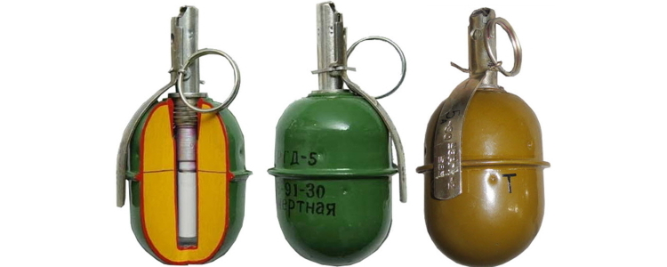
- 

- 
- 
- 
- 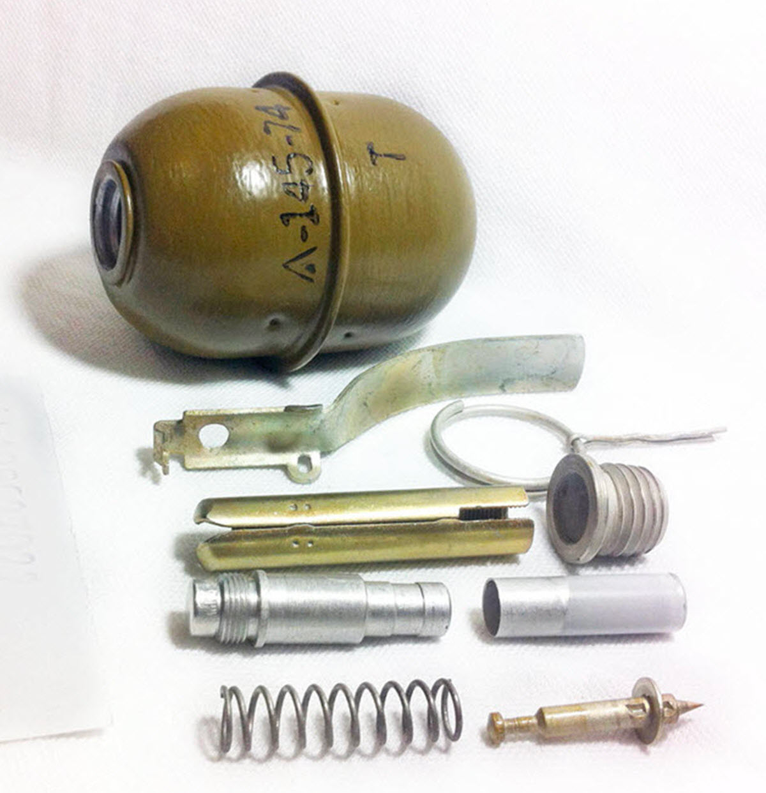
- 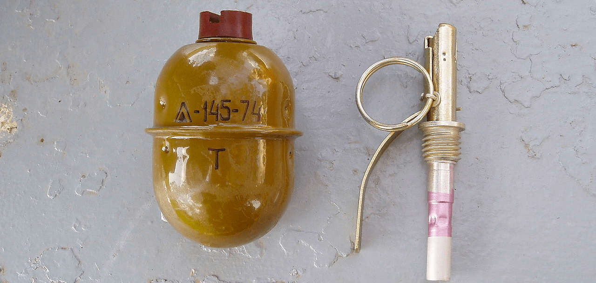
- 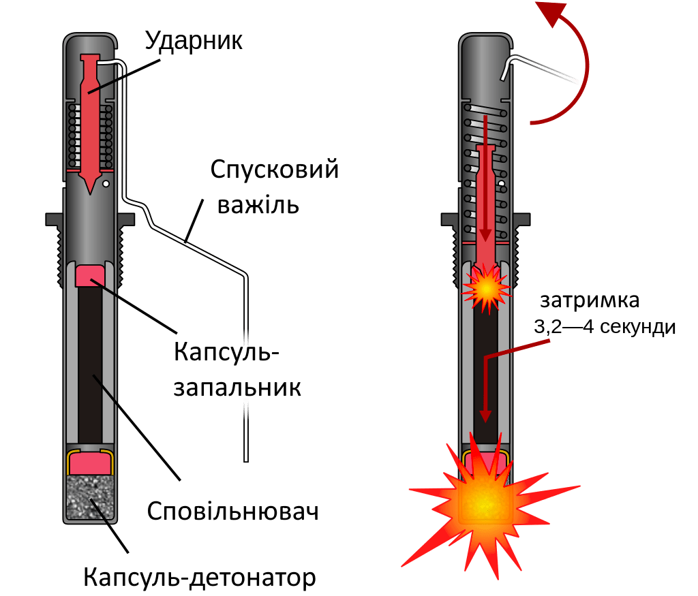
- 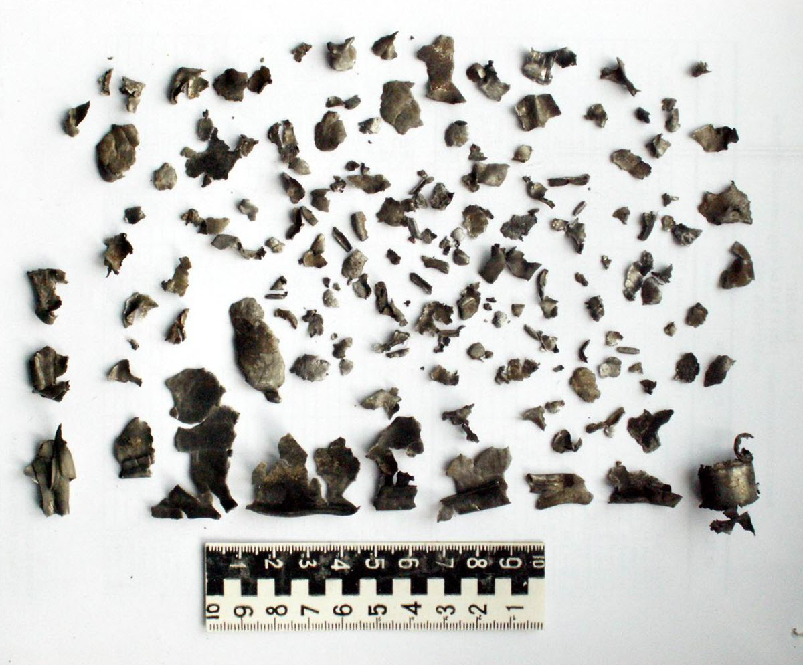
- 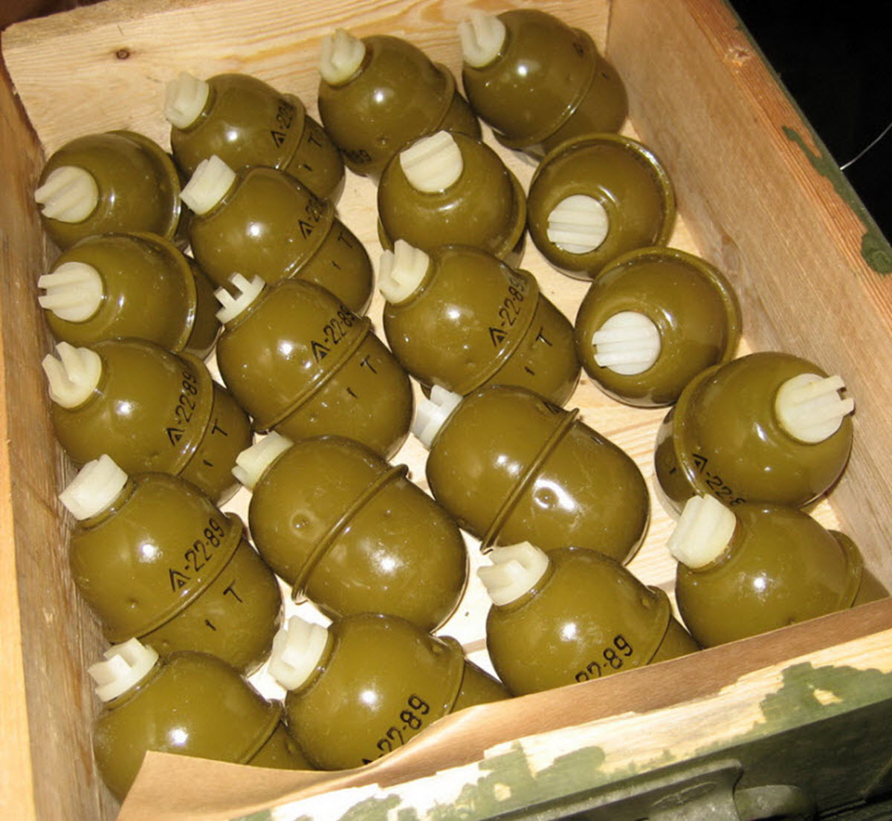
- 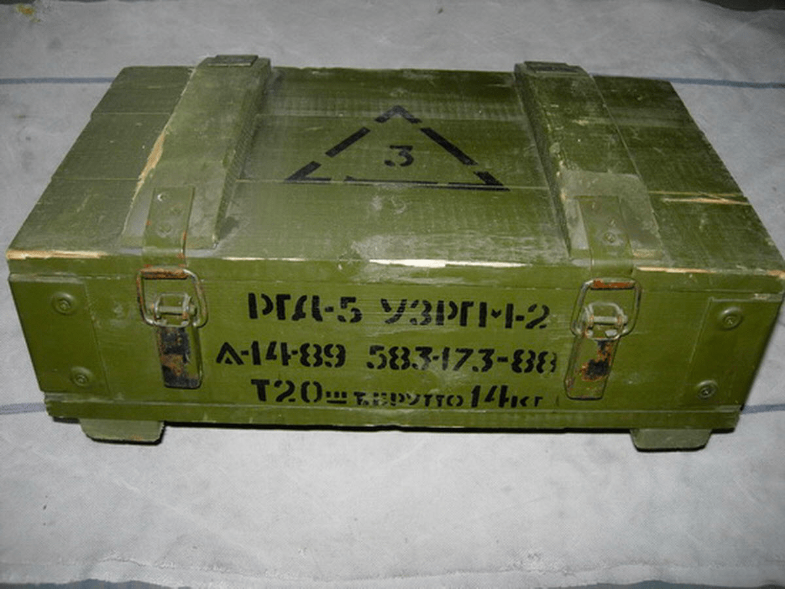
- 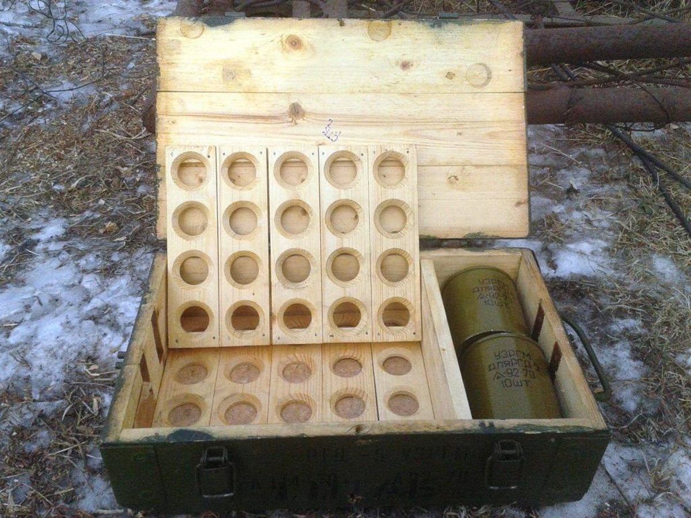
- 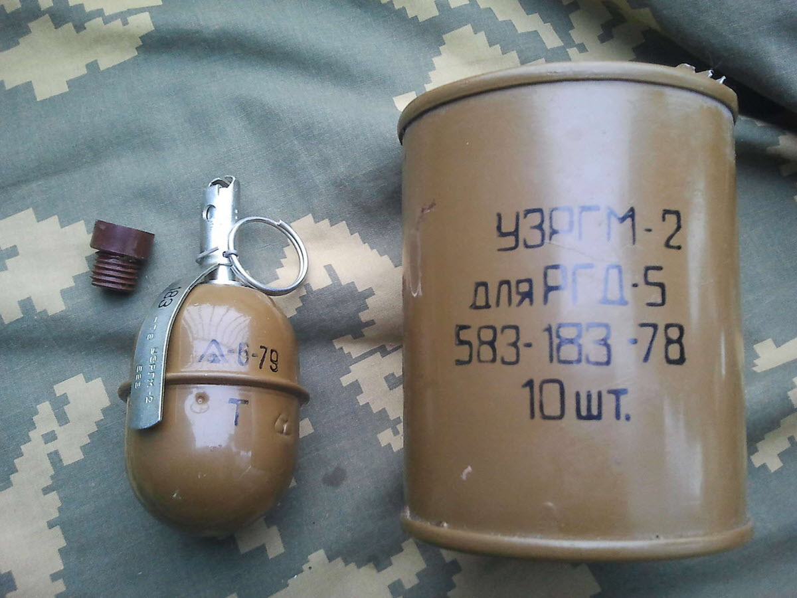
- 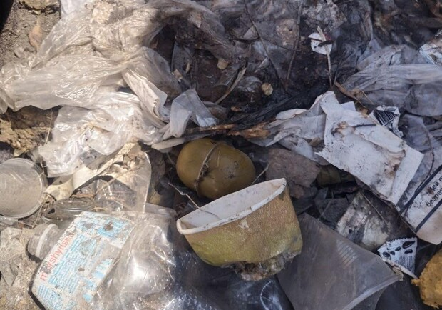
- 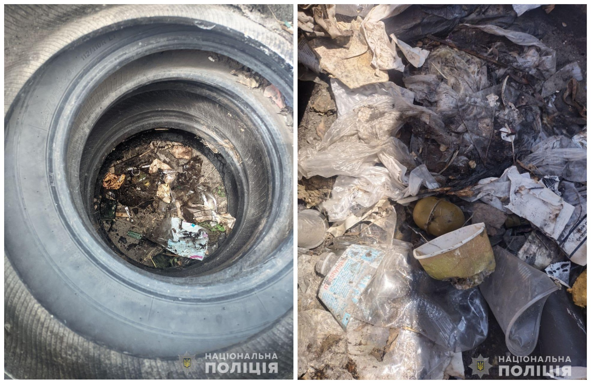
- 
:::

#### Інформаційні джерела

1. [РГД-5](https://warriors.fandom.com/uk/wiki/РГД-5)
2. [Ручна граната РГД-5](https://www.ukrmilitary.com/2020/08/rgd5.html)
3. [RGD-5 Hand Grenade](https://cat-uxo.com/explosive-hazards/grenades/rgd-5-hand-grenade)
4. [У дніпрі знайшли гранату РГД-5 у купі сміття на автовокзалі](https://dp.vgorode.ua/ukr/news/sobytyia/u-dnipri-znajshli-hranatu-rhd-5-u-kupi-smittja-na-avtovokzali)
