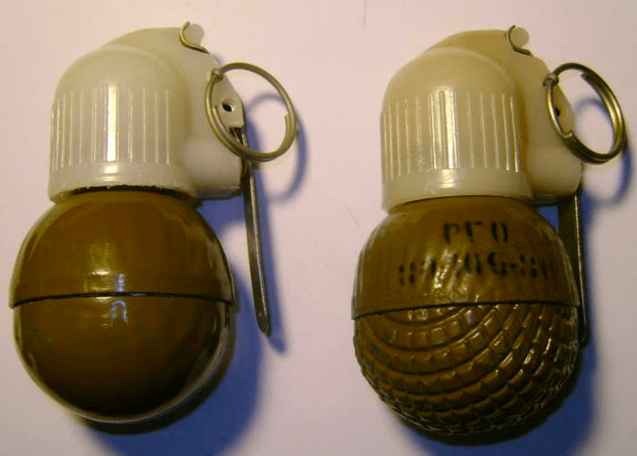
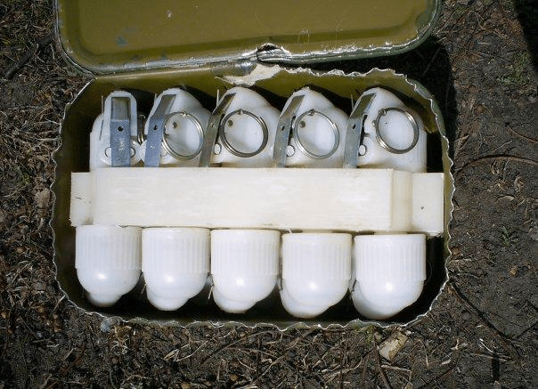

---
# Custom KB params
title: Ручні осколкові гранати РГН та РГО
subtitle: "Ручна граната наступальна РГН і оборонна РГО ударно-дистанційна"
description: "Ручна граната наступальна РГН і ручна граната оборонна РГО – призначені для враження живої сили противника в наступальному і оборонному боях відповідно, в різних умовах місцевості в будь-яку пору року."
created: 2022-08-06 16:27
type: kb|page
video: https://youtu.be/QI6MCKHnu8w
gallery:
  - img

# Obsidian metadata YAML front matter params
aliases: Гранати РГН та РГО
tags:
keywords:
cssclass:
publish: false

# VuePress 2.x Frontmatter params
lang: uk-UA
prev:
  text: Перелік
  link: /catalog/index.html
next:
  text: МОН-90
  link: /catalog/mina-mon-90.html
---

← [Повернутись](./index.md)

# Ручні осколкові гранати РГН та РГО
**Ручна граната наступальна РГН і ручна граната оборонна РГО** призначені для враження живої сили противника в наступальному і оборонному боях відповідно, в різних умовах місцевості не залежно від пори року.

## Тактико-технічні характеристики

- **Корпус** -  Корпус РГН складається з двох півсфер, які виготовлені з алюмінієвого сплаву та має товщину 4 мм. Корпус РГО для збільшення кількості осколків, крім двох зовнішніх півсфер, має дві внутрішні півсфери, виготовлені із сталі. Нижня півсфера оборонної гранати має на зовнішній поверхні насічку для зручності розрізнення гранат по призначенню.
- **Тип** - осколкова
- **Маса** - РГН 0,31 кг, РГО 0,53 кг
- **Габарити**- 60 х 60 мм х 113 мм ( як великий лімон ) 🍋
- **Сила натягу** - Усилие срабатывания (кг/см) - 300 г 🐀
- **Безпечна відстань** - РГН 30 м (2 автобуси) 🚌🚌 , РГО 150 м ( 7 автобусів ) 🚌🚌🚌🚌🚌🚌🚌

### Зона враження

- **Кількість осколків** 
	 - Граната **РГН** під час вибуху утворює 220 – 300 осколків середньою вагою 0,42 грами з початковою швидкістю розльоту 700 м/с, приведена площа розльоту осколків складає 95 – 96 м2.
	 - Граната **РГО** після вибуху дає приблизно 670 – 700 осколків вагою 0,46 грамів і швидкістю до 1200 м/с. На утворення осколків йде до 73 % ваги корпуса гранати. Енергія осколків РГО втроє перевершує осколки РГН, приведена площа розльоту складає 213 – 286 м2. Граната РГО забезпечує велику щільність ураження, у той же час, має більшу безпеку для того, хто її кидає та його підрозділу за рахунок швидкої втрати осколками енергії.
- **Горизонтальний кут розкидання осколків** – 180°
- **Радіус суцільного ураження** – РГН 15 м, РГО 50 м
- **Дальність ураження легкового та вантажного автотранспорту та живої сили в ньому** –до 30 м
- **Дальність польоту забійних осколків** – РГН 30 м, РГО 150 м
- **Приведена площа розльоту** – РГН 95 – 96 м2 , РГО 213 – 286 м2

- **Температурний діапазон (°C)** – від -40 до +50
- **Видобуваність** - видобута
- **Знешкоджуваність** – знешкоджувана
- **Самоліквідація** – через  3,2-4,2 с
- **Гарантійний термін** – 10 років

## Історична довідка

РГН і РГО були розроблені конструкторами С. Коршуновим і В. Кузьміним на підприємстві «Базальт» в кінці сімдесятих років. Прийняті на озброєння Радянської Армії в 1981 році. Нові гранати мали замінити гранати РГ-42 і РГД-5.

При розробці гранат РГН і РГО був врахований досвід бойового застосування і технології масового виробництва. Необхідність їх хокрема була продиктована «афганським досвідом», так як застосування в гранатах дистанційного запалу під час бойових дій ну горах дозволяло противнику вчасно сховатися від її осколків, а також створювало загрозу самознищення гранатометчика в разі відскоку гранати від перешкоди або скочування зі схилу після кидка.

## Відео

<iframe width="560" height="315" src="https://www.youtube.com/embed/9lgry2ScWgg" title="YouTube video player" frameborder="0" allow="accelerometer; autoplay; clipboard-write; encrypted-media; gyroscope; picture-in-picture" allowfullscreen></iframe>

## Зображення

#### Інформаційні джерела

1.  Матеріал з Вікіпедії [МОН-50](https://uk.wikipedia.org/wiki/%D0%9C%D0%9E%D0%9D-50)
2. [Ручні осколкові гранати РГН і РГО]( https://www.ukrmilitary.com/2020/10/rgn-rgo.html)

---------
Sources:

https://free3d.com/ru/3d-model/rgn-hand-grenade-8917.html

Links:

