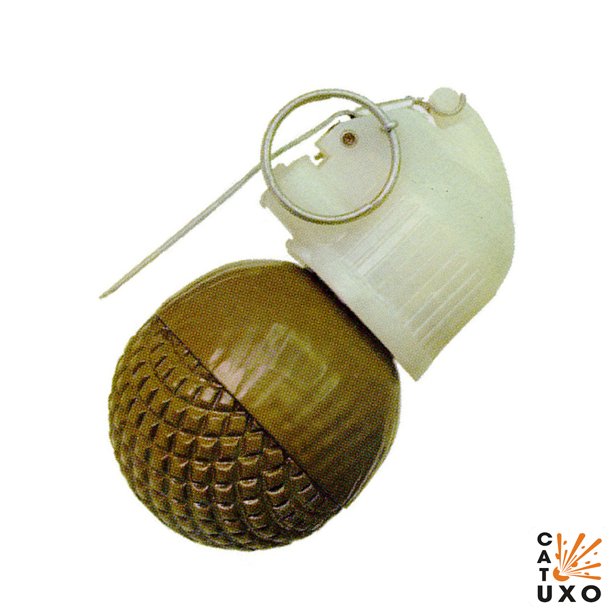

---
# Custom KB params
title: Ручні осколкові гранати РГН та РГО
subtitle: "Ручна граната наступальна РГН і оборонна РГО ударно-дистанційна"
description: "Ручна граната наступальна РГН і ручна граната оборонна РГО – призначені для враження живої сили противника в наступальному і оборонному боях відповідно, в різних умовах місцевості в будь-яку пору року."

# Obsidian metadata YAML front matter params
aliases: РГН та РГО
tags:
keywords:
cssclass:
publish: false

# VuePress 2.x Frontmatter params
lang: uk-UA
prev:
  text: Перелік
  link: /catalog/index.html
next:
  text: МОН-100
  link: /catalog/hand-thrown-grenade-rgd-5.html
---

← [Повернутись](./index.md)

# Ручні осколкові гранати РГН та РГО

- 

**Ручна граната наступальна РГН і ручна граната оборонна РГО** призначені для враження живої сили противника в наступальному і оборонному боях відповідно, в різних умовах місцевості не залежно від пори року.

- Радіус суцільного ураження: 15-50 м
- Безпечна відстань: 150 м

- Мають невеликий розмір.
- Йх часто застосовують для пасток з розтяжками.
- Комплектуються запалами що реагують на удар та можуть керуватись дистанційно.
- Улмаки РГН алюмінієві, вони не магнітяться і тому їх важко вилучити хирургічним шляхом.
- Гранати використовуються з **Ударно-дистанційним запалом УДЗ** — механічний запал, спрацьовує при ударі гранати об перешкоду. У випадку, коли датчик  відмовляє в ударній дії, запал спрацьовує від дистанційного пристрою через 3,3 – 4,3 с.

## Тактико-технічні характеристики

- **Корпус**
  - Корпус РГН складається з двох півсфер, які виготовлені з алюмінієвого сплаву та має товщину 4 мм.
  - Корпус РГО для збільшення кількості осколків, крім двох зовнішніх півсфер, має дві внутрішні півсфери, виготовлені із сталі. Нижня півсфера оборонної гранати має на зовнішній поверхні насічку для зручності розрізнення гранат по призначенню.
- **Тип** - осколкова
- **Маса**
  - РГН 0,31 кг,
  - РГО 0,53 кг
- **Габарити**- ⌀60 х 113 мм ( як великий лімон ) 🍋
- **Сила натягу** - Усилие срабатывания (кг/см) - 300 г 🐀
- **Безпечна відстань**
  - РГН 30 м (2 автобуси) 🚌🚌 ,
  - РГО 150 м ( 7 автобусів ) 🚌🚌🚌🚌🚌🚌🚌

::: danger Категорично забороняється:

1. Виконувати будь - які механічні , термічні та інші впливи на корпус гранати або запалу.
2. Переміщувати гранату з місця їх знаходження .
3. Проводити будь - які земляні роботи поблизу з гранатою .
4. Намагатися викрутити будь - які комплектуючі з гранати .
5. Перерізати проводити , троси , тощо , що ідуть до гранати.
6. Намагатись знешкодити гранату самостійно.
   :::

### Зона враження

- **Кількість осколків**
  - Граната **РГН** - 220 – 300 осколків середньою вагою 0,42 грами з початковою швидкістю розльоту 700 м/с.
  - Граната **РГО** - 670 – 700 осколків вагою 0,46 грамів і швидкістю до 1200 м/с. На утворення осколків йде до 73 % ваги корпуса гранати.
- **Горизонтальний кут розкидання осколків** – 180°
- **Радіус суцільного ураження**
  - РГН 15 м,
  - РГО 50 м
- **Дальність ураження легкового та вантажного автотранспорту та живої сили в ньому** – до 30 м
- **Дальність польоту забійних осколків**
  - РГН 30 м,
  - РГО 150 м
- **Приведена площа розльоту**
  - РГН 95 – 96 м2 ,
  - РГО 213 – 286 м2
- **Температурний діапазон (°C)** – від -40 до +50
- **Видобуваність** - так
- **Знешкоджуваність** – так
- **Самоліквідація** – так, через  3,2-4,2 с
- **Гарантійний термін** – 10 років

## Історична довідка

РГН і РГО були розроблені конструкторами С. Коршуновим і В. Кузьміним на підприємстві «Базальт» в кінці сімдесятих років. Прийняті на озброєння Радянської Армії в 1981 році. Нові гранати мали замінити гранати РГ-42 і РГД-5.

При розробці гранат РГН і РГО був врахований досвід бойового застосування і технології масового виробництва. Необхідність їх хокрема була продиктована «афганським досвідом», так як застосування в гранатах дистанційного запалу під час бойових дій ну горах дозволяло противнику вчасно сховатися від її осколків, а також створювало загрозу самознищення гранатометчика в разі відскоку гранати від перешкоди або скочування зі схилу після кидка.

## Відео

<iframe width="560" height="315" src="https://www.youtube.com/embed/9lgry2ScWgg" title="YouTube video player" frameborder="0" allow="accelerometer; autoplay; clipboard-write; encrypted-media; gyroscope; picture-in-picture" allowfullscreen></iframe>

## Зображення

::: gallery

- 
- 
- 
- 
- 
- 

:::

#### Інформаційні джерела

1. [Ручні осколкові гранати РГН і РГО](https://www.ukrmilitary.com/2020/10/rgn-rgo.html)
2. [RGN Hand Grenade](https://cat-uxo.com/explosive-hazards/grenades/rgn-hand-grenade)
3. [RGO Hand Grenade](https://cat-uxo.com/explosive-hazards/grenades/rgo-hand-grenade)
