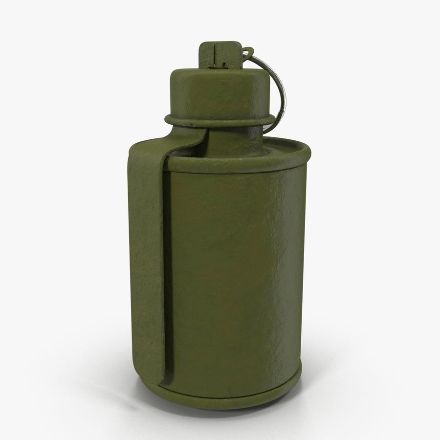
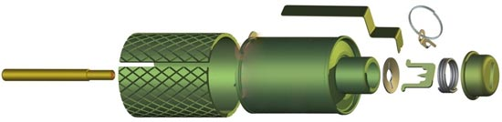
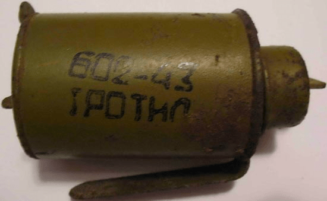
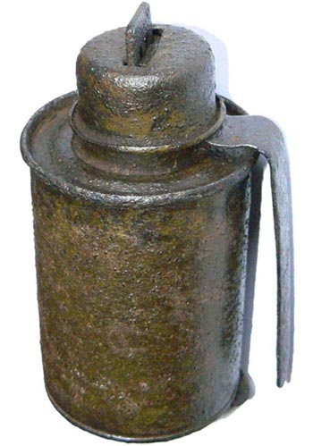
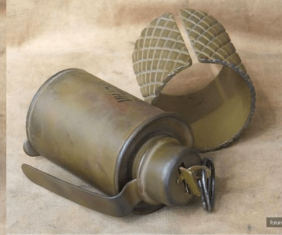
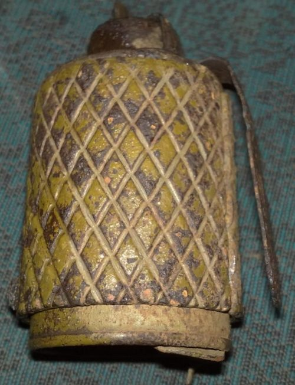

---
# Custom KB params
title: Ручна осколкова граната РОГ-43
subtitle: "Ручна осколкова граната РОГ-43"
description: "**Ручна осколкова граната РОГ-43** дистанційної дії, призначена для поразки живої сили противника у наступальному та оборонному бою."

# Obsidian metadata YAML front matter params
aliases: РОГ-43
tags:
keywords:
cssclass:
publish: false

# VuePress 2.x Frontmatter params
lang: uk-UA
prev:
  text: Перелік
  link: /catalog/index.html
next:
  text: РГН та РГО
  link: /catalog/hand-thrown-grenade-f1.html
---

← [Повернутись](./index.md)

# Ручна осколкова граната РОГ-43

**Ручна осколкова граната РОГ-43** дистанційної дії, призначена для поразки живої сили противника у наступальному та оборонному бою.

- Радіус суцільного ураження: 5 м
- Безпечна відстань: 50 м

- Мають невеликий розмір.
- Йх часто застосовують для пасток з розтяжками.

## Тактико-технічні характеристики

- **Корпус** – метал
- **Тип** – осколкова
- **Маса** – 0,45 кг
- **Габарити**- ⌀57 х 106 мм ( як великий лімон ) 🍋
- **Сила натягу** - Усилие срабатывания (кг/см) - 300 г 🐀
- **Безпечна відстань** – (2 автобуси) 🚌🚌 

::: danger Категорично забороняється:

1. Виконувати будь - які механічні , термічні та інші впливи на корпус гранати або запалу.
2. Переміщувати гранату з місця їх знаходження .
3. Проводити будь - які земляні роботи поблизу з гранатою .
4. Намагатися викрутити будь - які комплектуючі з гранати .
5. Перерізати проводити , троси , тощо , що ідуть до гранати.
6. Намагатись знешкодити гранату самостійно.
   :::

### Зона враження

- **Кількість осколків** – 200 (без чохла), 240 (з чохлом)
- **Горизонтальний кут розкидання осколків** – 180°
- **Радіус суцільного ураження** –   5м
- - **Дальність польоту забійних осколків** – 5м (без чохла), 35м (з чохлом)
- **Температурний діапазон (°C)** – від -40 до +50
- **Видобуваність** - так
- **Знешкоджуваність** – так
- **Самоліквідація** – так, через  3,2-4,2 с
- **Гарантійний термін** – 10 років

## Історична довідка
Нову гранату було розроблено у першій половині Великої Вітчизняної Війни на заводі ім. Калініна і мала заводське позначення РГК-42. Після прийняття на озброєння в 1943 граната отримала позначення РОГ-43. 

При її виробництві використовувалися ті самі матеріали та технології що і для гранати 1933 року РГД-33. Корпус гранати та її оборонний чохол довший, ніж у прототипу на кілька міліметрів. Завдяки цій переробці граната стала простішою і дешевшою у виробництві, і, головне, її стало зручніше застосовувати у бою. Виробництво РОГ-43 було налагоджено на промислових підприємствах Кавказу. 

Граната РІГ-43 складається з корпусу, заряду вибухової речовини (ВВ), ударно-запобіжного механізму, запалу. 

Корпус гранати - металевий, виготовлений із жерстяної смуги завтовшки 0,6 мм. Кінці смуги з'єднані швом. Зверху та знизу корпус закривається кришками. Кришки мають отвори в центрі, в яких закріплено центральну трубку корпусу, призначену для приміщення запалу гранати.  

На верхню кришку за допомогою точкового зварювання кріпиться корпус ударного механізму. До нижньої кришки корпусу за допомогою заклепки кріпиться поворотна засувка. Засувка виконує дві функції: закриває центральну трубку корпусу і не дозволяє запалу випасти, а також утримує на корпусі чохол.

Усередині корпусу розміщується заряд ВР (тротил).

Між зарядом ВР і корпусом поміщається сталева стрічка товщиною 0.4 мм, згорнута в три-чотири шари і має квадратну або ромбоподібну насічку для полегшення утворення осколків.

Як оборонну гранату РОГ-43 використовують з оборонною (осколковою) сорочкою. Оборонна сорочка виготовлялася із заліза завтовшки 3 мм. На зовнішній поверхні є насічки, що ділять поверхню на ромби.

Ударно-запобіжний механізм складається з ударника, шайби, бойової пружини, запобіжної скоби, запобіжного ковпачка та запобіжної чеки.

Шайба має проріз і надівається на ударник. Пружина постійно знаходиться в стислому положенні і впирається одним кінцем у кришку корпусу ударного механізму, а другим тисне на шайбу.

Запобіжна скоба роздвоєна на кінці, вставляється під ударник.

<iframe width="560" height="315" src="https://www.youtube.com/embed/p5PCvOJvS8Q" title="YouTube video player" frameborder="0" allow="accelerometer; autoplay; clipboard-write; encrypted-media; gyroscope; picture-in-picture" allowfullscreen></iframe>

## Зображення

::: gallery

- 
- 
- 
- 
- 

:::

#### Інформаційні джерела
1. [https://sptroops.at.ua/publ/12-1-0-116](https://sptroops.at.ua/publ/12-1-0-116)

