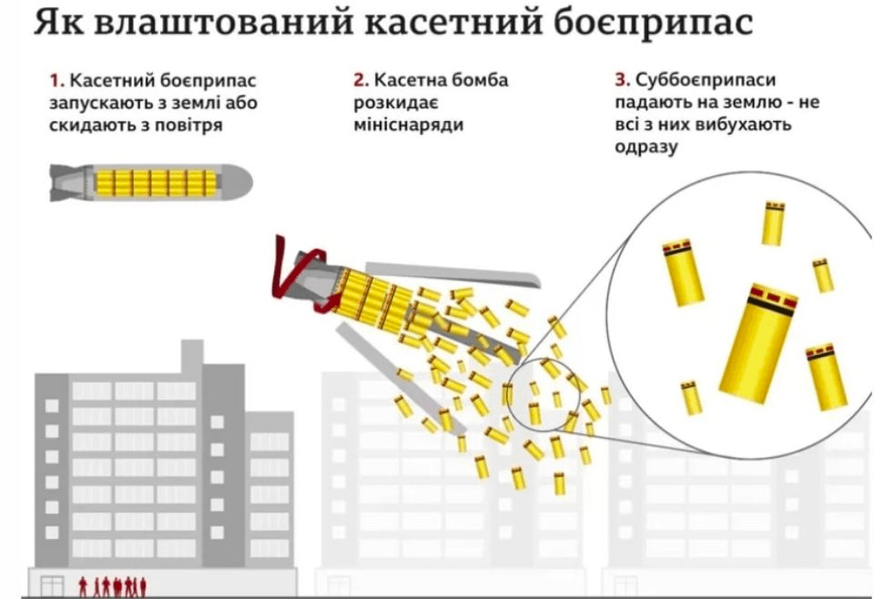

# Довідник вибухонебепечних предметів

## Авіаційні бомби

### Касетні бомби
- [РБК-250](bomb-rbk250.md)
- [РБК-500](bomb-rbk500.md)
- [РБК-500-225](bomb-rbk500-255.md)

## Ракети

### Крилаті ракети

- [Ракета Калібр 3М54](missile-3m54_kalibr.md)

### Балістичні ракети
### Протитанкові керовані ракети (ПТКР)
### Ракети до різних РСЗВ

## Постріли (снаряди) 
### Артилерійські снаряди
### Постріли осколкової гранати
### Гранатометні постріли

## Ручні гранати
- [Ф-1](hand-thrown-grenade-f1.md)
- [РОГ-43](./hand-thrown-grenade-rog-43.md)
- [РГН та РГО](./hand-thrown-grenade-rgn.md)
- [РГД-5](./hand-thrown-grenade-rgd-5.md)

## Касетні боєприпаси

::: details
#### Що таке касетний боєприпас?

**Касетний боєприпас** — це особливий вид авіабомби, яка вирізняється тонкими стінками. Вона складається з наконечника, корпусу, порожнистої форми-оболонки. Цю форму наповнюють дрібними осколками, авіамінами, мінами різного призначення (протитанкові, протипіхотні, запальні). В одному боєприпасі загальна маса такого небезпечного начиння може становити до 10 кг.

Одна касетна бомба може містити мінімум десять мін та дрібних деталей до них, які перебувають на спеціальних стінках-перегородках. Тобто в бомбі розміщується велика кількість маленьких бомб, які після детонації в повітрі висипаються та розсипаються по всій зоні ураження.

#### Існує кілька типів касетних бомб:

- запалювальні — їх використовують для підпалу об’єктів, містять напалм або білий фосфор, протитанкові і протипіхотні елементи, саме такі касетні бомби під назвою «Хлібний кошик» Молотова були застосовані Радянським Союзом взимку 1939-1940 років;
- протитанкові — авіабомби, перебувають всередині, мають кумулятивні боєголовки, які пробивають броню бронемашини чи танка;
- протипіхотні — використовуються осколкові бомбочки, які розраховані на знищення м’яких (неброньованих) об’єктів;
- мінувальні — мінні боєприпаси вибухають не відразу, а поводять себе як звичайні наземні міни;
- протиаеродромні — розраховані на проникнення через бетон перед вибухом, щоб знищити чи значно ушкодити поверхню злітно-посадкової смуги;
- хімічні — протягом 1950-1960-х років в Радянському Союзі розробляли касетні бомби для поширення хімічної зброї.

#### Чому касетні бомби заборонені?

Касетні боєприпаси загрожують цивільному населенню з двох причин, [пояснює](https://www.hrw.org/news/2022/03/21/russias-use-cluster-munitions-and-other-explosive-weapons-shows-need-stronger) старша дослідниця відділу Human Rights Watch з питань зброї Бонні Догерті. По-перше, вони вражають широку площу, не відрізняючи солдатів від мирних жителів.

По-друге, не всі мініснаряди вибухають одразу при ударі. До чверті суббоєприпасів можуть залишатися на землі й становити небезпеку цивільному населенню протягом місяців, років або навіть десятиліть після конфлікту. Деякі мініснаряди мають яскраве забарвлення або виглядають як кульки чи циліндри, приваблюючи дітей. Через невеликий розмір снаряди можуть не помітити фермери, які обробляють поле.

| Назва | ПТАБ-2,5 | ПТАБ-2,5 МБ1 | ПТАБ-2,5 МБ2 | ПТАБ-10-5 | АО-15 | АО-25 | АО-50-45 |
| ------------------------------------- | ----------------- | ---------------------- | ---------------------- | ----------------- | ------------------- | ---------------------------- | ---------------------------- |
| Тип заряду Кумулятивний | Кумулятивно-уламковий | Кумулятивно осколковий | Кумулятивний | Уламково-фугасний | Уламково-фугасний | Уламково-фугасний |
| Тип підривника | Контактний донний | Контактний донний | Контактний донний | Контактний донний | Контактний головний | Контактний головний (донний) | Контактний головний (донний) |
| Маса, кг | 2,5 | 3,2 | 3,2 | 5 | 16,5 | 25 | 45 |
| Діаметр, мм 60 | 68 | 76 | 91 | 120 | 122 | 290 |
| Довжина мм | 360 | 360 | 360 | 365 | 650 | 900 | 720 |
| Діапазон висот бойового застосування, мм | 150-1000 | 150-1000 | 150-1000 | 150-1000 | 150-2000 | 150-2000 | 150-3000 |
:::

### Запалювальні

### Протитанкові
- [ПТАБ-1М](subbomb-ptab1m.md)
- [ПТАБ-2.5](subbomb-ptab2_5.md)
- ПТАБ-2,5 МБ1
- ПТАБ-2,5 МБ2
- ПТАБ-10-5

### Протипіхотні
- [АО-1](subbomb-ao1.md)
- АО-15
- АО-25
- АО-50-45

### Мінувальні

### Протиаеродромні

### Хімічні

## Міни

::: details
> **Міна** — боєприпас, що встановлюється під землею, на землі чи поблизу землі або іншої поверхні й призначений для вибуху, спричиненого присутністю, близькістю чи контактом людини або транспортним засобом

**Історія**

Спочатку міною називався підкоп, здійснюваний нападниками під фортечну стіну під час облоги. З появою пороху під терміном «міна» став розумітися заряд вибухової речовини, закладений на певній глибині, для руйнування фортифікаційних споруд противника. Вважають, що вперше успішно використали мінування війська Великого князівства Литовського і Руського та Польщі при звільненні Стародуба.

Наприкінці XVIII ст. для боротьби проти бойових кораблів стали створюватися міни плаваючі або такі, що утримувалися на якорях. З 2-ї половини XIX ст. почали застосовуватися морські «саморушні» міни. На цей час припадає й бойове використання польових, так званих самовибухових фугасів — прототипів сучасних протипіхотних мін.

Під час російсько-японської війни 1904—1905 вперше були застосовані міни для стрільби з мінометів, у період Першої світової війни з'явилися протитанкові міни, у Другій світовій війні почали використовуватися також морські неконтактні міни (акустичні, магнітні та інші), авіаційні морські та інженерні міни, що скидаються з літаків, тощо.
::: 

### Протидесантні міни (берегових зон)

- [МЯМ](mine-myam.md)
- [КПМ](mine-kpm.md)
- [ПДМ-1М](mina-pdm-1m.md)
- [ПДМ-2](mina-pdm-2.md)

### Мінометні міни

### Пристрої керування

- [НВУ-П “Охота”](./nvup-ohota.md)

### Міни пастки

- [МС-2](mina-pmd-6-ms-2.md)
- [МС-5 «Портсигар»](mina-ms-5.md)
- [МЛ-7](mina-ml-7.md)
- [МЛ-8](mina-ml-8.md)

### Протипіхотні осколкові міни
- [Міна ОЗМ-3](./mina-ozm-3.md)
- [Міна ОЗМ-4](./mina-ozm-4.md)
- [Міна ОЗМ-72 «Відьма»](./mina-ozm-72.md)
- [Міна МОН-50](./mina-mon-50.md)
- [Міна МОН-90](./mina-mon-90.md)
- [Міна МОН-100](./mina-mon-100.md)
- [Міна МОН-200](./mina-mon-200.md)

### Протипіхотні фугасні міни
- [Міна ПМН](./mina-pmn.md)
- [Міна ПМН-2](./mina-pmn-2.md)
- [Міна ПМН-4](./mina-pmn-4.md)
- [МІна ПФМ-1 та ПФМ-1С «Лепесток»](./mina-pfm-1c.md)
- [ПМД-6](mina-pmd-6-ms-2.md)

### Протитанкові міни дистанційного мінування
- [[mina-pom-2]]

### Протитанкові міни фугасної дії

## Ручні гранати
- [Гранати РГН та РГО](./hand-thrown-grenade-rgn.md)
- [Граната РГД-5](./hand-thrown-grenade-rgd-5.md)
- [Граната РОГ-43](./hand-thrown-grenade-rog-43.md)

https://cat-uxo.com/explosive-hazards/mortars/100mm-mwms-100m-mortar