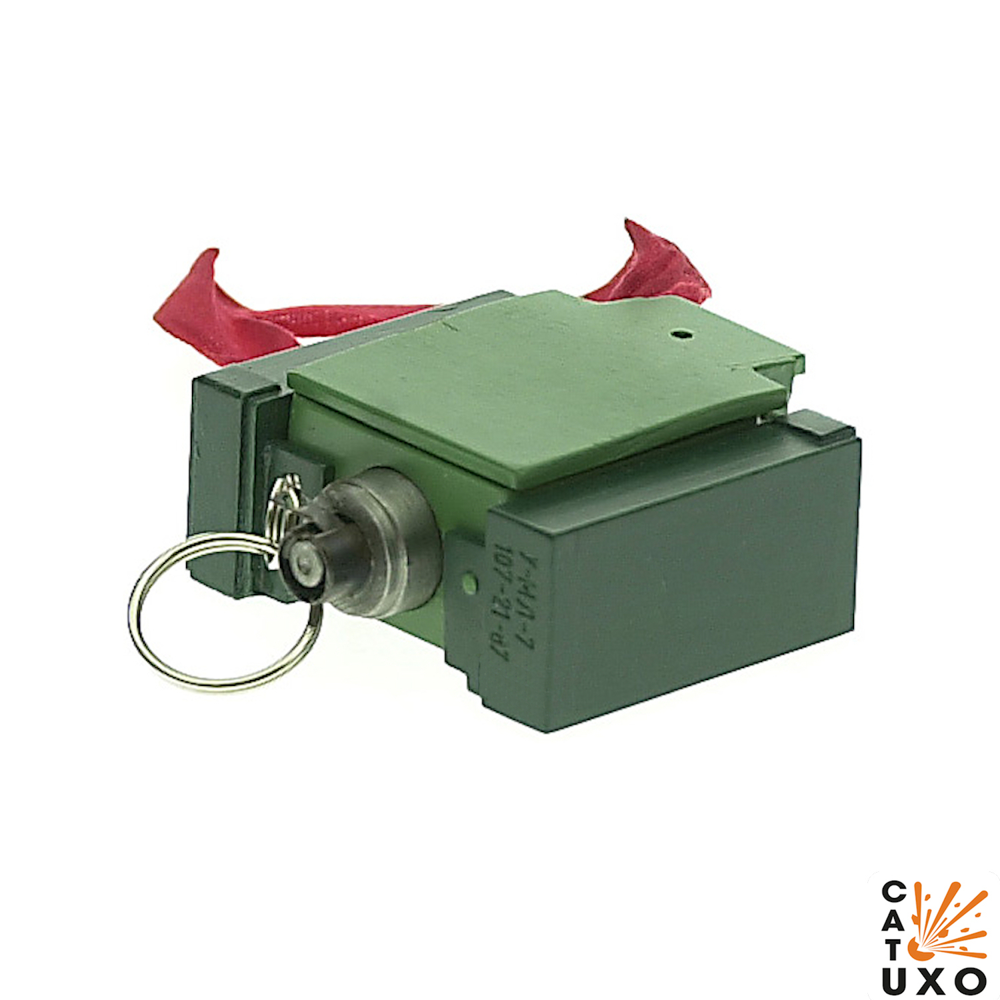
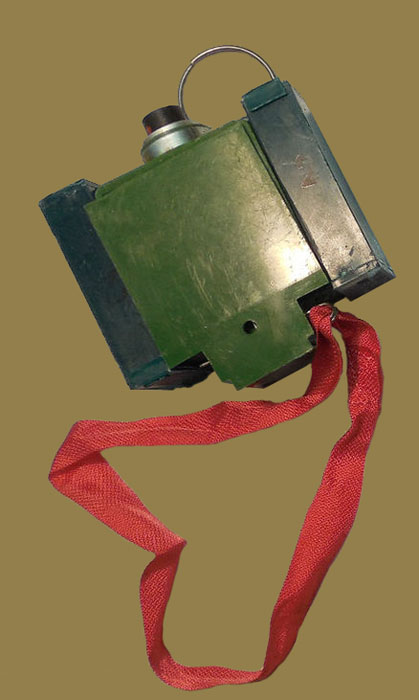
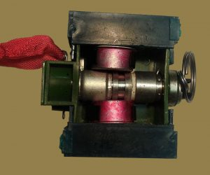
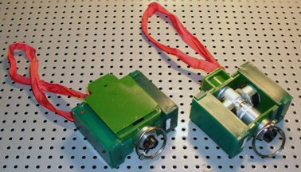

---
# Custom KB params
title: Міна-пастка МЛ-7
subtitle: "Міна-пастка"
description: "Міна-пастка МЛ-7"

# Obsidian metadata YAML front matter params
aliases: МЛ-7
tags:
keywords:
cssclass:
publish: false

# VuePress 2.x Frontmatter params
lang: uk-UA
prev:
  text: ПМН-2
  link: /catalog/mina-pmd-6-ms-2.html
next:
  text: МЛ-8
  link: /catalog/mina-ml-8.html
---

← [Повернутись](./index.md)

# Міна-пастка МЛ-7

МЛ-7 (ML-7), "Мина-Ловушка" - накладається під якісь предмет вагою понад 250 грам, а коли його знімають - міна вибухає. Часто використовується як детонатор для більш потужної вибухівки.

- Відстань суцільного ураження: 1 м
- Безпечна відстань: 50 м

- Реагує на зняття тиску. Призначення - пристрій невилучності для протипіхотних, протитанкових, протитранспортних, об'єктних та інших мін, що не мають власного такого пристрою, а також як міна-пастка розвантажувальної дії.
- Маскуєтьяся, може бути встановлена перевернутою.
- Як правило, використовується разом з фугасними минами типу  [ПМН](mina-pmn.md) , [ПМН-2](mina-pmn-2.md), [ПМН-4](mina-pmn-4.md), МИТ-6м, [ОЗМ-72](mina-ozm-72.md), протитранспортні міни серії Т.М. -62 або аналогічний.

## Тактико-технічні характеристики

- **Корпус** - пластмаса
- **Тип** - фугасна розвантажувальної дії
- **Маса** - 0,1 кг
- **Габарити**- 72 х 69 x 30 мм ( як пачка масла)
- **Чутливість** - 300 г 🐀
- **Безпечна відстань** - 50 м ( 3 автобуси ) 🚌🚌🚌

::: danger Категорично забороняється:

1. Виконувати будь - які механічні , термічні та інші впливи на корпус міни або вибухника.
2. Переміщувати міни з місця їх знаходження .
3. Проводити будь - які земляні роботи поблизу з міною .
4. Намагатися викрутити будь - які комплектуючі з міни .
5. Чипати корпус міни.
6. Самостійно знешкоджувати міни .

:::

### Зона враження

- **Радіус ураження** – 1 м
- **Спосіб встановлення**: вручну
- **Температурний діапазон (°C)** – від -40 до +50 °C.
- **Вилученість** - ні
- **Знешкоджуваність** – ні
- **Самоліквідація / самонейтралізація** – ні

## Історична довідка

Міна-пастка МЛ-7 (ML-7) була прийнята на озброєння Радянської Армії в 1984 році і призначена для використання як пристрій невилучності для протипіхотних мін, а також як міна-пастка розвантажувальної дії.

## Відео

<iframe width="560" height="315" src="https://www.youtube.com/embed/dMgjBZUinMY" title="YouTube video player" frameborder="0" allow="accelerometer; autoplay; clipboard-write; encrypted-media; gyroscope; picture-in-picture" allowfullscreen></iframe>

## Зображення

::: gallery

- 
- 
- 

:::

#### Інформаційні джерела

1. [Рашисти почали робити вкрай небезпечні міни-пастки: чого не треба робити за будь-яких умов](https://defence-ua.com/weapon_and_tech/vorog_pochav_robiti_vkraj_nebezpechni_mini_pastki_chogo_ne_treba_robiti_za_bud_jakih_umov-6660.html)
2. [ML-7 Firing Device](https://cat-uxo.com/explosive-hazards/firing-devices/ml-7-firing-device)
