← [Повернутись](./index.md)

# Міна осколочна направлена МОН-100

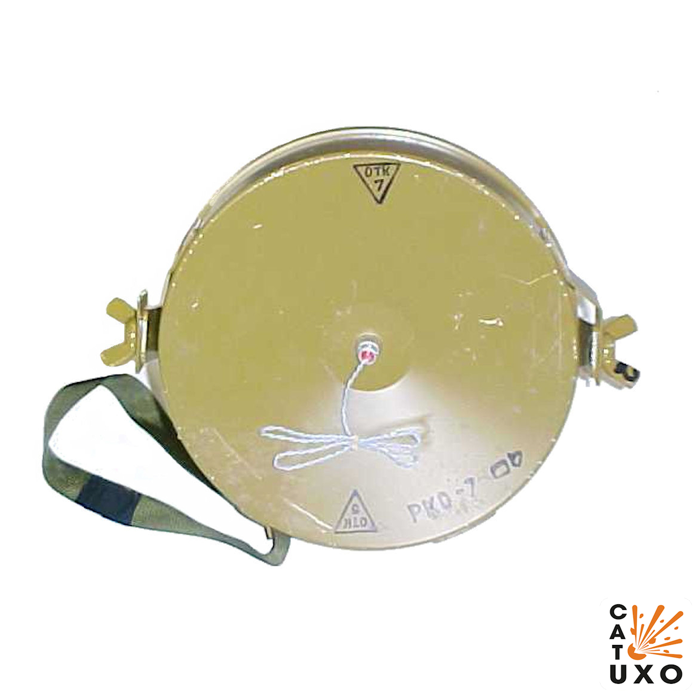

Радянська протипіхотна осколкова керована наземна міна спрямованої дії. 

- Відстань суцільного ураження: 120 м
- Безпечна відстань: 180 метрів

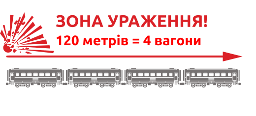
- Встановлюється вручну на ґрунт або кріпиться до дерева або стовпа за допомогою спеціального кронштейна та сталевого штиря, який може вбиватись у дерев'яні поверхні.
- Як правило мінуються підступи до мостів та переправ, береги в місцях висадки десанту, вулиці в населених пунктах, дороги в горах та лісі тощо.
- Встановлюються мiни на розтяжку або з дистанційним керуванням.
- Міна вибухає від електродетонатора в керованому варіанті або від запалу при встановленні на вибухник. 
- З вибухом заряду елементи розлітаються з боку увігнутої частини міни.

## Тактико-технічні характеристики

- **Корпус** - сталь
- **Тип** - осколкова, скерованого враження
- **Маса** - 5 кг
- **Габарити**- 236 х 82,5 мм  ( як папка з документами ) 📁
- **Сила натягу** - Усилие срабатывания (кг/см) - 300 г 🐀
- **Безпечна відстань** - 180 м ( довжина стадіона) 🏟

::: danger Категорично забороняється:
1. Виконувати будь - які механічні , термічні та інші впливи на корпус міни або вибухника. 
2. Переміщувати міни з місця їх знаходження . 
3. Проводити будь - які земляні роботи поблизу з міною . 
4. Намагатися викрутити будь - які комплектуючі з міни . 
5. Перерізати проводити , троси , тощо , що ідуть до вибухників міни . 
6. Самостійно знешкоджувати міни . 
:::

### Зона враження

- **Кількість осколків** – 400 роликів діаметром 10 мм.
- **Горизонтальний кут розкидання осколків** – 54°
- **Ширина зони суцільного ураження** – 10 м
- **Дальність польоту забійних осколків** – до 116 м

- **Спосіб встановлення**: ручний
- **Температурний діапазон (°C)** – від -40 до +50
- **Видобуваність** - видобута
- **Знешкоджуваність** – знешкоджувана
- **Самоліквідація** – немає
- **Гарантійний термін** – 10 років

## Історична довідка
Розроблена на початку 60-х років XX століття в СРСР. 

При підриві протипіхотна міна МОН-100 (MON-100) дає дуже щільний, вузький пучок уламків, чому сприяє увігнута лицьова поверхня міни. Ураження людини (або декількох людей одночасно) при вибуху міни завдається сталевими роліками, що вилітають в напрямку противника, вузьким пучком шириною до 5 м і дальністю до 115 м (при ймовірності ураження 90%). 

Не дивлячись що вона виявилася малоефективною, занадто важкою і можливості її застосування обмеженими, людині, що потрапить у потік уламків шансів на виживання не залишається.

Вибух вчиняє оператор з пульта управління при появі противника в секторі ураження або при зачіпанні противником обривного датчика підривача.

Безпечне віддалення від міни в тильну та бічні сторони 35 метрів, хоча відмічено, що деякі уламки міни летять і набагато далі.

## Відео
<iframe width="560" height="315" src="https://www.youtube.com/embed/Fdauo1-wFbI" title="YouTube video player" frameborder="0" allow="accelerometer; autoplay; clipboard-write; encrypted-media; gyroscope; picture-in-picture" allowfullscreen></iframe>
## Зображення

::: gallery
- 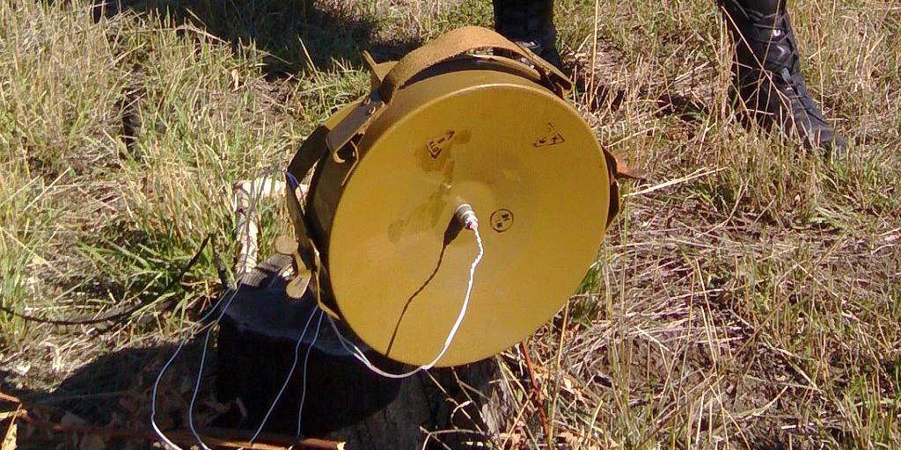
- 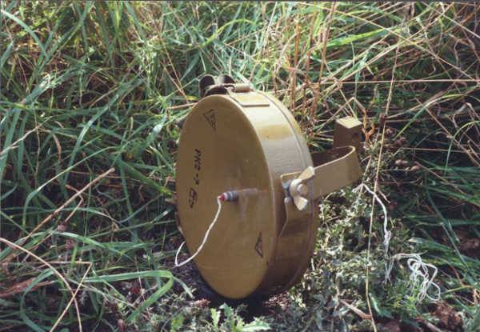
- 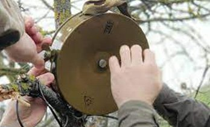
- 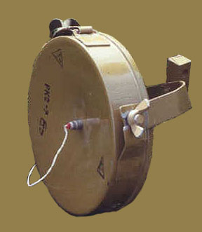
- 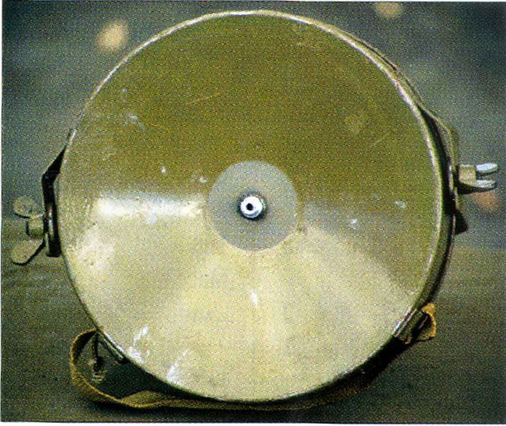
- 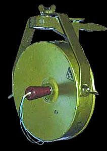
- 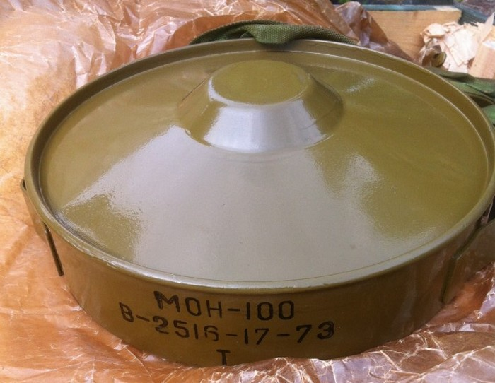
- 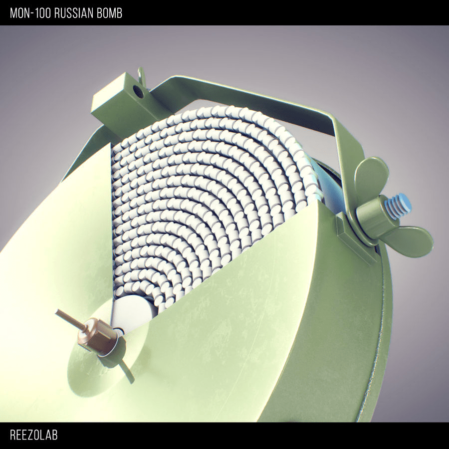
- 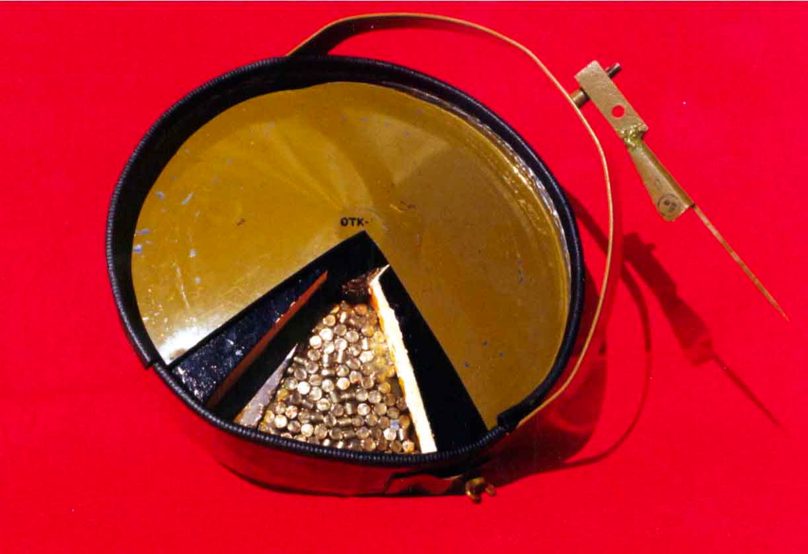
- 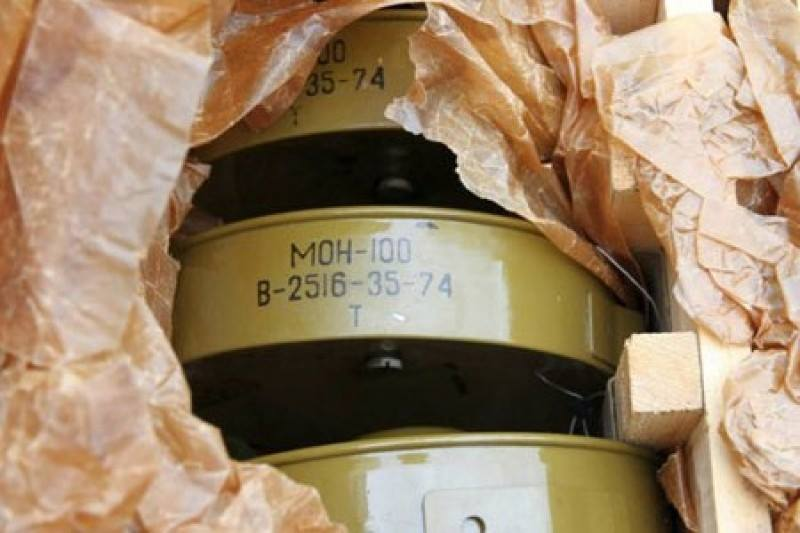
:::

#### Інформаційні джерела

1. [МОН-100 (MON-100)](http://eragun.org/explosives/rusmin_27.html)
2. [Протипіхотні міни-близнюки: «Клеймор», МОН, MRUD](https://armyinform.com.ua/2021/04/05/protypihotni-miny-blyznyuky-klejmor-mon-mrud/)

