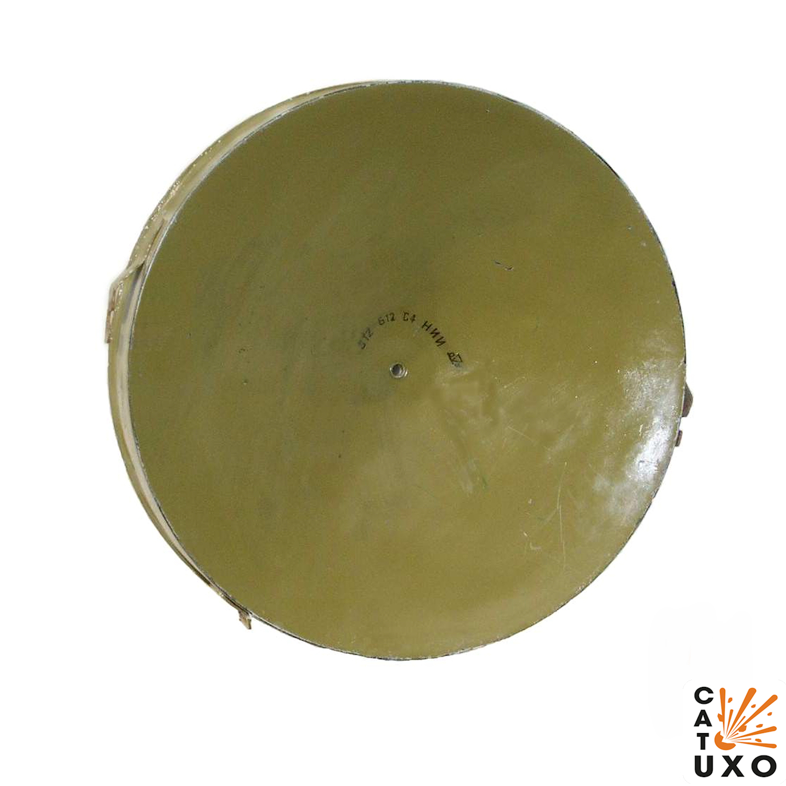
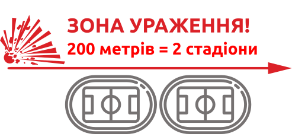
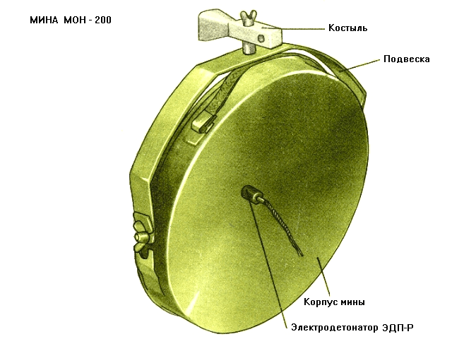
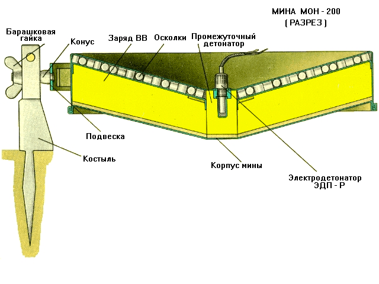
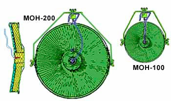
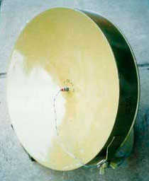
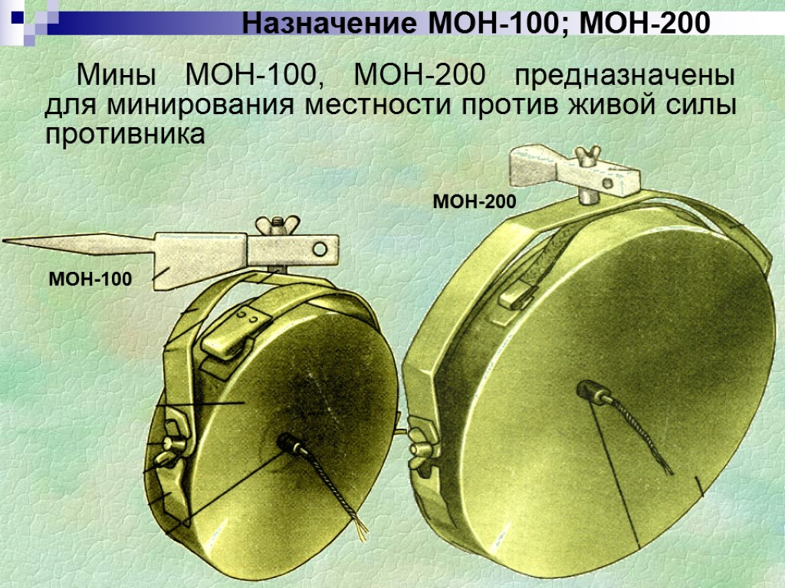

← [Повернутись](./index.md)

# Міна осколочна направлена МОН-200

Радянська протипіхотна осколкова керована наземна міна спрямованої дії.

- Відстань суцільного ураження: 220 м
- Безпечна відстань: 300 м

- Встановлюється вручну на ґрунт або кріпиться до дерева або стовпа за допомогою спеціального кронштейна та сталевого штиря, який може вбиватись у дерев'яні поверхні.
- Як правило мінуються підступи до мостів та переправ, береги в місцях висадки десанту, вулиці в населених пунктах, дороги в горах та лісі тощо.
- Встановлюються мiни на розтяжку або з дистанційним керуванням.
- Міна вибухає від електродетонатора в керованому варіанті або від запалу при встановленні на вибухник.
- З вибухом заряду елементи розлітаються з боку увігнутої частини міни.

## Тактико-технічні характеристики

- **Корпус** - листовий метал
- **Тип** - осколкова, скерованого враження
- **Маса** - 25 кг
- **Габарити**- 434 х 130 мм ( як колесо авто ) 🛞
- **Сила натягу** - Усилие срабатывания (кг/см) - 3,5 кг 🐈
- **Безпечна відстань** - 300 м ( 3 стадіони) 🏟🏟🏟

::: danger Категорично забороняється:

1. Виконувати будь - які механічні , термічні та інші впливи на корпус міни або вибухника.
2. Переміщувати міни з місця їх знаходження .
3. Проводити будь - які земляні роботи поблизу з міною .
4. Намагатися викрутити будь - які комплектуючі з міни .
5. Перерізати проводити , троси , тощо , що ідуть до вибухників міни .
6. Самостійно знешкоджувати міни .
   :::

### Зона враження

- **Кількість осколків** – 900 роликів діаметром 10 мм.
- **Горизонтальний кут розкидання осколків** – 54°
- **Ширина зони суцільного ураження** – 10 м
- **Дальність польоту забійних осколків** – до 220 м

- **Спосіб встановлення**: ручний
- **Температурний діапазон (°C)** – від -40 до +50
- **Видобуваність** - видобута
- **Знешкоджуваність** – знешкоджувана
- **Самоліквідація** – немає
- **Гарантійний термін** – 10 років

## Історична довідка

Розроблена на початку 60-х років XX століття в СРСР.

Оскільки у Радянському Союзі була тенденція до модифікації раніше створених мін, згодом, на початку 60-х років, розробили нові міни [МОН-100](./mina-mon-100.md) вагою 5 кг (2 кг вибухівки) та МОН-200 вагою 25 кг (12 кг вибухівки).

МОН-200 виявилася малоефективною, дуже важкою, та й замаскувати таку громіздку міну стало не просто. Її вкрай обмежено застосовували в Афганістані, оскільки встановити міну у вузькому секторі ураження, де вірогідно з’явиться достатня кількість ворожих бійців, щоб ефективно використати велику кількість вибухівки з дуже вузьким завширшки потоком осколків, виявилось надто складним завданням.

МОН-200 обмеженими партіями поставляли в Сирію, до В’єтнаму та Єгипту. Після отримання перших партій мін збройні сили вищевказаних країн від нових поставок відмовлялися.

Не дивлячись що вона виявилася малоефективною, занадто важкою і можливості її застосування обмеженими, людині, що потрапить у потік уламків шансів на виживання не залишається.

Вибух вчиняє оператор з пульта управління при появі противника в секторі ураження або при зачіпанні противником обривного датчика підривача.

Безпечне віддалення від міни в тильну та бічні сторони 50 м, хоча відмічено, що деякі уламки міни летять і набагато далі.

Спеціальна моніторингова місія ОБСЄ в Україні у жовтні 2021 року повідомляла про використання російськими військовими протипіхотних мін МОН-200 в окупованих районах Донецької та Луганської областей у ході російсько-української війни.

## Відео

<iframe width="560" height="315" src="https://www.youtube.com/embed/dzQ0y4WoJFw" title="YouTube video player" frameborder="0" allow="accelerometer; autoplay; clipboard-write; encrypted-media; gyroscope; picture-in-picture" allowfullscreen></iframe>

<iframe src="https://www.facebook.com/plugins/video.php?height=314&href=https%3A%2F%2Fwww.facebook.com%2Ffenixinsight%2Fvideos%2F806901903049073%2F&show_text=false&width=560&t=0" width="560" height="314" style="border:none;overflow:hidden" scrolling="no" frameborder="0" allowfullscreen="true" allow="autoplay; clipboard-write; encrypted-media; picture-in-picture; web-share" allowFullScreen="true"></iframe>

## Зображення

::: gallery

- 
- 
- 
- 
- 
- 
- :::

#### Інформаційні джерела

1. [МОН-200 (MON-200)](https://uk.wikipedia.org/wiki/%D0%9C%D0%9E%D0%9D-200)
2. [Протипіхотні міни-близнюки: «Клеймор», МОН, MRUD](https://armyinform.com.ua/2021/04/05/protypihotni-miny-blyznyuky-klejmor-mon-mrud/)
   3. [Окупанти встановлюють на сході України російські протипіхотні міни - дані ОБСЄ з початку року](https://web.archive.org/web/20220402114906/https://www.ukrinform.ua/rubric-ato/3340269-okupanti-vstanovluut-na-shodi-ukraini-rosijski-protipihotni-mini-dani-obse-z-pocatku-roku.html)
3. Вікторія Андрєєва (30 березня 2022). [Міни під ногами: у ДСНС показали 9 видів бомб, які розкидали окупанти в Україні](https://web.archive.org/web/20220401053520/https://life.pravda.com.ua/society/2022/03/30/248039/)
4. [Немного минной войны в Ливии 2](https://ivagkin.livejournal.com/188663.html)
5. https://cat-uxo.com/explosive-hazards/landmines/mon-200-landmine
