← [Повернутись](./index.md)

# Міна осколочна направлена МОН-50

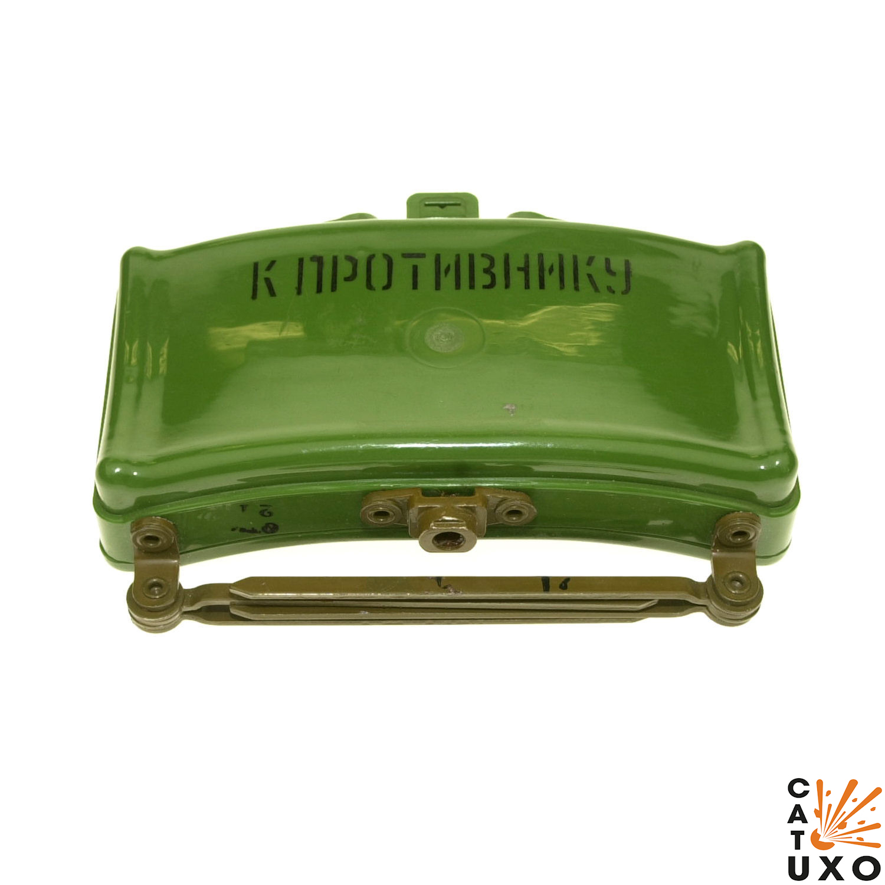

Міна протипіхотна осколкова спрямованого ураження керована.
Призначена для ураження людини, у тому числі **у вантажному та легковому транспорті**.

- Відстань суцільного ураження: 50-58 м
- Безпечна відстань: 100 м

- В більшості випадків встановлюються на поверхні або у товщі ґрунту та маскуються.
- Як правило мінуються підступи до мостів та переправ, береги в місцях висадки десанту, вулиці в населених пунктах, дороги в горах та лісі тощо.
- Встановлюються мiни на розтяжку або з дистанційним керуванням.
- Міна вибухає від електродетонатора в керованому варіанті або від запалу при встановленні на вибухник.
- З вибухом заряду елементи розлітаються з боку опуклої частини міни.

## Тактико-технічні характеристики

- **Корпус** - пластик
- **Тип** - осколкова, скерованого враження
- **Маса** - 2,0 кг
- **Габарити**- 226 х 66 мм х 155 мм ( як товста книга ) 📔
- **Сила натягу** - Усилие срабатывания (кг/см) - 300 г 🐀
- **Безпечна відстань** - 100 м ( 4 вагони) 🚃🚃🚃🚃

::: danger Категорично забороняється

1. Виконувати будь - які механічні, термічні та інші впливи на корпус міни або вибухника.
2. Переміщувати міни з місця їх знаходження .
3. Проводити будь - які земляні роботи поблизу з міною .
4. Намагатися викрутити будь - які комплектуючі з міни .
5. Перерізати проводити, троси? тощо, що ідуть до вибухників міни .
6. Самостійно знешкоджувати міни.
   :::

### Зона враження

- **Кількість осколків** – в залежності від спорядження або 485 циліндричних, або 540 кульок
- **Горизонтальний кут розкидання осколків** – 54°
- **Радіус суцільного ураження** – 50/58 м
- **Ширина зони суцільного ураження** – 45/54 м
- **Приведена площа ураження** – 1514/1910 м²
- **Дальність ураження легкового та вантажного автотранспорту та живої сили в ньому** –до 30 м
- **Дальність розльоту осколків від корпусу у тиловому та бічному напрямах** – до 40 м
- **Дальність польоту забійних осколків** – 80/85 м

- **Спосіб встановлення**: ручний
- **Температурний діапазон (°C)** – від -40 до +50
- **Видобуваність** - видобута
- **Знешкоджуваність** – знешкоджувана
- **Самоліквідація** – немає
- **Гарантійний термін зберігання** – 10 років

До складу комплекту може входити електродетонатор ЭДП-р (ЭДП) або запал МД-5М.

## Історична довідка

Була розроблена в СРСР в 1966 як аналог американської міни M18А1 «Клеймор». Призначена для виведення з ладу особового складу супротивника. Ураження людині (або декількох одночасно) при вибуху міни завдаються готовими забійними елементами (540 кульок або 485 роликів), що вилітають у напрямку супротивника в секторі по горизонту 54 градуси на відстань до 50 м. Висота сектора ураження від 15 см до 4 метрів на граничній дальності. **Заборонена Оттавською конвенціею**.

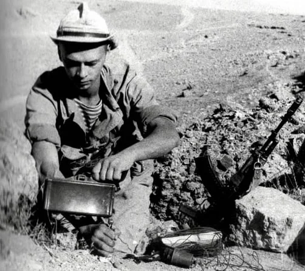

Перше бойове застосування МОН-50 припало на Афганістан. Півстоліття випускається без будь-яких принципових змін, проте стали застосовуватись нові датчики, що викликають її спрацювання: оптичні, лазерні, сейсмічні.

Вибух проводиться оператором з пульта управління при появі противника в секторі поразки або при зачепленні солдата противника за обривний датчик підривника.

## Відео

<iframe width="560" height="315" src="https://www.youtube.com/embed/QI6MCKHnu8w" title="YouTube video player" frameborder="0" allow="accelerometer; autoplay; clipboard-write; encrypted-media; gyroscope; picture-in-picture" allowfullscreen></iframe>
<iframe width="560" height="315" src="https://www.youtube.com/embed/_4djPcHro4k" title="YouTube video player" frameborder="0" allow="accelerometer; autoplay; clipboard-write; encrypted-media; gyroscope; picture-in-picture" allowfullscreen></iframe>

## Зображення

::: gallery

- 
- 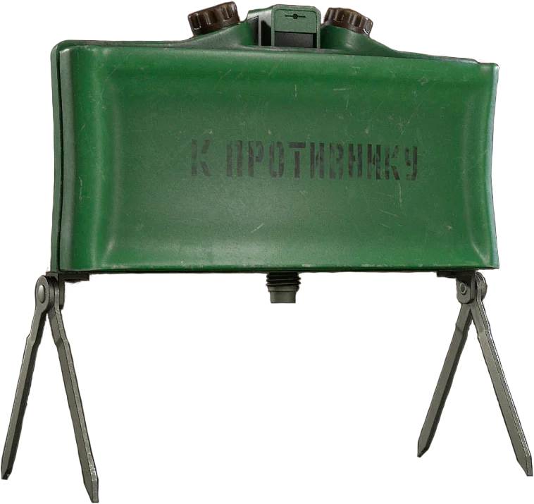
- 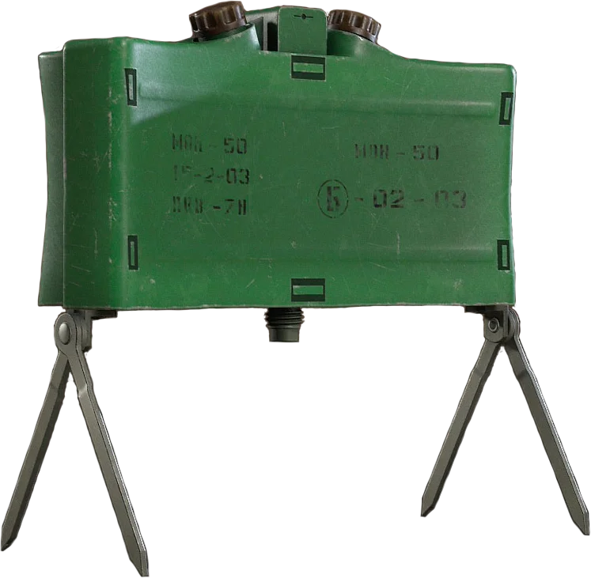
- 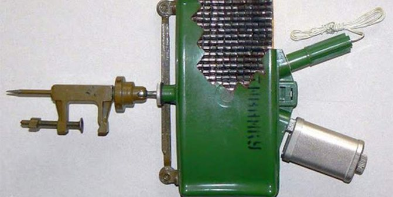
- 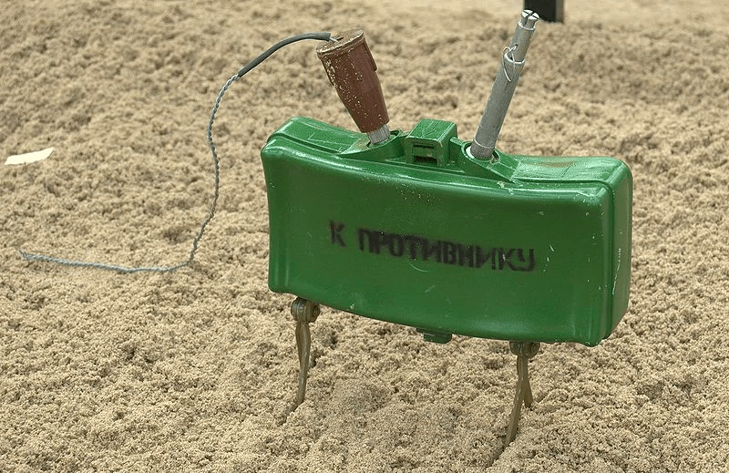
- 
- 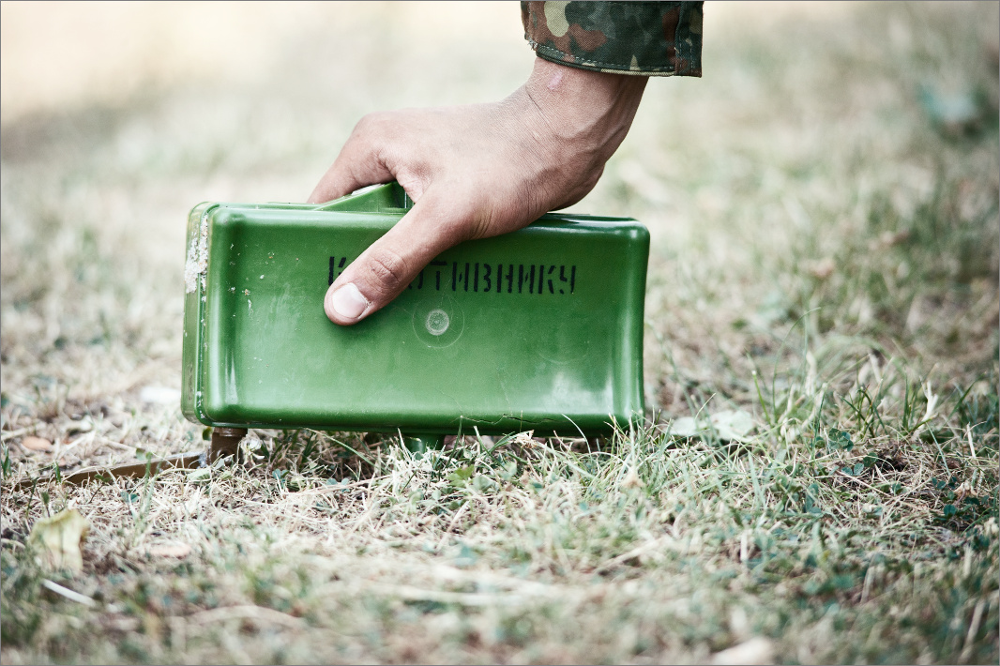
- 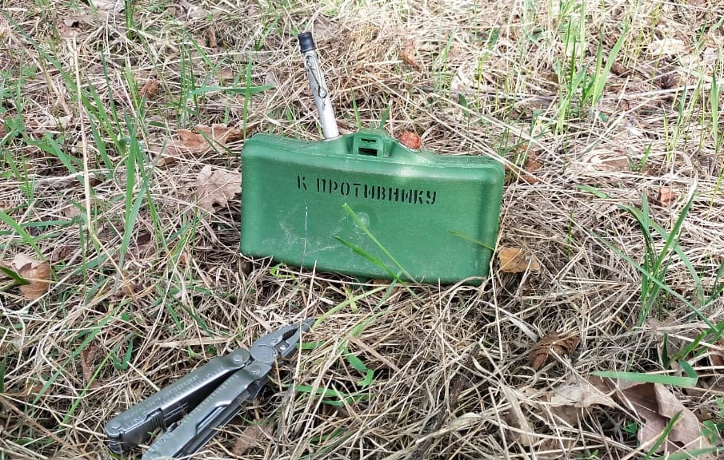
- 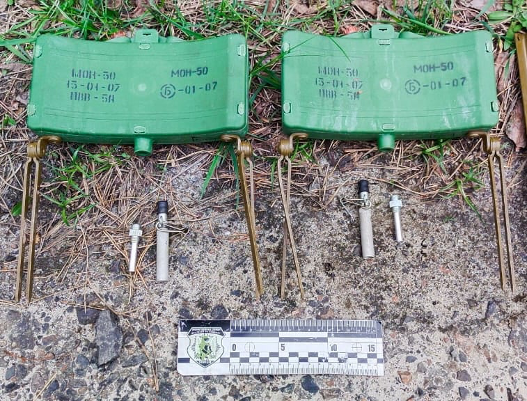
- 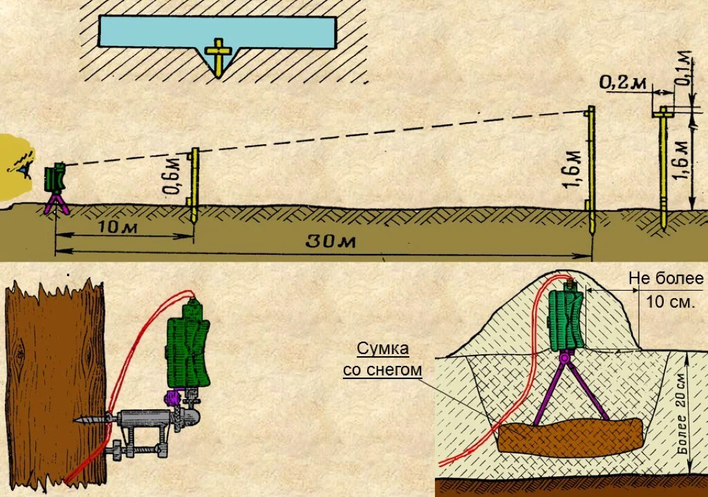
- 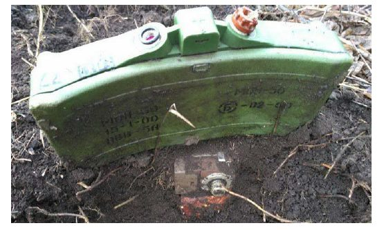
  :::

#### Інформаційні джерела

1.  Матеріал з Вікіпедії [МОН-50](https://uk.wikipedia.org/wiki/%D0%9C%D0%9E%D0%9D-50)
2.  Sergey Gapanchak [Протипіхотна міна МОН-50](https://youtu.be/QI6MCKHnu8w)
3.  [Протипіхотні міни-близнюки: «Клеймор», МОН, MRUD](https://armyinform.com.ua/2021/04/05/protypihotni-miny-blyznyuky-klejmor-mon-mrud/)
4.  [Поліція Сумщини нагадує громадянам про небезпеку замінованих територій](https://www.facebook.com/policesumy/posts/316074153971170)
