---
# Custom KB params
title: Міна осколочна направлена МОН-90
subtitle: "Міна протипіхотна осколкова спрямованого ураження керована"
description: "Міна протипіхотна осколкова спрямованого ураження керована. Призначена для ураження людини, у тому числі у вантажному та легковому транспорті."

# Obsidian metadata YAML front matter params
aliases: МОН-90
tags:
keywords:
cssclass:
publish: false

# VuePress 2.x Frontmatter params
lang: uk-UA
prev:
  text: Перелік
  link: /catalog/index.html
next:
  text: МОН-100
  link: /catalog/mina-mon-100.html
---

← [Повернутись](./index.md)

# Міна осколочна направлена МОН-90

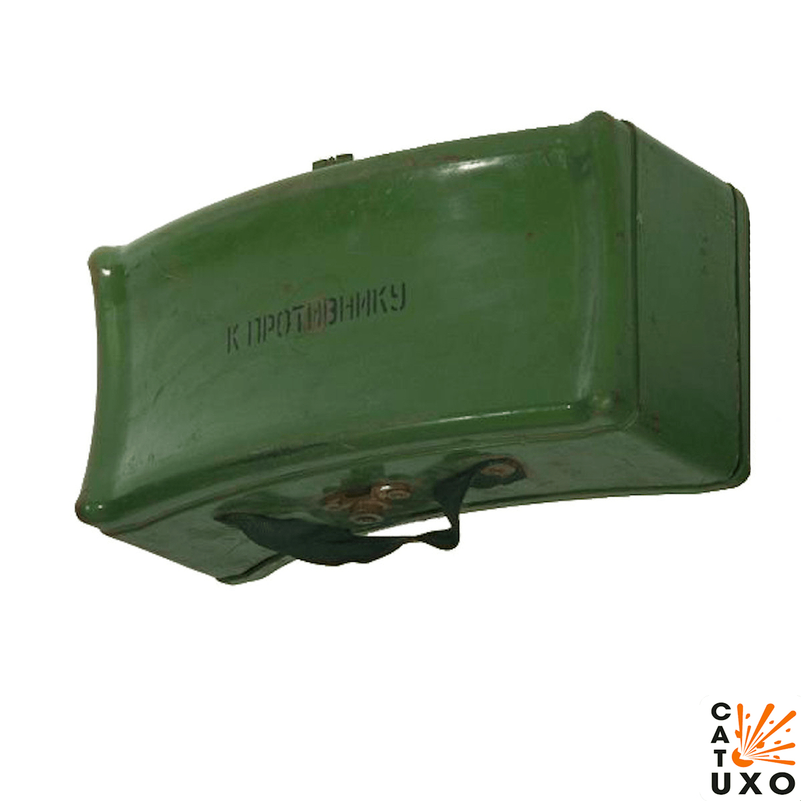 

Міна протипіхотна осколкова спрямованого ураження керована. 
Призначена для ураження людини, у тому числі **у вантажному та легковому транспорті**.

- Радіус суцільного ураження: 90-99 м
- Безпечна відстань: 150 метрів

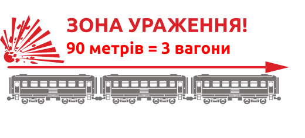

- В становлюються на поверхні або у товщі ґрунту та маскуються. 
- Як правило мінуються підступи до мостів та переправ, береги в місцях висадки десанту, вулиці в населених пунктах, дороги в горах та лісі тощо.
- Встановлюються мiни на розтяжку або з дистанційним керуванням.
- Міна вибухає від електродетонатора в керованому варіанті або від запалу при встановленні на вибухник. 
- З вибухом заряду елементи розлітаються з боку опуклої частини міни.

## Тактико-технічні характеристики

- **Корпус** - пластик
- **Тип** - осколкова, скерованого враження
- **Маса** - 12,1 кг
- **Габарити**- 345 х 153 мм х 202 мм ( як папка з документами ) 📁
- **Сила натягу** - Усилие срабатывания (кг/см) - 300 г 🐀
- **Безпечна відстань** - 100 м ( 5 вагонів ) 🚃🚃🚃🚃🚃

::: danger Категорично забороняється:
1. Виконувати будь - які механічні , термічні та інші впливи на корпус міни або вибухника. 
2. Переміщувати міни з місця їх знаходження . 
3. Проводити будь - які земляні роботи поблизу з міною . 
4. Намагатися викрутити будь - які комплектуючі з міни . 
5. Перерізати проводити , троси , тощо , що ідуть до вибухників міни . 
6. Самостійно знешкоджувати міни . 
:::

### Зона враження

- **Кількість осколків** – 2000 шт.
- **Горизонтальний кут розкидання осколків** – 54°
- **Радіус суцільного ураження** – 90 м
- **Ширина зони суцільного ураження** – 60 м
- **Дальність ураження легкового та вантажного автотранспорту та живої сили в ньому** –до 30 м
- **Дальність розльоту осколків від корпусу у тиловому та бічному напрямах** – до 40 м
- **Дальність польоту забійних осколків** – до 100 м

- **Спосіб встановлення**: ручний
- **Температурний діапазон (°C)** – від -40 до +50
- **Видобуваність** - видобута
- **Знешкоджуваність** – знешкоджувана
- **Самоліквідація** – немає
- **Гарантійний термін** – 10 років

## Історична довідка

МОН-90 (Мина Осколочная Направленного действия) – радянська протипіхотна міна спрямованої дії, створена у 1960-х роках. Является более мощной версией мины [МОН-50](./mina-mon-50.md), що вражає на відстані 90 м. 

Вибух проводиться оператором з пульта управління при появі противника в секторі поразки або при зачепленні солдата противника за обривний датчик підривника. 

Сама міна підривниками не комплектується, а має у верхній частині два гнізда з різьбленням під запал МД-5М, електродетонатор ЕДП-р. Таким чином, міна може використовуватися в керованому варіанті, так і приводиться в дію самою жертвою.

Поразка під час вибуху міни наноситься готовими забійними елементами (кульки чи ролики), вилітають у бік противника у секторі по горизонту 54 градуси на дальність до 90-99 метрів. Висота сектора поразки – від 30 см безпосередньо біля міни та  до 8 метрів висоти на граничній дальності.

## Відео

<iframe width="560" height="315" src="https://www.youtube.com/embed/I5Ic6vw6x_Q" title="YouTube video player" frameborder="0" allow="accelerometer; autoplay; clipboard-write; encrypted-media; gyroscope; picture-in-picture" allowfullscreen></iframe>

## Зображення

::: gallery
- 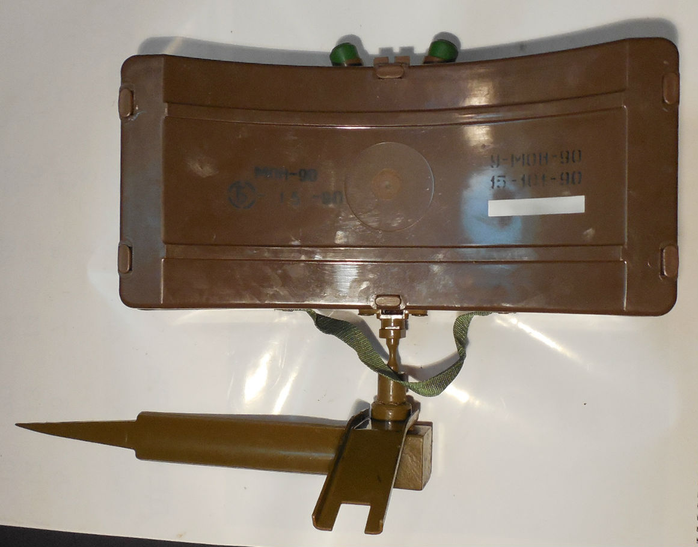
- 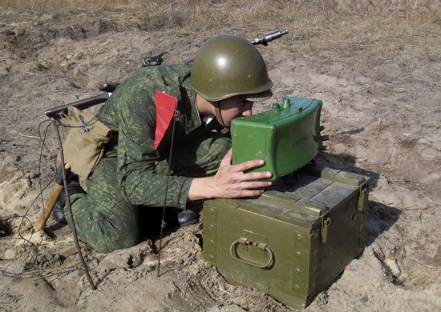
- 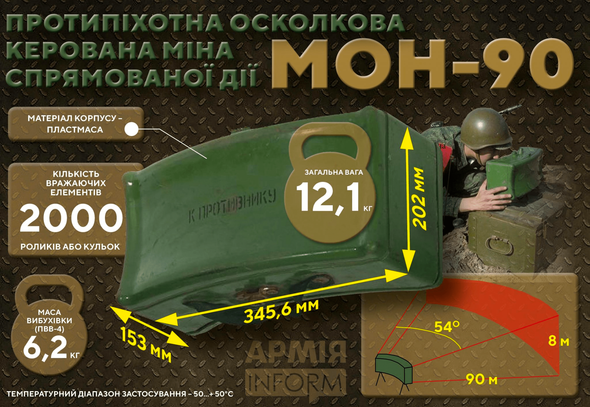
- 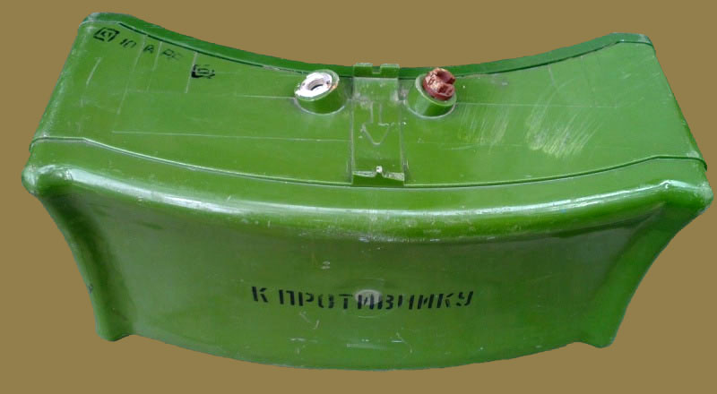
- 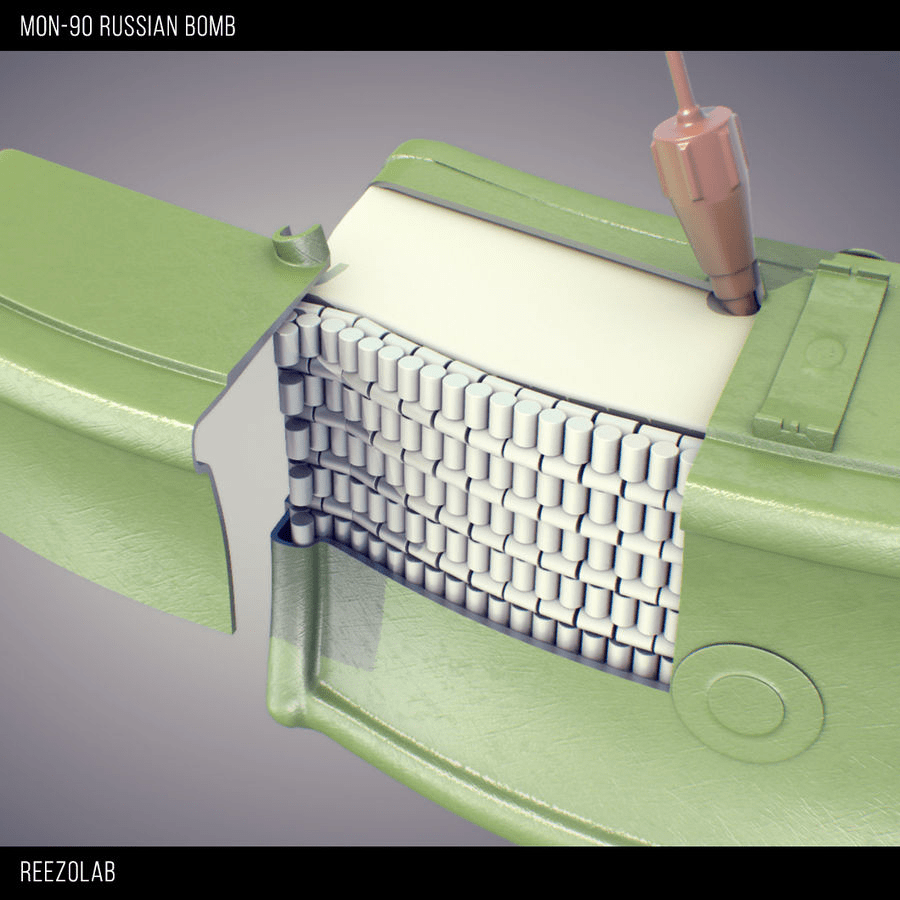
- 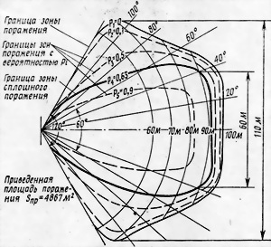
- 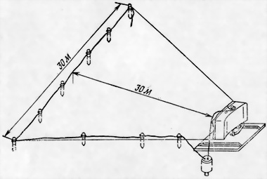

- 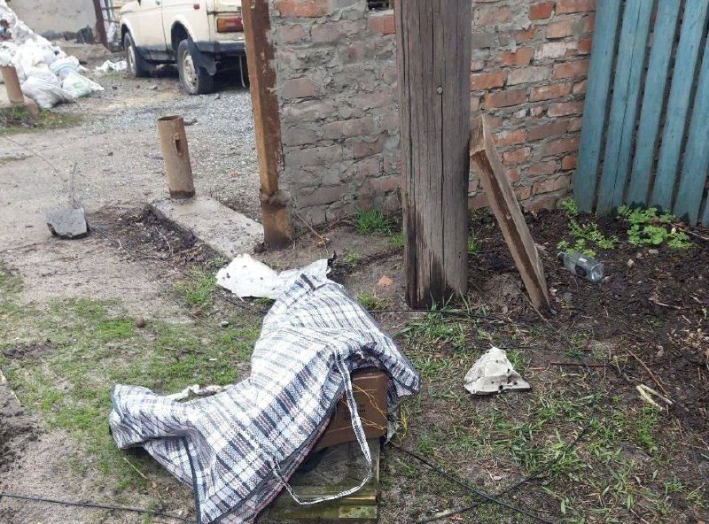
- 
- 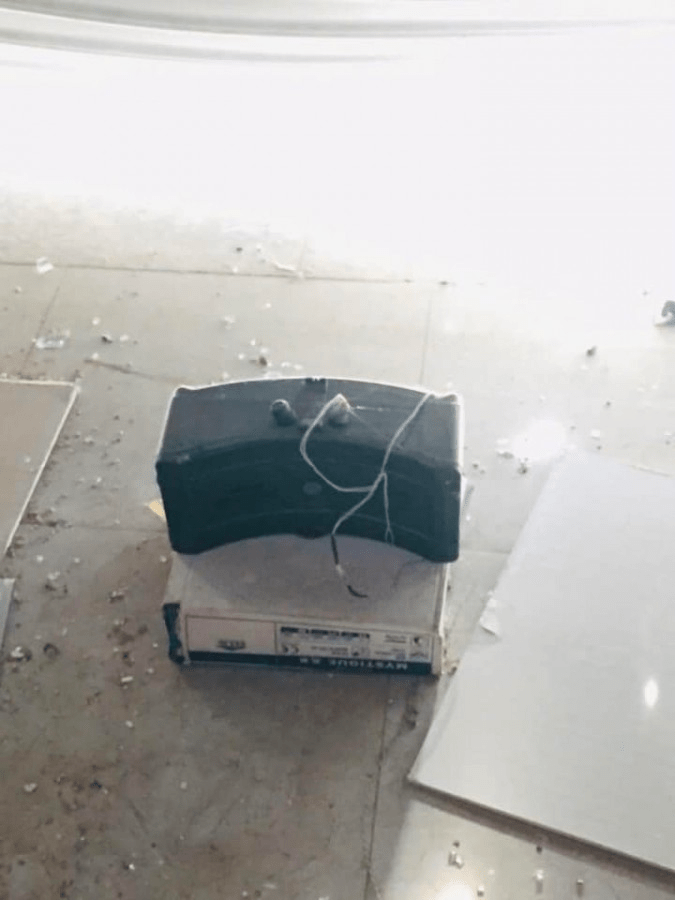
- 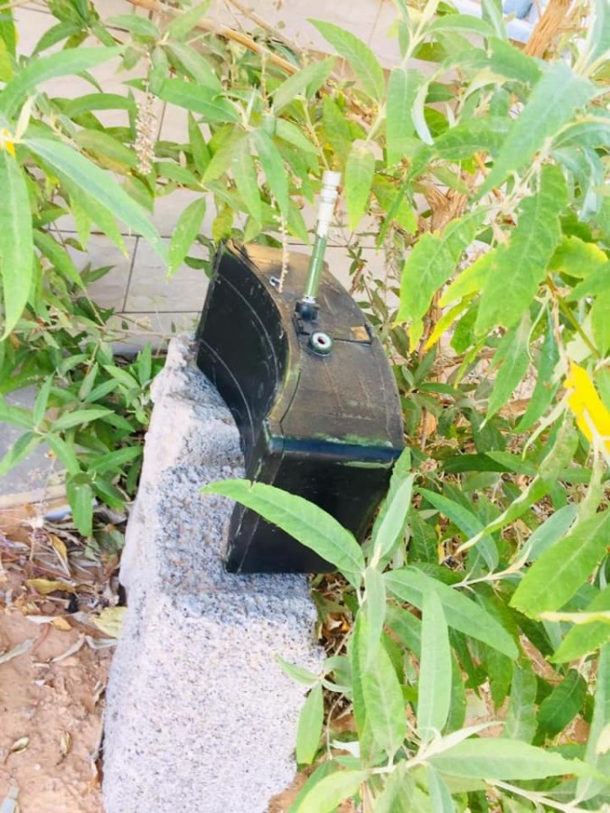
- 

:::

#### Інформаційні джерела

1. [«МОН-90»: смертельний «подарунок» окупантів](https://armyinform.com.ua/2022/04/12/mon-90-smertelnyj-podarunok-okupantiv/)
2. [МОН-90 (MON-90)](http://eragun.org/explosives/rusmin_26.html)
3. [Протипіхотні міни-близнюки: «Клеймор», МОН, MRUD](https://armyinform.com.ua/2021/04/05/protypihotni-miny-blyznyuky-klejmor-mon-mrud/)
