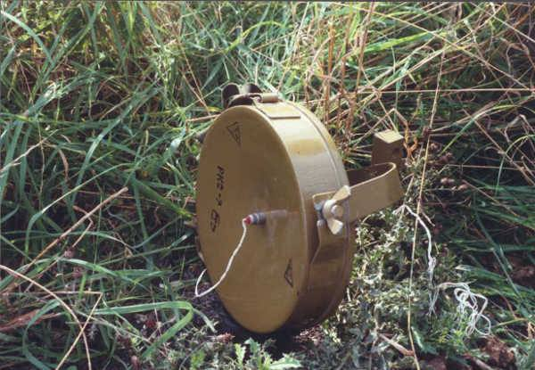

# Міна осколочна направлена МОН-90

https://www.youtube.com/watch?v=2u1G2uBul6k

**МОН-90** *(MON-90)*, **М**ина **О**сколочная **Н**аправленного действия, – советская противопехотная мина направленного действия, созданная в 1960-х годах.

**МОН-90** - противопехотная осколочная [мина](<https://ru.wikipedia.org/wiki/%D0%9C%D0%B8%D0%BD%D0%B0_(%D0%B2%D0%BE%D0%B5%D0%BD%D0%BD%D0%BE%D0%B5_%D0%B4%D0%B5%D0%BB%D0%BE)> "Мина (военное дело)") направленного поражения, предназначенная для выведения из строя личного состава противника. Является более мощной версией мины [МОН-50](https://ru.wikipedia.org/wiki/%D0%9C%D0%9E%D0%9D-50 "МОН-50"). Со взрывателем [ВЗД-144](https://ru.wikipedia.org/w/index.php?title=%D0%92%D0%97%D0%94-144&action=edit&redlink=1 "ВЗД-144 (страница отсутствует)") может также использоваться как [объектная мина](https://ru.wikipedia.org/wiki/%D0%9E%D0%B1%D1%8A%D0%B5%D0%BA%D1%82%D0%BD%D1%8B%D0%B5_%D0%BC%D0%B8%D0%BD%D1%8B "Объектные мины").

Поражение при взрыве мины наносится готовыми убойными элементами (шарики или ролики), вылетающими в направлении противника в секторе по горизонту 54 градуса на дальность до 90-99 метров. Высота сектора поражения — от 30 см непосредственно у мины до 8 метров на предельной дальности.

[Взрыв](https://ru.wikipedia.org/wiki/%D0%92%D0%B7%D1%80%D1%8B%D0%B2 "Взрыв") производится оператором с пульта управления при появлении противника в [секторе поражения](https://ru.wikipedia.org/w/index.php?title=%D0%A1%D0%B5%D0%BA%D1%82%D0%BE%D1%80_%D0%BF%D0%BE%D1%80%D0%B0%D0%B6%D0%B5%D0%BD%D0%B8%D1%8F&action=edit&redlink=1 "Сектор поражения (страница отсутствует)") или же при задевании [солдата](https://ru.wikipedia.org/wiki/%D0%A1%D0%BE%D0%BB%D0%B4%D0%B0%D1%82 "Солдат") противника за обрывной датчик взрывателя [МВЭ-72](https://ru.wikipedia.org/wiki/%D0%9C%D0%92%D0%AD-72 "МВЭ-72") или [МВЭ-НС](https://ru.wikipedia.org/w/index.php?title=%D0%9C%D0%92%D0%AD-%D0%9D%D0%A1&action=edit&redlink=1 "МВЭ-НС (страница отсутствует)"). Сама мина взрывателями не комплектуется, а имеет в верхней части два гнезда с резьбой под запал [МД-5М](https://ru.wikipedia.org/w/index.php?title=%D0%9C%D0%94-5%D0%9C&action=edit&redlink=1 "МД-5М (страница отсутствует)"), [электродетонатор](https://ru.wikipedia.org/wiki/%D0%AD%D0%BB%D0%B5%D0%BA%D1%82%D1%80%D0%BE%D0%B4%D0%B5%D1%82%D0%BE%D0%BD%D0%B0%D1%82%D0%BE%D1%80 "Электродетонатор") [ЭДП-р](<https://ru.wikipedia.org/wiki/%D0%AD%D0%94%D0%9F_(%D0%B4%D0%B5%D1%82%D0%BE%D0%BD%D0%B0%D1%82%D0%BE%D1%80)> "ЭДП (детонатор)"). Таким образом, мина может как использоваться в управляемом варианте, так и приводиться в действие самой жертвой.

Мина противопехотная осколочная, направленного поражения МОН-90 предназначается для минирования местности и различных дефиле (подступы к мостам и переправам, берега в местах высадки десанта, улицы в населенных пунктах, дороги в горах и лесу и т. п.).

##### ОСНОВНЫЕ ТАКТИКО-ТЕХНИЧЕСКИЕ ХАРАКТЕРИСИКИ

Тип: Осколочная, направленного поражения
Масса, кг 12,1
Масса заряда (ПВВ-5А), кг 6,2
Масса комплекта в упаковке, кг 23
Габаритные размеры, мм
длина 345
ширина 153
высота 202
Количество осколков, шт. 2000
Угол разлета убойных осколков 120°
Ширина зоны сплошного поражения на дальности 90 м, м 60
Дальность разлета осколков корпуса и узлов крепления в тыльном и боковом направлении, м до 100
Средства взрывания ЭДП, ЭДП-р, МД-5М, ВЗД-6ч, ВЗД-144, МВЭ-72
Температурный диапазон применения от +50 до –50 °C
Способ установки Вручную
Время взрыва со взрывателем ВЗД-144: от 30 минут до 6 суток
Усилие срабатывания (с МВЭ-72 и МВЭ-НС): 300 грамм
Извлекаемость: извлекаемая
Обезвреживаемость: обезвреживаемая
Самоликвидация/самонейтрализация: нет/нет
Срок боевой работы не определялся
Температурный диапазон применения: −40 — +50 град.
Гарантийный срок хранения 10 лет.

Підрив міни МОН-90 може здійснюватися як з пульта оператора, так і при зачепленні обривного або натяжного датчика підривника. Міна не має елементів самоліквідації, невилучності та необезшкоджуваності.

---

Sources:

https://armyinform.com.ua/2022/04/12/mon-90-smertelnyj-podarunok-okupantiv/
https://coollib.com/b/338187/read
http://eragun.org/explosives/rusmin_26.html

Links:
