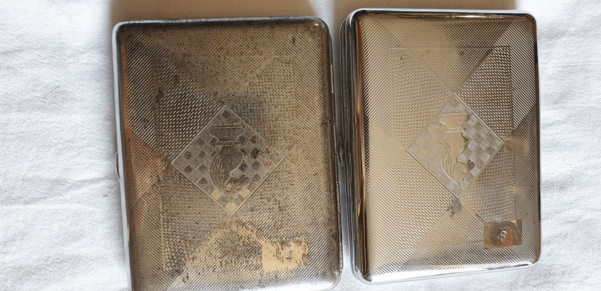
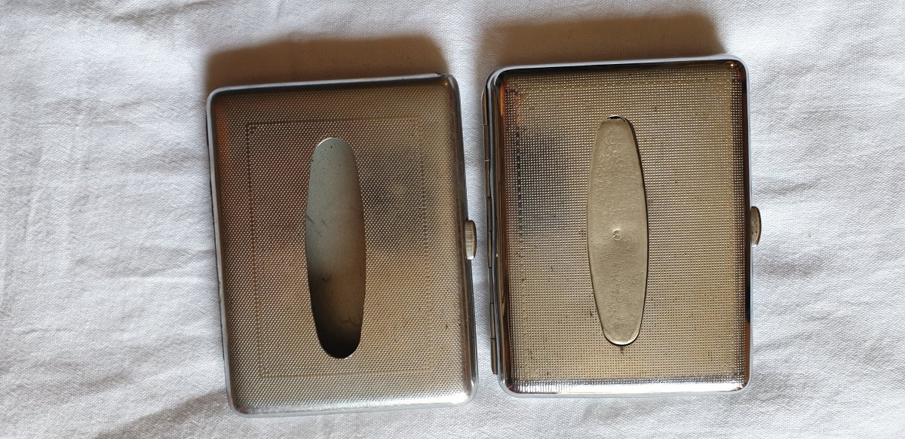
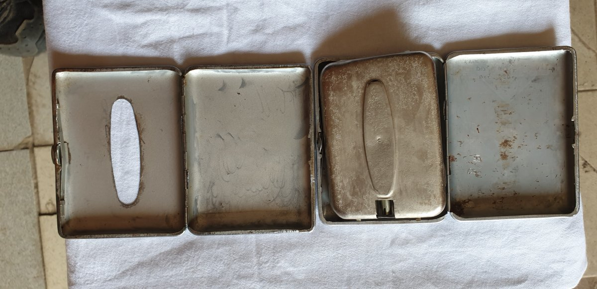

← [Повернутись](../index.md)

# Міна-сюрприз МС-5 «Портсигар»

Міна-пастка МС-5 використовується безпосередньо як міна, а також як детонатор для підривних зарядів. На вигляд це звичайний портсигар, що є футляром міни. 
Механічний підривник  може бути встановлений на спрацьовування при відкритті футляра, підйомі міни з місця встановлення, зняття з неї вантажу. Є режим спрацювання із затимкою часу. У режимі уповільнення детонатор виставляється на спрацювання від 15 хвилин до 360 годин.
Встановлені міни МС-5 не підлягають знешкодженню.

- Відстань суцільного ураження: >1 м (може підірвати більш потужну міну)
- Безпечна відстань: 100 м

- Реагує на зміну тиску. Спрацьовує під час відкривання футляра: у цьому режимі, коли відкривається кришка «портсигара»,  ударник наколює капсуль-детонатор МГ-8-Т, який  миттєво спрацьовує і призводить до підриву заряду вибухової речовини.
- Міна розривається, коли її підіймають з місця закладки, спрацьовує металоелемент, що вбудований у кришку. Він надає імпульс на спрацювання детонатора та підриву вибухової речовини.
- На міну можуть зверху покласти якийсь вантаж (вагою  не менше ніж 0,3 кг), наприклад, ноутбук, або вставити міну між меблями, які будуть перешкоджати проходу. Коли  меблі  перемістити,  міна спрацює. Для більшого вражаючого ефекту «портсигар» можуть використати як детонатор для іншої більш потужної міни.
- Міна здатна працювати як часовий детонатор (у положенні об’єктна) для підриву потужного заряду вибухової речовини. У режимі уповільнення детонатор виставляється на спрацювання від 15 хвилин до 360 годин.

## Тактико-технічні характеристики

- **Корпус** - метал
- **Тип** - фугасна міна-сюрприз, об’єктна, пристрій протидії розмінуванню
- **Маса** - 660 г
- **Габарити**- 107 х 82 х 20 мм (розмір карманної книжки)
- **Чутливість** - 0,3 кг 🐁
- **Безпечна відстань** - 100 м ( 5 автобусів ) 🚌🚌🚌🚌🚌

::: danger Категорично забороняється:

1. Виконувати будь - які механічні , термічні та інші впливи на корпус міни або вибухника.
2. Переміщувати міни з місця їх знаходження .
3. Проводити будь - які земляні роботи поблизу з міною .
4. Намагатися викрутити будь - які комплектуючі з міни .
5. Чипати корпус міни.
6. Самостійно знешкоджувати міни .
   :::

### Зона враження

- **Радіус ураження** – >1 м (може підірвати більш потужну міну)
- **Спосіб встановлення**: вручну 
- **Температурний діапазон (°C)** – від -40 до +40
- **Видобуваність** - ні
- **Знешкоджуваність** – ні
- **Самоліквідація** – ні
- **Гарантійний термін** – 10 років

## Зображення

::: gallery
- 
- 
- 
- 
- 
:::

#### Інформаційні джерела

1.  [Міна-сюрприз МС-5](https://armyinform.com.ua/2020/04/30/rosijski-miny-syurpryzy-abo-yak-spraczovuye-portsygar/)
2. [Ликбез по минам для киевлян](https://detroit-diesel8.livejournal.com/473624.html)