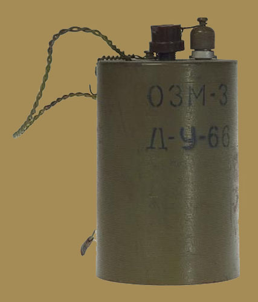
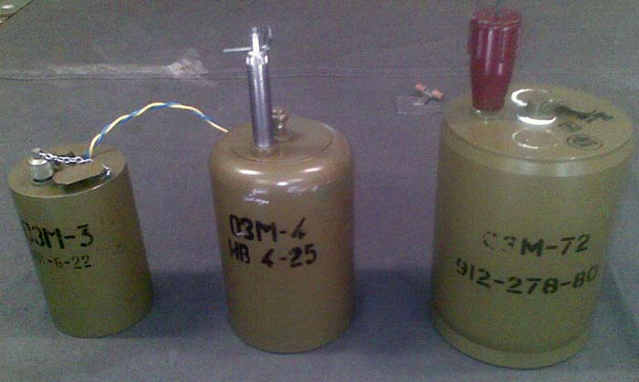

---
# Custom KB params
title: Міна ОЗМ-3
subtitle: "Протипіхотна уламково-загорожувальна міна, що вистрибує, колового ураження."
description: "Міна протипіхотна уламкова колового ураження."
type: kb|page
video: 
gallery:
  - img1.png
  - img2.png

# Obsidian metadata YAML front matter params
aliases: Міна ОЗМ-3
tags:
keywords:
cssclass:
publish: false

# VuePress 2.x Frontmatter params
lang: uk-UA
prev:
  text: Перелік
  link: /catalog/index.html
next:
  text: МОН-90
  link: /catalog/mina-mon-90.html
---

← [Повернутись](./index.md)

# Міна ОЗМ-3

При спрацьовуванні підривника спалахує пороховий сповільнювач, який центральною запальною трубкою підпалює вихідний заряд, що складається з шашки чорного пороху. 
Заряд викидає бойовий снаряд міни на висоту близько 0,4-1,4 м. Саме тоді відбувається горіння порохового сповільнювача. Як тільки полум'я досягає капсуля-детонатора, останній вибухає, викликаючи вибух основного заряду міни. 
Поразка наноситься уламками корпусу міни. Міна, вибухаючи на рівні 0,4-1,4 метра, вражала уламками навіть бійців, що лежали на землі.
Протипіхотна міна ОЗМ-3 (OZM-3) встановлюється вручну в ґрунт або на ґрунт за допомогою вбитого кілочка. Елементів самоліквідації, невиймальності та необезшкоджуваності міну ОЗМ-3 (OZM-3) не має.

## Тактико-технічні характеристики

- **Корпус** - чавун
- **Тип** - уламкова, колового враження, підстрибуюча
- **Маса** - 3,2 кг
- **Габарити**- 76 x 76 x 130 мм ( як консервна банка ) 🥫
- **Чутливість** - 1—17 кг 🦆
- **Висота вибуху** - 40—140 см
- **Безпечна відстань** - 100 м ( 5 автобусів ) 🚌🚌🚌🚌🚌

### Зона враження

- **Кількість уламків** – в залежності від розриву чавунного корпусу
- **Горизонтальний кут розкидання уламків** – 360°
- **Радіус суцільного ураження** – 9 м
- **Дальність розльоту уламків від корпусу у тиловому та бічному напрямах** – до 40 м

- **Спосіб встановлення**: ручний
- **Температурний діапазон (°C)** – від -60 до +60 °C.
- **Виімальність** - невиймальна
- **Знешкоджуваність** – незнешкоджувана
- **Самоліквідація** – немає

## Історична довідка

Була розроблена у СРСР наприкінці 1950 – на початку 1960-х років. 

Ця міна аналогічна своїй дії німецької протипіхотної Sprengmine, яка застосовувалась німцями під час Другої Світової війни. Червона Армія нічого подібного тоді не мала. Ця німецька міна виявилася неприємним сюрпризом. Міна, що вибухає лише на рівні живота, вражала уламками навіть бійців, що лежать землі.

Власне, конструктори СРСР  лише вдосконалили Springmine, додавши до неї електропідривник. З середини Другої Світової війни міна досить активно застосовувалася саперами Червоної Армії, тоді як активність німецьких мінерів швидко зменшувалась. 

Наразі міна ОЗМ-3 не виробляється.

## Відео

<iframe width="560" height="315" src="https://www.youtube.com/embed/QI6MCKHnu8w" title="YouTube video player" frameborder="0" allow="accelerometer; autoplay; clipboard-write; encrypted-media; gyroscope; picture-in-picture" allowfullscreen></iframe>

## Зображення

#### Інформаційні джерела

1.  Матеріал з Вікіпедії [МОН-50](https://uk.wikipedia.org/wiki/%D0%9C%D0%9E%D0%9D-50)
2. https://www.youtube.com/watch?v=4R9PnxpTtc4

