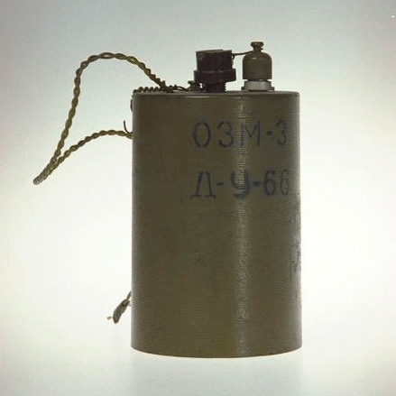
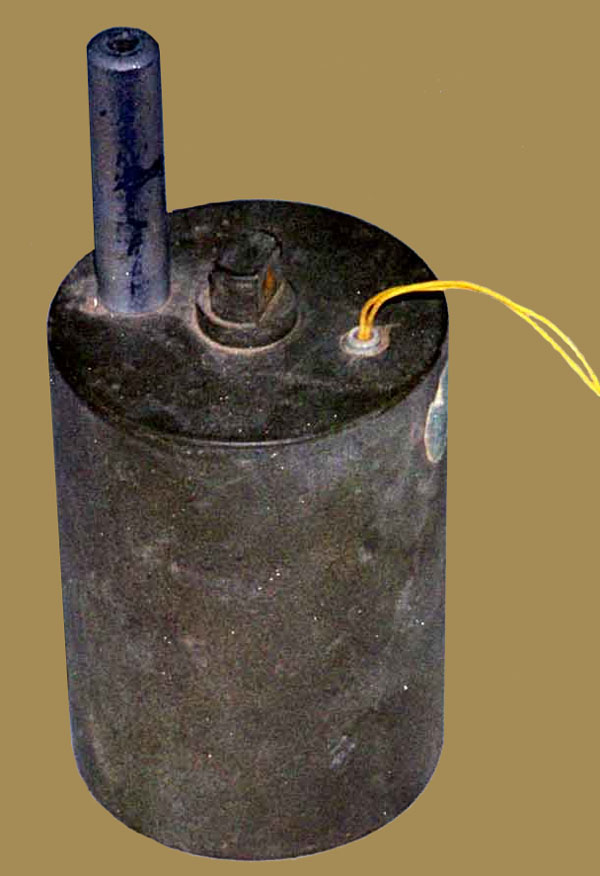
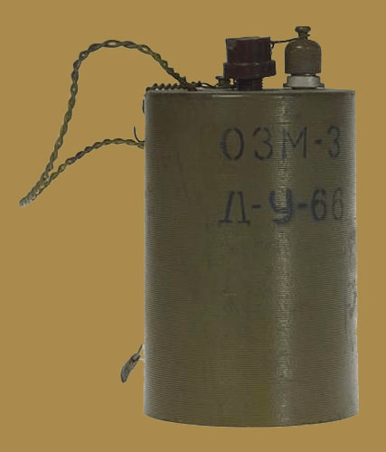
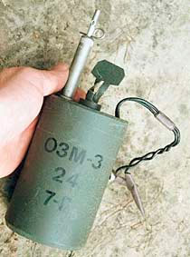
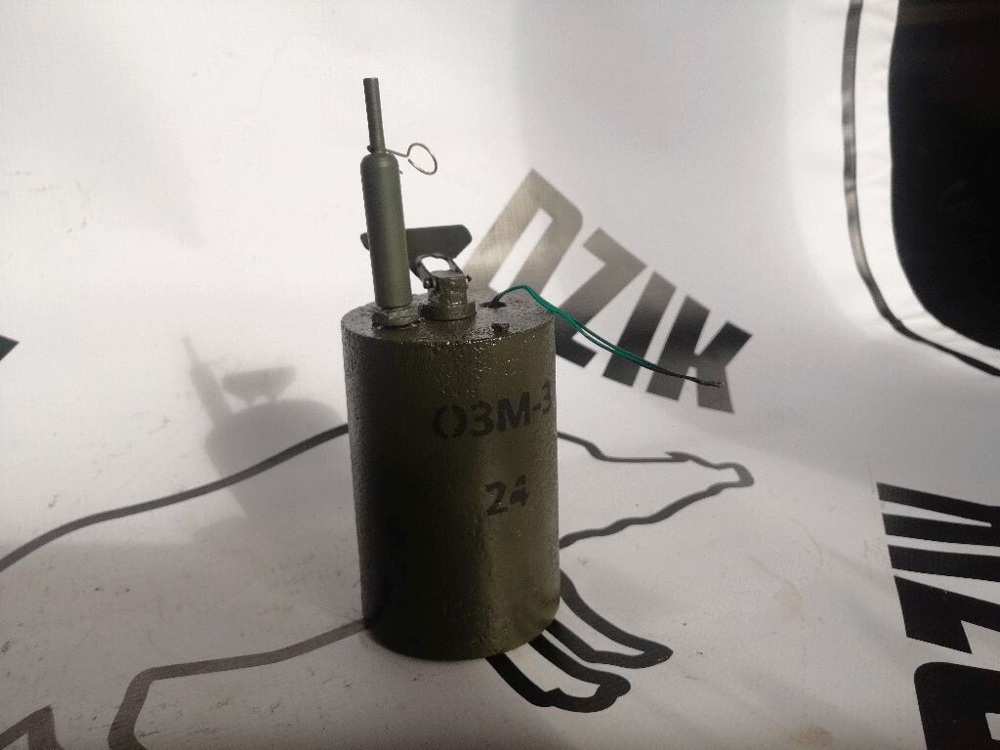
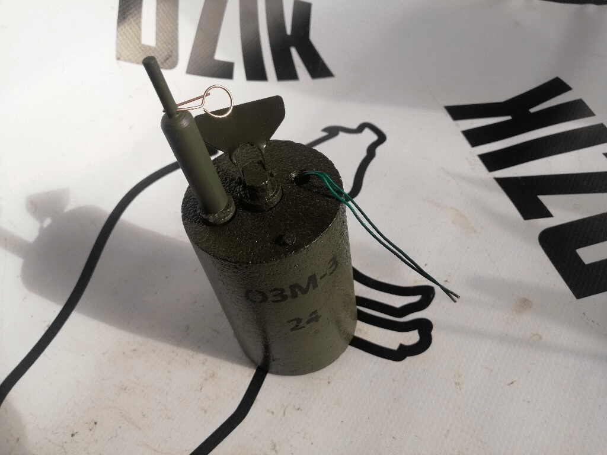
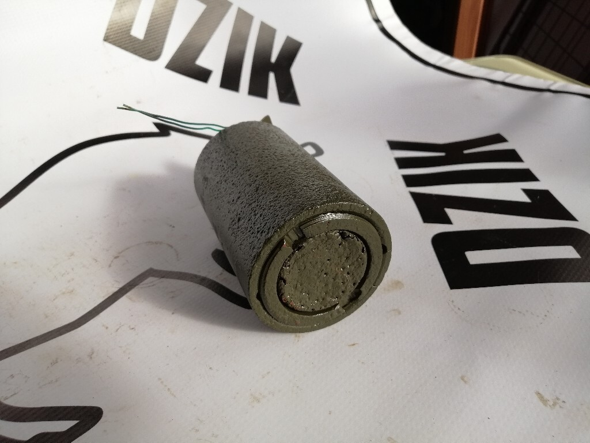
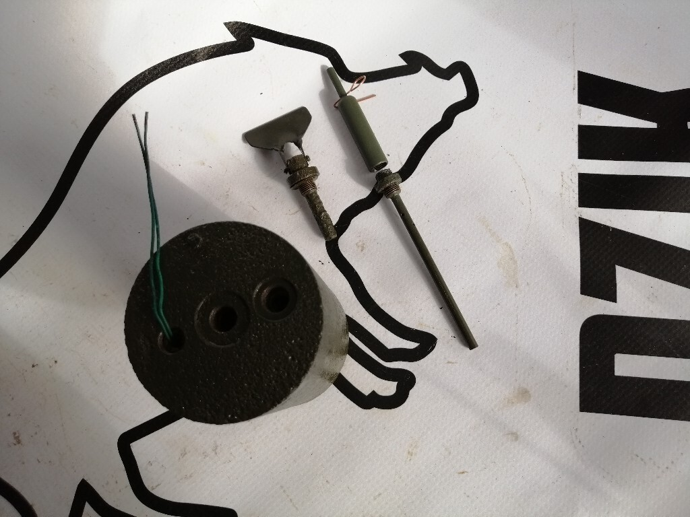
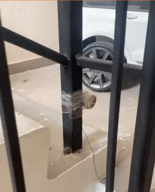

---
# Custom KB params
title: Міна ОЗМ-3
subtitle: "Протипіхотна осколково-загорожувальна міна, що вистрибує, колового ураження."
description: "Міна протипіхотна осколкова колового ураження."

# Obsidian metadata YAML front matter params
aliases: ОЗМ-3
tags:
keywords:
cssclass:
publish: false

# VuePress 2.x Frontmatter params
lang: uk-UA
prev:
  text: Перелік
  link: /catalog/index.html
next:
  text: ОЗМ-4
  link: /catalog/mina-ozm-4.html
---

← [Повернутись](./index.md)

# Міна ОЗМ-3

ОЗМ-3 — Протипіхотна вистрибуюча осколкова міна кругового ураження (в просторіччі — «міна-жаба»). Може також використовуватися як керована. 
Поразка наноситься осколками корпусу міни. Міна, вибухаючи на рівні 0,4-1,4 метра, вражає осколками навіть бійців, що лежать на землі.

- Відстань суцільного ураження: 9-10 м
- Безпечна відстань: 100 метрів

- Міна встановлюється вручну в ґрунт або на ґрунт за допомогою вбитого кілочка. 
- Міна спрацьовує при зачепленні за розтяжку. При спрацьовуванні підривника міна "підстрибує" та взривається. 
- Заряд викидає бойовий снаряд міни на висоту близько 0,4-1,4 м. де вибухає основний заряд міни. 
- Поразка наноситься осколками корпусу міни. Міна, вибухаючи на рівні 0,4-1,4 метра, вражала осколками навіть бійців, що лежали на землі.

## Тактико-технічні характеристики

- **Корпус** - чавун
- **Тип** - осколкова, колового враження, підстрибуюча
- **Маса** - 3,2 кг
- **Габарити**- ⌀76 x 130 мм ( як консервна банка ) 🥫
- **Чутливість** - 1—17 кг 🐈 -🦮
- **Висота вибуху** - 40—140 см
- **Безпечна відстань** - 100 м ( 5 автобусів ) 🚌🚌🚌🚌🚌

::: danger Категорично забороняється:
1. Виконувати будь - які механічні , термічні та інші впливи на корпус міни або вибухника. 
2. Переміщувати міни з місця їх знаходження . 
3. Проводити будь - які земляні роботи поблизу з міною . 
4. Намагатися викрутити будь - які комплектуючі з міни . 
5. Перерізати проводити , троси , тощо , що ідуть до вибухників міни . 
6. Самостійно знешкоджувати міни . 
:::

### Зона враження

- **Кількість осколків** – в залежності від розриву чавунного корпусу
- **Горизонтальний кут розкидання осколків** – 360°
- **Радіус суцільного ураження** – 9 м
- **Дальність розльоту осколків від корпусу у тиловому та бічному напрямах** – до 40 м

- **Спосіб встановлення**: ручний
- **Температурний діапазон (°C)** – від -60 до +60 °C.
- **Вилученість** - ні
- **Знешкоджуваність** – ні
- **Самоліквідація / самонейтралізація** – ні

## Історична довідка

Була розроблена у СРСР наприкінці 1950 – на початку 1960-х років. 

Ця міна аналогічна своїй дії німецької протипіхотної Sprengmine, яка застосовувалась німцями під час Другої Світової війни. Червона Армія нічого подібного тоді не мала. Ця німецька міна виявилася неприємним сюрпризом. Міна, що вибухає лише на рівні живота, вражала осколками навіть бійців, що лежать землі.

Власне, конструктори СРСР  лише вдосконалили Springmine, додавши до неї електропідривник. З середини Другої Світової війни міна досить активно застосовувалася саперами Червоної Армії, тоді як активність німецьких мінерів швидко зменшувалась. 

Наразі міна ОЗМ-3 не виробляється.

## Відео

[Російська протипіхотна міна ОЗМ-3 в будинку в Бучі](https://twitter.com/i/status/1511324392743186435).

## Зображення

::: gallery
- 
- 
- 
- 
- 
- 
- 
- 
- 
- 
:::

#### Інформаційні джерела

1.  Матеріал з Вікіпедії [МОН-50](https://uk.wikipedia.org/wiki/%D0%9C%D0%9E%D0%9D-50)
2. 

