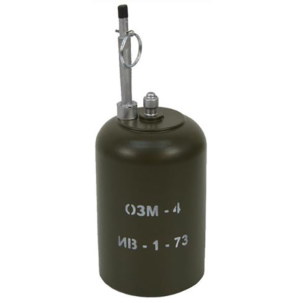
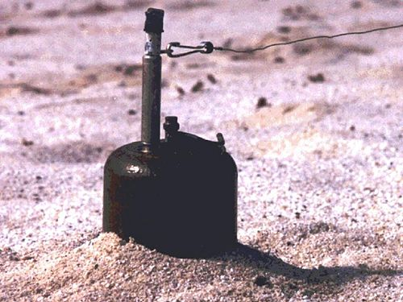
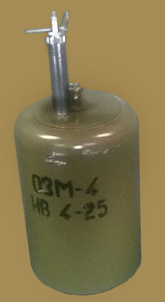
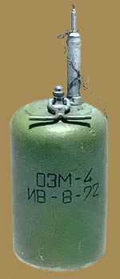
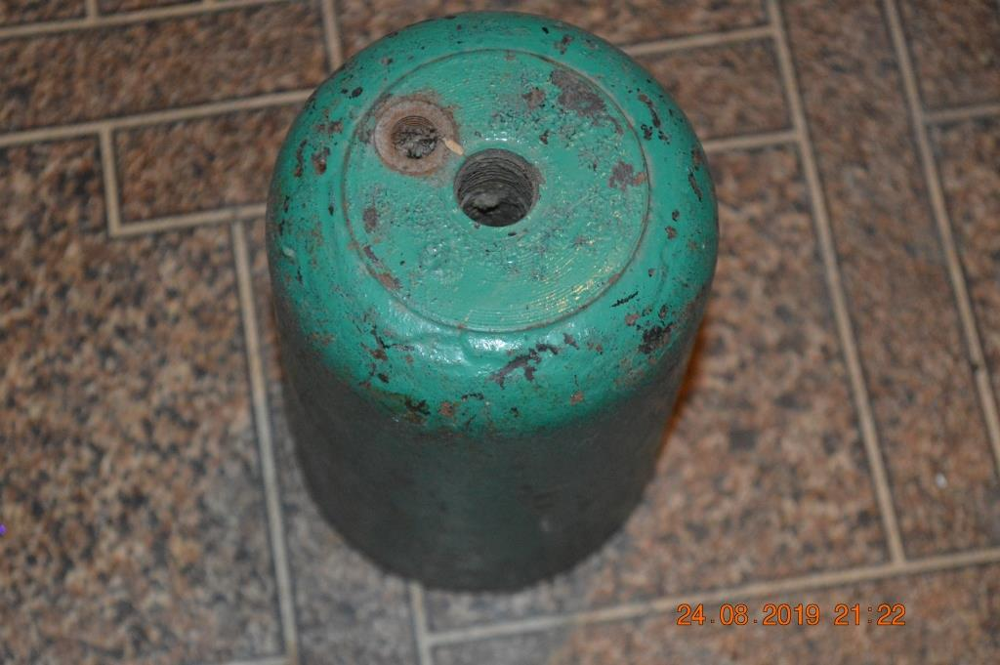
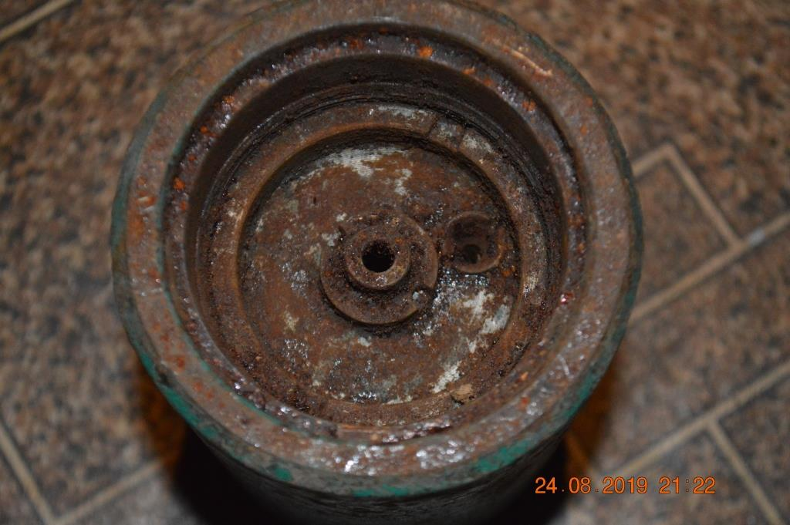

---
# Custom KB params
title: Міна ОЗМ-4
subtitle: "Протипіхотна уламково-загорожувальна міна, що вистрибує, колового ураження."
description: "Міна протипіхотна уламкова колового ураження."
type: kbpage

# Obsidian metadata YAML front matter params
aliases: Міна ОЗМ-4
tags:
keywords:
cssclass:
publish: false

# VuePress 2.x Frontmatter params
lang: uk-UA
prev:
  text: Перелік
  link: /catalog/index.html
next:
  text: МОН-90
  link: /catalog/mina-mon-90.html
---

← [Повернутись](./index.md)

# Міна ОЗМ-4

Міна спрацьовує внаслідок зачеплення за розтяжку і тим самим висмикування бойової чеки підривника. При спрацьовуванні підривника спалахує пороховий сповільнювач, який центральною запальною трубкою підпалює вихідний заряд, що складається з шашки чорного пороху. 
Заряд викидає бойовий снаряд міни на висоту близько 0,6-0,8 м. Саме тоді відбувається горіння порохового сповільнювача. Як тільки полум'я досягає капсуля-детонатора, останній вибухає, викликаючи вибух основного заряду міни. 
Поразка наноситься уламками корпусу міни. Міна, вибухаючи на рівні 0,4-1,4 метра, вражала уламками навіть бійців, що лежали на землі.
Протипіхотна міна ОЗМ-4 (OZM-4) встановлюється вручну в ґрунт або на ґрунт за допомогою вбитого кілочка. Елементів самоліквідації, невиймальності та необезшкоджуваності міну ОЗМ-4 (OZM-4) не має.

## Тактико-технічні характеристики

- **Корпус** - чавун
- **Тип** - уламкова, колового враження, підстрибуюча
- **Маса** - 5,4 кг
- **Габарити**- 90 x 90 x 170 мм ( як консервна банка ) 🥫
- **Чутливість** - 1—17 кг 🦆
- **Висота вибуху** - 60—80 см
- **Безпечна відстань** - 50 м ( 2 автобуси ) 🚌🚌

### Зона враження

- **Кількість уламків** – в залежності від розриву чавунного корпусу
- **Горизонтальний кут розкидання уламків** – 360°
- **Радіус суцільного ураження** – 13 м
- **Дальність розльоту уламків від корпусу у тиловому та бічному напрямах** – до 40 м

- **Спосіб встановлення**: ручний
- **Температурний діапазон (°C)** – від -60 до +60 °C.
- **Виімальність** - невиймальна
- **Знешкоджуваність** – незнешкоджувана
- **Самоліквідація** – немає

## Історична довідка

Була розроблена у СРСР у 1960 роки. 

Ця міна на відміну від [Міна ОЗМ-3](./mina-ozm-3.md) не використовується в якості керованої. Тобто в неї немає електропідривника.

Наразі міна ОЗМ-4 не виробляється.

## Відео

## Зображення
::: gallery
- 
- 
- 
-  
- 
- 
- 
- 
:::

#### Інформаційні джерела

1.  Матеріал з Вікіпедії [МОН-50](https://uk.wikipedia.org/wiki/%D0%9C%D0%9E%D0%9D-50)
2. https://www.youtube.com/watch?v=4R9PnxpTtc4

