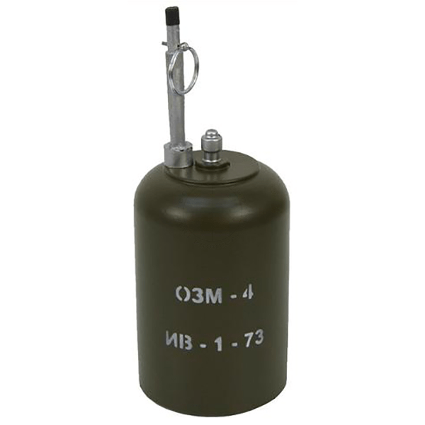
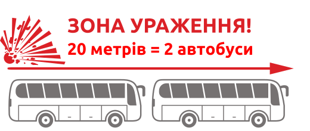
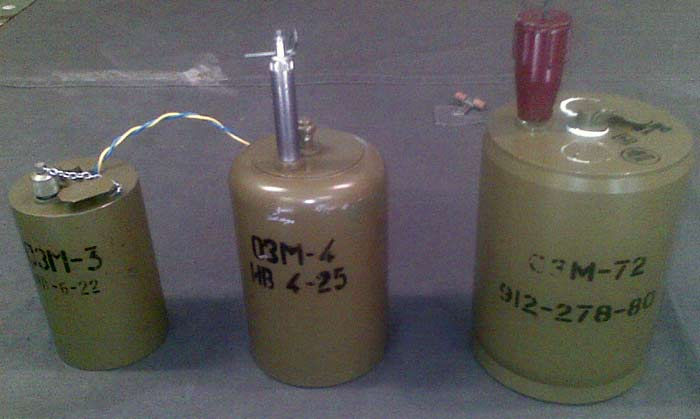
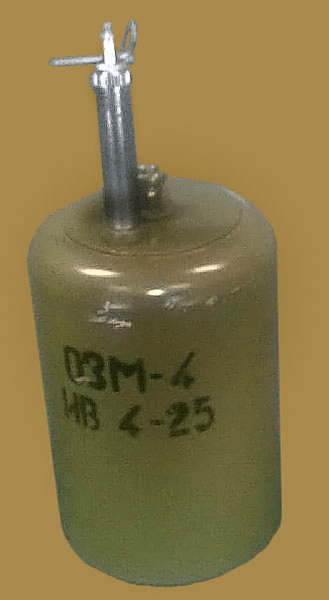
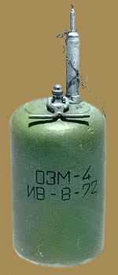
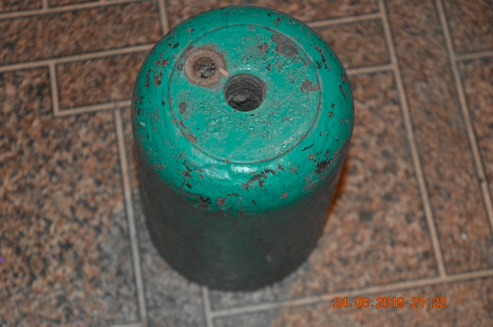
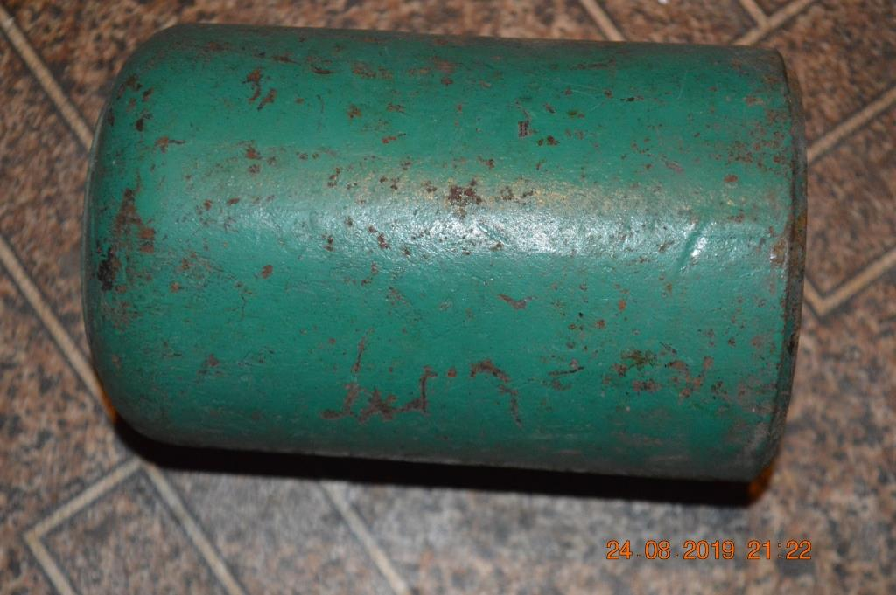

---
# Custom KB params
title: Міна ОЗМ-4
subtitle: "Протипіхотна осколково-загорожувальна міна, що вистрибує, колового ураження."
description: "Міна протипіхотна осколкова колового ураження."

# Obsidian metadata YAML front matter params
aliases: ОЗМ-4
tags:
keywords:
cssclass:
publish: false

# VuePress 2.x Frontmatter params
lang: uk-UA
prev:
  text: Перелік
  link: /catalog/index.html
next:
  text: Міна ОЗМ-72
  link: /catalog/mina-ozm-72.html
---

← [Повернутись](./index.md)

# Міна ОЗМ-4

ОЗМ-4 — Протипіхотна вистрибуюча осколкова міна кругового ураження (в просторіччі — «міна-жаба»).
Поразка наноситься осколками корпусу міни. Міна, вибухаючи на рівні 0,4-1,4 метра, вражає осколками навіть бійців, що лежать на землі.

- Відстань суцільного ураження: 13-20 м
- Безпечна відстань: 100 м

- Міна встановлюється вручну в ґрунт або на ґрунт за допомогою вбитого кілочка.
- Міна спрацьовує при зачепленні за розтяжку. При спрацьовуванні підривника міна "підстрибує" та взривається.
- Заряд викидає бойовий снаряд міни на висоту близько 0,4-1,4 м. де вибухає основний заряд міни.
- Поразка наноситься осколками корпусу міни. Міна, вибухаючи на рівні 0,4-1,4 метра, вражала осколками навіть бійців, що лежали на землі.

## Тактико-технічні характеристики

- **Корпус** - чавун
- **Тип** - осколкова, вистрибуюча, кругового ураження
- **Маса** - 5,4 кг
- **Габарити**- ⌀90 x 170 мм ( як консервна банка ) 🥫
- **Чутливість** - 1—17 кг 🐈 -🦮
- **Висота вибуху** - 40—140 см
- **Безпечна відстань** - 100 м ( 5 автобусів ) 🚌🚌🚌🚌🚌

::: danger Категорично забороняється:

1. Виконувати будь - які механічні , термічні та інші впливи на корпус міни або вибухника.
2. Переміщувати міни з місця їх знаходження .
3. Проводити будь - які земляні роботи поблизу з міною .
4. Намагатися викрутити будь - які комплектуючі з міни .
5. Перерізати проводити , троси , тощо , що ідуть до вибухників міни .
6. Самостійно знешкоджувати міни .
   :::

### Зона враження

- **Кількість осколків** – в залежності від розриву чавунного корпусу
- **Горизонтальний кут розкидання осколків** – 360°
- **Радіус суцільного ураження** – 13 м
- **Дальність розльоту осколків від корпусу у тиловому та бічному напрямах** – до 40 м

- **Спосіб встановлення**: ручний
- **Температурний діапазон (°C)** – від -60 до +60 °C.
- **Вилученість** - ні
- **Знешкоджуваність** – ні
- **Самоліквідація / самонейтралізація** – ні

## Історична довідка

Була розроблена у СРСР у 1960 роки. Своє походження веде від німецької вистрибуючої міни SMI-44 часів Другої Світової війни.

Ця міна на відміну від [Міна ОЗМ-3](./mina-ozm-3.md) не використовується в якості керованої. Тобто в неї немає електропідривника.

Наразі міна ОЗМ-4 не виробляється.

## Відео

<iframe width="560" height="315" src="https://www.youtube.com/embed/qmco21uT314" title="YouTube video player" frameborder="0" allow="accelerometer; autoplay; clipboard-write; encrypted-media; gyroscope; picture-in-picture" allowfullscreen></iframe>

## Зображення

::: gallery

- 
- 
- 
- 
- 
- 
- 
- 
  :::

#### Інформаційні джерела

1.  Матеріал з Вікіпедії [ОЗМ-4](https://uk.wikipedia.org/wiki/%D0%9E%D0%97%D0%9C-4)
