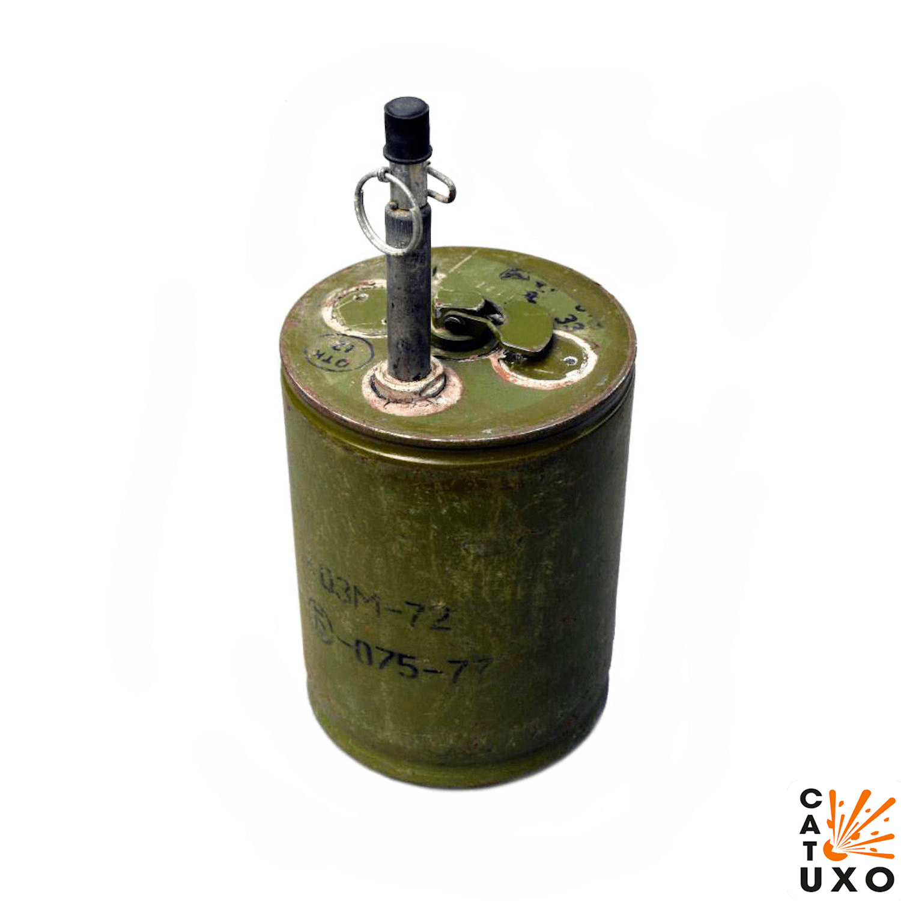
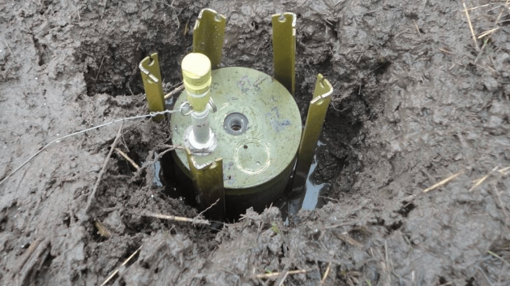
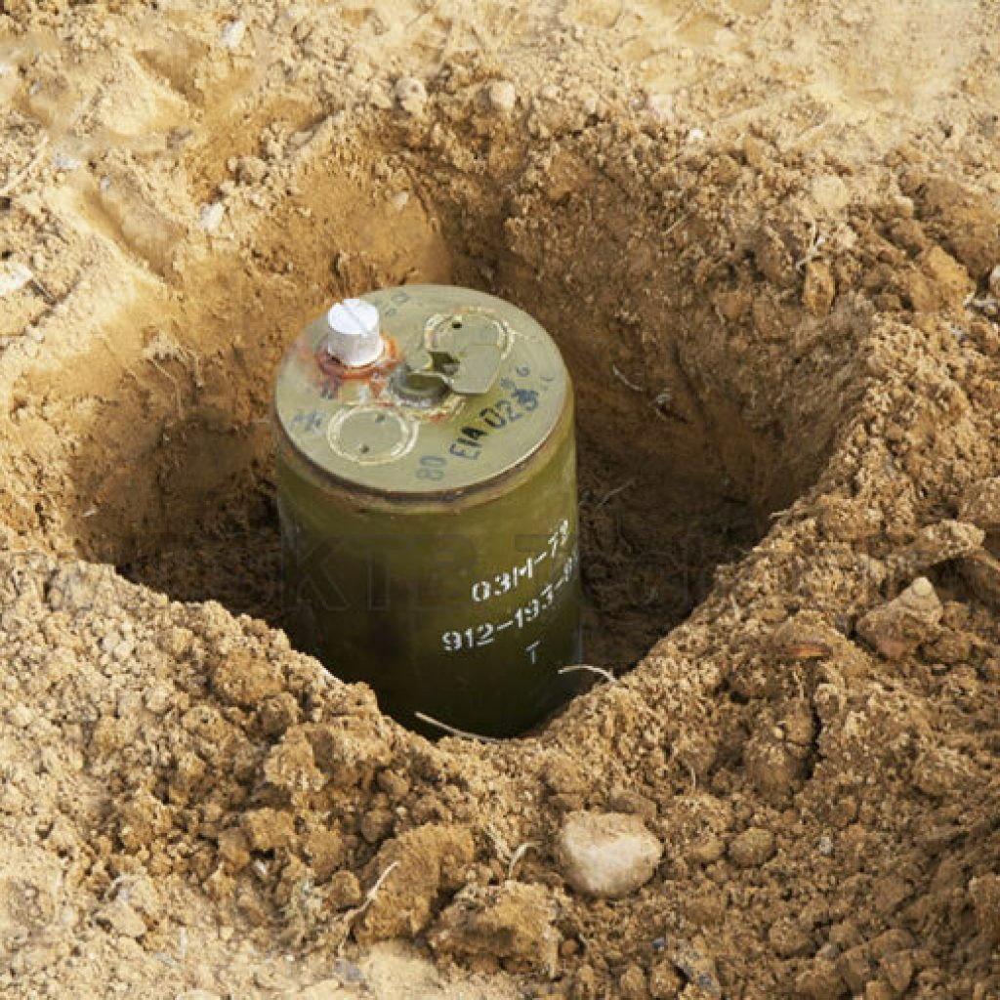
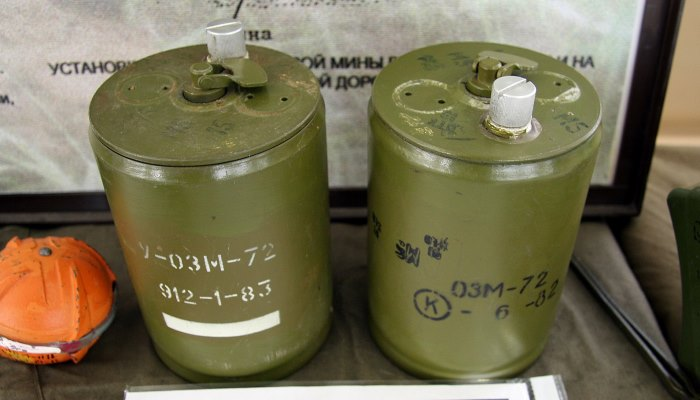
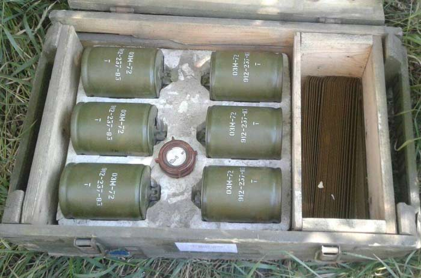
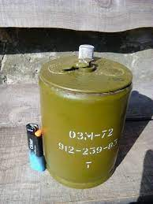
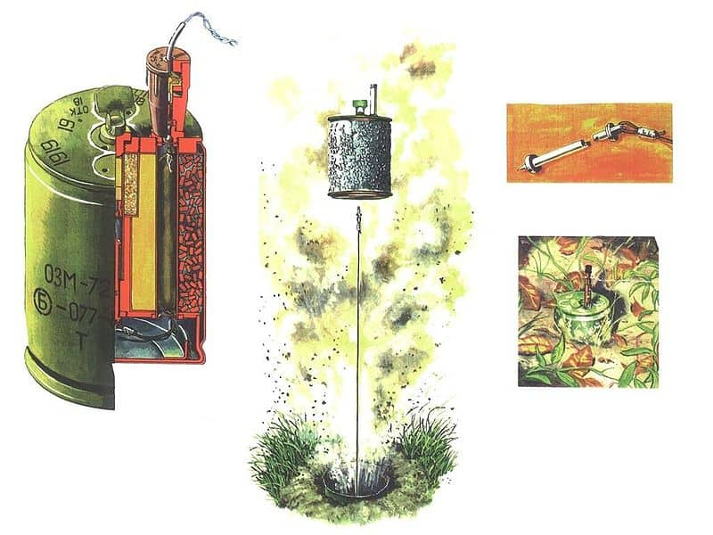
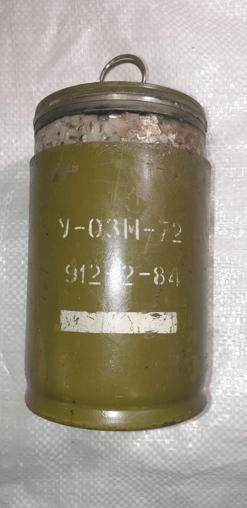
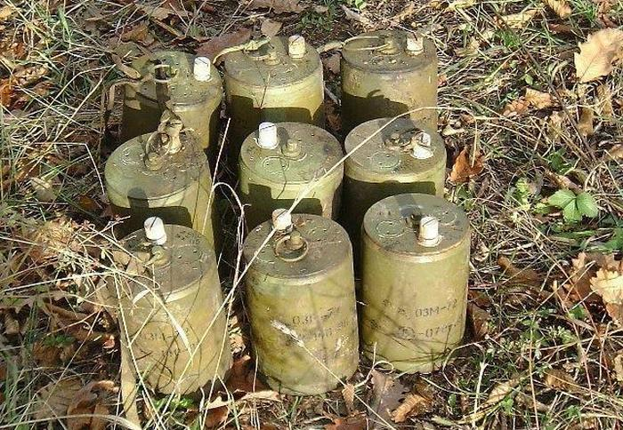
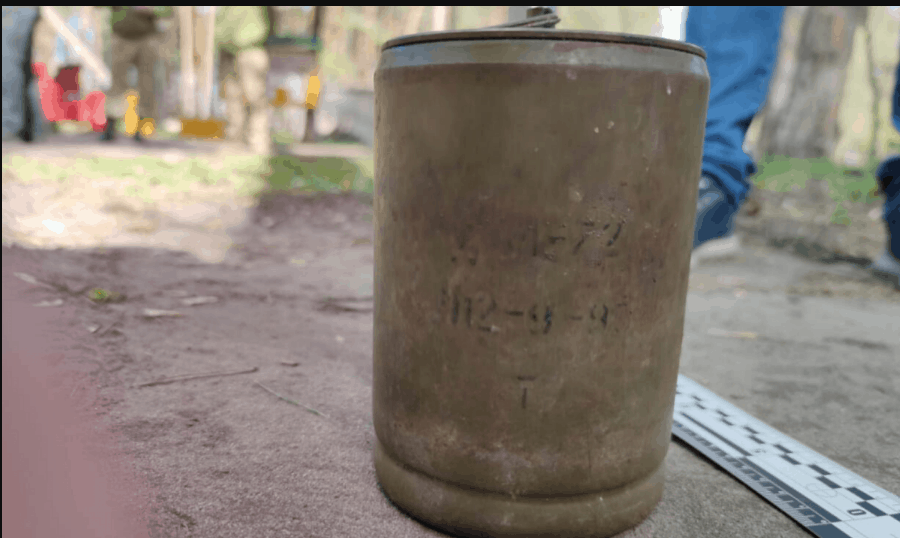

---
# Custom KB params
title: Міна ОЗМ-72
subtitle: "Міна протипіхотна осколкова колового ураження"
description: "Протипіхотна вистрибуюча осколкова міна кругового ураження"

# Obsidian metadata YAML front matter params
aliases: ОЗМ-72, Відьма, Злюка, Жаба
tags:
keywords:
cssclass:
publish: false

# VuePress 2.x Frontmatter params
lang: uk-UA
prev:
  text: Перелік
  link: /catalog/index.html
next:
  text: МОН-50
  link: /catalog/mina-mon-50.html
---

← [Повернутись](./index.md)

# Міна ОЗМ-72 "Відьма" ("Злюка", "Жаба")

ОЗМ-72 — Протипіхотна вистрибуюча осколкова міна кругового ураження (в просторіччі — «міна-жаба»). Може також використовуватися як керована.
Вибух цієї міни має своєрідний звук, що нагадує потужний виск роликів, що летять. Його не сплутаєш ні з чим іншим. Солдати прозвали її «Злюка» або «Відьма».

- Відстань суцільного ураження: 25-32 м
- Безпечна відстань: 100 м

- Міна встановлюється вручну в ґрунт, а при неможливості встановлення в ґрунт — на ґрунт (при цьому міна прив'язується до вбитого в ґрунт кілка. .
- Як правило мінуються підступи до мостів та переправ, береги в місцях висадки десанту, вулиці в населених пунктах, дороги в горах та лісі тощо.
- Встановлюються мiни на розтяжку або з дистанційним керуванням.
- Міна вибухає від електродетонатора в керованому варіанті або від запалу при встановленні на вибухник.
- Міна "підскакує" від поверхні землі і взривається. З вибухом заряду кульки/ролики розлітаються у всі сторони.
- В зоні суцільного ураження не залишається жодного об'єкта розміром з людину, що не отримає хоча б одного ролика. Навіть якщо він плазом лежить на землі.

## Тактико-технічні характеристики

- **Корпус** - сталь
- **Тип** - осколкова, вистрибуюча, кругового ураження
- **Маса** - 5,0 кг
- **Габарити**- ⌀100 х 172 мм ( як велика консервна банка з ананасами) 🥫
- **Сила натягу** - Усилие срабатывания (кг/см) - 1-17 кг 🐈 -🦮
- **Висота стрибка** - 50-90 см.
- **Безпечна відстань** - 100 м ( 4 вагони) 🚃🚃🚃🚃

::: danger Категорично забороняється:

1. Виконувати будь - які механічні , термічні та інші впливи на корпус міни або вибухника.
2. Переміщувати міни з місця їх знаходження .
3. Проводити будь - які земляні роботи поблизу з міною .
4. Намагатися викрутити будь - які комплектуючі з міни .
5. Перерізати проводити , троси , тощо , що ідуть до вибухників міни .
6. Самостійно знешкоджувати міни .
   :::

### Зона враження

- **Кількість осколків** – близько 2400 кульок або роликів
- **Горизонтальний кут розкидання осколків** – 360°
- **Радіус суцільного ураження** – 25-32 м
- **Дальність розльоту забійних осколків** – 50 м

- **Спосіб встановлення**: ручний
- **Температурний діапазон (°C)** – від -40 до +50
- **Вилученість** - так, але заборонено
- **Знешкоджуваність** – так
- **Самоліквідація / самонейтралізація** – ні
- **Гарантійний термін** – 10 років

## Історична довідка

ОЗМ-72 — Протипіхотна вистрибуюча осколкова міна кругового ураження (в просторіччі — «міна-жаба»). Може також використовуватися як керована. Призначена для виведення з ладу особового складу супротивника. Ураження людини (або декількох одночасно) завдається готовими забійними елементами (кульки або ролики) та осколками корпусу міни при її підриві на висоті 90–110 см. Від поверхні землі після підкидання її пороховим вибивним зарядом, який спрацьовує в той момент, коли солдат противника, зачепившись ногою за дротяну розтяжку мимоволі висмикне бойову чеку підривника.

Міна встановлюється вручну в ґрунт, а при неможливості встановлення в ґрунт — на ґрунт (при цьому міна прив'язується до вбитого в ґрунт кілка. Термін бойової роботи міни не обмежується. Самоліквідатором міна не оснащена. Елементів невилучення і незнешкодження не має, однак дуже висока чутливість підривника МУВ (якщо використовується він), або МВЕ-72 робить витяг знешкодження міни вкрай небезпечним. Може встановлюватися на невилучення за допомогою міни-сюрпризу МС-3 або ж саморобних мін-сюрпризів.

Ця міна, мабуть, найпотужніша з осколкових мін колового ураження. Навіть набагато більші за розміром і вагою міни ОЗМ-160 не забезпечують настільки рівномірного розподілу осколків зоною ураження, як міна ОЗМ-72 розподіляє свої готові забійні елементи. Досвід застосування міни однозначно вказує, що в зоні суцільного ураження не залишиться жодного об'єкта розміром з людину, яка не отримає хоча б одного ролика. Навіть якщо він плазом лежить на землі. В цілому ж радіус ураження міни (з ймовірністю поразки 20%) перевищує 30 м.

Вибух цієї міни має своєрідний звук, що нагадує потужний виск роликів, що летять. Його не сплутаєш ні з чим іншим. Солдати прозвали її «Злюка» або «Відьма».

Перебуває на озброєнні в Росії. Широко застосовується колаборантами та окупантами та їх диверсійними групами на Донбасі проти ЗСУ та мирних громадян в ході російської агресії на сході України.

Так, у квітні 2020 року під час розмінування територій поблизу позицій ЗСУ, розташованих біля села Кримське (Луганська область), виявили міну виробництва Російської Федерації ОЗМ-72. На міні вказано 93 рік виготовлення, за часів СРСР міни виготовляли на території сучасної Росії й до України після 91-го року ОЗМ-72 на склади не потрапляли.

## Відео

<iframe width="560" height="315" src="https://www.youtube.com/embed/C9N92PjxsfE" title="YouTube video player" frameborder="0" allow="accelerometer; autoplay; clipboard-write; encrypted-media; gyroscope; picture-in-picture" allowfullscreen></iframe>
<iframe width="560" height="315" src="https://www.youtube.com/embed/qzfVQBWE9tE" title="YouTube video player" frameborder="0" allow="accelerometer; autoplay; clipboard-write; encrypted-media; gyroscope; picture-in-picture" allowfullscreen></iframe>
<iframe width="560" height="315" src="https://www.youtube.com/embed/NHu5S-S1dsE" title="YouTube video player" frameborder="0" allow="accelerometer; autoplay; clipboard-write; encrypted-media; gyroscope; picture-in-picture" allowfullscreen></iframe>
<iframe width="560" height="315" src="https://www.youtube.com/embed/TIb1rbQch-0" title="YouTube video player" frameborder="0" allow="accelerometer; autoplay; clipboard-write; encrypted-media; gyroscope; picture-in-picture" allowfullscreen></iframe>
<iframe width="560" height="315" src="https://www.youtube.com/embed/YxrGhYh2faw" title="YouTube video player" frameborder="0" allow="accelerometer; autoplay; clipboard-write; encrypted-media; gyroscope; picture-in-picture" allowfullscreen></iframe>

## Зображення

::: gallery

- 
- 
- 
- 
- 
- 
- 
- 
- 
  :::

#### Інформаційні джерела

1.  Матеріал з Вікіпедії [ОЗМ-72](https://uk.wikipedia.org/wiki/%D0%9E%D0%97%D0%9C-72)
2.  [В ООС заявили про нові факти участі Росії у війні на Донбасі](https://www.pravda.com.ua/news/2020/04/17/7248421/)
3.  Safronov Taras (18 квітня 2020). [Виявлено міни ОЗМ-72 з Росії](https://mil.in.ua/uk/news/vyyavleno-miny-ozm-72-z-rosiyi/)
