---
# Custom KB params
title: Міна ПДМ-1М
subtitle: "Протидесантна міна ПДМ-1М"
description: "Протидесантна міна ПДМ-1М"

# Obsidian metadata YAML front matter params
aliases: ПДМ-1М
tags:
keywords:
cssclass:
publish: false

# VuePress 2.x Frontmatter params
lang: uk-UA
prev:
  text: МС-5__
  link: /catalog/mina-ms-5.html
next:
  text: ПДМ-2
  link: /catalog/mina-pdm-2.html
---

← [Повернутись](./index.md)

# Міна ПДМ-1М

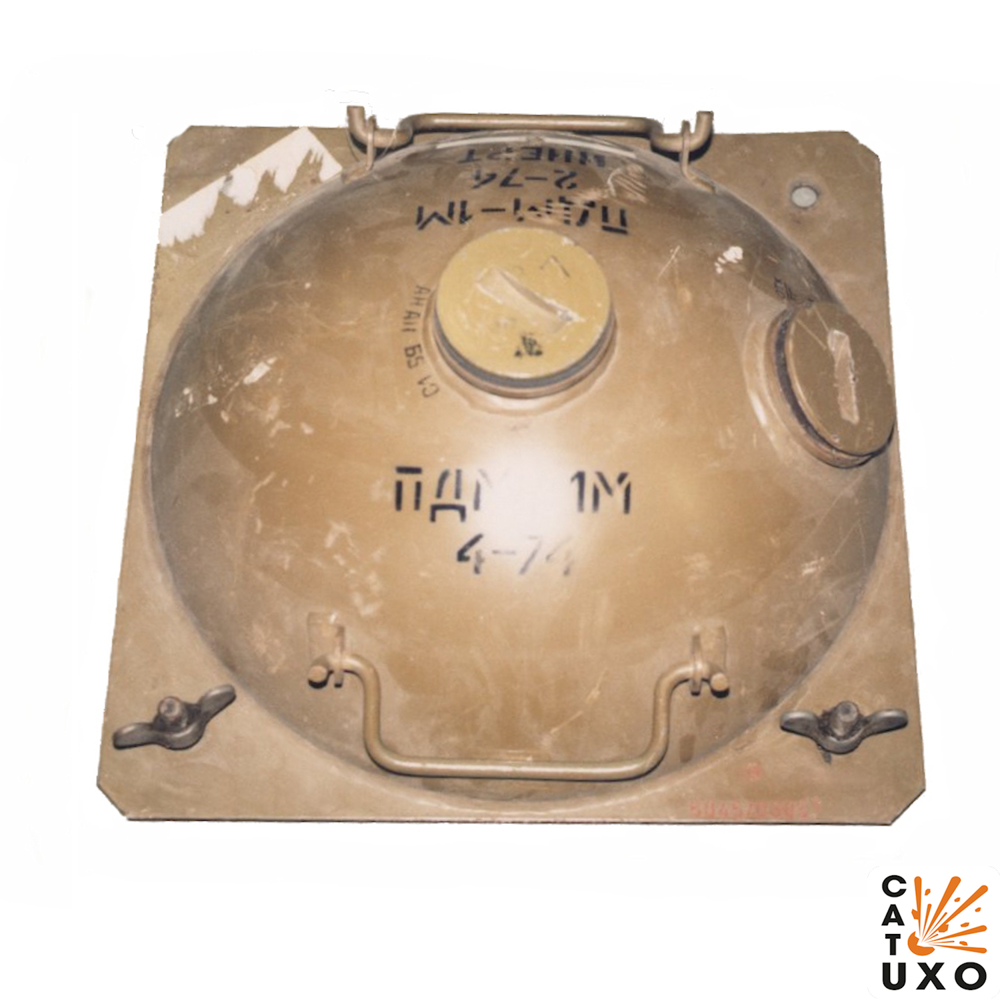

**ПДМ-1М** – радянська протидесантна міна донного типу, призначена для виведення з ладу плавзасобів противника при подоланні ними водних перешкод. Застосовується в прибережній зоні річок, озер, морів, заток. 

- Відстань суцільного ураження: 5 м
- Безпечна відстань: 50 м

- Міну встановлюють під водою на глибині від 1 до 2 м.
- Вибухає при відхиленні дачику цілі від вертикального положення на 10-15 градусів.
- Міна може спрацювати від впливу хвиль, якщо хвилювання води перевищує 5 балів.
- Двоє чоловіків можуть закласти та поставити річкову міну за 10-20 хвилин.

## Тактико-технічні характеристики

- **Корпус** - метал
- **Тип** - протидесантна донна контактної дії
- **Маса** - 60 кг
- **Розмір основи** – ∅800 мм
- **Висота загальна** – 1 м
- **Стійкість до шторму** – 6 балів.
- **Чутливість** - 18-26 кг 🛶
- **Безпечна відстань** - 50 м ( 5 автобусів ) 🚌🚌🚌🚌🚌

::: danger Категорично забороняється:

1. Виконувати будь - які механічні , термічні та інші впливи на корпус міни або вибухника.
2. Переміщувати міни з місця їх знаходження .
3. Проводити будь - які земляні роботи поблизу з міною .
4. Намагатися викрутити будь - які комплектуючі з міни .
5. Чипати корпус міни.
6. Самостійно знешкоджувати міни .

:::

### Зона враження

- **Радіус ураження** – 10 м
- **Спосіб встановлення**: з плавального засобу, вертольота або вручну
- **Температурний діапазон (°C)** – від 0 до +30 °C.
- **Вилученість** - ні
- **Знешкоджуваність** – ні
- **Самоліквідація / самонейтралізація** – може бути запрограмовано в діапазоні від одного до дев'яноста днів.

## Історична довідка

ПДМ-1М, ПДМ-2 (PDM-1M, PDM-2), Проти Десантна Міна – радянські протидесантні міни, прийняті на озброєння радянської армії у 1957 році.

Міна складається з корпусу, підривника із запобіжним пристроєм, штанги і баластної плити. Робота запобіжного пристрою, заснована на розчиненні у воді цукрової шашки, що забезпечує переведення підривника в бойове положення після установки міни протягом 8 хвилин при температурі +30° C і до 2,5 годин при температурі, близькій до 0° C.

Сама міна важить 21 кг, а разом чавунною баластною плитою – 55-60 кг. 
Маса вибухової речовини, якою є литий тротил, становить 10 кг. 
Міну встановлюють під водою на глибині від 1,1 до 2 м. При встановленні її в річку швидкість течії не повинна перевищувати 1,5 м/с. 

Мінімальна відстань між мінами, що запобігає вибухостійкості від сусідньої міни – 6 м. Міна може спрацювати від впливу хвиль, якщо хвилювання води перевищує 5 балів.

Міну застосовують з механічним, контактним підривником ВПДМ-1М. Спрацьовування детонатора відбувається, коли десантне судно або інша плавальна бойова машина наштовхується на штангу встановленої у воді міни і нахиляє її на кут 10-15 градусів.

Встановлення мін ПДМ-1М можливе з плавального засобу, вертольота або вручну.

Основна відмінність ПДМ-1 від ПДМ-1М полягає в тому, що в ПДМ-1М відсутній бустер, а штанга нахилу телескопічна.

## Відео

UA - Наші військові замінували узбережжя Маріуполя. У надзвичайно складних погодних умовах на плаваючому транспортері військові замінували море біля берегової лінії. Тепер на дні стоятимуть протидесантні міни, які захищатимуть узбережжя від катерів чи суден з ворожим десантом. Випуск ТСН.19:30 за 15 грудня 2014 року

  <a href="https://youtu.be/a_yNpnhhUq8" target="_blank">
    

    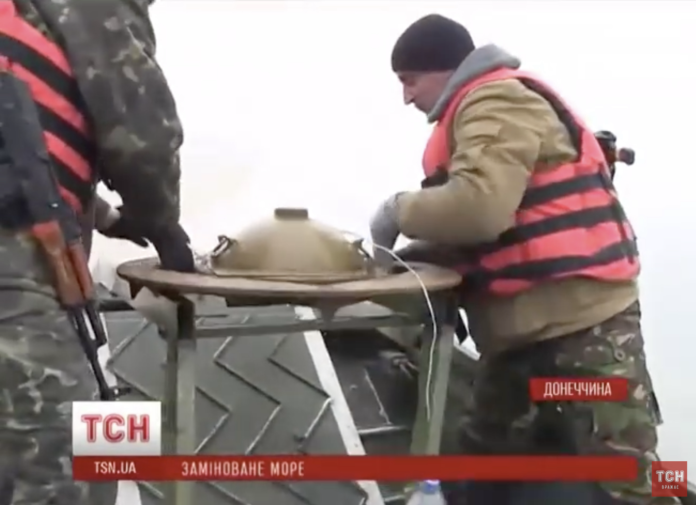
    

  </a>

## Зображення

::: gallery

- 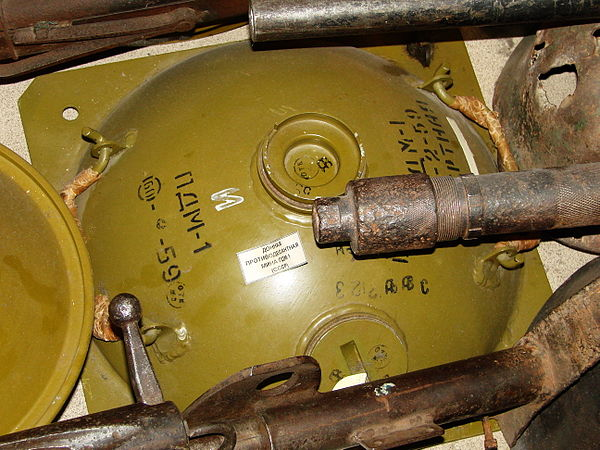
- 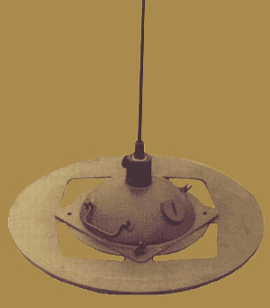
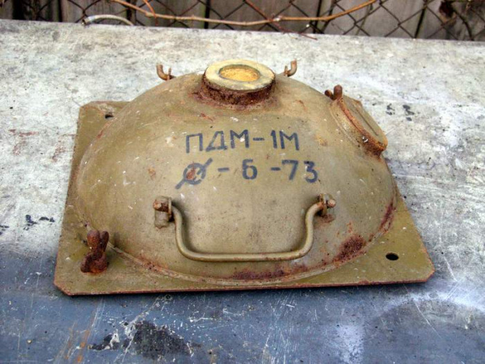
- 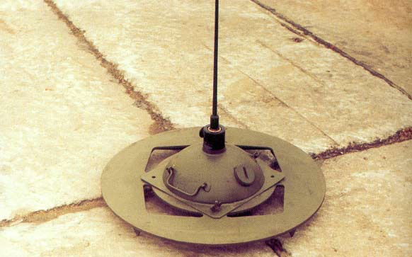
- 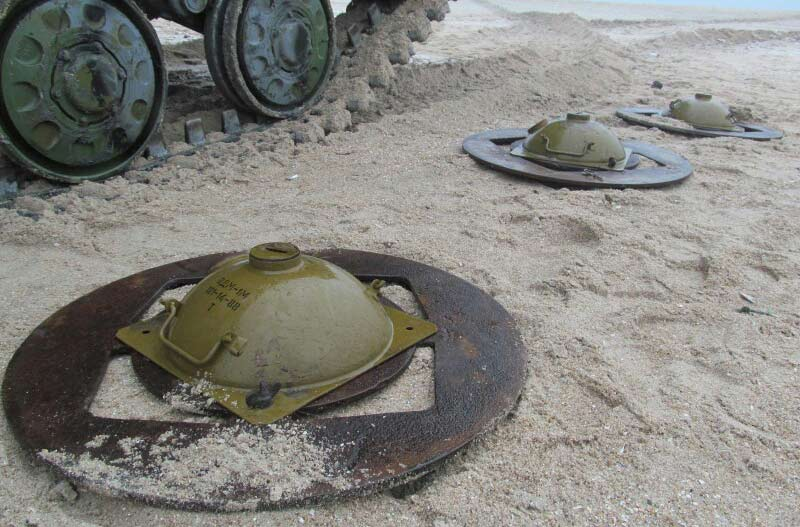
- 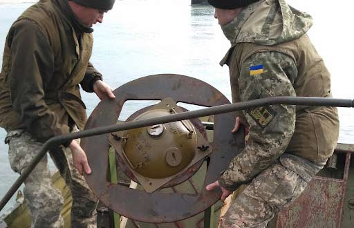
- 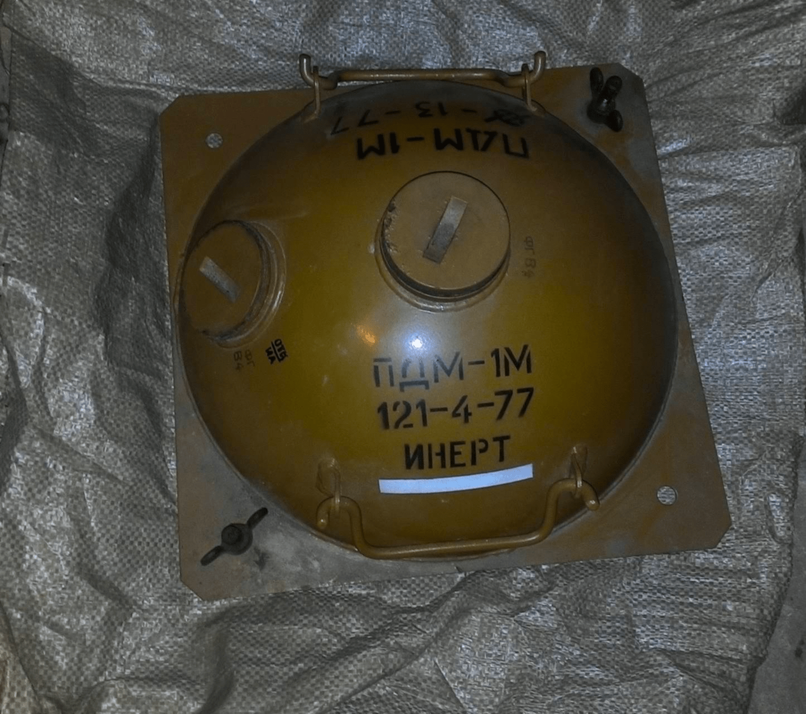
- 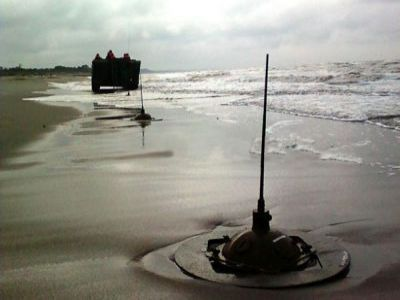
- 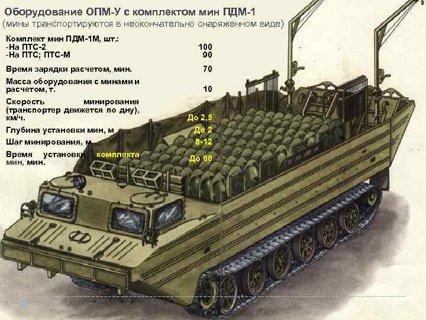
- 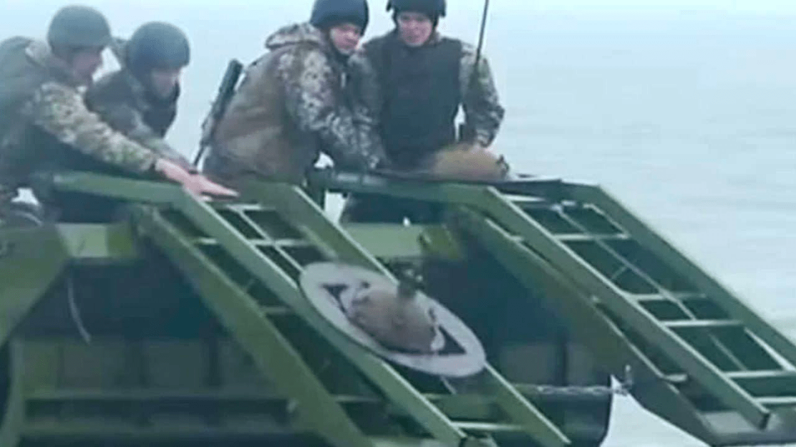
- 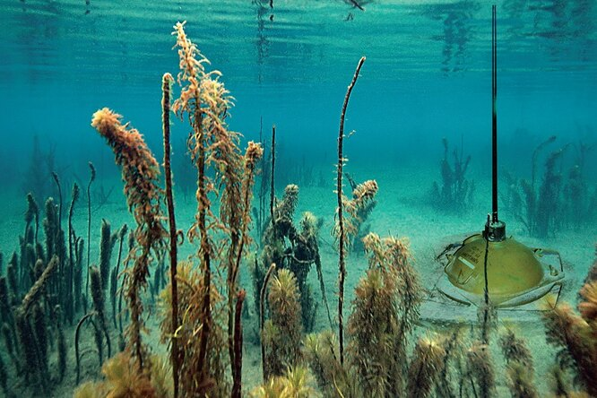

:::

#### Інформаційні джерела

1. [PDM-1M Seamine](https://cat-uxo.com/explosive-hazards/landmines/pdm-1m-seamine)
2. [ПДМ-1М - Вікіпедія](https://uk.wikipedia.org/wiki/%D0%9F%D0%94%D0%9C-1%D0%9C)
