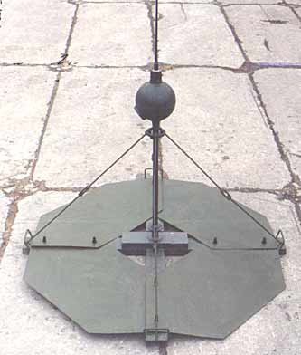
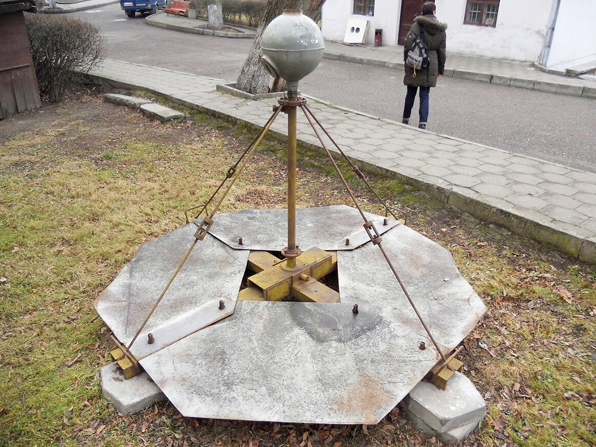

---
# Custom KB params
title: Міна ПДМ-2
subtitle: "Протидесантна міна  ПДМ-2"
description: "Протидесантна міна  ПДМ-2"

# Obsidian metadata YAML front matter params
aliases: ПДМ-2
tags:
keywords:
cssclass:
publish: false

# VuePress 2.x Frontmatter params
lang: uk-UA
prev:
  text: ПДМ-1М
  link: /catalog/mina-pdm-1m.html
next:
  text: ПДМ-2
  link: /catalog/mina-pdm-2.html
---

← [Повернутись](./index.md)

# Міна ПДМ-2

**ПДМ-2** – радянська протидесантна міна донного типу, призначена для виведення з ладу плавзасобів противника при подоланні ними водних перешкод. Застосовується в прибережній зоні річок, озер, морів, заток. 

- Відстань суцільного ураження: 8 м
- Безпечна відстань: 50 м

- Міну встановлюють під водою на глибині від 2,5 до 4 м.
- Вибухає при відхиленні дачику цілі від вертикального положення на 10-15 градусів.
- Міна може спрацювати від впливу хвиль, якщо хвилювання води перевищує 6 балів.
- Двоє чоловіків можуть закласти та поставити річкову міну за 10-20 хвилин.

## Тактико-технічні характеристики

- **Корпус** - метал
- **Тип** - протидесантна донна контактної дії
- **Маса** - 100-135 кг
- **Розмір основи** – 2x2 м
- **Висота загальна** – 140-270 мм
- **Стійкість до шторму** – 5-6 балів.
- **Чутливість** - 40-50 кг 🚤
- **Безпечна відстань** - 50 м ( 5 автобусів ) 🚌🚌🚌🚌🚌

::: danger Категорично забороняється:

1. Виконувати будь - які механічні , термічні та інші впливи на корпус міни або вибухника.
2. Переміщувати міни з місця їх знаходження .
3. Проводити будь - які земляні роботи поблизу з міною .
4. Намагатися викрутити будь - які комплектуючі з міни .
5. Чипати корпус міни.
6. Самостійно знешкоджувати міни .

:::

### Зона враження

- **Радіус ураження** – 10 м
- **Спосіб встановлення**: з плавального засобу, вертольота або вручну
- **Температурний діапазон (°C)** – від 0 до +30 °C.
- **Вилученість** - ні
- **Знешкоджуваність** – ні
- **Самоліквідація / самонейтралізація** – може бути запрограмовано в діапазоні від одного до дев'яноста днів.

## Історична довідка

ПДМ-2 (PDM-2), Проти Десантна Міна – радянські протидесантні міни, прийняті на озброєння радянської армії у 1957 році.

Застосування цієї міни має досить обмежений характер. По-перше, установку цих мін можна проводити лише заздалегідь, за відсутності на іншому березі супротивника, оскільки значний обсяг робіт, задіяно досить багато особового складу, що демаскує роботи. По-друге, за течією завжди пливе багато трави, сміття, колод, сучків, інших предметів, це призводить до помилкових спрацьовувань.
Щоправда, трохи загрублений підривник у порівнянні з підривником міни [ПДМ-1М](./mina-pdm-1m.md) (50 кг. проти 26) підвищував стійкість міни.

Мінування річки Меконг проти американських патрульних катерів давало позитивний ефект, правда за досить чистої течії. Хороший результат давало використання мін для мінування бухточок, де течії не було.

Мінування ж прибережної смуги Суецького каналу не дало жодного результату. Пісок під баластовими плитами швидко вимивався, міни перекидалися і вибухали, або їх забирало невідомо куди. Дещо кращий результат давала установка міни без сталевих листів

Взагалі, всі протидесантні міни з контактними датчиками цілі задовільно застосовні при слабкій течії та слабких хвилях.
При середній, швидкій течії та нестійких ґрунтах дна рік мінування русел рік зазвичай проблематично будь-якими мінами. Найскладнішим тут є майже повна неможливість забезпечити сталість знаходження міни у цьому місці та забезпечення заданої глибини внаслідок коливань рівня води у річці. Єдиний засіб - це прив'язування міни до природних або штучних якорів (забиті палки, великі камені або уламки скель, затоплені важкі предмети тощо). Однак у Суецькому каналі це неможливо через текучість піщаного ложа дна.

## Відео

## Зображення

::: gallery

- 
- 
:::

#### Інформаційні джерела

1. [PDM-2 Seamine](https://cat-uxo.com/explosive-hazards/landmines/pdm-2-seamine)
2. [Противодесантная мина ПДМ-2](http://saper.isnet.ru/mines/pdm-2.html)