← [Повернутись](./index.md)

# Міна дистанційного мінування ПФМ-1

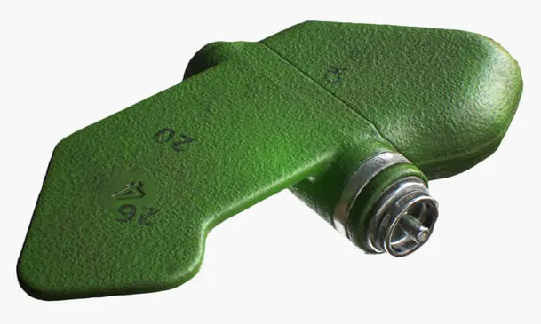

ПФМ-1 (протипіхотна фугасна міна) «Лепесток» — протипіхотна міна натискної дії радянського виробництва. Є майже точною копією американської міни BLU-43 / B «Dragontooth». Прийнята на озброєння Радянської армії та залишається на озброєнні ЗС РФ. Заборонена Оттавською конвенцією.

- Відстань суцільного ураження: 1 м
- Безпечна відстань: 50 м

- Реагує на натискання.
- Міна може встановлюватися у ґрунт тільки засобами дистанційного мінування. Розміщується на поверхні або у товщі грунту, маскується.
- Міна існує в двох варіантах: ПФМ-1 та ПФМ-1С. Перший варіант міни не має пристрою самоліквідації, другий забезпечений пристроєм, що забезпечує самоліквідацію міни підривом після закінчення 1-40 годин із моменту установки (час самоліквідації залежить від температури навколишнього повітря). Зовні ці два різновиди міни відрізняються лише тим, що на крилі міни ПФМ-1С нанесена літера «С».
- Ураження людини при вибуху міни завдається за рахунок руйнування нижньої частини ноги. Вибух проводиться в момент наступання ногою на датчик цілі, яким є вся площа напівм'якого поліетиленового контейнера з рідкою вибуховою речовиною.
- Міни розкидуються по площі еліпса в межах ⌀30–35 метрів. **Якщо натрапили на одну, то поряд є інші!**

## Тактико-технічні характеристики

- **Корпус** - поліетилен, колір може бути різним - маскування під грунт, листя та траву
- **Тип** - фугасна, натискної дії
- **Маса** - 80 г
- **Габарити**- 119 х 64 мм х 20 мм ( розмір долоні ) ✋
- **Чутливість** - 5-25 кг 🐐
- **Безпечна відстань** - 50 м ( 5 автобусів ) 🚌🚌🚌🚌🚌

::: danger Категорично забороняється:

1. Виконувати будь - які механічні , термічні та інші впливи на корпус міни або вибухника.
2. Переміщувати міни з місця їх знаходження .
3. Проводити будь - які земляні роботи поблизу з міною .
4. Намагатися викрутити будь - які комплектуючі з міни .
5. Чипати корпус міни.
6. Самостійно знешкоджувати міни .
   :::

### Зона враження

- **Радіус ураження** – 1 м

- **Спосіб встановлення**: дистанційний
- **Кількість мін у касеті**: 64 шт
- **Температурний діапазон (°C)** – від -20 до +40
- **Видобуваність** - ні
- **Знешкоджуваність** – ні
- **Самоліквідація** – 1-40 годин якщо ПФМ-1С
- **Гарантійний термін** – 10 років

## Історична довідка

Ця міна — майже точна радянська копія американської міни BLU-43/В «Dragontooth».

Міна широко застосовувалася в Афганській війні. У вересні 1980 року для закриття проходів на афгано-пакистанському кордоні було встановлено 34 мінні поля з витратою 34 312 мін. У жовтні — ще 55 мінних полів (196 272 ПФМ-1), у вересні 1981 року з гелікоптерів було встановлено 20 мінних полів (21 600 ПФМ-1) у провінції Баглан та 12 мінних полів (25 992 ПФМ-1) у провінції Парван.

Міна може встановлюватися на ґрунт тільки засобами дистанційного мінування. У даний час випуск припинено.

Міна широко застосовувалася в Афганській війні. Через незвичну форму пластикового корпусу діти нерідко сприймали міну як іграшку й отримували серйозні поранення або гинули. Завдяки антирадянській пропаганді серед афганського населення набула поширення теорія, що ПФМ-1 була спеціально спроектована, щоб приваблювати дітей, насправді форма міни просто обумовлена ​​аеродинамікою.

Чеченська війна РФ. 9 серпня 1999 два російських штурмовика Су-25 вторглися в повітряний простір Грузії і скинули касетні бомби з мінами ПФМ-1 біля села Земо-Омало, поранивши 3 мирних жителів. Міністерство закордонних справ Росії висловило Грузії вибачення у зв'язку з цим інцидентом. Мінне поле, що утворилося, було розміновано в 2011 році американо-британською організацією HALO Trust на гроші Державного департаменту США.

Ураження людині завдається за рахунок руйнування нижньої частини ноги (стопи) при вибуху міни в момент наступання ногою на міну.

Як правило при вибухові міни відривається повністю стопа ноги, якою людина наступила на міну, і, залежно від відстані, другої ноги від місця вибуху, вона також може бути значно ушкоджена або не одержати ушкодження зовсім.

Датчиком міни є вся площа напівм’якого поліетиленового контейнера, наповненого рідкою вибуховою речовиною. Під час підриву на міні людина дістає значні поранення ніг, смерть можлива внаслідок великої крововтрати за умови несвоєчасної медичної допомоги.

Для її спрацювання достатньо натиснути із зусиллям 5–25 кгс, рідка вибухівка вагою 40 грамів гарантовано уражає кінцівки людини. А міна завдяки поліетиленовому корпусу важить усього 80 грамів.

Крім того, ударна хвиля досить великого заряду ВР позбавляє людини свідомості, висока температура підривних газів може заподіяти значні опіки нижнім кінцівкам. Смерть може наступити від травматичного шоку, втрати крові при несвоєчасному наданні першої допомоги

## Відео

<iframe id="twitter-widget-0" scrolling="no" frameborder="0" allowtransparency="true" allowfullscreen="true" class="" style="position: static; visibility: visible; width: 550px; height: 532px; display: block; flex-grow: 1;" title="Twitter Tweet" src="https://platform.twitter.com/embed/Tweet.html?dnt=false&amp;embedId=twitter-widget-0&amp;features=eyJ0ZndfdGltZWxpbmVfbGlzdCI6eyJidWNrZXQiOlsibGlua3RyLmVlIiwidHIuZWUiXSwidmVyc2lvbiI6bnVsbH0sInRmd19ob3Jpem9uX3RpbWVsaW5lXzEyMDM0Ijp7ImJ1Y2tldCI6InRyZWF0bWVudCIsInZlcnNpb24iOm51bGx9LCJ0ZndfdHdlZXRfZWRpdF9iYWNrZW5kIjp7ImJ1Y2tldCI6Im9uIiwidmVyc2lvbiI6bnVsbH0sInRmd19yZWZzcmNfc2Vzc2lvbiI6eyJidWNrZXQiOiJvbiIsInZlcnNpb24iOm51bGx9LCJ0ZndfY2hpbl9waWxsc18xNDc0MSI6eyJidWNrZXQiOiJjb2xvcl9pY29ucyIsInZlcnNpb24iOm51bGx9LCJ0ZndfdHdlZXRfcmVzdWx0X21pZ3JhdGlvbl8xMzk3OSI6eyJidWNrZXQiOiJ0d2VldF9yZXN1bHQiLCJ2ZXJzaW9uIjpudWxsfSwidGZ3X3NlbnNpdGl2ZV9tZWRpYV9pbnRlcnN0aXRpYWxfMTM5NjMiOnsiYnVja2V0IjoiaW50ZXJzdGl0aWFsIiwidmVyc2lvbiI6bnVsbH0sInRmd19leHBlcmltZW50c19jb29raWVfZXhwaXJhdGlvbiI6eyJidWNrZXQiOjEyMDk2MDAsInZlcnNpb24iOm51bGx9LCJ0ZndfZHVwbGljYXRlX3NjcmliZXNfdG9fc2V0dGluZ3MiOnsiYnVja2V0Ijoib24iLCJ2ZXJzaW9uIjpudWxsfSwidGZ3X3R3ZWV0X2VkaXRfZnJvbnRlbmQiOnsiYnVja2V0Ijoib2ZmIiwidmVyc2lvbiI6bnVsbH19&amp;frame=false&amp;hideCard=false&amp;hideThread=false&amp;id=1513585769214103554&amp;lang=uk&amp;origin=https%3A%2F%2Ftexty.org.ua%2Ffragments%2F106338%2Frosiyany-skydayut-na-vulyci-harkova-miny-upovilnenoyi-diyi-yaki-spracovuyut-avtomatychno%2F&amp;sessionId=325f4f2b09d4cec97e1a3f0c40b28e6d89d3958f&amp;siteScreenName=textyorgua&amp;theme=light&amp;widgetsVersion=31f0cdc1eaa0f%3A1660602114609&amp;width=550px" data-tweet-id="1513585769214103554"></iframe>

<iframe width="560" height="315" src="https://www.youtube.com/embed/a6wVyut9C3o" title="YouTube video player" frameborder="0" allow="accelerometer; autoplay; clipboard-write; encrypted-media; gyroscope; picture-in-picture" allowfullscreen></iframe>

## Зображення

<!-- <Carousel data={[img20220811162205.png, img20220811155856.png ]} /> -->

<CarouselView />

::: gallery

- 
- 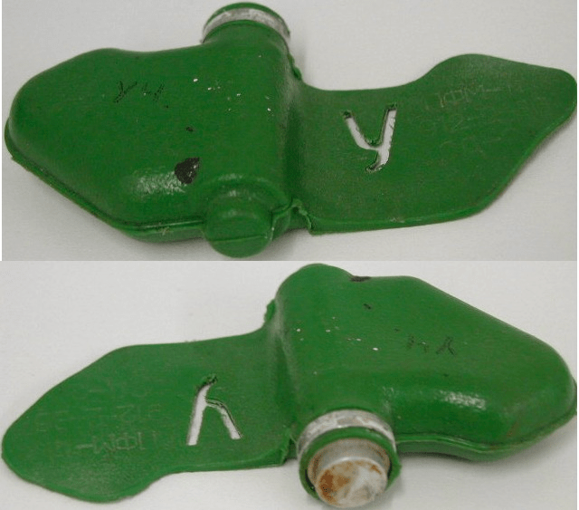
- 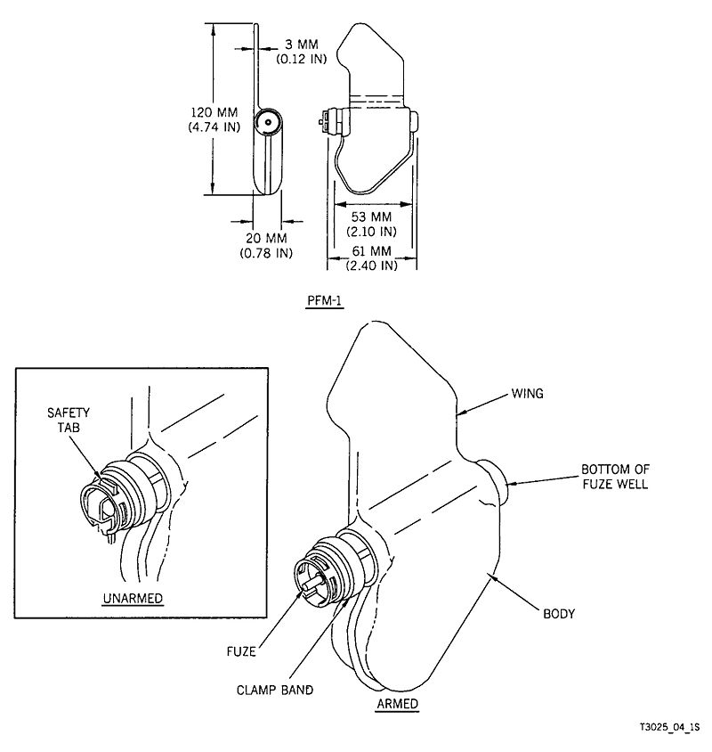
- 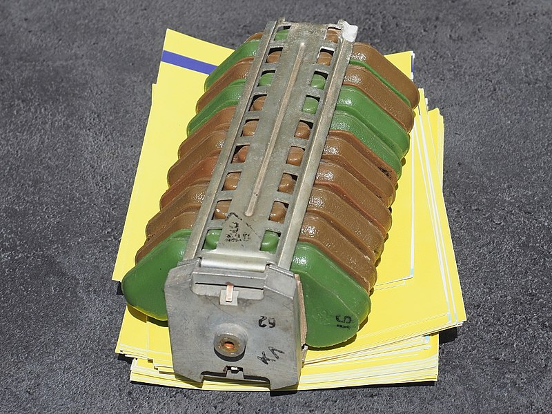
- 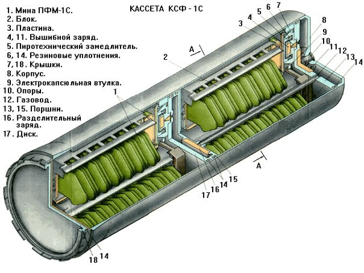
- 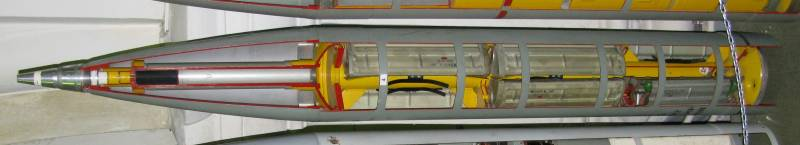
- 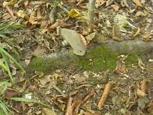
- 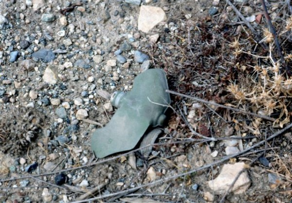
- 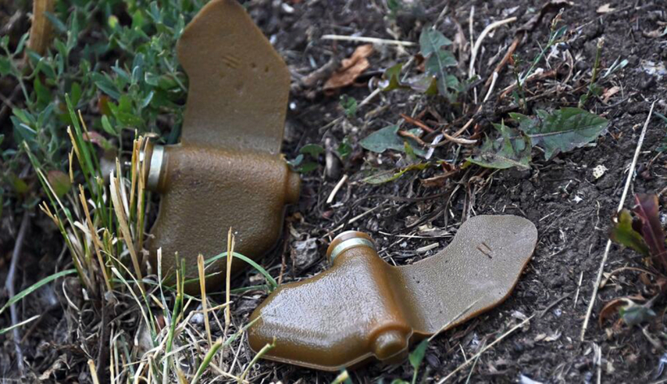
- 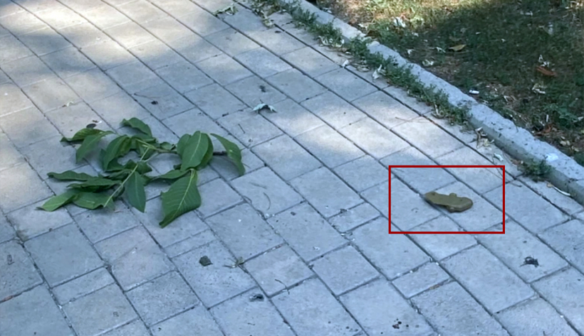
- 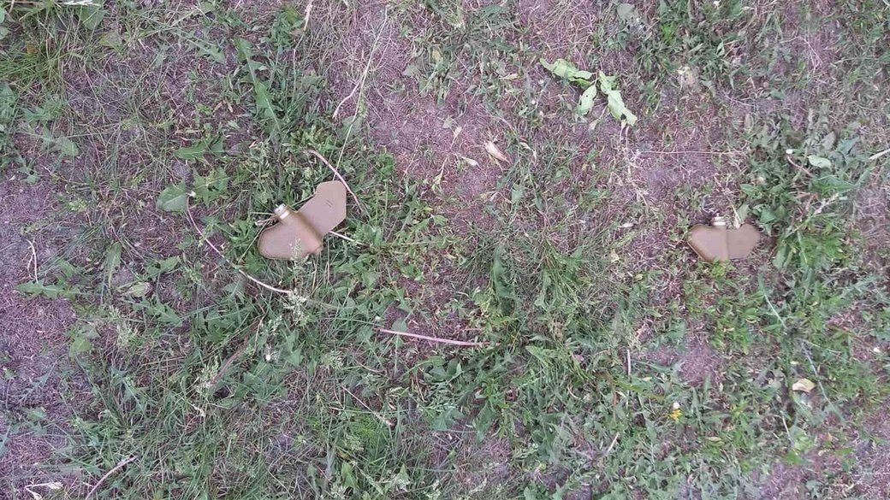
- 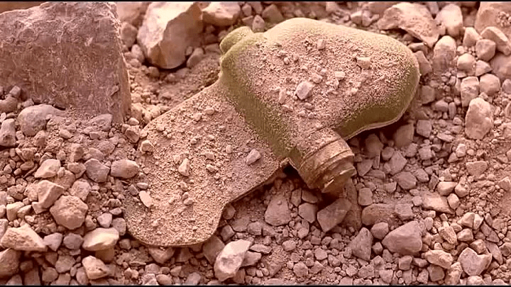
- 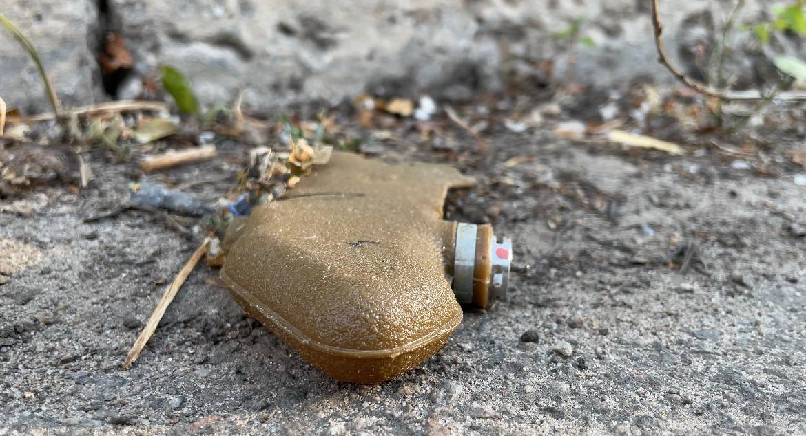
- 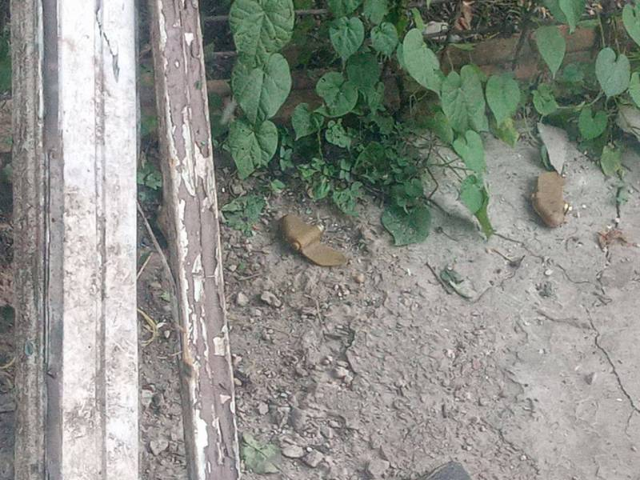
- 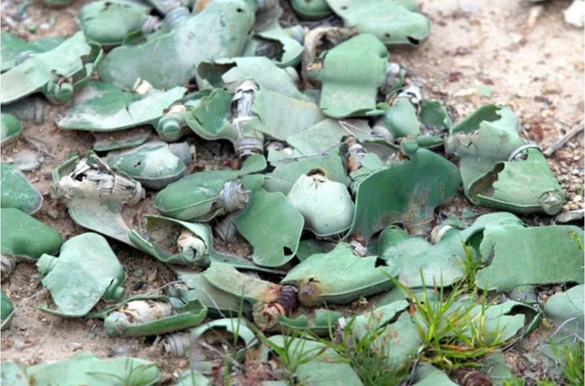
- 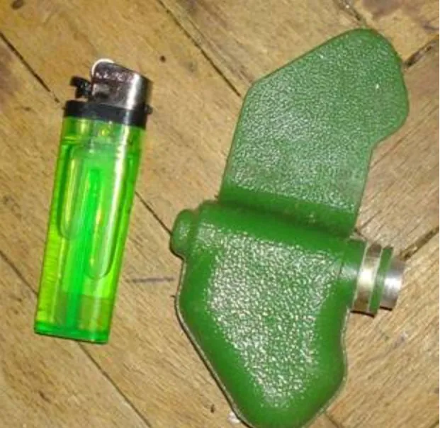
- 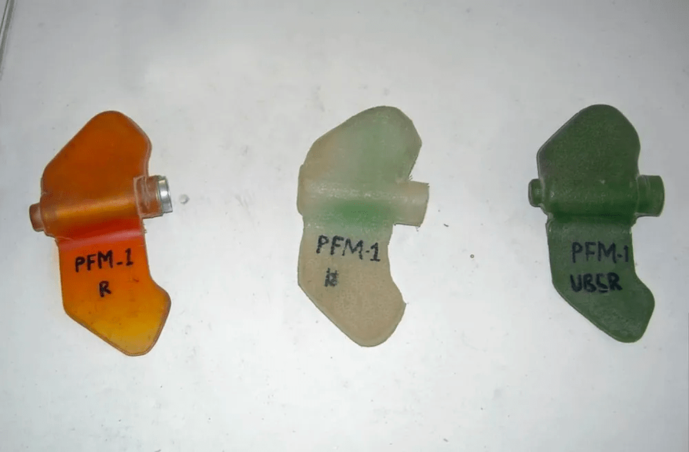
- 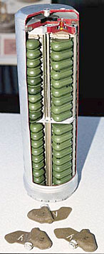
- 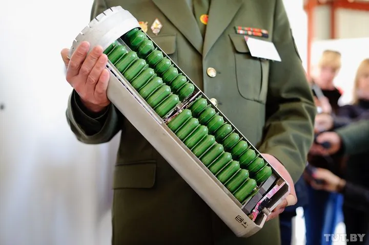
:::
<!-- </Carousel> -->

#### Інформаційні джерела

1.  Матеріал з Вікіпедії [ПФМ-1](https://uk.wikipedia.org/wiki/%D0%9F%D0%A4%D0%9C-1)
2.  [Смертельно небезпечні «пелюстки»](https://armyinform.com.ua/2021/03/19/smertelno-nebezpechni-pelyustky/)
