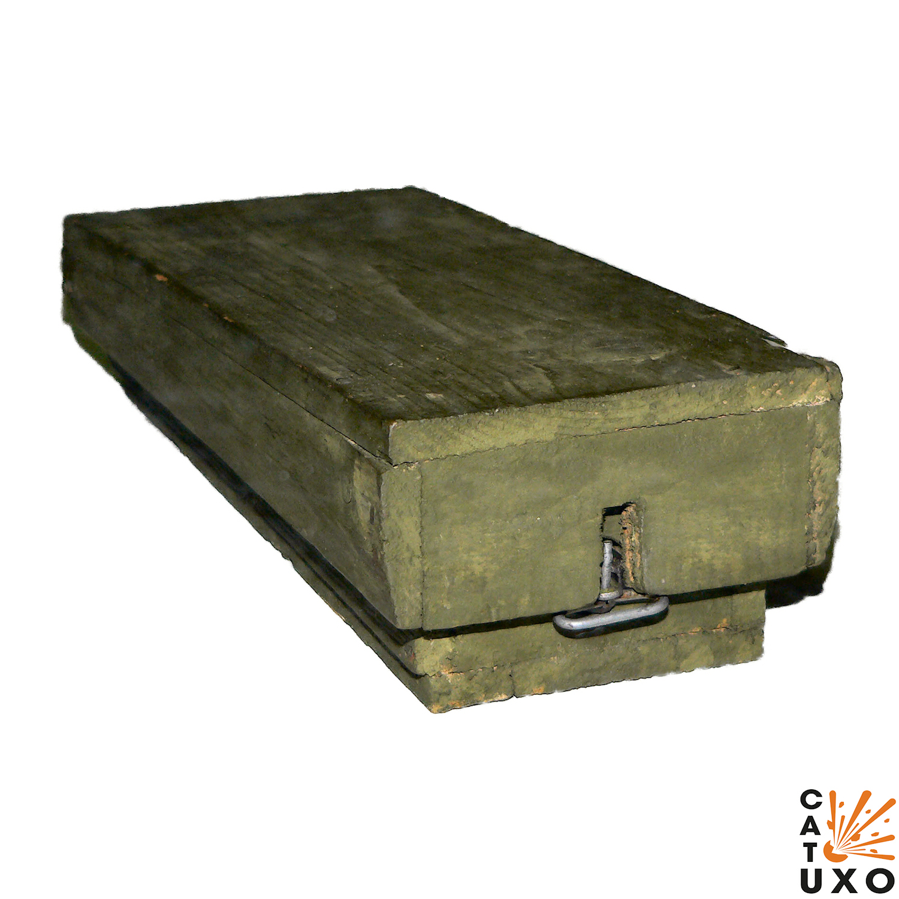
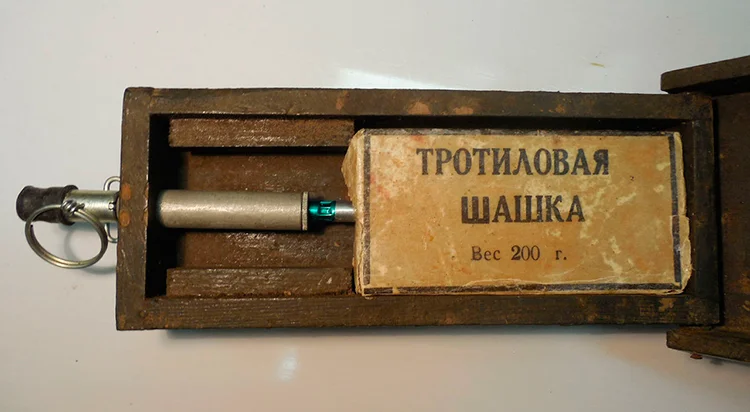
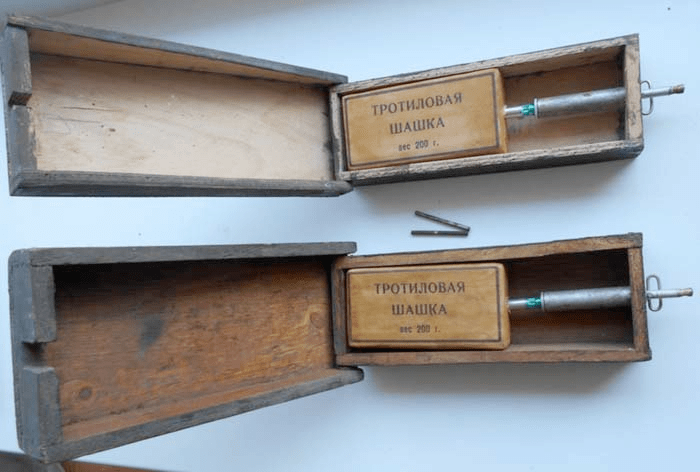
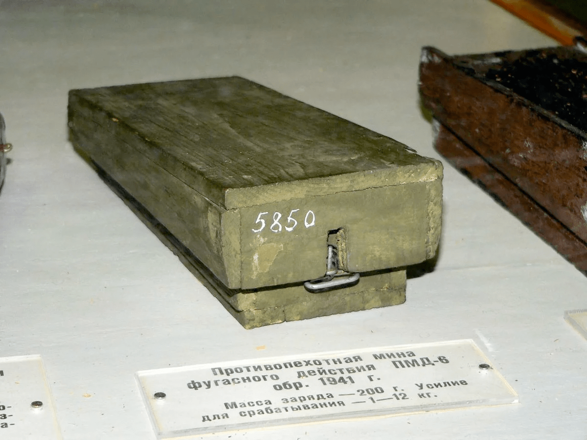

---
# Custom KB params
title: Міна-пастка МС-2 або протипіхотна міна деревяна ПМД-6
subtitle: "Протипіхотна міна деревяна або  міна-пастка"
description: "Міна-пастка МС-2 або протипіхотна міна деревяна ПМД-6"

# Obsidian metadata YAML front matter params
aliases: ПМД-6, МС-2
tags:
keywords:
cssclass:
publish: false

# VuePress 2.x Frontmatter params
lang: uk-UA
prev:
  text: Перелік
  link: /catalog/index.html
next:
  text: МС-5 «Портсигар»
  link: /catalog/mina-ms-5.html
---

← [Повернутись](./index.md)

# Міна-пастка МС-2 або протипіхотна міна деревяна ПМД-6

ПМД-6 — Протипіхотна деревяна міна. Руйнує та калічить ноги. У виконанні міни-пастки отримала позначення "міна-сюрприз" МС-2.
Має дуже просту будову і принцип дії. За цим принципом часто створюють пастки з будь-яких ящиків та коробок.

- Відстань суцільного ураження: 1 м
- Безпечна відстань: 50 м

- Реагує на натискання або зняття тиску.
- Міна встановлюється вручну в ґрунт.
- Маскуєтьяся, може бути встановлена перевернутою.

## Тактико-технічні характеристики

- **Корпус** - дерево
- **Тип** - фугасна, натискної або розвантажувальної дії
- **Маса** - 0,58 кг
- **Габарити**- 200 х 96 x 38 мм ( як пенал для олівців)
- **Чутливість** - 1-12 кг 🐈 -🦮
- **Безпечна відстань** - 50 м ( 3 автобуси ) 🚌🚌🚌

::: danger Категорично забороняється:

1. Виконувати будь - які механічні , термічні та інші впливи на корпус міни або вибухника.
2. Переміщувати міни з місця їх знаходження .
3. Проводити будь - які земляні роботи поблизу з міною .
4. Намагатися викрутити будь - які комплектуючі з міни .
5. Чипати корпус міни.
6. Самостійно знешкоджувати міни .
   :::

### Зона враження

- **Радіус ураження** – 1 м
- **Спосіб встановлення**: вручну або засобами механізації
- **Температурний діапазон (°C)** – від -40 до +50 °C.
- **Вилученість** - ні
- **Знешкоджуваність** – ні
- **Самоліквідація / самонейтралізація** – ні

## Історична довідка

ПМД-6 - Радянська протипіхотна міна натискної дії. Була використана наприкінці 1930-х років. Активно використовувалася частинами Червоної Армії протягом Другої світової війни . Була знята з озброєння у 1949 році 

Складається з дерев'яного корпусу, тротилової шашки вагою 0,2 кг а також підривника серії МУВ або УВГ з "Т"-подібною бойовою чекою і запалом МД-5 або МД-2 . 
Кришка міни з'єднана з корпусом шарнірно та є натискним датчиком мети. Дерев'яний корпус з метою кращої безпеки при виробництві покривали оліфою або виварювали в маслі. Усередині міни встановлено 200-грамову шашку тротилу. 

Модифікація міни ПМД-6ф спороджувалася порошкоподібним тротилом, який засипався попередньо в скляний флакон. 

Після Другої світової війни міну модернізували. У ПМД-6М до внутрішньої поверхні кришки прибита одним кінцем металева пластинка, а інший її кінець упирається в гільзу підривника. 

Для підриву міни потрібно зусилля вже 6-28 кг, що робить її безпечнішою при мінуванні. ПМД-6, як і її модифікації, при знешкодженні вкрай небезпечна і тому при розмінуванні знищується дома шляхом підриву поруч заряду ВР або мінним тралом . 

Міна-пастка МС-2 призначена для використання як пристрій не виймання для протитанкових та інших мін, що не мають власного елемента не виймання. 
Крім того, міна може використовуватися як міна-пастка розвантажувальної дії.

## Відео

<iframe width="560" height="315" src="https://www.youtube.com/embed/QTbE1YupF7c" title="YouTube video player" frameborder="0" allow="accelerometer; autoplay; clipboard-write; encrypted-media; gyroscope; picture-in-picture" allowfullscreen></iframe>

<iframe width="560" height="315" src="https://www.youtube.com/embed/D6HyXPQMR_w" title="YouTube video player" frameborder="0" allow="accelerometer; autoplay; clipboard-write; encrypted-media; gyroscope; picture-in-picture" allowfullscreen></iframe>

## Зображення

::: gallery

- 
- 
- 

  :::

#### Інформаційні джерела

1.  [PMD-6 & 7 Landmine](https://cat-uxo.com/explosive-hazards/landmines/pmd-6-7-landmine)
