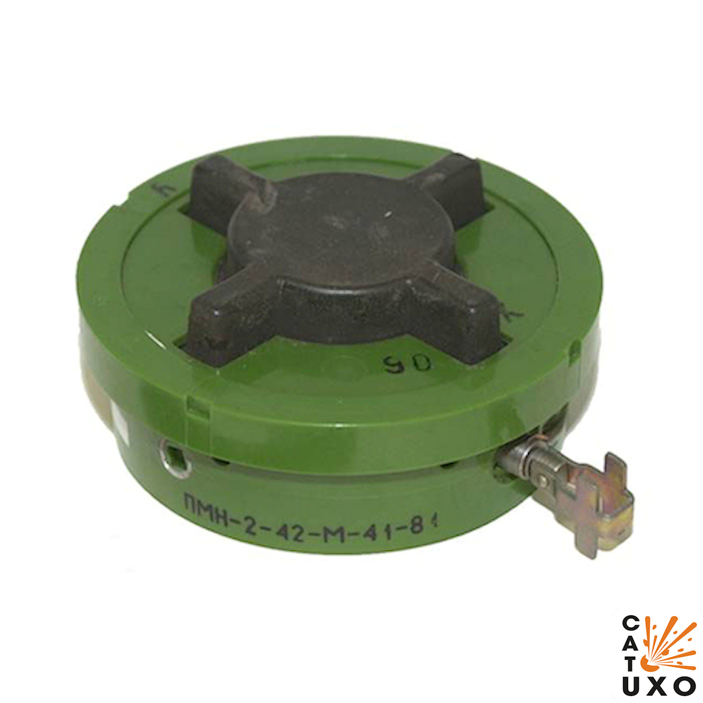
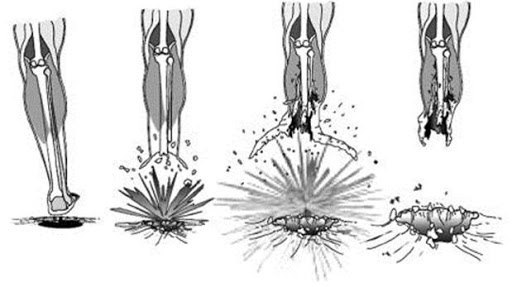
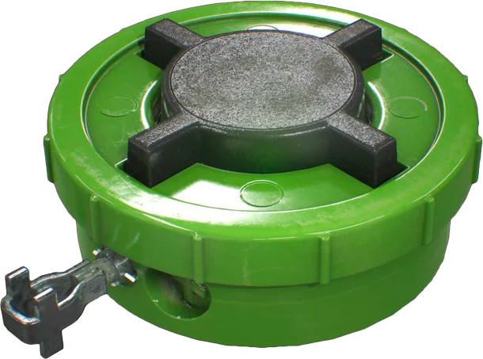
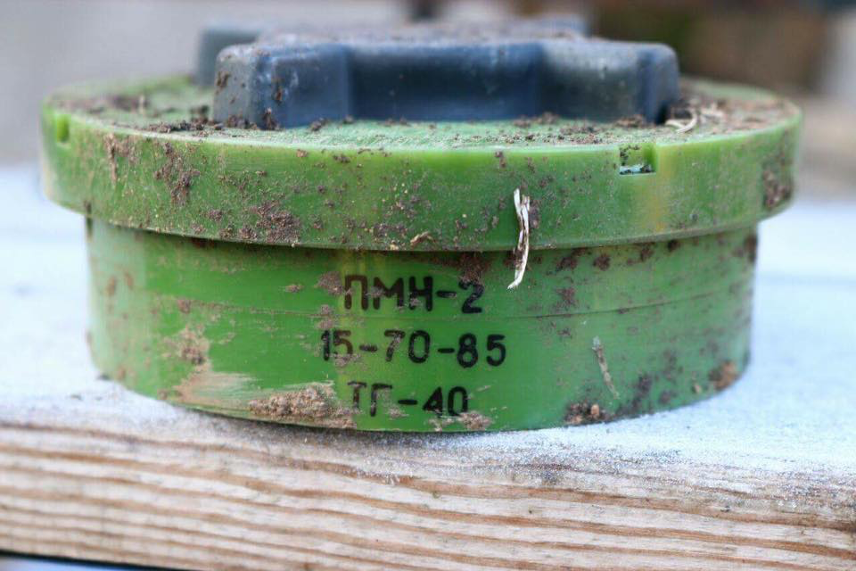
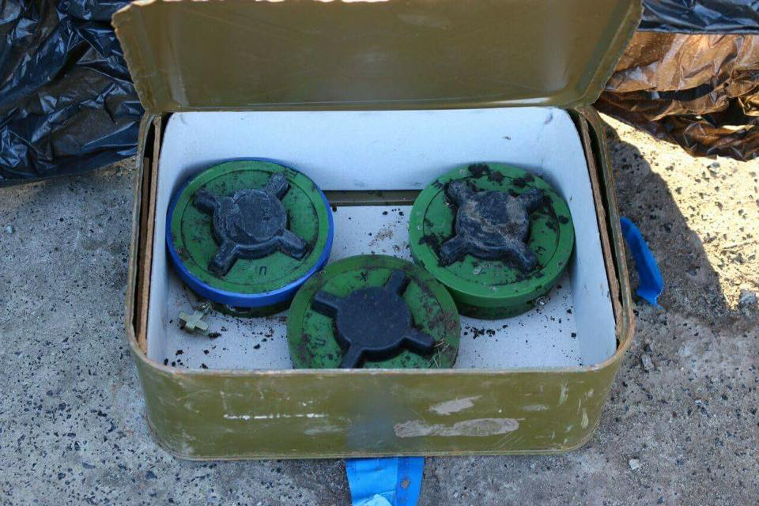
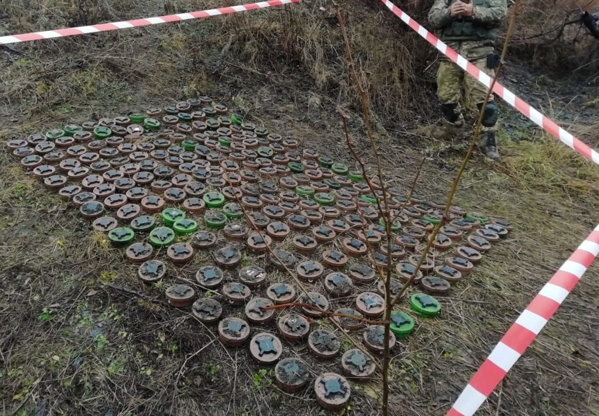
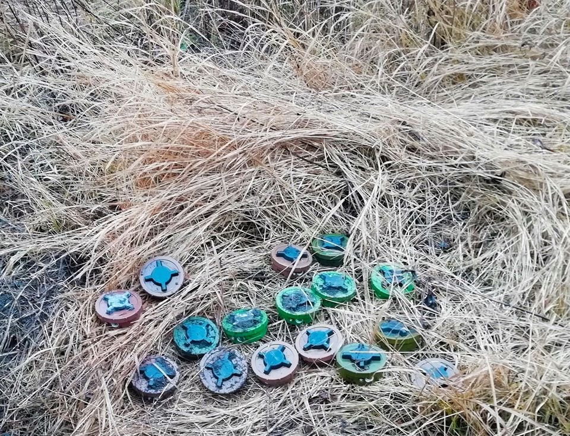
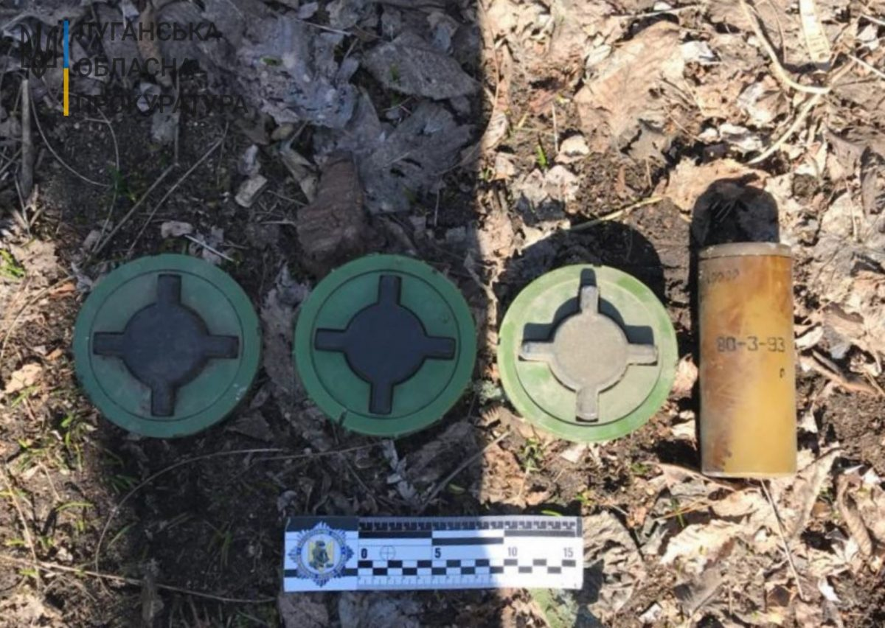
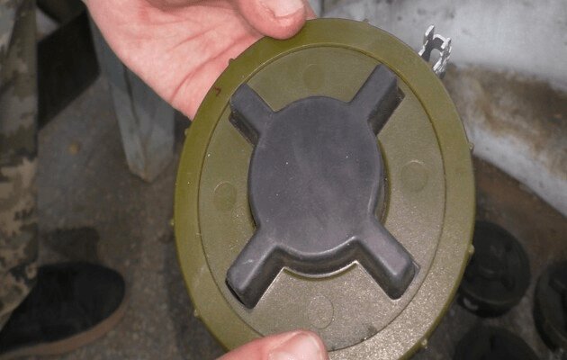
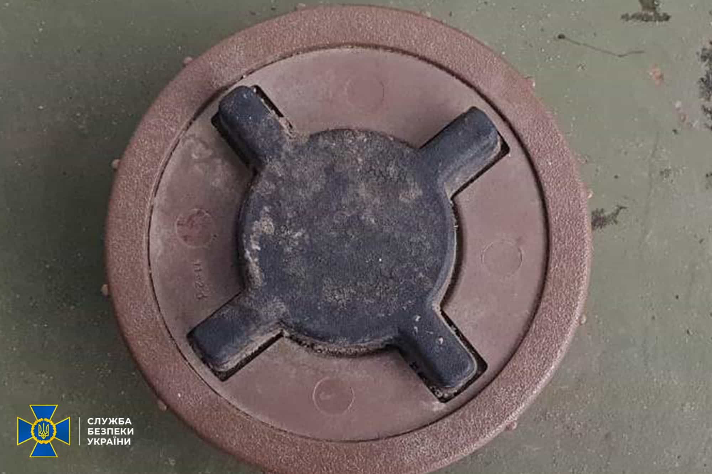

---
layout:

# Custom KB params
title: Міна фугасна ПМН-2 «Жах піхоти»
subtitle: "Міна протипіхотна фугасна ПМН"
description: "ПМН-2 - протипіхотна міна. Назва розшифровується як «протипіхотна міна натискна»."
type: kbpage

# Obsidian metadata YAML front matter params
aliases: ПМН-2, «Жах піхоти»
tags:
keywords:
cssclass:
publish: false

# VuePress 2.x Frontmatter params
lang: uk-UA
prev:
  text: Перелік
  link: /catalog/index.html
next:
  text: ПМН-4
  link: /catalog/mina-pmn4.html
---

← [Повернутись](./index.md)

# Міна ПМН-2 «Жах піхоти»

**ПМН-2** (_PMN-2_) — протипіхотна фугасна натискної дії. Руйнує та калічить ноги. За заподіяні людині важкі поранення, які практично не залишають йому шансів залишитися живими, отримала назву «Жах піхоти». Заборонена Оттавською конвенцією.

- Відстань суцільного ураження: 1 м
- Безпечна відстань: 50 м

- Реагує на натискання.
- Міна може встановлюватися як на ґрунт, так і в ґрунт, у сніг, вручну або розкладатися засобами механізації (причіпні мінні розкладники ПМР-1, ПМР-2, причіпні мінні загороджувачі ПМЗ-4), але у всіх випадках переведення міни в бойове положення здійснюється вручну.
- Маскуєтьяся, може бути встановлена перевернутою.
- Герметична і може працювати у вологому, болотистому грунті.

## Тактико-технічні характеристики

- **Корпус** - пластмаса
- **Тип** - фугасна, натискної дії
- **Маса** - 400 г
- **Габарити**- ⌀120 х 54 мм (розмір рулона скотча)
- **Чутливість** - 5-25 кг 🐐
- **Безпечна відстань** - 50 м ( 3 автобуси ) 🚌🚌🚌

::: danger Категорично забороняється:

1. Виконувати будь - які механічні , термічні та інші впливи на корпус міни або вибухника.
2. Переміщувати міни з місця їх знаходження .
3. Проводити будь - які земляні роботи поблизу з міною .
4. Намагатися викрутити будь - які комплектуючі з міни .
5. Чипати корпус міни.
6. Самостійно знешкоджувати міни .
   :::

### Зона враження

- **Радіус ураження** – 1 м
- **Спосіб встановлення**: вручну або засобами механізації
- **Час зведення**: 30 - 300 с
- **Температурний діапазон (°C)** – від -40 до +50
- **Вилученість** - ні
- **Знешкоджуваність** – ні
- **Самоліквідація** – ні
- **Гарантійний термін** – 10 років

## Історична довідка

На відміну від своєї попередниці [ПМН](./mina-pmn.md) ця ПМН-2 має механізм що працює за принципом пневматики, а не перерізання струною металоелемента. Це забезпечує меншу залежність часу переходу міни в бойове положення від температури навколишнього середовища (час зведення міни ПМН при низьких температурах доходив до 59 годин, тобто дві з половиною доби).

Друга перевага ПМН-2 в тому, що не потрібно жодних попередніх дій при підготовці міни до застосування (огляд, вигвинчування пробки, вставляння запала, і т. і.) і немає жодних елементів, якими потрібно комплектувати міну (запал). Це забезпечуло можливість користуватися міною малокваліфікованим солдатам.

Міна протипіхотна фугасна натискної дії. Призначена для виведення зі строю особового складу супротивника. Ураження людини відбувається шляхом руйнування нижньої частини ноги (стопи) при вибуху заряду міни в момент наступання ногою на індикатор цілі (чорний хрестоподібний виступ на верхній площині) міни.

Зазвичай під час вибуху міни відривається повністю стопа ноги, якою солдат наступив на міну, й, залежно від відстані, другої ноги від місця вибуху, вона також може бути сильно пошкоджена або не зазнати пошкоджень зовсім.
Крім того, ударна хвиля досить великого заряду ВР позбавляє людину свідомості, висока температура вибухових газів може завдати сильні опіки нижніх кінцівок.Смерть може наступити від больового шоку, втрати крові при несвоєчасному наданні першої допомоги.

Міна може встановлюватися як на ґрунт, так і в ґрунт, у сніг, вручну чи розкладатися засобами механізації (причіпні мінні розкладники ПМР-1, ПМР-2, причіпні мінні загороджувачі ПМЗ-4), але у всіх випадках переклад міни в бойове положення здійснюється вручну. Герметичність міни дозволяє використовувати її у водонасичених і болотистих ґрунтах. Установка мін під воду (прибережна смуга водних перешкод, броди) не допускається з огляду на її плавучість.

Термін бойової роботи міни не обмежується.

## Відео

<iframe width="560" height="315" src="https://www.youtube.com/embed/Gk6e62wSJQU" title="YouTube video player" frameborder="0" allow="accelerometer; autoplay; clipboard-write; encrypted-media; gyroscope; picture-in-picture" allowfullscreen></iframe>
<iframe width="560" height="315" src="https://www.youtube.com/embed/54m-LxnxsnQ" title="YouTube video player" frameborder="0" allow="accelerometer; autoplay; clipboard-write; encrypted-media; gyroscope; picture-in-picture" allowfullscreen></iframe>
<iframe width="560" height="315" src="https://www.youtube.com/embed/Lg5f9BXn8Uk" title="YouTube video player" frameborder="0" allow="accelerometer; autoplay; clipboard-write; encrypted-media; gyroscope; picture-in-picture" allowfullscreen></iframe>

## Зображення

::: gallery

- 
- 
- 
- 
- 
-
- 
- 
- 
- 
- 
- 
- :::

#### Інформаційні джерела

1. Матеріал з Вікіпедії [ПМН-2](https://uk.wikipedia.org/wiki/%D0%9F%D0%9C%D0%9D-2)
2. [На Луганщині виявили російські протипіхотні міни, заборонені Оттавською конвенцією](https://armyinform.com.ua/2021/03/17/na-luganshhyni-vyyavyly-rosijski-protypihotni-miny-zaboroneni-ottavskoyu-konvencziyeyu/)
3. [Російські окупанти встановили мінні пастки для комунальників та місцевих біля дороги загального призначення](https://diana-mihailova.livejournal.com/4465548.html)
4. [Зафіксоване використання від «психологічних» до заборонених Оттавською конвенцією мін.](https://zn.ua/ukr/UKRAINE/jaki-same-mini-vkljuchajuchi-zaboroneni-vikoristovuje-rf-u-vijni-z-ukrajinoju-ekspert.html)
5. [Заборонені міни з Росії долучено до справи з порушення законів та звичаїв війни](https://mil.in.ua/uk/news/zaboroneni-miny-z-rosiyi-dolucheno-do-spravy-z-porushennya-zakoniv-ta-zvychayiv-vijny/)
6. [ДСНС інформує про вибухонебезпечні предмети, яких варто остерігатися](https://mil.in.ua/uk/news/dsns-informuye-pro-vybuhonebezpechni-predmety-yakyh-varto-osterigatysya/)
7. [Військові знешкодили в Мар'їнці сорок заборонених мін, розставлених бойовиками](https://texty.org.ua/fragments/94468/Vijskovi_zneshkodyly_v_Marjinci_sorok_zaboronenyh_min-94468/)
8. [PMN-2 Landmine](https://cat-uxo.com/explosive-hazards/landmines/pmn-2-landmine)
