← [Повернутись](./index.md)

# Міна ПМН-4
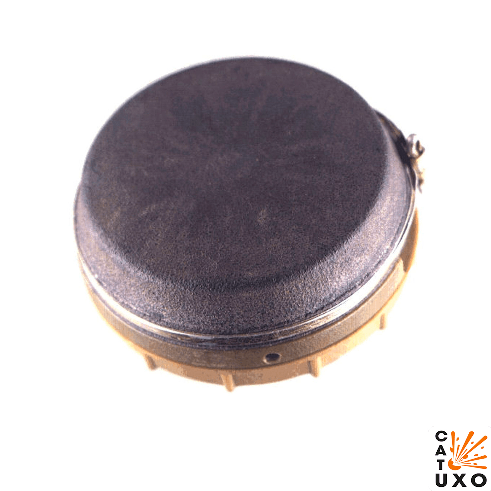
**ПМН-4** _(PMN-4)_ – російська протипіхотна міна натискної дії, прийнята на озброєння на початку 1990-х років. Заборонена Оттавською конвенцією.

- Відстань суцільного ураження: 1 м
- Безпечна відстань: 50 метрів

- Реагує на натискання.
- Міна може встановлюватися вручну як на ґрунт, так і в ґрунт, у сніг.
- Маскуєтьяся, може бути встановлена перевернутою.
- Герметична і може працювати у вологому, болотистому грунті на бродах.

## Тактико-технічні характеристики

- **Корпус** - пластмаса
- **Тип** - фугасна, натискної дії
- **Маса** - 300 г
- **Габарити**- ⌀95 х 42 мм (розмір рулона скотча) 
- **Чутливість** - 5-15 кг 🐐
- **Безпечна відстань** - 50 м ( 5 автобусів ) 🚌🚌🚌🚌🚌

::: danger Категорично забороняється:
1. Виконувати будь - які механічні , термічні та інші впливи на корпус міни або вибухника. 
2. Переміщувати міни з місця їх знаходження . 
3. Проводити будь - які земляні роботи поблизу з міною . 
4. Намагатися викрутити будь - які комплектуючі з міни . 
5. Чипати корпус міни. 
6. Самостійно знешкоджувати міни . 
:::

### Зона враження

- **Радіус  ураження** – 1 м
- **Спосіб встановлення**: вручну або засобами механізації
- **Час зведення**: 1 - 40 хв. 
- **Температурний діапазон (°C)** – від -40 до +50
- **Видобуваність** - ні
- **Знешкоджуваність** – ні
- **Самоліквідація** – ні
- **Гарантійний термін** – 10 років

## Історична довідка

Міна протипіхотна фугасна натискної дії. Прийнята на озброєння у 1990 році як заміна мін ПМН та ПМН-2.
Встановлюється виключно вручну.

Міна ПМН-4 є останньою у лінійці моделей ПМН. Від попередніх моделей візуально відрізняється помітно меншими габаритними розмірами. Корпус герметичний, пластмасовий циліндричний. Зверху корпус закритий гумовим ковпаком, що кріпиться до нього за допомогою сталевого хомута. 

Міна протипіхотна фугасна натискної дії. Призначена для виведення зі строю особового складу супротивника. Ураження людини відбувається шляхом руйнування нижньої частини ноги (стопи) при вибуху заряду міни в момент наступання ногою на попверхню міни (датчиком є вся поверхня).

Зазвичай під час вибуху міни відривається повністю стопа ноги, якою солдат наступив на міну, й, залежно від відстані, другої ноги від місця вибуху, вона також може бути сильно пошкоджена або не зазнати пошкоджень зовсім.
Крім того, ударна хвиля досить великого заряду ВР позбавляє людину свідомості, висока температура вибухових газів може завдати сильні опіки нижніх кінцівок.Смерть може наступити від больового шоку, втрати крові при несвоєчасному наданні першої допомоги.

Термін бойової роботи міни не обмежується.
Особливості конструкції виключають зворотне переведення міни з бойового в безпечне положення. Тому міна відноситься до категорії не знешкоджуваних.

## Зображення

::: gallery
- 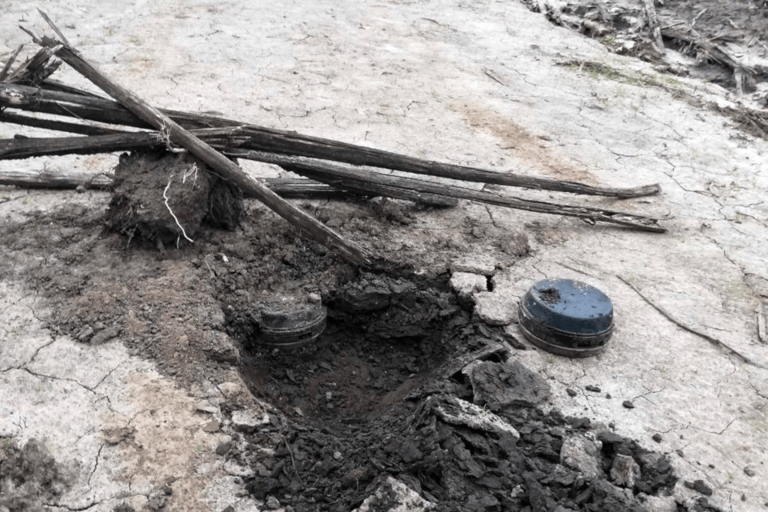
- 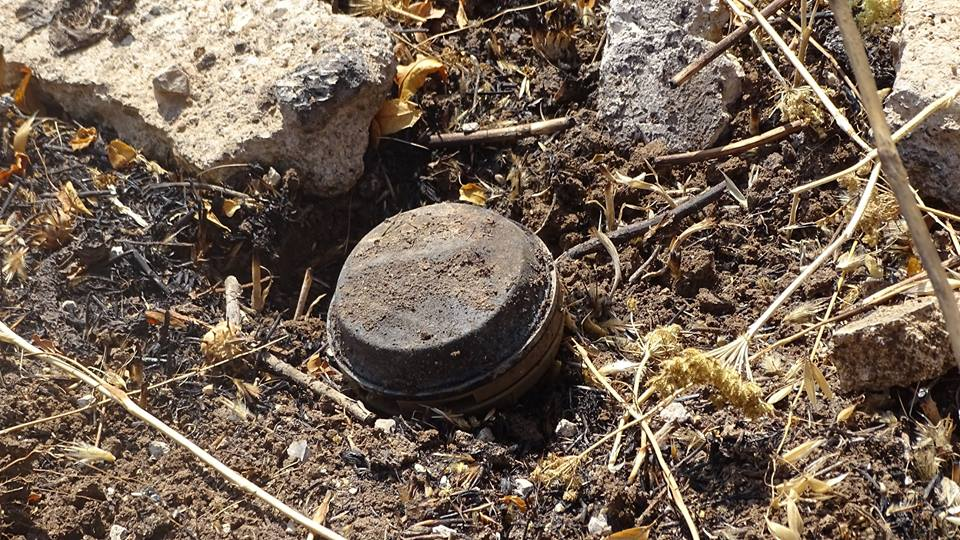
- 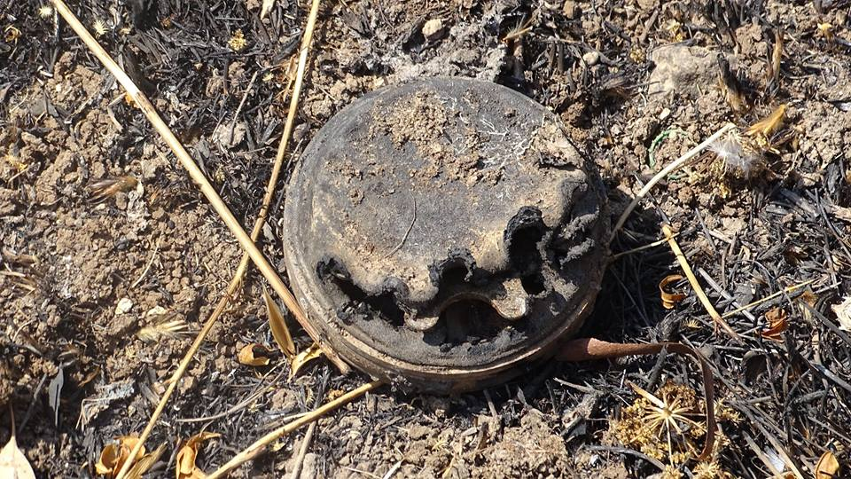
- 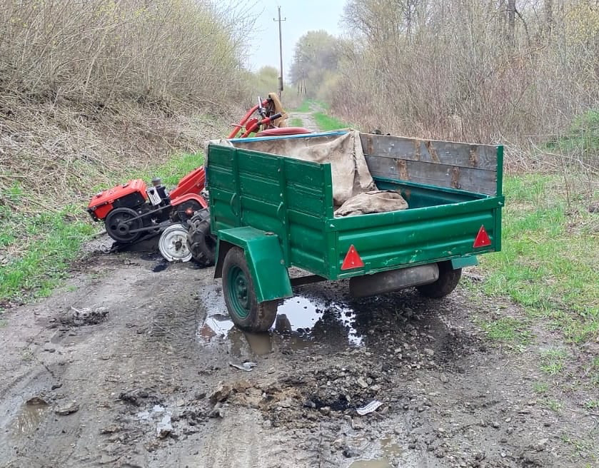
- 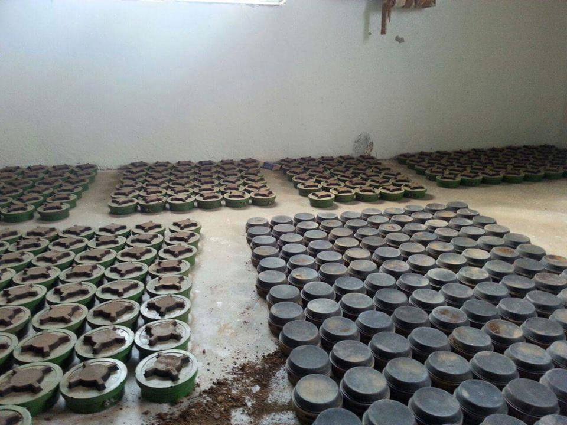
- 
- 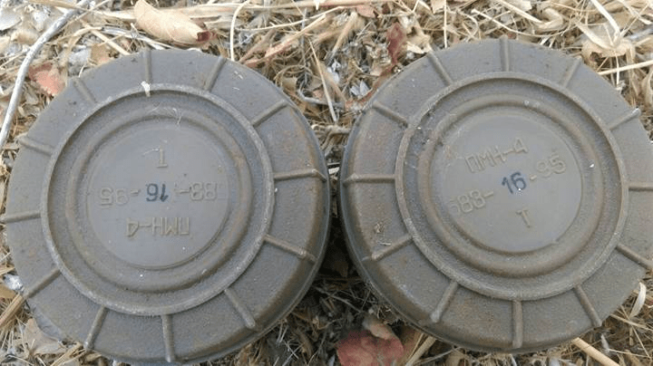
- 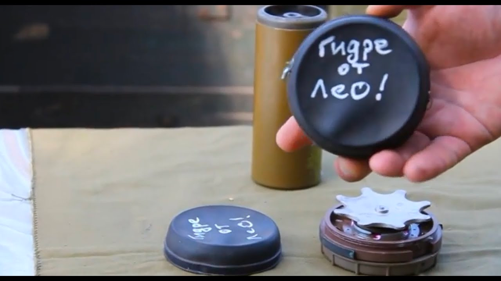
- 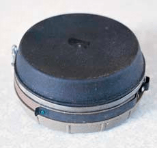 
- 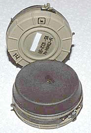
- 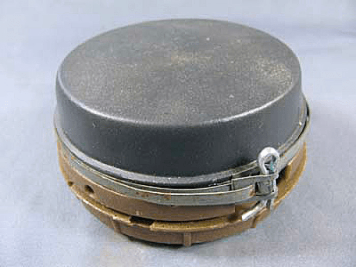
- 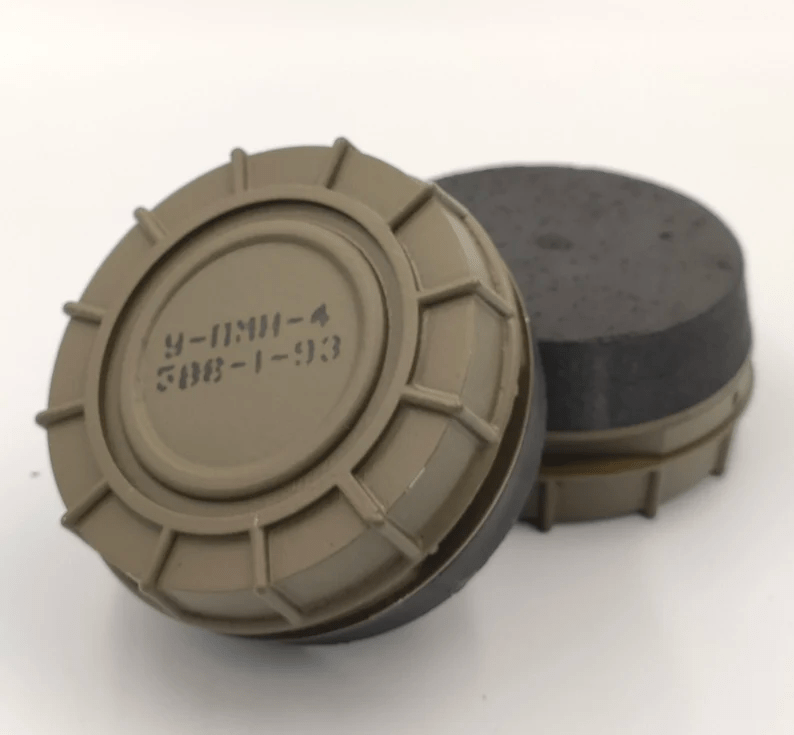
- 
:::

#### Інформаційні джерела

1. [На Сумщині вибухотехніки знешкодили кілька протипіхотних мін](https://sumypost.com/sumynews/bezpeka/na-sumshhyni-vybuhotehniky-zneshkodyly-kilka-protypihotnyh-min/)
2. [Мины ПМН-2 и ПМН-4 в Сирии](https://imp-navigator.livejournal.com/368140.html)
3. [Поліція Сумщини нагадує громадянам про небезпеку замінованих територій](https://www.facebook.com/policesumy/posts/316074153971170)