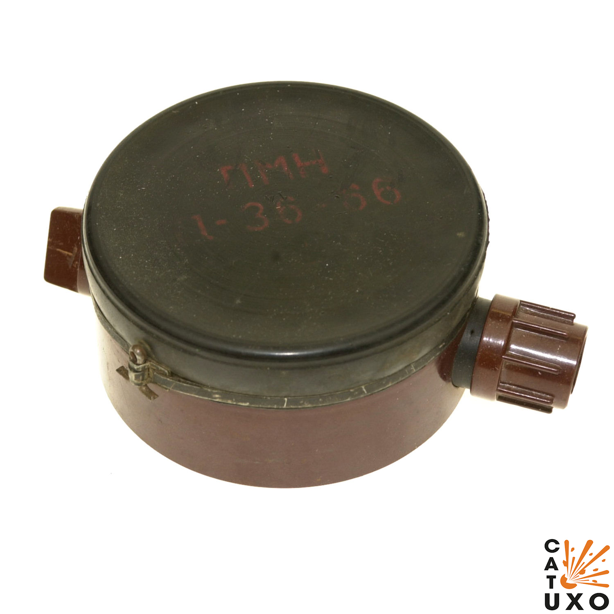
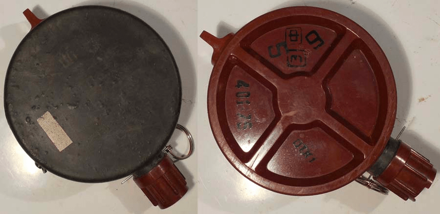
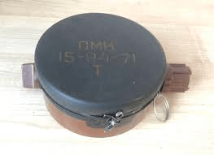
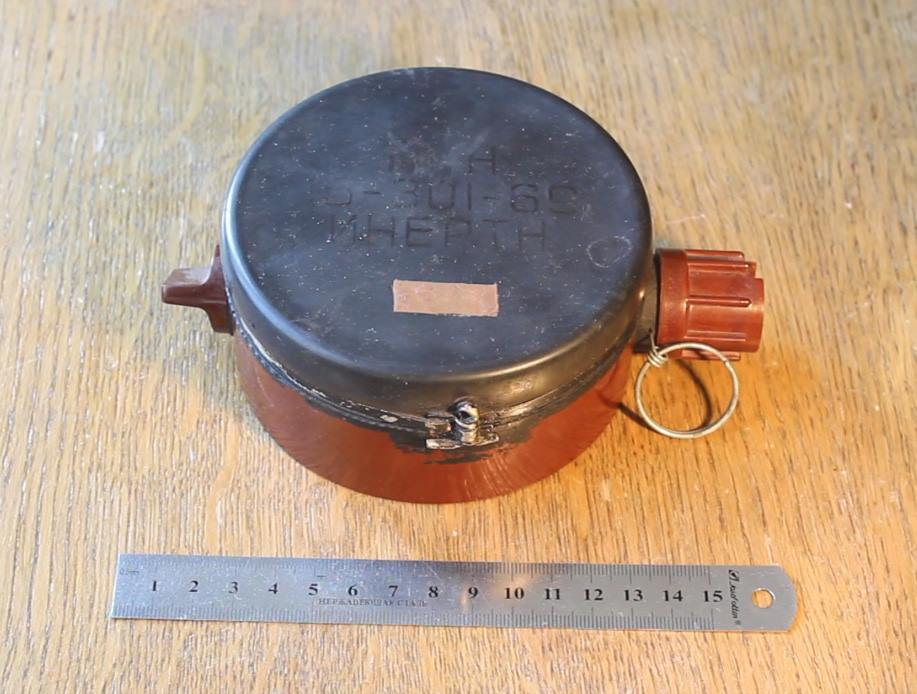
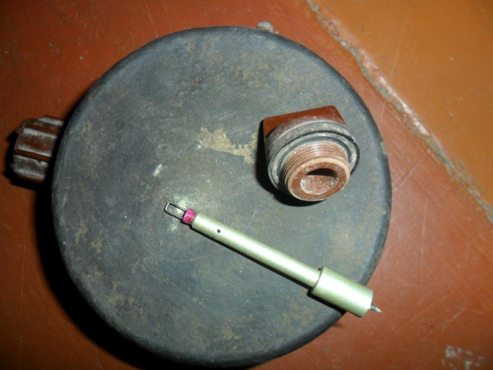
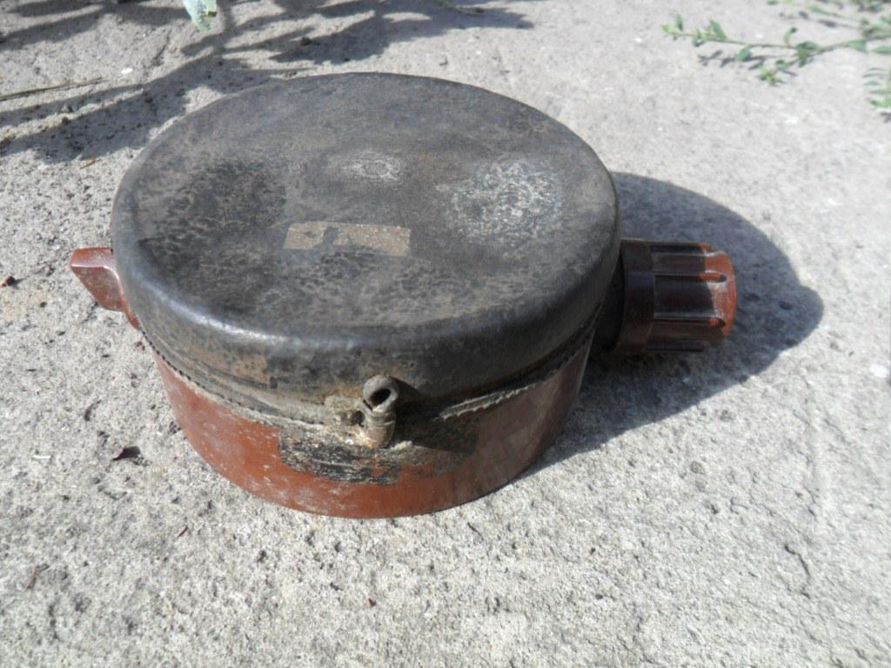

← [Повернутись](./index.md)

# Протипіхотна міна натискна ПМН «Чорна вдова»

**ПМН** - протипіхотна фугасна натискної дії. Назва розшифровується як «протипіхотна міна натискна». За заподіяні людині важкі поранення, які практично не залишають йому шансів залишитися живими, на Заході отримала назву «Чорна вдова». Заборонена Оттавською конвенцією.

- Відстань суцільного ураження: 1 м
- Безпечна відстань: 50 метрів

- Реагує на натискання.
- Міна може встановлюватися як на ґрунт, так і в ґрунт, у сніг, вручну або розкладатися засобами механізації (причіпні мінні розкладники ПМР-1, ПМР-2, причіпні мінні загороджувачі ПМЗ-4), але у всіх випадках переведення міни в бойове положення здійснюється вручну.

## Тактико-технічні характеристики

- **Корпус** - пластмаса
- **Тип** - фугасна, натискної дії
- **Маса** - 550 г
- **Габарити**- ⌀110 х 53 мм (розмір рулона скотча) 
- **Чутливість** - 8-25 кг 🐐
- **Безпечна відстань** - 50 м ( 5 автобусів ) 🚌🚌🚌🚌🚌

::: danger Категорично забороняється:
1. Виконувати будь - які механічні , термічні та інші впливи на корпус міни або вибухника. 
2. Переміщувати міни з місця їх знаходження . 
3. Проводити будь - які земляні роботи поблизу з міною . 
4. Намагатися викрутити будь - які комплектуючі з міни . 
5. Чипати корпус міни. 
6. Самостійно знешкоджувати міни . 
:::

### Зона враження

- **Радіус  ураження** – 1 м
- **Спосіб встановлення**: вручну або засобами механізації
- **Температурний діапазон (°C)** – від -40 до +50
- **Видобуваність** - ні
- **Знешкоджуваність** – ні
- **Самоліквідація** – ні
- **Гарантійний термін** – 10 років

## Історична довідка

Була розроблена у СРСР. Прийнята на озброєння радянської армії у 1950 році. В даний час досі перебуває на озброєнні армії РФ та багатьох країн СНД.

Міна вибухає в момент наступу ногою на натискну кришку міни. Руйнується нижня частини ноги. Жартівна солдатська розшифровка назви «принесіть мені ноги», що характеризує тяжкість типових поранень у результаті підриву на ній.

Зазвичай при вибуху міни повністю відривається стопа ноги, якою солдат наступив на міну, і, залежно від відстані, другої ноги від місця вибуху, вона також може бути значно пошкоджена або не отримати пошкодження зовсім.

Крім того, ударна хвиля заряду вибухової речовини позбавляє людину свідомості, висока температура вибухових газів може завдати значних опіків нижнім кінцівкам. Смерть може наступити від больового шоку, втрати крові при несвоєчасному наданні першої допомоги.

Ця міна крім СРСР, вироблялася в багатьох країнах світу, включаючи Угорщину. Експортувалася до різних країн світу і широко застосовувалася у збройних конфліктах. З 1963 року вироблялася у Китаї під індексом "міна типу 58".

За заподіяні людині під час вибуху важкі поранення, які практично не залишають йому шансів залишитися живими, на Заході отримала назву «Чорна вдова». 

## Відео

<iframe width="560" height="315" src="https://www.youtube.com/embed/Gk6e62wSJQU" title="YouTube video player" frameborder="0" allow="accelerometer; autoplay; clipboard-write; encrypted-media; gyroscope; picture-in-picture" allowfullscreen></iframe>

## Зображення

::: gallery
- 
-  
- 
- 
- 
- 
- 
- 
:::

#### Інформаційні джерела

1. [Мінна зброя на сході України: призначення та її класифікація](https://acmc.ua/minna-zbroya-na-shodi-ukrayini/)
2. [PMN Landmine](https://cat-uxo.com/explosive-hazards/landmines/pmn-landmine)

