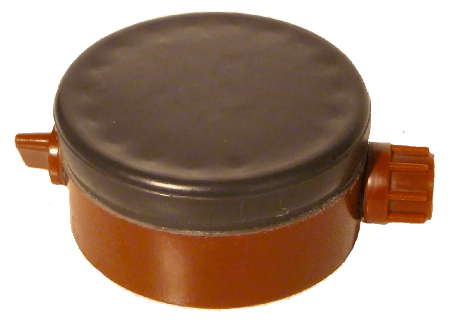

← [Повернутись](./index.md)

# Противопехотная мина ПМН

 

Мина противопехотная фугасная нажимного действия. Предназначена для выведения из строя личного состава противника. Поражение человеку наносится за счет разрушения нижней части ноги (стопы) при взрыве заряда мины в момент наступания ногой на нажимную крышку мины. Обычно при взрыве мины отрывается полностью стопа ноги, которой солдат противника наступил на мину, и, в зависимости от расстояния, второй ноги от места взрыва, она также может быть значительно повреждена или не получить повреждения вовсе. Кроме того, ударная волна достаточно большого заряда ВВ лишает человека сознания, высокая температура взрывных газов может причинить значительные ожоги нижним конечностям. Смерть может наступить от  болевого шока, потери крови при несвоевременном оказании первой помощи.

Мина может устанавливаться как на грунт, так и в грунт, в снег,  вручную или раскладываться средствами механизации (прицепные минные раскладчики ПМР-1, ПМР-2, прицепные минные заградители ПМЗ-4), но во всех случаях перевод мины в боевое положение осуществляется вручную.

## Тактико-технические характеристики мины ПМН
Тип мины: противопехотная фугасная нажимного   действия
Корпус: пластмасса
Масса: 550 гр.
Маса заряда ВВ (тротил): 200 гр.
Диаметр: 11 см.
Высота: 5.3см.
Тип датчика цели: нажимной
Диаметр датчика цели: около 5.1 см.
Усилие срабатывания: 8-25 кг.
Температурный диапазон применения: -40 - +50 град.
Применяемый взрыватель: встроенный
Запал: МД-9
Извлекаемость: не разрешается
Обезвреживаемость: не разрешается
Самоликвидация/самонейтрализация: нет/нет
Срок боевой работы: не определялся

---------
Sources:

Links:

