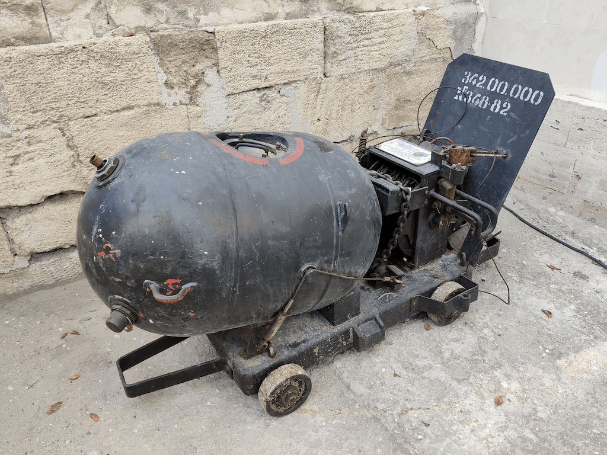
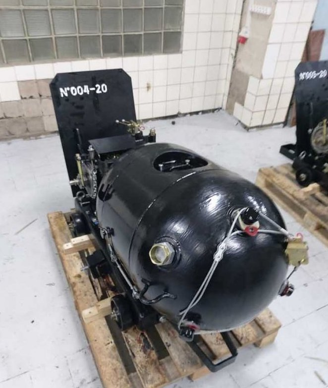
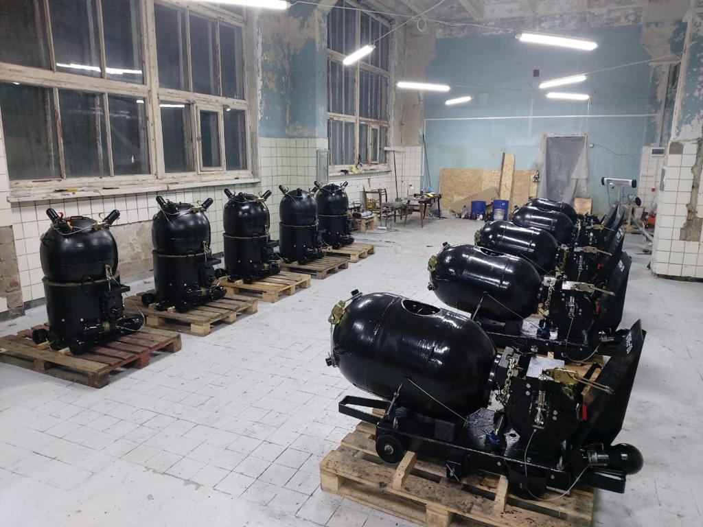

---
# Custom KB params
title: Корабельна протидесантна міна КПМ
subtitle: "Корабельна протидесантна міна КПМ"
description: "Корабельна протидесантна міна КПМ"

# Obsidian metadata YAML front matter params
aliases: КПМ
tags:
keywords:
cssclass:
publish: false

# VuePress 2.x Frontmatter params
lang: uk-UA
prev:
  text: МЯМ
  link: /catalog/mine-myam.html
next:
  text: ПДМ-1М
  link: /catalog/mina-pdm-1m.html
---

← [Повернутись](./index.md)

# Корабельна протидесантна міна КПМ

**КПМ** – радянська міна донного типу для підриву морських десантно-висадкових засобів. Застосовується в прибережній зоні річок, озер, морів, заток. 

- Відстань суцільного ураження: 20 м
- Безпечна відстань: 100 м

- Міну встановлюють під водою на глибині від 5 до 20 м на якір. Можуть регулювати глибину довжиною ланцюга якіря. 
- Вибухає при спрацюванні одного з 3-х электроударных висувних замикачів.
- Міна автоматично встановлюється на задане поглиблення з пристроями самоліквідації при спробі роззброєння.
- Більшість мін, які були виявлені біля узбережжя Одещини у 2022 році, становили міни, зірвані штормами з якорів. Під впливом течії та вітрів їх виносило на мілководдя або безпосередньо викидало на берег.  

## Тактико-технічні характеристики

- **Корпус** - метал
- **Тип** -  якірна контактної дії
- **Маса** - 360 кг
- **Діаметр** – 531 мм
- **Габарити** – 770х770х1450 мм
- **Стійкість до шторму** – 6 балів.
- **Чутливість** - 40-50 кг 🚤
- **Безпечна відстань** - 100 м ( 4 вагони) 🚃🚃🚃🚃

::: danger Категорично забороняється:

1. Виконувати будь - які механічні , термічні та інші впливи на корпус міни або вибухника.
2. Переміщувати міни з місця їх знаходження .
3. Проводити будь - які земляні роботи поблизу з міною .
4. Намагатися викрутити будь - які комплектуючі з міни .
5. Чипати корпус міни.
6. Самостійно знешкоджувати міни .

:::

### Зона враження

- **Радіус ураження** – 20 м
- **Спосіб встановлення**: з плавального засобу
- **Температурний діапазон (°C)** – від 0 до +30 °C.
- **Вилученість** - ні
- **Знешкоджуваність** – ні
- **Самоліквідація / самонейтралізація** – так/ні

## Історична довідка

Міну спроектовано в СКБ ім. Куйбишева, головний архітектор – А.Г. Воробйов. Міна проектувалася з огляду на досвід війни в Кореї (1950-1953), коли через відсутність великотоннажних кораблів – постановників мін КНДР не могла ставити важкі М-26 та КБ.

Корпус міни сфероциліндричної форми лежить на якорі. У верхній частині корпусу розміщено 4 горловини: одна для запобіжного приладу, 3 – для підривників. На циліндричній частині корпусу є велика горловина для встановлення приладів та запального пристрою. На нижній півкулі розташована заливальна горловина. Для підвищення живучості та тралостійкості використаний ланцюговий мінреп.

## Відео

## Зображення

::: gallery

- 
- 
:::

#### Інформаційні джерела

1. [Мінна небезпека в Чорному морі залишається високою](https://armyinform.com.ua/2022/08/23/minna-nebezpeka-v-chornomu-mori-zalyshayetsya-vysokoyu/)
2. [ВМСУ отримали партію відновлених морських мін](https://www.ukrmilitary.com/2020/11/mines.html)
3. [Морські міни на озброєнні ЗСУ: Чому Росія боїться за свої кораблі у Чорному та Азовському морях](https://www.depo.ua/rus/war/morski-mini-na-ozbroenni-zsu-chomu-rosiya-boitsya-za-svoi-korabli-u-chornomu-ta-azovskomu-moryakh-202109171368981)

