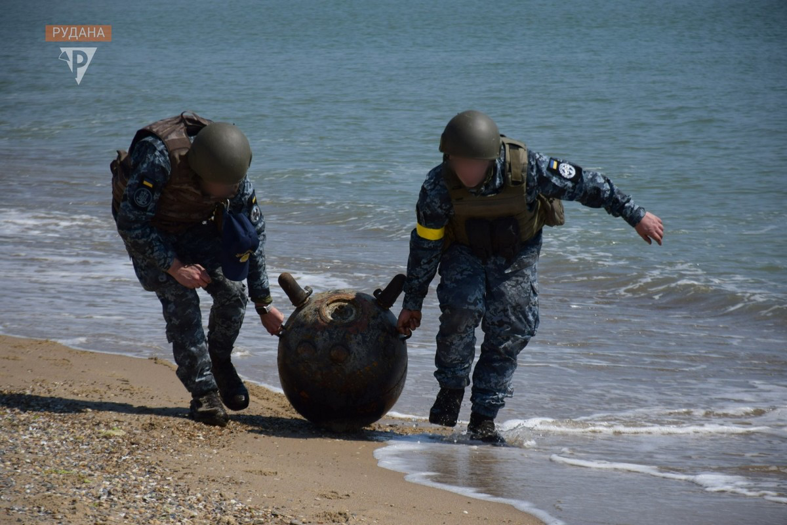
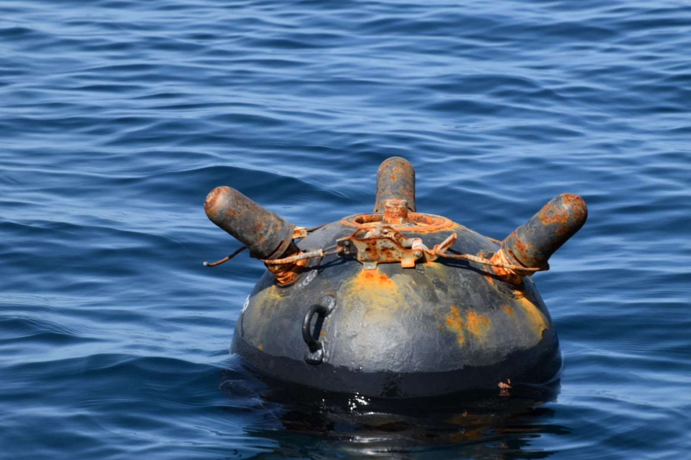
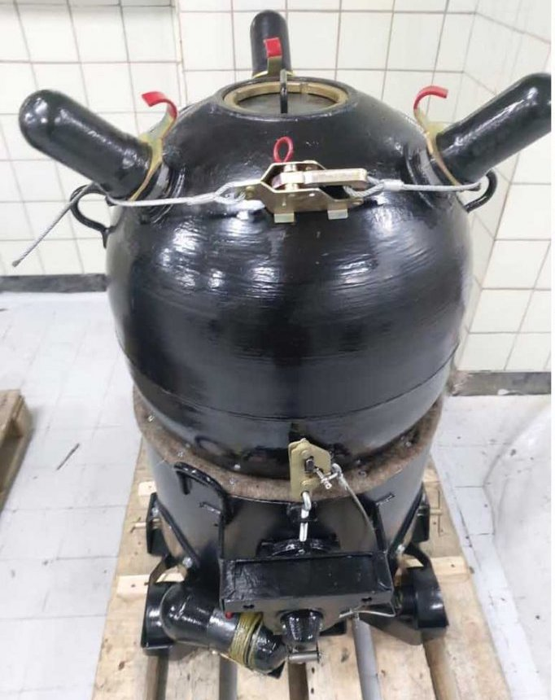
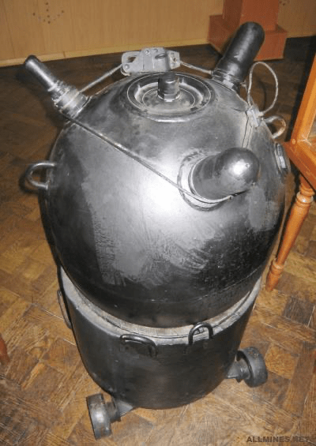
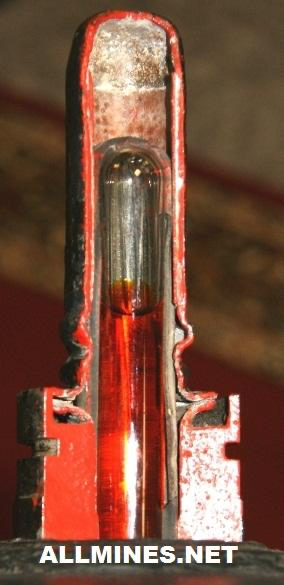
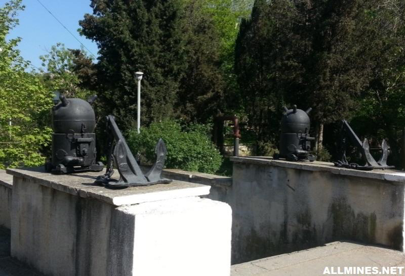
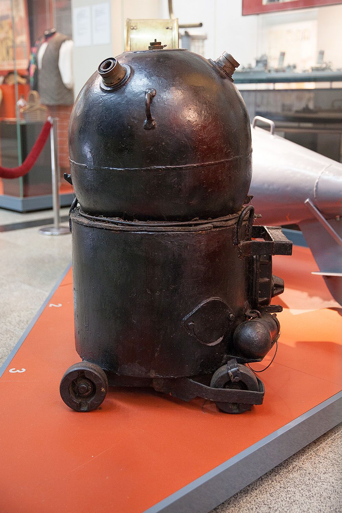
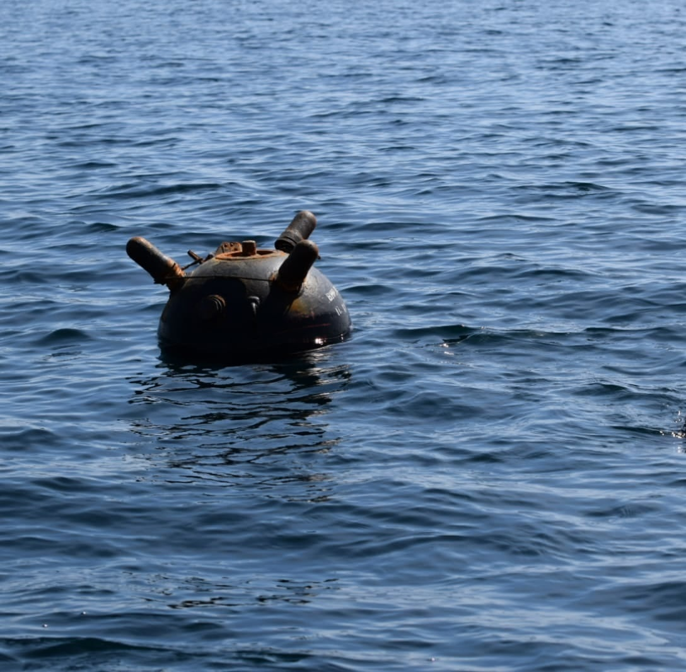
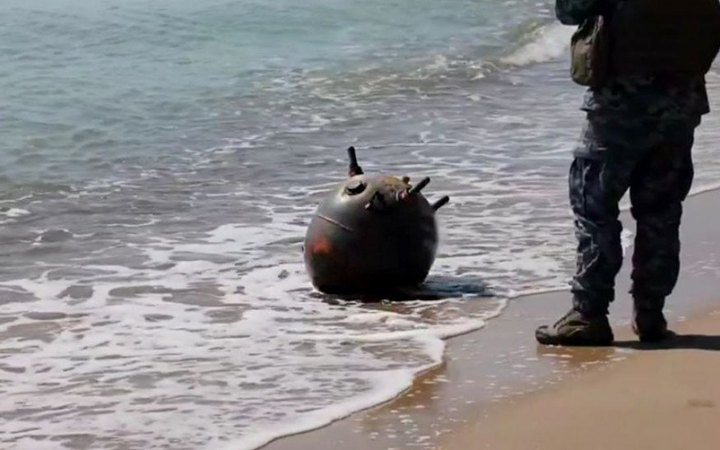

---
# Custom KB params
title: Морська якорна мала міна МЯМ
subtitle: "Морська якорна мала міна МЯМ"
description: "Морська якорна мала міна МЯМ"

# Obsidian metadata YAML front matter params
aliases: МЯМ
tags:
keywords:
cssclass:
publish: false

# VuePress 2.x Frontmatter params
lang: uk-UA
prev:
  text: Перелік
  link: /catalog/index.html
next:
  text: KPМ
  link: /catalog/mine-kpm.html
---

← [Повернутись](./index.md)

# Морська якірна мала міна МЯМ

**МЯМ** – морська якорна мала міна донного типу, призначена для виведення з ладу малих кораблів та катерів. Застосовується в прибережній зоні річок, озер, морів, заток.

- Відстань суцільного ураження: 10 м
- Безпечна відстань: 50 м

- Міну встановлюють під водою на глибині від 2,5 до 50 м на якір. Можуть регулювати глибину довжиною ланцюга якіря. 
- Вибухає при розбитті скляного гальваноударного дачику.
- Більшість мін, які були виявлені біля узбережжя Одещини у 2022 році, становили міни, зірвані штормами з якорів. Під впливом течії та вітрів їх виносило на мілководдя або безпосередньо викидало на берег.  

## Тактико-технічні характеристики

- **Корпус** - метал
- **Тип** -  якірна контактної дії
- **Маса** - 168-175 кг
- **Діаметр** – 533 мм
- **Габарити** – 580х680x980 мм
- **Стійкість до шторму** – 6 балів.
- **Безпечна відстань** - 50 м ( 5 автобусів ) 🚌🚌🚌🚌🚌

::: danger Категорично забороняється:

1. Виконувати будь - які механічні , термічні та інші впливи на корпус міни або вибухника.
2. Переміщувати міни з місця їх знаходження .
3. Проводити будь - які земляні роботи поблизу з міною .
4. Намагатися викрутити будь - які комплектуючі з міни .
5. Чипати корпус міни.
6. Самостійно знешкоджувати міни .

:::

### Зона враження

- **Радіус ураження** – 10 м
- **Спосіб встановлення**: з плавального засобу
- **Глибина встановлення** – 2,5-50 м
- **Температурний діапазон (°C)** – від 0 до +30 °C
- **Вилученість** - ні
- **Знешкоджуваність** – ні
- **Самоліквідація / самонейтралізація** – ні.

## Історична довідка
Мала якірна міна (МЯМ) прийнята на озброєння в 1943 році, використовувалась у Другій світовій війні та під час війни в Кореї (1950-1953).
Бойові дії у другій світовій війні катерних сил Балтійського флоту СРСР у східній частині Фінської затоки виявили необхідність створення міни проти торпедних катерів супротивника. 
У зв'язку з цим у 1942 р. фахівці мінно-торпедного відділу Кронштадтського морського оборонного району та мінери Кронштадтських майстерень у короткий термін спроектували та виготовили близько 40 одиниць протикатерних мін ПМ-1. 
У 1943 р. для повноцінного вирішення цього завдання колективом ЦКЛ-36 була розроблена і прийнята на озброєння флоту корабельна якірна мала морська гальваноударна міна ЯМ (або МЯМ - мала якірна міна). Головний конструктор – П. І. Нирковский. Міна серійно випускалася із 1944 р.
Використовуються гальваноударні ковпаки та запобіжний прилад, що застосовуються у старій міні Р-1. Для утримування запобіжних чавунних ковпаків використовуються цукрові кріплення від мін зр. 1908 р. При глибині моря менше 2,5 м міна ставиться або за виміряною глибиною із застопореною юшкою, або як донна (без відділення від якоря).

## Відео

<iframe width="560" height="315" src="https://www.youtube.com/embed/K0MK25ZH9R0" title="YouTube video player" frameborder="0" allow="accelerometer; autoplay; clipboard-write; encrypted-media; gyroscope; picture-in-picture" allowfullscreen></iframe>

<iframe width="560" height="315" src="https://www.youtube.com/embed/VqyikdpO_EU" title="YouTube video player" frameborder="0" allow="accelerometer; autoplay; clipboard-write; encrypted-media; gyroscope; picture-in-picture" allowfullscreen></iframe>

## Зображення

::: gallery

- 
- 
- 
- 
- 
- 
-   
- 
- 
- 
- 

:::

#### Інформаційні джерела

1. [Мінна небезпека в Чорному морі залишається високою](https://armyinform.com.ua/2022/08/23/minna-nebezpeka-v-chornomu-mori-zalyshayetsya-vysokoyu/)
2. [Росія використовує у Чорному морі міни захоплені в Севастополі у 2014 році – МЗС](https://mil.in.ua/uk/news/rosiya-vykorystovuye-u-chornomu-mori-miny-zahopleni-v-sevastopoli-v-2014-rotsi-mzs/)
3. [PDM-2 Seamine](https://cat-uxo.com/explosive-hazards/landmines/pdm-2-seamine)
4. [Морская якорная малая мина МЯМ](https://allmines.net/catalog/russia/mines/myam/)
5. [ВМСУ отримали партію відновлених морських мін](https://www.ukrmilitary.com/2020/11/mines.html)
6. [Морські міни на озброєнні ЗСУ: Чому Росія боїться за свої кораблі у Чорному та Азовському морях](https://www.depo.ua/rus/war/morski-mini-na-ozbroenni-zsu-chomu-rosiya-boitsya-za-svoi-korabli-u-chornomu-ta-azovskomu-moryakh-202109171368981)
