---
# Custom KB params
title: ТМ62 міна протитанкова протигусенична
subtitle: "ТМ62 міна протитанкова протигусенична"
description: "ТМ62 міна протитанкова протигусенична"

# Obsidian metadata YAML front matter params
aliases: ТМ-62
tags:
keywords:
cssclass:
publish: false

# VuePress 2.x Frontmatter params
lang: uk-UA
prev:
  text: МЯМ
  link: /catalog/mine-myam.html
next:
  text: ПДМ-1М
  link: /catalog/mina-pdm-1m.html
---

← [Повернутись](./index.md)

# Противотанкова міна ТМ62

ТМ62 - радянська противотанкова міна у формі плоскої круглої металевої коробки. Усередині коробки міститься заряд вибухівки, а зверху встановлюєтся підривник. 
Це наймасовіша протитанкова міна, яка призначена для пошкодження гусениць бронетехніки.  

- Відстань суцільного ураження: 20 м
- Безпечна відстань: 150 м

Найпотужніша за вибуховою силою радянська протитанкова міна, при вазі в 10 кг містить 7,5 кг тротилу.  
Спрацьовує при зусиллі 150-550 кг, але при пригниванні корпусу зусилля може зменшитись і до 10-15 кг.  
У танка перебиває гусениці, руйнує катки, призводить до контузій екіпажу.  
При наїзді трактор відлітає на кілька метрів, а цивільна машина перетворюється на понівечену бляшанку.  
Засобів самоліквідації немає, то ж строк бойової роботи складає десятки років, навіть при прогниванні корпусу.  
Засобів невилучаємості теж не має але це легко вправляють **закладаючи під неї міну-сюрприз, чи банально гранату без чеки**.  
Ставиться на ґрунт, в ґрунт, в сніг, під воду, вручну та засобами мінування, навіть з гелікоптера.
  
Може використовуватись з 8 штатними і купою нештатних детонаторів, має 7 модифікацій у різних корпусах,  
таких як пластик, бакеліт, тканина, дерево, картон, для того щоб ускладнити пошук металодетектором,та підвищити стійкість до корозії.  
  
Застосовується у найрізноманітніші способи, по 3 штуки вертикально, збираються фугаси, підсилюється іншими зарядами, та різноманітною шрапнеллю, наприклад мішками з відсівом,муже бути дистанційно підірвана чи поставлена на розтяжку або пастку.  
Є головною та базовою моделлю у сімействі мін ТМ-62  
  
Застосовується по всьому світу, а у нашій війні з обох боків.  
На жаль наші бійці стикаються з ними регулярно, і найнеприємніше коли їх приносять ДРГ з того боку,та старанно маскують на фронтових дорогах.

## Тактико-технічні характеристики

- **Корпус** - метал
- **Тип** - протигусенична
- **Маса** - 9.5-10 кг
- **Діаметр** – 32 см
- **Висота** – 12.8 см (з пілдривником МВ-62) - 100.2 см (з підривником МВШ-62)
- **Діаметр датчика цілі** – 9см
- **Габарити** – 770х770х1450 мм
- **Стійкість до шторму** – 6 балів.
- **Чутливість** - 150-500 кг 🚗 . При пригниванні корпусу зусилля може зменшитись і **до 10-15 кг!**
- **Температурний діапазон (°C)** – від -60 до +60 °C.
- **Вилученість** - ні
- **Знешкоджуваність** – ні
- **Самоліквідація / самонейтралізація** – так/ні

### Зона враження

- **Радіус ураження** – 20 м (2 автобуси) 🚌🚌
- **Безпечна відстань** - 150 м ( 6 вагонів) 🚃🚃🚃🚃🚃🚃

::: danger Категорично забороняється:

1. Виконувати будь - які механічні , термічні та інші впливи на корпус міни або вибухника.
2. Переміщувати міни з місця їх знаходження .
3. Проводити будь - які земляні роботи поблизу з міною .
4. Намагатися викрутити будь - які комплектуючі з міни .
5. Чипати корпус міни.
6. Самостійно знешкоджувати міни .

:::

## Історична довідка

ТМ-62 — клас радянських противотанкових мін, розроблений як наступник ТМ-57.
Протитанкова міна, зразка 1962-го року у металевому корпусі. 
Міна ТМ-62М є головною базовою моделлю сімейства ТМ-62, які розрізняються між собою матеріалом і формою корпусу, та вибухово-ваговими характеристиками. До цього класу крім ТМ-62М, входять ТМ-62П, ТМ-62П2, ТМ-62П3, ТМ-62Т, ТМ-62Д та ТМ-62Б. 

При наїзді гусениці (колеса) на підривник міни відбувається вибух. Ураження завдається за рахунок руйнування їх ходової частини.

Міна за вибухово-ваговими даними є наймогутнішою з усіх радянських протигусеничних мін. При підриві під ціллю типу „танк” ходова частина зазнає таких пошкоджень, після яких техніка не підлягає відновленню. Різноманітні типи підривників розширювали можливості самої міни. Проте міна ТМ-62М не вдалося повністю замінити міну ТМ-57. ТМ-62М виявилася важчою за попередницю, її датчик цілі був менший за натискну кришку міни ТМ-57, що зменшувало ймовірність наїзду танка на міну. На відміну від ТМ-57, ТМ-62М не має додаткового вічка для встановлення підривника протиздобуваності.

Міни ТМ-62М укладаються в дерев'яні ящики по 4 шт. Вага ящика 60 кг. Підривники перевозяться у власному закупорюванні. Проте міни можуть перевозитися в своєму штатному закупорюванні остаточно спорядженими, тобто з угвинченими підривниками.

#### Модифікації

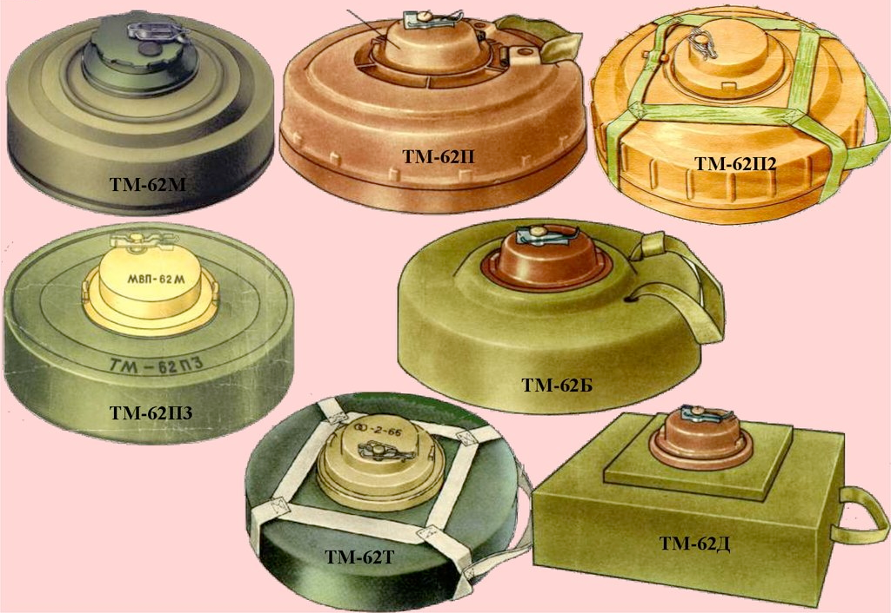

ТМ-62М — Круглий металевий корпус. Найбільш широко використовується з-поміж інших ТМ-62.
ТМ-62П3 — Корпус з поліетилену.
ТМ-62Т — Корпус з капронової тканини.
ТМ-62П2 — Корпус з пластмаси.
ТМ-62П — Корпус з пластмаси.
ТМ-64Д — Корпус з дерева.
ТМ-62Б — (Без корпуса) корпус з картону або паперу.

## Відео

<iframe width="560" height="315" src="https://www.youtube.com/embed/OiHE9V3U40Q" title="YouTube video player" frameborder="0" allow="accelerometer; autoplay; clipboard-write; encrypted-media; gyroscope; picture-in-picture; web-share" allowfullscreen></iframe>

<iframe width="560" height="315" src="https://www.youtube.com/embed/C61ZI1VbVU8" title="YouTube video player" frameborder="0" allow="accelerometer; autoplay; clipboard-write; encrypted-media; gyroscope; picture-in-picture; web-share" allowfullscreen></iframe>

## Зображення

::: gallery

- 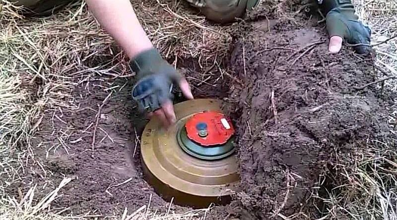
- 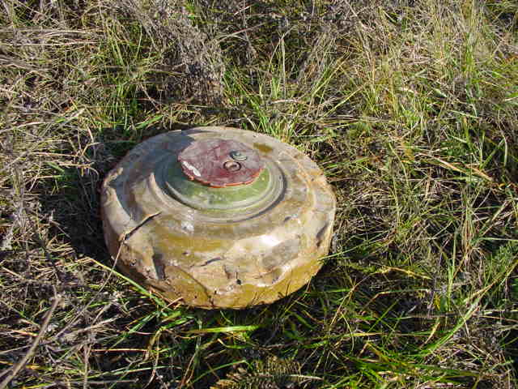
- 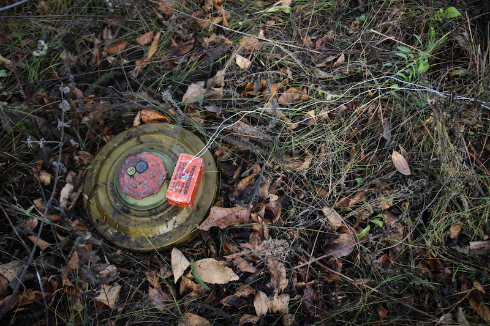
- 
- 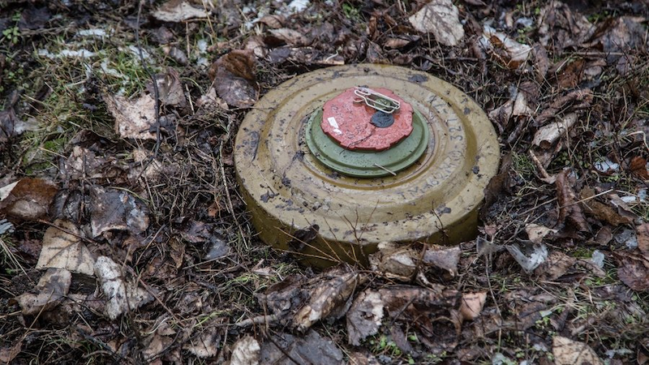
- 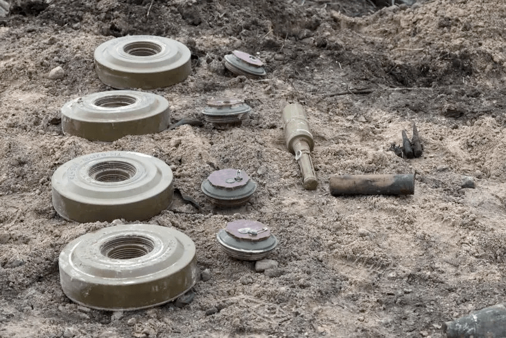
- 
- 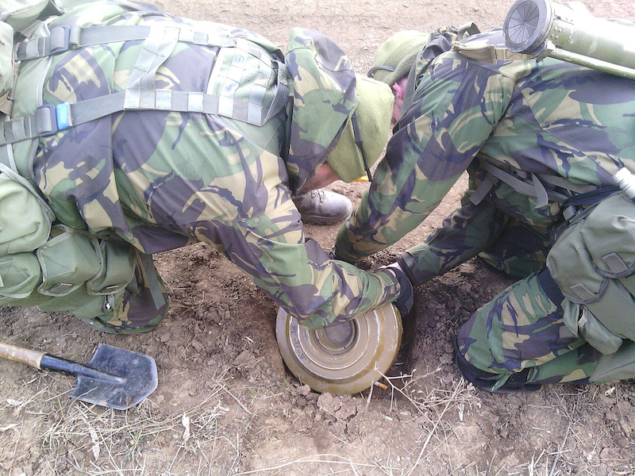
- 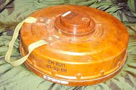
- 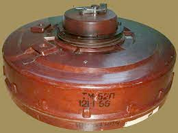
- 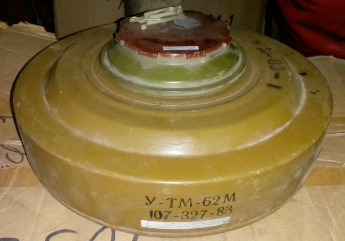
- 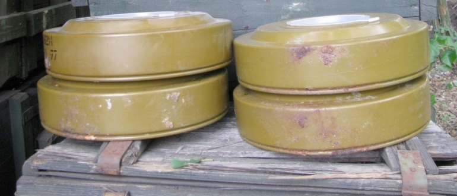
- 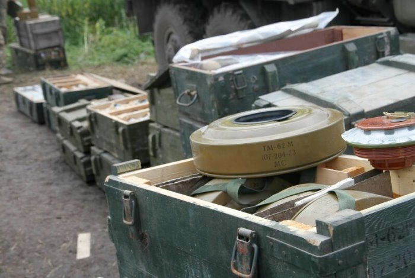
- 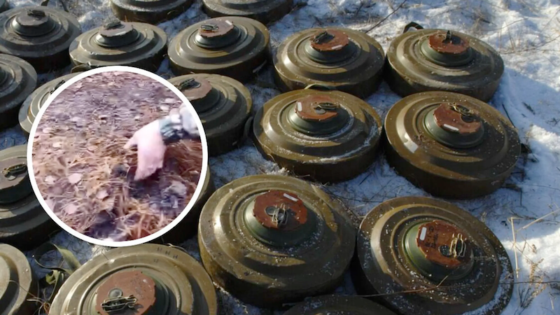
- 
- 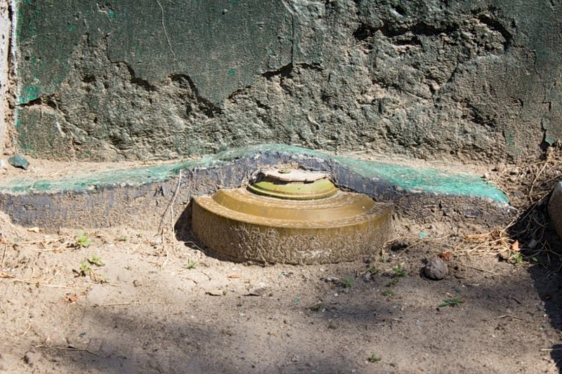
- 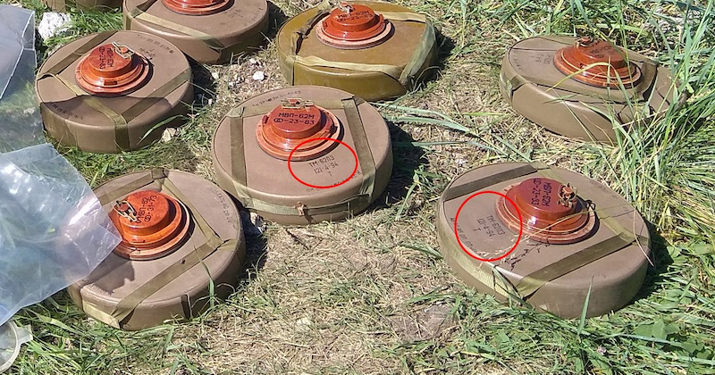
- 
:::

#### Інформаційні джерела

1. [Повернись живим. Противотанкова міна ТМ62](https://www.facebook.com/photo/?fbid=663819817108792&set=a.346200148870762)
2. [Бійці ЗСУ знешкодили міну армії рф: снаряд прикопали посеред дороги (відео)](https://www.stopcor.org/ukr/section-suspilstvo/news-bijtsi-zsu-zneshkodili-minu-armii-rf-snaryad-prikopali-posered-dorogi-video-04-01-2023.html)
3. [Мінна безпека](https://sprotyvg7.com.ua/lesson/minna-bezpeka)
