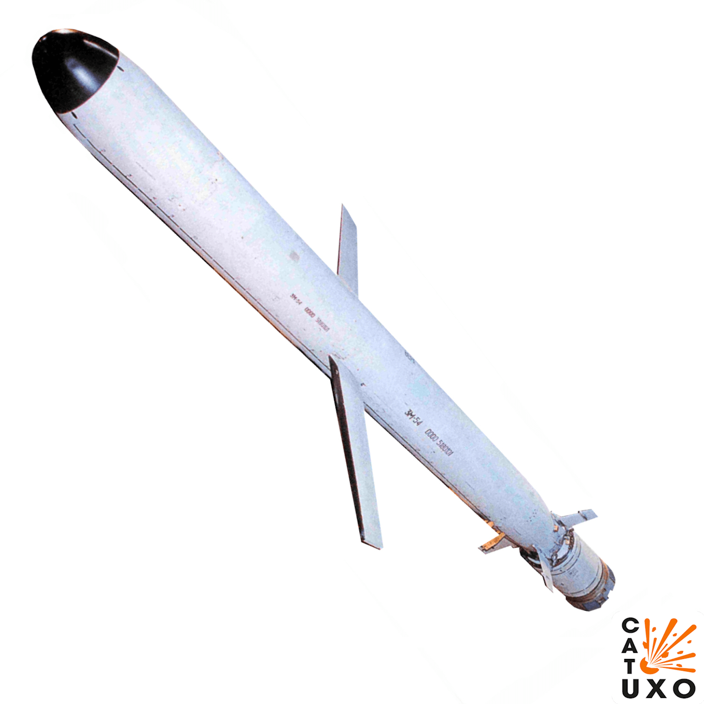
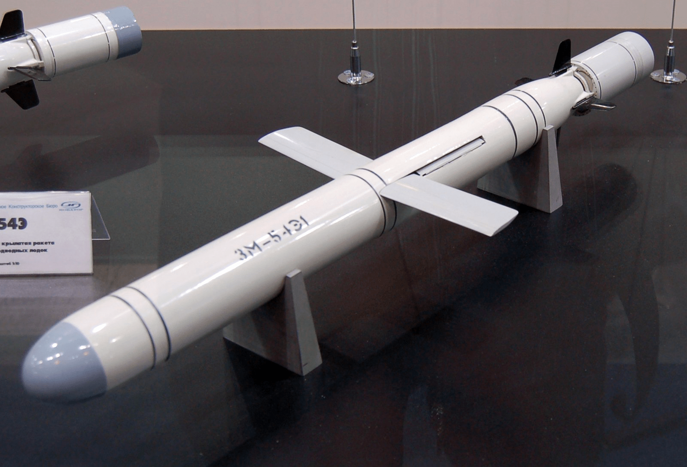
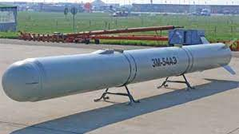
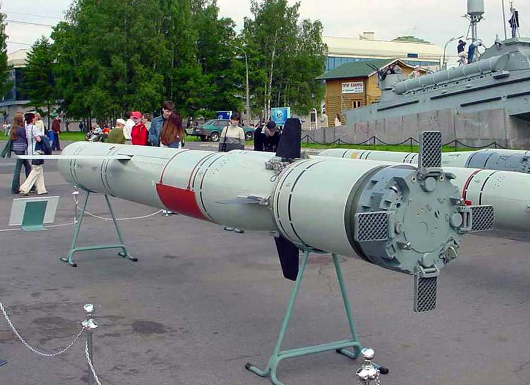
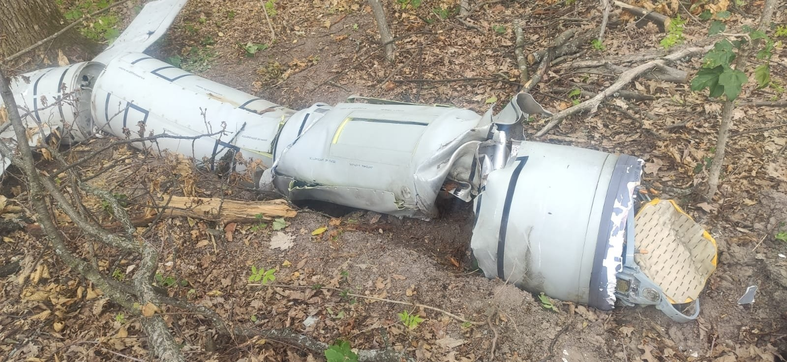
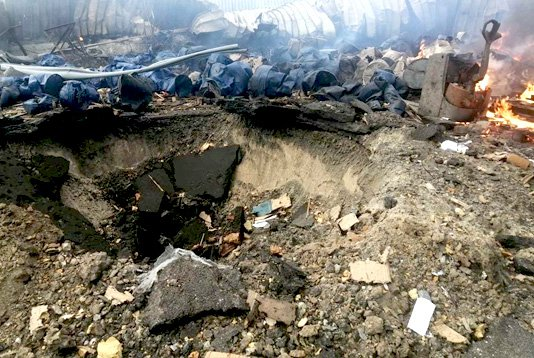
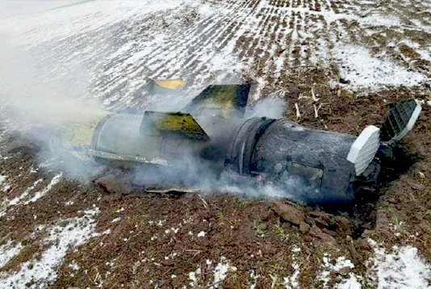
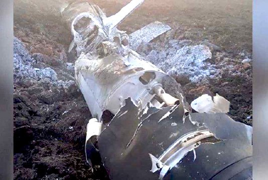

---
# Custom KB params
title: Крилата ракета 3М54 Калібр
subtitle: "Крилата ракета 3М54 Калібр"
description: "Крилата ракета 3М54 Калібр/SS-27 Sizzler"

# Obsidian metadata YAML front matter params
aliases: Ракета Калібр 3М54
tags:
keywords:
cssclass:
publish: false

# VuePress 2.x Frontmatter params
lang: uk-UA
prev:
  text: Перелік
  link: /catalog/index.html
next:
  text: ___МЛ-8
  link: /catalog/mina-ml-8.html
---

← [Повернутись](./index.md)

# Крилата ракета Калібр

3М54 "Калібр" (SS-27 "Sizzler") - ракета класу "земля-земля", запуск з наземної, корабельної та підводної пускової платформи.

- Радіус суцільного ураження: 100 м
- Безпечна відстань: 200 м

- У своїй конструкції мають реактивний двигун, стабілізатори у вигляді лопатей та додаткові рулі для корегування ракети на польоті.
- **Крилаті** ракети повільніші за балістичні й несуть менше заряду, проте завдяки постійній роботі двигуна здатні оминати вигини рельєфу, потенційні перешкоди, зону дії ППО. Летять на висоті від кількох десятків до кількох сотень метрів над землею. Але тільки тоді, коли оператор це заздалегідь задав. Самостійно коригувати свій шлях ракета не може.
- Утім, це теоретичне “вміння” не завжди можна втілити на практиці - “Для точної траєкторії потрібні точні 3D-карти місцевості, а з цим у росіян проблеми. Тому часто вони вимушені пускати ракети на висоті, досяжній для систем ППО, просто через відсутність актуальних карт”.

## Тактико-технічні характеристики

- Бойова частина: 450 кг.
- Довжина: 6,20 м
- Діаметр: 533 мм
- Стартова маса: 1800 кг
- Бойова частина: Прониклива фугасна 400 кг
- Дальність польоту: 300 км
- Швидкість польоту, в числах Маха: 0,8
- Траєкторія (висота польоту): 20 м
- Система управління: ІНС (інерціальна навігація) + РЛГСН (радіо-локаційна головка самоонаведення)

::: danger Категорично забороняється:

1. Використовувати мобільні телефони, засоби радіозв'язку поряд з ракетою.
2. Виконувати будь-які механічні, термічні та інші впливи на корпус ракети, двигуна,
тощо.
3. Переміщувати ракету з місця її знаходження.
4. Проводити будь-які земляні роботи поблизу з ракетою.
5. Намагатися викрутити будь-які комплектуючі з ракети.
6. Намагатись знешкодити ракети самостійно. 
:::

### Зона враження

- Радіус суцільного ураження: 100 м
- Безпечна відстань: 200 м

## Історична довідка

Калібр - сімейство крилатих ракет розроблених в ОКБ-8 (НПО «Новатор» (СРСР, Росія)
Протикорабельна крилата ракета цього сімейства має кодове позначення НАТО **SS-N-27 «Sizzler»**, для ураження наземних цілей — **SS-N-30**. Експортні варіанти комплексу мають назву **Club** (Club-A, Club-M, Club-K, Club-S).
Ймовірно, що на деякі модифікації ракет цього сімейства можливе встановлення ядерної бойової частини.

Ракету створювали ОКБ «Новатор», науково-виробниче об'єднання Моринформсистема «Агат» і Науково-дослідний технологічний інститут імені П. І. Снєгірьова.

Під час випробувань деякі ракети мали технічні несправності. Так, 20 серпня 2016 року, екіпажем корабля «Адмирал флота Советского Союза Горшков» здійснено пуски двох крилатих ракет морського базування (типу «Калібр») по наземних цілях на полігоні «Чижа» (півострів Канін Ніс, Архангельська область), але через технічні проблеми пуски двічі відкладались та у підсумку — ракети не досягли цілей і впали у невизначеному районі

Тактико-технічні характеристики ракет сімейства «Калібр», що стоять на озброєнні Збройних Сил Росії, є таємницею та достеменно не відомі.

За повідомленнями від 2012 року, дальність стрільби ракетами «Калібр» по морських цілях дорівнює 375 кілометрів, по наземних — 2600 кілометрів.

За іншими повідомленнями, дальність ракети 3М-14 не менша 2000 км до 2600 км (в ядерному бойовому оснащенні).

## Відео

<iframe width="560" height="315" src="https://www.youtube.com/embed/ZVTwU42onxU" title="YouTube video player" frameborder="0" allow="accelerometer; autoplay; clipboard-write; encrypted-media; gyroscope; picture-in-picture" allowfullscreen></iframe>

<iframe width="560" height="315" src="https://www.youtube.com/embed/esklgo6MWCY" title="YouTube video player" frameborder="0" allow="accelerometer; autoplay; clipboard-write; encrypted-media; gyroscope; picture-in-picture" allowfullscreen></iframe>

## Зображення

::: gallery

- 
- 
- 
- 
- 
- 
- 
- 

:::

#### Інформаційні джерела

1. [SS-27 Sizzler (3M54 Kalibr) Missile](https://cat-uxo.com/explosive-hazards/missiles/ss-27-sizzler-3m54-kalibr-missile)
2. [Калібр (крилаті ракети)](https://uk.wikipedia.org/wiki/%D0%9A%D0%B0%D0%BB%D1%96%D0%B1%D1%80_(%D0%BA%D1%80%D0%B8%D0%BB%D0%B0%D1%82%D1%96_%D1%80%D0%B0%D0%BA%D0%B5%D1%82%D0%B8))
3. [Все про російські ракети](https://texty.org.ua/articles/106433/letyucha-smert/)