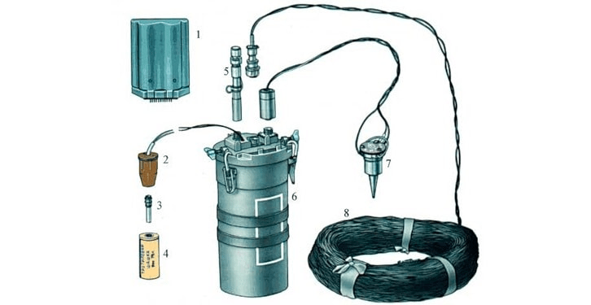
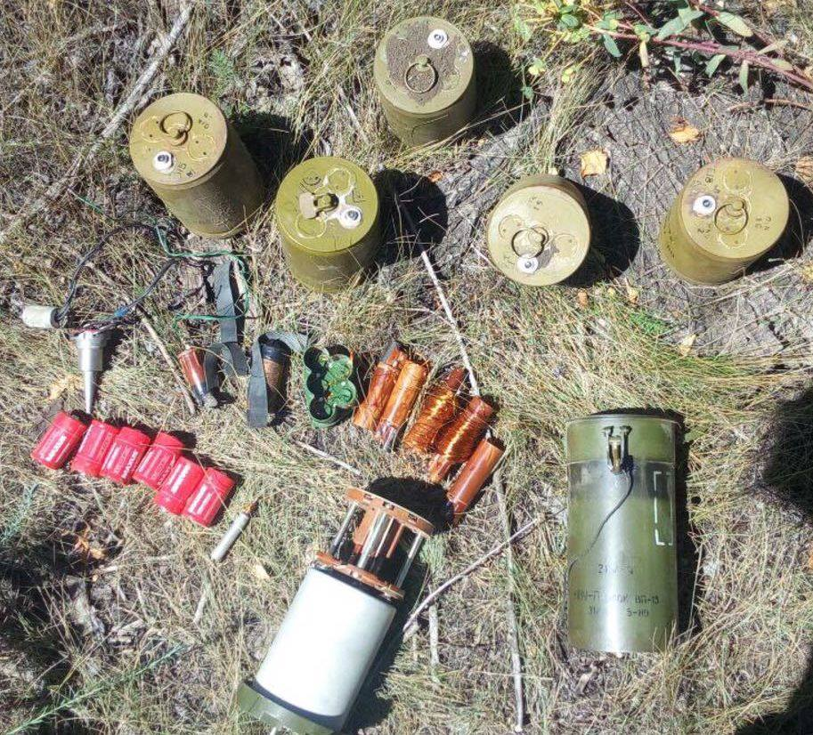
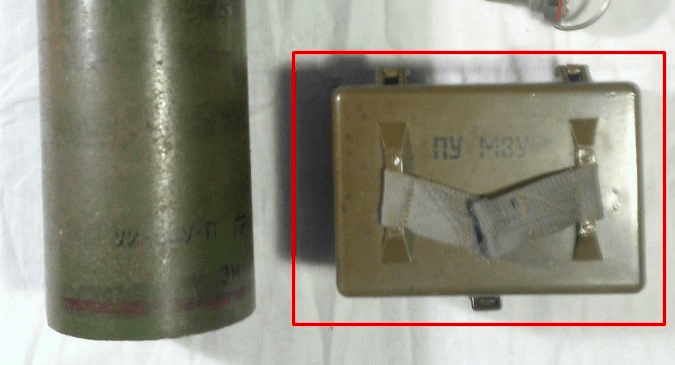
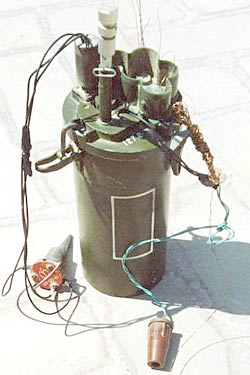

---
# Custom KB params
title: НВУ-П “Охота”
subtitle: "# Неконтактний вибуховий пристрій “Охота”"
description: "Міна протипіхотна осколкова спрямованого ураження керована. Призначена для ураження людини, у тому числі у вантажному та легковому транспорті."

# Obsidian metadata YAML front matter params
aliases: НВУ-П “Охота”
tags:
keywords:
cssclass:
publish: false

# VuePress 2.x Frontmatter params
lang: uk-UA
prev:
  text: Перелік
  link: /catalog/index.html
next:
  text: МОН-90
  link: /catalog/mina-mon-90.html
---

← [Повернутись](./index.md)

# НВУ-П “Охота”

Багато хто напевно чув про радянський  неконтактний вибуховий пристрій “Охота” (рос. НВУ-П “Охота”). Його завданням є автоматичне керування протипіхотними мінами типу [ОЗМ-72](./mina-ozm-72.md) та [МОН-50](./mina-mon-50.md) (а також в рідших випадках рядом інших мін).

- Радіус суцільного ураження: 120-150 м, залежить від підключених мін
- Безпечна відстань: 200 м

Один пристрій “Охота” може керувати 5 мінами. Він знаходиться в пасивному режимі, а при появі цілі в радіусі виявлення (120-150 м) її помічає сейсмічний датчик, що знаходиться в землі поряд з пристроєм.

Датчик передає виявлені коливання ґрунту на пристрій де відбувається аналіз типу цілі та відстань. Якщо ціль ідентифіковано як людину, пристрій переводиться в бойовий режим. Визначається відстань та азимут, що дає пристрою точне місце знаходження цілі.

Як тільки ціль потрапляє у точку ефективного враження будь якою з мін під’єднаних до пристрою з нього буде відправлено електричний імпульс для підриву найближчої з них. При повторному виявленні руху відбудеться підрив наступної найближчої міни.

Фактично навіть якщо після вибуху міни людина виживає і намагається відповзти або робить інші рухи, датчик знову її виявляє і підриває чергову міну.

## Тактико-технічні характеристики

- **Корпус** - метал
- **Тип** - пристрій керування
- **Маса** - 4,2 кг
- **Габарити**м- ⌀155 мм х 362 мм ( як велика вузька консервна банка ) 🥫
- **Безпечна відстань** - 200 м ( 2 стадіони ) 🏟🏟

::: danger Категорично забороняється

1. Виконувати будь - які механічні, термічні та інші впливи на корпус міни або вибухника.
2. Переміщувати міни з місця їх знаходження .
3. Проводити будь - які земляні роботи поблизу з міною .
4. Намагатися викрутити будь - які комплектуючі з міни .
5. Перерізати проводити, троси? тощо, що ідуть до вибухників міни .
6. Самостійно знешкоджувати міни.
   :::

### Зона враження

- **Штатні міни**– [ОЗМ-72](./mina-ozm-72.md), [МОН-50](./mina-mon-50.md)
- **Час бойової роботи** – від 4 до 9 місяців (в залежності від навколишнього середовища)
- **Відстань встановлення мін від пристрою** – від 2 до 15 метрів
- **Тип датчика цілі** – сейсмічний
- **Дальність виявлення цілі** – від 120 до 150 м
- **Дальність розпізнавання цілі** – не менше 90 м
- **Видача команди на підрив міни** – від 15 до 20 м від міни
- **Керованість** – керований та некерований варіанти
- **Спосіб встановлення**: ручний
- **Температурний діапазон (°C)** – від -40 до +50
- **Видобуваність** - так
- **Знешкоджуваність** – так
- **Самоліквідація** – так, після підриву останньої міни
- **Гарантійний термін** – 10 років

## Історична довідка

Цей пристрій починає свою історію ще з 70-х років минулого століття і з того часу активно використовувався у багатьох війнах, зокрема в Афганістані, Чеченських війнах та на Донбасі.

Щодо Афганістану то тут напевно багато хто чув про те звідки начебто з’явився запит на цей пристрій. Коли я проходив службу нам розповідали, що так як “душмани” часто розміновували мінні поля женучи по ним різних  тварин було зроблено пристрій, який тварин пропускав, а реагував саме на людей.

Це може бути правдою, а може і ні. Так як на мою думку все таки головним задумом цього пристрою є не те, що він реагуватиме виключно на людей. А те, що виявити його є дуже мало шансів. А відповідно не виявивши уже і не може бути мови про знищення будь яким способом.

“Охоту” можна встановлювати і у керованому варіанті та переводити  її з бойового в безпечний режим пультом керування МЗУ. МЗУ та “Охота” з’єднуються кабелем, що дає можливість при наявності оптимального живлення керувати пристроєм на відстані до кількох сотень метрів.

Крім [МОН-50](./mina-mon-50.md) та [ОЗМ-72](./mina-ozm-72.md) пристрій може використовувати будь які міни з можливістю використання універсального детонатора МД-5М: [МОН-100](./mina-mon-100.md), [Міна МОН-200](./mina-mon-200.md), ПОМЗ-2М, [ОЗМ-3](./mina-ozm-3.md), [ОЗМ-4](./mina-ozm-4.md).

А також міни, які можуть приводитись в дію електричним імпульсом: ОЗМ-160 [ОЗМ-3](./mina-ozm-3.md).

Також тут варто згадати новіший варіант цього пристрою з індексом НВУ-ПМ. Однією з відмінностей НВУ-ПМ від НВУ-П є підрив одночасно усіх мін при спробі перерізати буль який з кабелів комплексу, або при спробі зняти кришку з самого пристрою. Це зроблено для унеможливлення розмінування  замінованої території під’їхавши до неї на автомобілі, що за деякими джерелами вказується як спосіб розмінування НВУ-П.

Пізніші варіанти НВУ-ПМ мають програмований таймер, що дозволяє в потрібний проміжок часу один раз на добу переводити пристрій в безпечний режим. Це дає змогу рухатись замінованою місцевістю для заміни підірваних мін та дає можливість для інших необхідних переміщень особового складу.

На сьогодні росіяни періодично поширюють інформацію про пристрій “Охота-2”, в якому до сейсмічного датчика додано ще й магнітний для спрацювання на метал (по задуму на зброю та спорядження військових).

Але є джерела, які вказують про відсутність магнітного датчика в “Охота-2”, і загалом інформації з приводу цього пристрою мало, а та що є досить суперечлива.

## Відео

<iframe width="560" height="315" src="https://www.youtube.com/embed/d5ohNFVkRfg" title="YouTube video player" frameborder="0" allow="accelerometer; autoplay; clipboard-write; encrypted-media; gyroscope; picture-in-picture" allowfullscreen></iframe>

## Зображення

::: gallery

- 
- 
- 
- 

:::

#### Інформаційні джерела

1. [# ЦІКАВА ЗБРОЯ: Неконтактний вибуховий пристрій “Охота”](https://mil.in.ua/uk/blogs/tsikava-zbroya-nekontaktnyj-vybuhovyj-prystrij-ohota/)
2.
