---
# Custom KB params
title: ПТАБ-1М
subtitle: "Противотанкова авіаційна бомба ПТАБ-1М"
description: "Противотанкова авіаційна бомба ПТАБ-1М"

# Obsidian metadata YAML front matter params
aliases: ПТАБ-1М
tags:
keywords:
cssclass:
publish: false

# VuePress 2.x Frontmatter params
lang: uk-UA
prev:
  text: МС-5
  link: /catalog/mina-ms-5.html
next:
  text: МЛ-8
  link: /catalog/mina-ml-8.html
---

← [Повернутись](../index.md)

# Противотанкова авіаційна бомба ПТАБ-1М

Протитанкова авіаційна бомба ПТАБ-1М призначена для ураження об'єктів бронетанкової техніки: танків, самохідних артилерійських установок, бойових машин піхоти. Авіабомбою споряджаються касетні авіаційні боєприпаси: [РБК-500](./bomb-rbk500.md) , КМГУ, бойові частини ракет.

Суббоєприпаси зазвичай випускаються з касетної бомби [РБК-500](./bomb-rbk500.md), яка містить **268** таких суббоєприпасів.

Броня пробивається кумулятивним зарядом, що ініціюється п'єзоелектричним підривником. ПТАБ-1М оснащений механізмом самоліквідації.

- **Реагує на тиск, дотик**. **Чутливість** - 300 г 🐀
- **Зона ураження** – 10 м
- **Безпечна відстань** - 50 м ( 3 автобуси ) 🚌🚌🚌

::: danger Категорично забороняється:

1. Виконувати будь - які механічні , термічні та інші впливи на корпус бомби або вибухника.
2. Переміщувати бомбу з місця їх знаходження .
3. Проводити будь - які земляні роботи поблизу з бомби .
4. Намагатися викрутити будь - які комплектуючі з бомби .
5. Чипати корпус бомби.
6. Самостійно знешкоджувати бомбу .

:::

## Тактико-технічні характеристики

- **Корпус** - метал
- **Тип** - противотанкова, кумулятивна
- **Калібр** –  42 мм
- **Довжина** – 260 мм
- **Маса** – 0,94 кг
- **Бронепробиття** >200 мм
- **Швидкість зустрічі із перешкодою** – 100-200 м/с 
- **Температурний діапазон застосування** – ±60 °C
- **Час самознищення** – 20-40 с

## Історична довідка

Кумулятивна авіабомба була розроблена в СРСР в 1942 році, в Центральному конструкторському бюро № 22, яке спеціалізувалося на розробці детонаторів (на 2015 рік це НДІ «Пошук» в Санкт-Петербурзі). Перший зразок являв собою 10-кг авіабомбу, але згодом його зменшили до габаритів 2,5-кг суббоєприпасів. Підривник АД-А (індекс Управління озброєнь ВПС — 7-В-118), донний.

Бомба широко застосовувалася радянською авіацією в Німецько-радянській війні. Споряджалися в касетах по 48 штук. Штурмовик Іл-2 брав по чотири таких контейнера. Перше бойове застосування — 5 липня 1943 року на Курській дузі.

> З мемуарів учасника війни командувача 16-ї авіаційної армії генерала С. І. Руденко: 
> 
> Від самого початку бою на курському напрямку німецьким хваленим танкам «тигр» і «пантера», самохідним гарматним установкам «фердинанд» радянські льотчики-штурмовики протиставили вогневу міць «Ілів», забезпечених ПТАБ. Першим скинув їх на танкову колону Герой Радянського Союзу майор В.Голубєв. І одразу ми переконалися в тому, яку грізну зброю отримали штурмовики. Важила бомба 1,5-2,5 кг, падаючи на броню танка, вона не відскакувала, а ніби прилипала до неї. Спрямованим кумулятивним вибухом наскрізь пропалювалася броня «тигрів» і «пантер», і ті спалахували.

При скиданні ПТАБ накривали ділянку близько 15 × 200 м. З огляду на те, що горизонтальне бронювання танків традиційно вельми слабе, ймовірність ураження цілі була досить високою. Бронепробивність становила від 60 мм при куті зустрічі 30° до 100 мм при 90°, що було цілком достатньо. Навіть у T-VI «Тигр» перших серій товщина даху корпусу та башти становила всього близько 25 мм, у Т-V «Пантери» — 16-18 мм.

Тому в перші дні застосування ПТАБ ефективність Іл-2 була вражаючою (до 6-8 танків з одного заходу).

І. О. Ларіонова в січні 1944 року нагороджено за розробку бомби і підривника до неї орденом Леніна, а 1946 року — удостоєно звання лауреата Сталінської премії.

## Відео

<iframe width="560" height="315" src="https://www.youtube.com/embed/T-bADJfTJts" title="Росія на Одещині застосовує касетні бомби РБК-500 з ПТАБ-1М" frameborder="0" allow="accelerometer; autoplay; clipboard-write; encrypted-media; gyroscope; picture-in-picture; web-share" allowfullscreen></iframe>

## Зображення

::: gallery

- 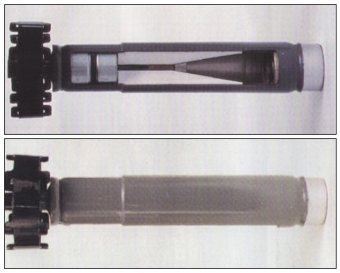
- 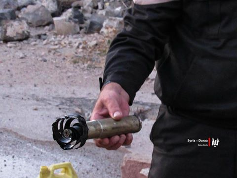
- 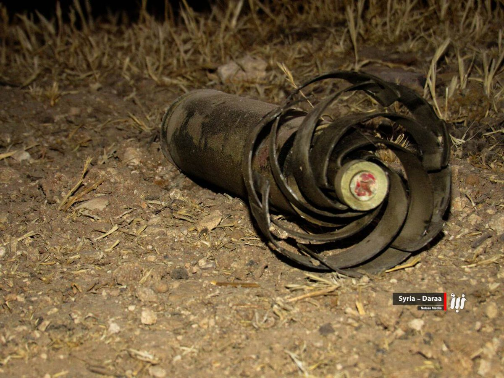
- 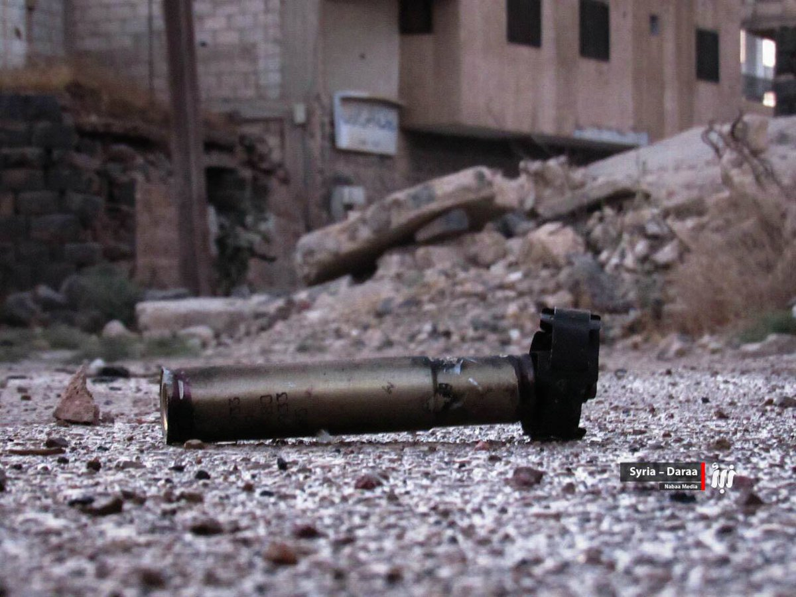
- 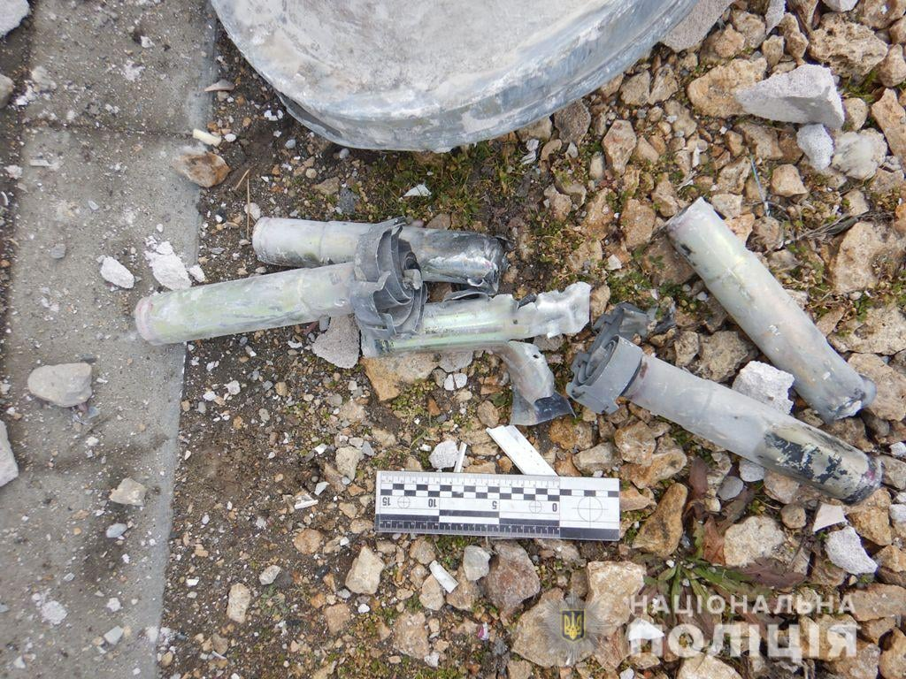
- 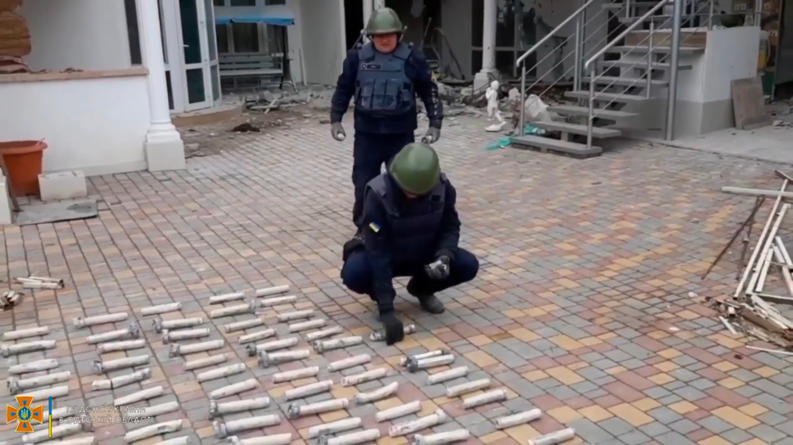
- 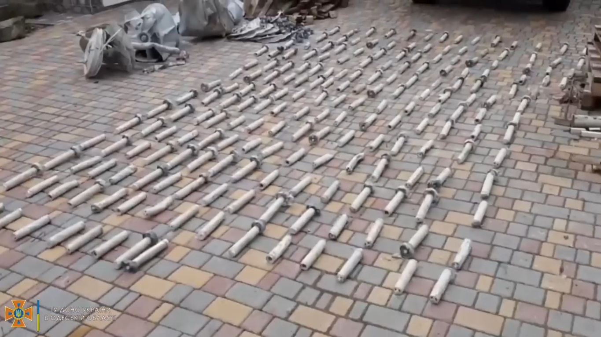
- 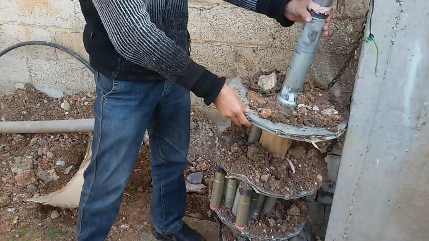
- 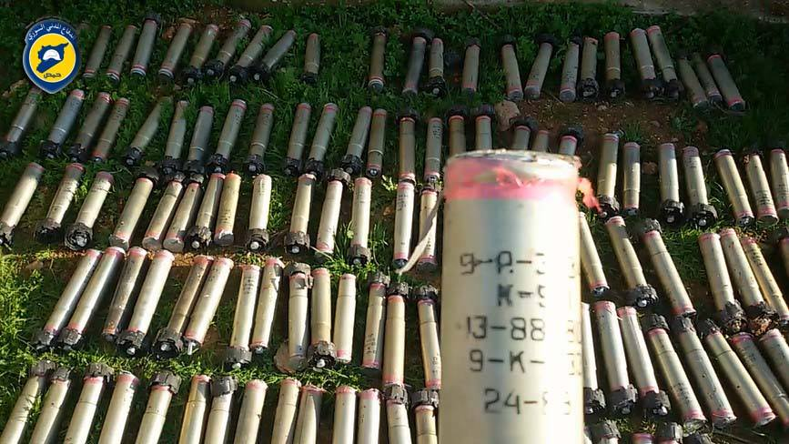
- 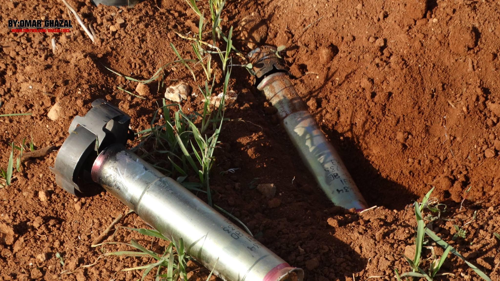
- 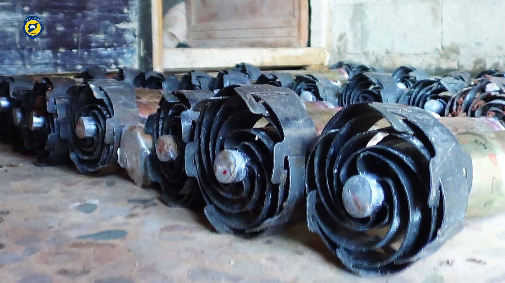
- 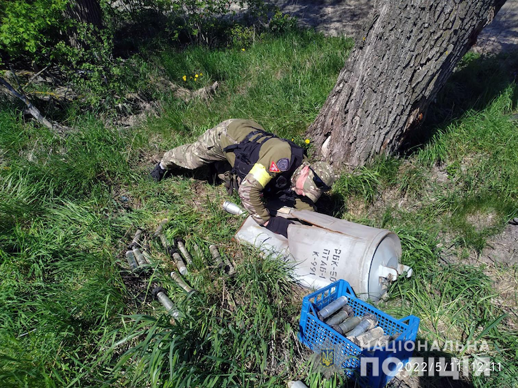
- 

:::

#### Інформаційні джерела

1. [PTAB-1M submunitions documented in Syria](https://armamentresearch.com/ptab-1m-submunitions-documented-in-syria/)
2. [Росія на Одещині застосовує касетні бомби РБК-500 з ПТАБ-1М](https://mil.in.ua/uk/news/rosiya-na-odeshhyni-zastosovuye-kasetni-bomby-rbk-500-z-ptab-1m/)
3. [ВКС РФ сбросили в Одесской области кассетную бомбу, но, похоже, большая часть суббоеприпасов не взорвалась](https://citeam-ru.medium.com/%D0%B2%D0%BA%D1%81-%D1%80%D1%84-%D1%81%D0%B1%D1%80%D0%BE%D1%81%D0%B8%D0%BB%D0%B8-%D0%B2-%D0%BE%D0%B4%D0%B5%D1%81%D1%81%D0%BA%D0%BE%D0%B9-%D0%BE%D0%B1%D0%BB%D0%B0%D1%81%D1%82%D0%B8-%D0%BA%D0%B0%D1%81%D1%81%D0%B5%D1%82%D0%BD%D1%83%D1%8E-%D0%B1%D0%BE%D0%BC%D0%B1%D1%83-%D0%BD%D0%BE-%D0%BF%D0%BE%D1%85%D0%BE%D0%B6%D0%B5-%D0%B1%D0%BE%D0%BB%D1%8C%D1%88%D0%B0%D1%8F-%D1%87%D0%B0%D1%81%D1%82%D1%8C-%D1%81%D1%83%D0%B1%D0%B1%D0%BE%D0%B5%D0%BF%D1%80%D0%B8%D0%BF%D0%B0%D1%81%D0%BE%D0%B2-%D0%BD%D0%B5-4236f2dffedd)
4. [PTAB-1M Submunition](https://cat-uxo.com/explosive-hazards/submunitions/ptab-1m-submunition)
