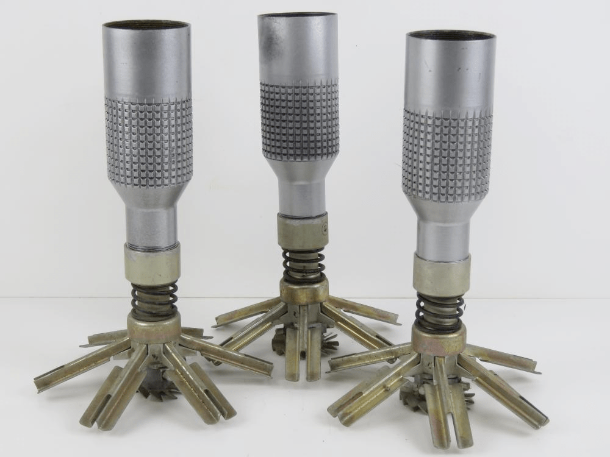

---
# Custom KB params
title: ПТАБ-2.5
subtitle: "Противотанкова авіаційна бомба ПТАБ-2,5"
description: "Противотанкова авіаційна бомба ПТАБ-2,5"

# Obsidian metadata YAML front matter params
aliases: ПТАБ-2.5
tags:
keywords:
cssclass:
publish: false

# VuePress 2.x Frontmatter params
lang: uk-UA
prev:
  text: ПТАБ-1М
  link: /catalog/subbomb-ptab1m.html
next:
  text: МЛ-8
  link: /catalog/mina-ml-8.html
---

← [Повернутись](../index.md)

# Противотанкова авіаційна бомба ПТАБ-2,5

Радянська протитанкова авіаційна бомба калібром 2,5 кг (в габаритах 2,5-кг авіабомби) і масою 1,5 кг, призначена для ураження бронетехніки за допомогою кумулятивного ефекту. 

Наймасовіша авіабомба СРСР в роки Німецько-радянської війни (в 1943—1945 рр. в армію поставлено 14,6 млн бомб). Розробник — ЦКБ-22, конструктор І. О. Ларіонов.

## Історична довідка

Кумулятивна авіабомба була розроблена в СРСР в 1942 році, в Центральному конструкторському бюро № 22, яке спеціалізувалося на розробці детонаторів (на 2015 рік це НДІ «Пошук» в Санкт-Петербурзі). 

Перший зразок являв собою 10-кг авіабомбу, але згодом його зменшили до габаритів 2,5-кг суббоєприпасів. Підривник АД-А (індекс Управління озброєнь ВПС — 7-В-118), донний. 

Бомба широко застосовувалася радянською авіацією в Німецько-радянській війні. Споряджалися в касетах по 48 штук. Штурмовик Іл-2 брав по чотири таких контейнера. 

Перше бойове застосування — 5 липня 1943 року на Курській дузі. При скиданні ПТАБ накривали ділянку близько 15 × 200 м. З огляду на те, що горизонтальне бронювання танків традиційно вельми слабе, ймовірність ураження цілі була досить високою. Бронепробивність становила від 60 мм при куті зустрічі 30° до 100 мм при 90°, що було цілком достатньо. Навіть у T-VI «Тигр» перших серій товщина даху корпусу та башти становила всього близько 25 мм, у Т-V «Пантери» — 16-18 мм. Тому в перші дні застосування ПТАБ ефективність Іл-2 була вражаючою (до 6-8 танків з одного заходу). 

І. О. Ларіонова в січні 1944 року нагороджено за розробку бомби і підривника до неї орденом Леніна, а 1946 року — удостоєно звання лауреата Сталінської премії.

## Відео

<iframe width="560" height="315" src="https://www.youtube.com/embed/sYIABdoj1dA" title="YouTube video player" frameborder="0" allow="accelerometer; autoplay; clipboard-write; encrypted-media; gyroscope; picture-in-picture; web-share" allowfullscreen></iframe>

## Зображення

::: gallery

- 
- 
- 
- 
- 
- 
- 
- 
- 
- 
- 
- 
- 

:::

#### Інформаційні джерела

1.  [Вікіпедія. ПТАБ-2,5-1,5](https://uk.wikipedia.org/wiki/%D0%9F%D0%A2%D0%90%D0%91-2,5-1,5)