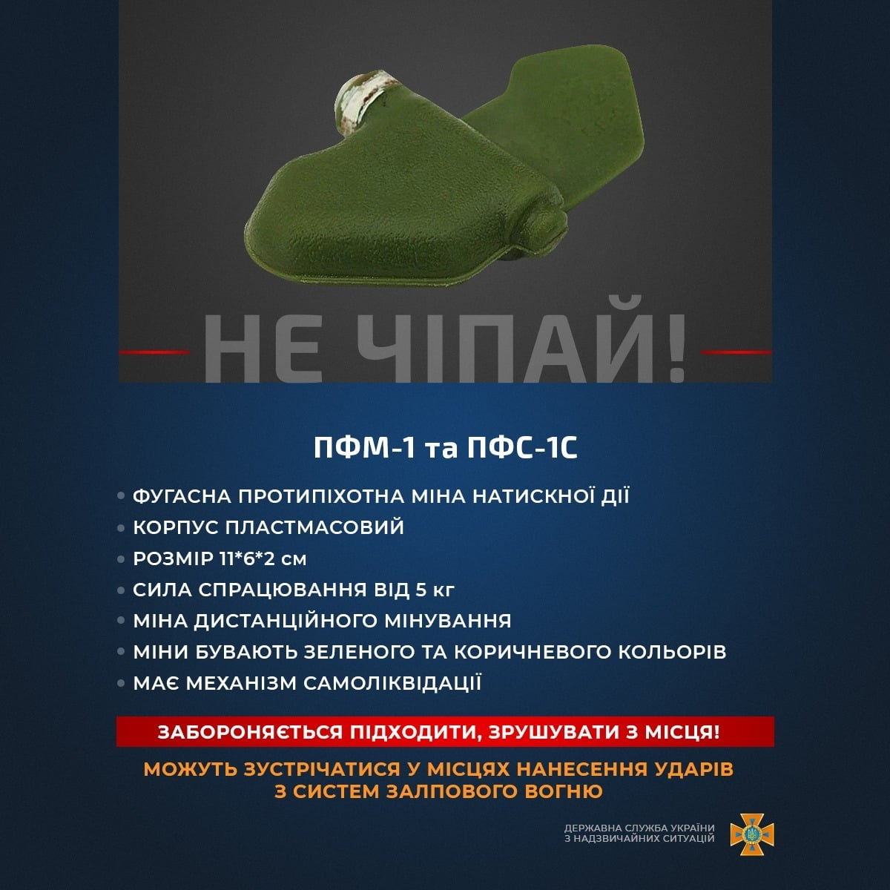
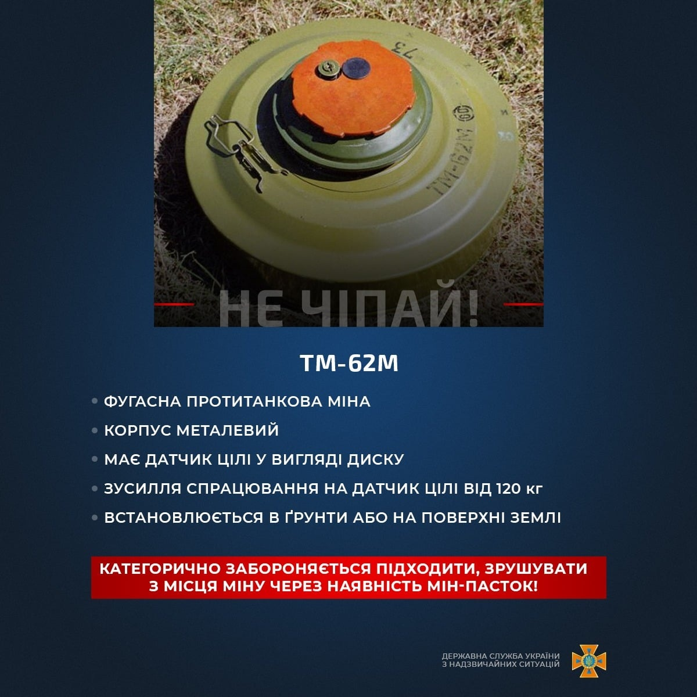
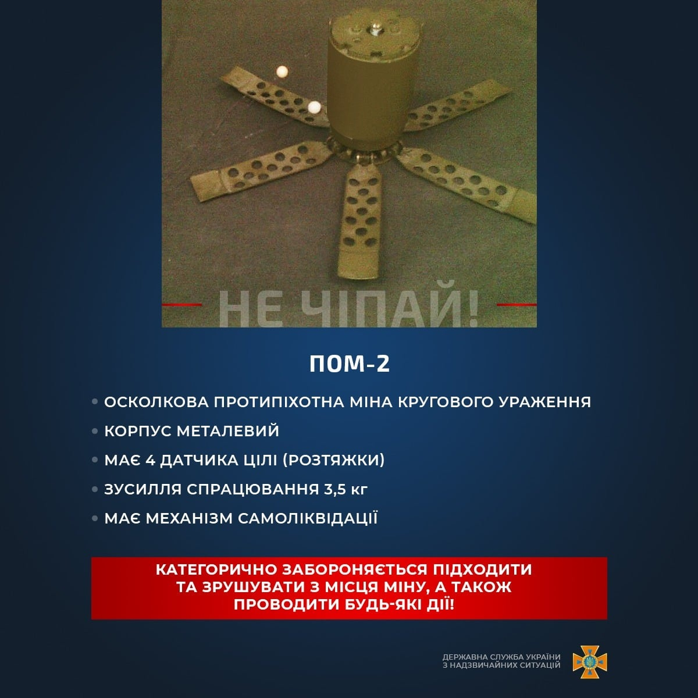
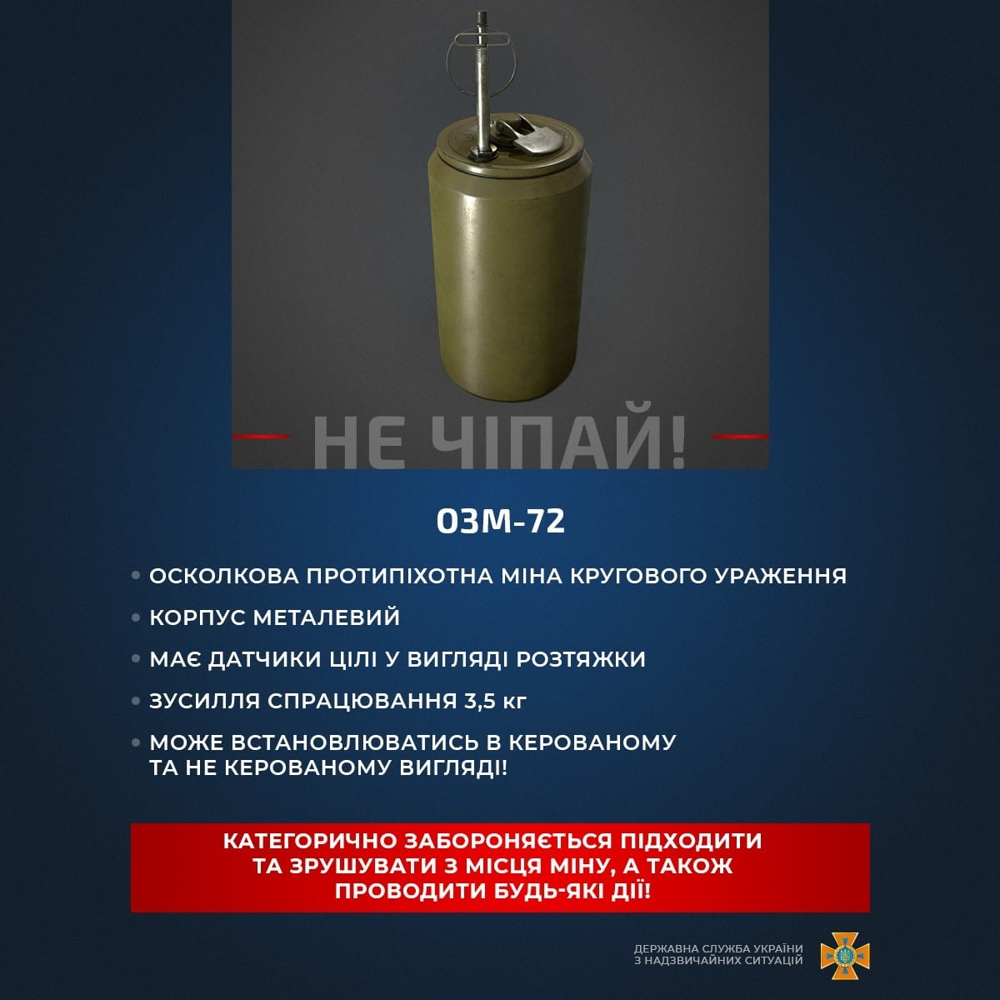
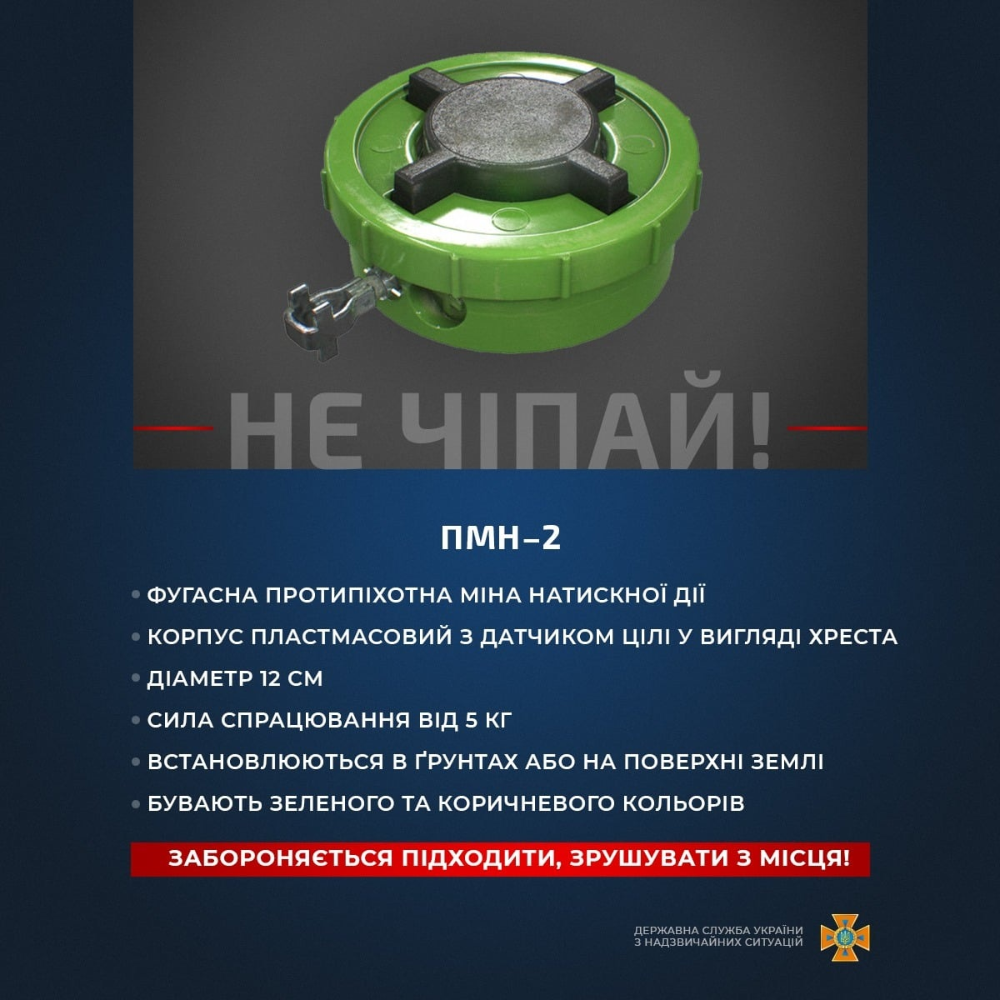
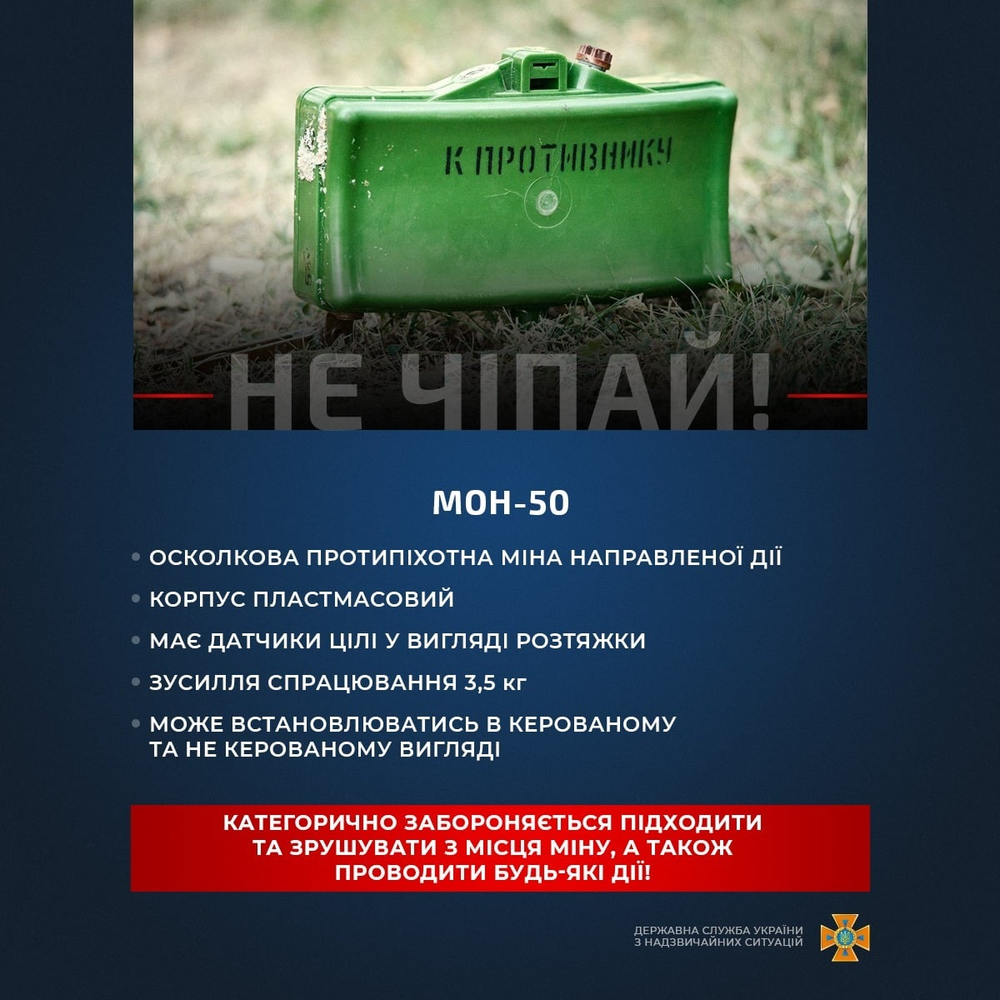
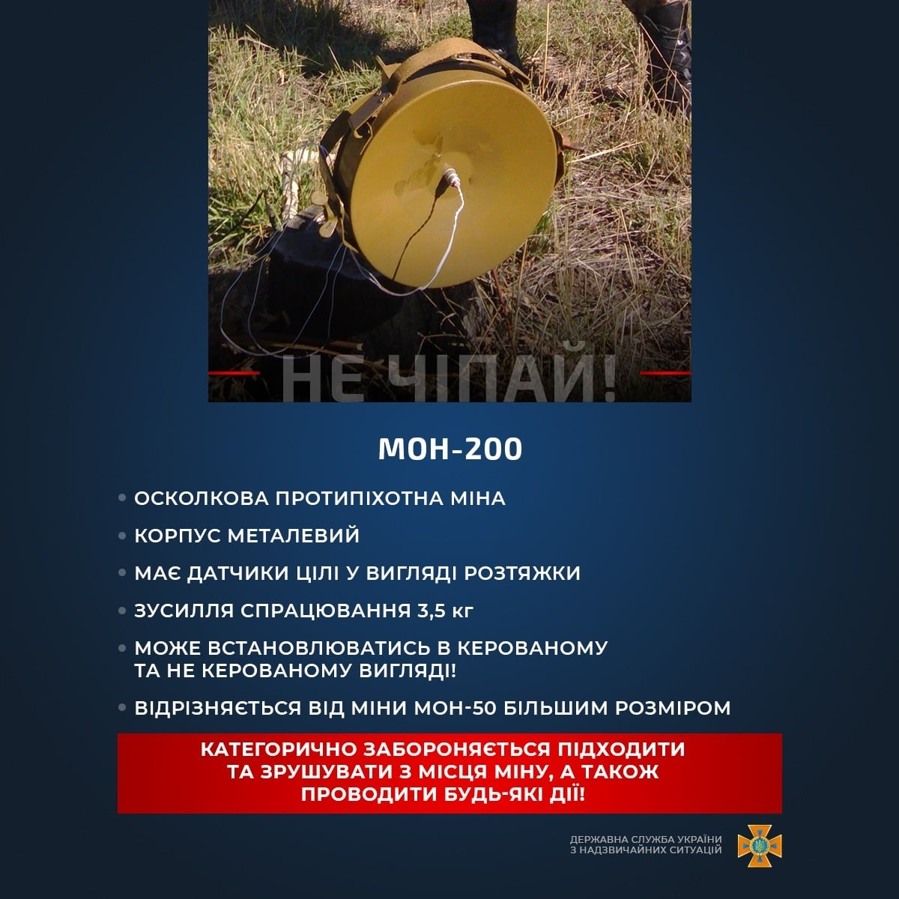
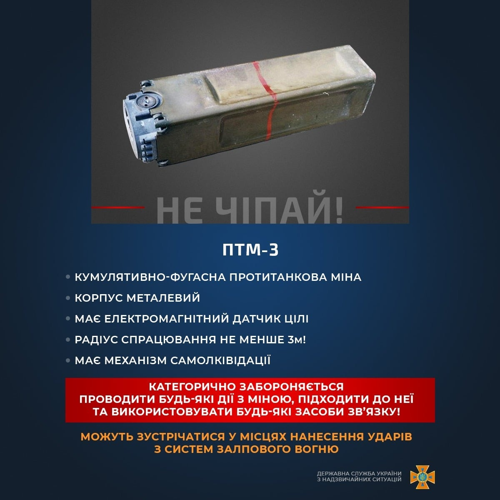

# ДСНС України.  Обережно міни!

Обережно міни!

Друзі! Відсьогодні, задля вашої безпеки, ми інформуватимемо вас про найбільш поширені вибухонебезпечні предмети, а також характеристики їхніх загроз.

Вкотре закликаємо: не наближайтеся до мін та боєприпасів! Повідомляйте про такі знахідки рятувальників або поліцію! Розкажіть про це дітям!

::: danger Вкотре закликаємо! 
Побачили таке залізяччя - не підходимо та не чіпаємо!

Телефонуємо на **101** або **102** та повідомляємо про знахідку!
:::

<iframe width="560" height="315" src="https://www.youtube.com/embed/w__t_oWQ3aE" title="YouTube video player" frameborder="0" allow="accelerometer; autoplay; clipboard-write; encrypted-media; gyroscope; picture-in-picture" allowfullscreen></iframe>

<iframe width="560" height="315" src="https://www.youtube.com/embed/-DekGvcqboM" title="YouTube video player" frameborder="0" allow="accelerometer; autoplay; clipboard-write; encrypted-media; gyroscope; picture-in-picture" allowfullscreen></iframe>

::: gallery
- 
- 
- 
- 
- 
- 
- 
- 
:::

#### Інформаційні джерела

1. [ДСНС інформує про вибухонебезпечні предмети, яких варто остерігатися](https://mil.in.ua/uk/news/dsns-informuye-pro-vybuhonebezpechni-predmety-yakyh-varto-osterigatysya/)
2. [ДСНС України.  Обережно міни!](https://www.facebook.com/100064736946785/posts/343140864520476/)