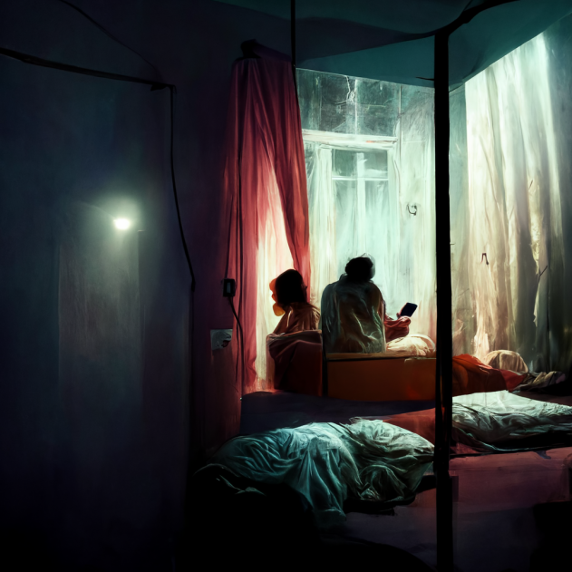
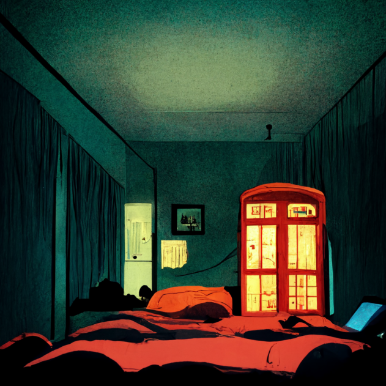

# Курс з мінної безпеки

## Частина 1. Дорога додому

  <a href="https://bezpeka.s3.amazonaws.com/mini/story_html5.html" target="_blank">
    

    
    

  </a>

Тут текст про те що тут буде

## Частина 2. Рідне місто

  <a href="https://bezpeka.s3.amazonaws.com/mini/story_html5.html" target="_blank">
    

    
    

  </a>

