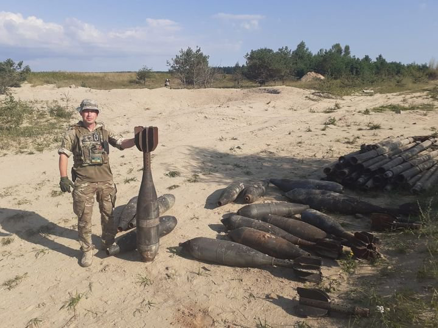
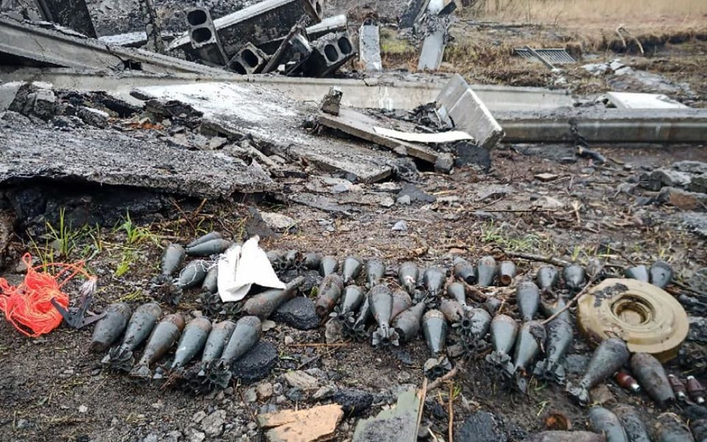

# Knowledge

Knowledge base on explosive objects on the territory of Ukraine after the invasion of russia

[[toc]]

💣 [Довідник мін](./catalog/index.md)

test 🤨

::: warning

This is a warning

:::

VuePress 2 is out :tada: !

Фото: facebook.com/GeneralStaff.ua
